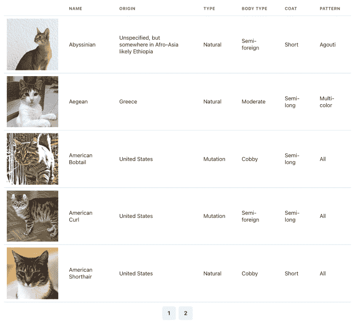

# React 中关于加载、错误和空状态的 UI 最佳实践

> 原文：<https://blog.logrocket.com/ui-design-best-practices-loading-error-empty-state-react/>

构建深思熟虑的和创造性的用户界面是困难的。即使是优秀的 UX/用户界面设计也无法讲述一个 web 应用程序的全部故事。

因为它们只是某种内在动态的静态表现，所以由开发人员来使设计变得生动，这当然意味着要考虑到所有可能的状态。

在本文中，我们将介绍在客户端渲染 React 应用程序中处理加载、错误和空状态时使用的最佳实践。

## 反应组分

假设我们想要在我们正在构建的单页面应用程序(SPA)的上下文中，使用 React 和 [Chakra UI](https://chakra-ui.com/) 从维基百科的[猫品种列表](https://en.wikipedia.org/wiki/List_of_cat_breeds)中重新创建表格。

下图是我们的设计目标。很简单，对吧？



首先，让我们将我们的猫品种数据提取到一个单独的文件中，`data.json`:

```
[
  {
    "name": "Abyssinian",
    "origin": "Unspecified, but somewhere in Afro-Asia likely Ethiopia",
    "type": "Natural",
    "bodyType": "Semi-foreign",
    "coat": "Short",
    "pattern": "Agouti",
    "imgUrl": "https://upload.wikimedia.org/wikipedia/commons/thumb/9/9b/Gustav_chocolate.jpg/200px-Gustav_chocolate.jpg"
  },
  {
    "name": "Aegean",
    "origin": "Greece",
    "type": "Natural",
    "bodyType": "Moderate",
    "coat": "Semi-long",
    "pattern": "Multi-color",
    "imgUrl": "https://upload.wikimedia.org/wikipedia/commons/thumb/5/51/Aegean_cat.jpg/200px-Aegean_cat.jpg"
  },
  ...
]

```

我们现在可以创建一个依赖于该数据的`TableComponent`:

```
import { Table, Thead, Tbody, Tr, Th, Td } from "@chakra-ui/react";
import data from "../public/data.json";

const TableComponent = () => {
  return (
      <Table colorScheme="blue" overflow="none">
        <Thead>
          <Tr>
            <Th></Th>
            <Th>Name</Th>
            <Th>Origin</Th>
            <Th>Type</Th>
            <Th>Body type</Th>
            <Th>Coat</Th>
            <Th>Pattern</Th>
          </Tr>
        </Thead>
        <Tbody>
          {data.map((cat) => (
            <Tr key={cat.name}>
              <Td p="2">
                <Box
                  bgImage={cat.imgUrl}
                  w="150px"
                  h="150px"
                  backgroundSize="cover"
                />
              </Td>
              <Td>{cat.name}</Td>
              <Td>{cat.origin}</Td>
              <Td>{cat.type}</Td>
              <Td>{cat.bodyType}</Td>
              <Td>{cat.coat}</Td>
              <Td>{cat.pattern}</Td>
            </Tr>
          ))}
        </Tbody>
      </Table>
  );
};

```

搞定了。看起来和预期的一模一样。

但是这个实现也很幼稚！我们的 cats 表的数据只是硬编码的。在现实世界的 React 应用程序中，它很可能来自服务器。这反过来意味着，当用户打开页面时，它不会立即可用。我们必须等待它。

## 装载状态

现在，我们来到上图中没有明确包含的第一个状态，即加载状态。当我们请求数据时，我们需要在等待服务器响应时向用户表明有东西正在加载。否则，他们只会看到一个空白屏幕。

所以，让我们给我们的`TableComponent`加上一个`Spinner`:

```
import React, { useState } from "react";
import {
  ...
  Spinner
} from "@chakra-ui/react";
import useCats from "./useCats";

const TableComponent = () => {
  // Custom data-fetching hook to handle the server request
  const { data, isLoading } = useCats();

  if (isLoading) {
    return <Spinner />;
  }

  return (
    <Table>
      ...
    </Table>
  );
};

```

这已经开始看起来更现实了。但是这里有一个想法:我们需要在每次获取表数据时显示一个微调器吗？

例如，如果我们想在页面间导航，该怎么办？每当用户转到一个新页面时，表格就会消失，微调器就会出现，这将是破坏性的。如果我们实现一个搜索，这同样适用。

或者，如果我们已经在应用程序中缓存了表数据，但是我们仍然希望在后台重新获取它以确保它不是陈旧的，该怎么办？同样，当我们重新获取数据时，让用户能够看到已经可用的数据比看到微调器要好得多。

为了让我们的 UI 真正感觉到完美，我们需要在后台发生事情时向用户发出指示。看起来我们需要第二个加载状态，一个允许我们显示我们的`TableComponent`的状态。

来补充一下吧！

```
import React, { useState } from "react";
import {
  ...
  Spinner,
  Progress,
} from "@chakra-ui/react";
import useCats from "./useCats";

const TableComponent = () => {
  const { data, isLoading } = useCats();

  if (isLoading && !data) {
    return <Spinner />;
  }

  return (
    <>
      {isLoading && (
        <Progress />
      )}
      <Table>
        ...
      </Table>
    </>
  );
};

```

这太棒了。我们现在只在没有数据显示给用户时才显示我们的`Spinner`。否则，我们在桌面上显示更加微妙的`Progress`。

但是如果完全没有数据呢？

## React 中的空状态

因为我们的数据是来自一个服务器，我们根本无法确定是否会有数据。我们可能会收到一个空列表。如果在我们当前的实现中出现这种情况，用户将只能看到`Table`头，这将非常令人困惑。

我们应该向组件添加一个带有适当消息的空状态，以说明这种情况:

```
import React, { useState } from "react";
import {
  ...
  Spinner,
  Progress,
  Text
} from "@chakra-ui/react";
import { SearchIcon } from "@chakra-ui/icons";
import useCats from "./useCats";

const EmptyState = () => {
  return (
    <Box>
      <SearchIcon />
      <Text>
        No cats found!
      </Text>
    </Box>
  );
};

const TableComponent = () => {
  const { data, isLoading } = useCats();

  if (isLoading && !data) {
    return <Spinner />;
  }

  if (data?.length === 0) {
    return <EmptyState />;
  }

  return (
    <>
      {isLoading && (
        <Progress />
      )}
        <Table>
          ...
        </Table>
    </>
  );
};

```

完美！我们差不多完成了。还有最后一件事要考虑。

## React 中的错误状态

因为我们依赖服务器对数据的响应，所以考虑请求失败的情况很重要。如果是这种情况，我们需要向用户显示适当的错误消息。

让我们开始吧:

```
import React, { useState } from "react";
import {
  ...
  Alert,
  AlertIcon,
  AlertTitle,
  AlertDescription
} from "@chakra-ui/react";
import useCats from "./useCats";
...
const ErrorState = () => {
  return (
    <Alert status="error">
      <AlertIcon />
      <AlertTitle mr={2}>An error occured!</AlertTitle>
      <AlertDescription>Please contact us for assistance.</AlertDescription>
    </Alert>
  );
};

const TableComponent = () => {
  const { data, isLoading, isError } = useCats();

  if (isError) {
    return <ErrorState />;
  }

  if (isLoading && !data) {
    return <Spinner />;
  }

  if (data?.length === 0) {
    return <EmptyState />;
  }

  return (
    <>
      {isLoading && (
        <Progress size="xs" isIndeterminate w="100%" position="fixed" top="0" />
      )}
      <Table colorScheme="blue" overflow="none">
        ...
      </Table>
    </>
  );
};

```

我们的组件现在运行良好。我们确实考虑到了每一种可能的情况。对代码很好奇？自己玩[这里](https://codesandbox.io/s/chakra-ui-table-jpg9f?file=/src/useCats.tsx)。

请记住，以上是基于单个表格组件的简化示例。在现实世界的应用程序中，可能有几十个页面，包含许多表格和组件，它们都需要自己的加载、错误和空状态。

* * *

### 更多来自 LogRocket 的精彩文章:

* * *

所以，你可能想知道:有没有办法大规模实施我们的方法？

## 大规模数据绘制

为了为我们的客户端渲染 React 应用程序实现一个可伸缩的数据获取解决方案，我们首先需要有合适的工具供我们使用。这里有一些有用的提示。

首先，使用已建立的、经过实战检验的数据获取库来处理数据同步和缓存。从头开始创建这样的东西既困难又没有必要。

对此有许多好的选择。我个人偏好是[反应查询](https://react-query.tanstack.com/)。一旦我们开始使用数据获取库，为我们可能需要发出的每个请求实现一个定制的 React 钩子就变得微不足道了，类似于我们的`useCats`例子。

如上例所示，这些钩子包含了我们实现每个组件数据获取状态所需的所有信息。

然后，利用组件库，或者至少在考虑可重用性的情况下构建加载、错误和空状态组件。在我们的例子中，我们使用[查克拉 UI](https://chakra-ui.com/) 作为基本构建模块。但是我们也将我们的`ErrorState`和`EmptyState`组件从主表中分离出来，确保我们可以在应用程序的其他地方再次使用它们。

最后，应用程序中 UX/用户界面的一致性对用户来说非常重要。为了进一步增强它，一定要标准化数据获取状态的处理方式。这可以通过进一步抽象我们上面使用的条件渲染逻辑来实现。

如果出于某种原因，抽象不是一个好的选择，确保至少通过约定和/或 linter 规则强烈鼓励整个代码库的标准化。

## 对数据提取的暂停做出反应

在我们总结这个概述之前，重要的是要提到一个主要的 React 更新正在进行中— [React 暂停数据获取](https://reactjs.org/docs/concurrent-mode-suspense.html)。这个新特性将允许它声明性地等待任何异步的东西，包括数据。从很多方面来说，这将是我们对 React 中数据的思维模式的转变，因为我们从“渲染时提取”转变为“提取时渲染”的方法(关于这种转变的更多信息可以在[这里](https://reactjs.org/docs/concurrent-mode-suspense.html#traditional-approaches-vs-suspense)找到)。

让我们带着悬念重新实现我们的组件，看看它是如何工作的。首先，我们需要为我们的数据创建一个假的 API。

```
import data from "./data.json";

export function fetchData() {
  let catsPromise = fetchCats();
  return {
    cats: wrapPromise(catsPromise)
  };
}

function wrapPromise(promise) {
  let status = "pending";
  let result;
  let suspender = promise.then(
    (r) => {
      status = "success";
      result = r;
    },
    (e) => {
      status = "error";
      result = e;
    }
  );
  return {
    read() {
      if (status === "pending") {
        throw suspender;
      } else if (status === "error") {
        throw result;
      } else if (status === "success") {
        return result;
      }
    }
  };
}

function fetchCats() {
  console.log("fetch cats...");
  return new Promise((resolve, reject) => {
    setTimeout(() => {
      console.log("fetched cats");
      resolve(data);
      // reject();
    }, 1100);
  });
}

```

注意:这只是一个示例实现，不是生产就绪代码！

## 带反应暂停的加载状态

有了 API，我们可以将加载状态添加到`Suspense`回退。

```
import React, { Suspense } from "react";
import { ChakraProvider } from "@chakra-ui/react";
import * as ReactDOM from "react-dom";
import Table from "./Table";
import LoadingState from "./LoadingState";

const rootElement = document.getElementById("root");
ReactDOM.createRoot(rootElement).render(
  <ChakraProvider>
    <Suspense fallback={<LoadingState />}>
      <Table />
    </Suspense>
  </ChakraProvider>
);

```

并相应地更改我们的组件:

```
import React from "react";
import { Table, ... } from "@chakra-ui/react";
import { SearchIcon } from "@chakra-ui/icons";
import { fetchData } from "./fakeApi";
import EmptyState from "./EmptyState"

const data = fetchData();

const TableComponent = () => {
  const cats = data.cats.read();

  if (cats?.length === 0) {
    return <EmptyState />;
  }

  return (
      <Table colorScheme="blue" overflow="none">
        ...
      </Table>
  );
};
export default TableComponent;

```

很好，我们现在使用`Suspense`来获取数据！此外，正如我们所看到的，空状态的实现仍然和以前一样。

但是我们的错误处理发生了什么呢？

## 具有反应暂停的错误状态

使用`Suspense`获取数据带来的另一个有趣的变化是，我们可以像处理渲染错误一样处理获取错误。为此，我们将需要使用—您猜对了— `ErrorBoundary`。

让我们将它添加到我们的应用程序中:

```
import React, { Suspense } from "react";
import { ChakraProvider } from "@chakra-ui/react";
import * as ReactDOM from "react-dom";
import Table from "./Table";
import LoadingState from "./LoadingState";
import ErrorState from "./ErrorState";
import ErrorBoundary from "./ErrorBoundary";

const rootElement = document.getElementById("root");
ReactDOM.createRoot(rootElement).render(
  <ChakraProvider>
    <ErrorBoundary fallback={<ErrorState />}>
      <Suspense fallback={<LoadingState />}>
        <Table />
      </Suspense>
    </ErrorBoundary>
  </ChakraProvider>
);

```

很好，现在我们可以像以前一样显示我们的错误组件了。查看这个[代码沙箱](https://codesandbox.io/s/react-suspense-example-ievxn)的工作示例。

使用这些预期的新功能有几个优点。在他们的帮助下，我们可以通过放置`Suspense`和`ErrorBoundary`组件来精确控制应用程序中的错误和加载状态。

同时，数据提取和呈现逻辑保持分离(提取在呈现之前开始)。有了`Suspense`，也有可能避免经常困扰传统方法的[竞争条件](https://reactjs.org/docs/concurrent-mode-suspense.html#suspense-and-race-conditions)。

虽然 React Suspense 本身不是一个数据获取库，但已经采取措施将其集成到现有的解决方案中。

这些新的 React 更新非常令人兴奋，玩起来非常有趣！但重要的是要记住，这一切仍处于实验阶段，可能会发生变化。有关最新信息，您可以关注 [React 18 工作组报告](https://github.com/reactwg/react-18/discussions)中的讨论。

如果你觉得这篇文章有用，请在 Twitter 上关注我，访问我的博客，了解更多技术内容。

编码快乐！✨

## 使用 LogRocket 消除传统反应错误报告的噪音

[LogRocket](https://lp.logrocket.com/blg/react-signup-issue-free)

是一款 React analytics 解决方案，可保护您免受数百个误报错误警报的影响，只针对少数真正重要的项目。LogRocket 告诉您 React 应用程序中实际影响用户的最具影响力的 bug 和 UX 问题。

[ ](https://lp.logrocket.com/blg/react-signup-general) [  ](https://lp.logrocket.com/blg/react-signup-general) [LogRocket](https://lp.logrocket.com/blg/react-signup-issue-free)

自动聚合客户端错误、反应错误边界、还原状态、缓慢的组件加载时间、JS 异常、前端性能指标和用户交互。然后，LogRocket 使用机器学习来通知您影响大多数用户的最具影响力的问题，并提供您修复它所需的上下文。

关注重要的 React bug—[今天就试试 LogRocket】。](https://lp.logrocket.com/blg/react-signup-issue-free)