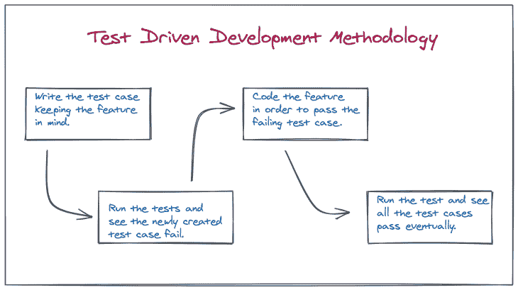
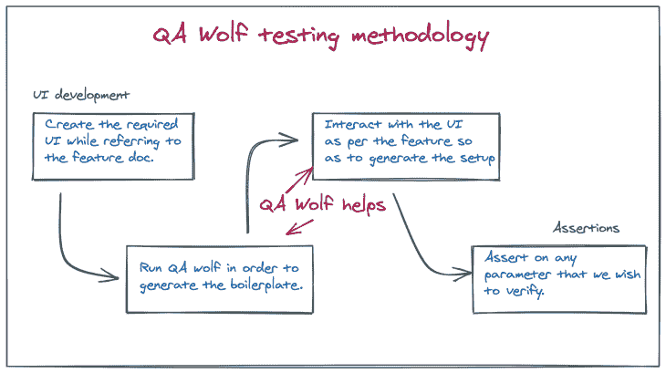
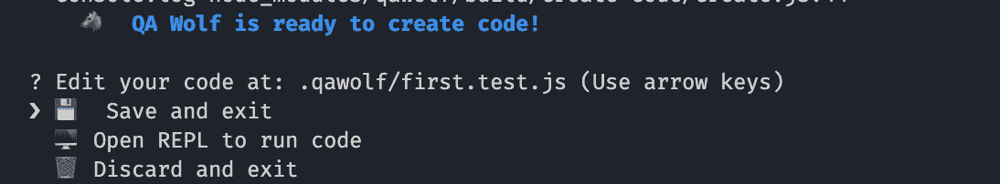
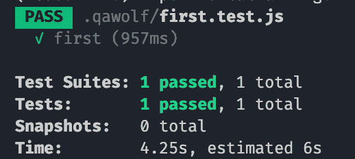

# 使用 QA Wolf - LogRocket 博客进行 UI 测试

> 原文：<https://blog.logrocket.com/ui-testing-using-qa-wolf/>

## 介绍

我们都知道，确保我们不仅编写了高质量、简洁、可维护的代码，而且创建了与所有产品需求保持一致的特性，这些特性不会在开发人员忽略的新场景开始时中断，这是多么重要。在过去的二十年里，这就是测试驱动开发方法为自己赢得了一个好名字的地方。对于外行来说，总结一下 TDD，它是我们在开发任何新特性时遵循这些步骤的地方:

*   创建一个我们希望在开发特性时通过的新测试
*   运行所有测试，查看新添加的测试是否失败
*   根据需求对功能进行编码
*   再次运行测试，查看失败的测试现在是否通过



虽然这对于开发 REST APIs(具有强大的预定义契约)来说效果很好，但是当我们试图将其应用于 UI 开发时，效果就不那么好了。这有几个原因，尽管最突出的一个原因是 UI 测试主要分为两类:

*   对于渲染页面上的任何动作元素(如按钮)，模拟其上的动作(点击),并检查特定的动作处理程序(点击监听器)是否被触发，或者是否达到特定的 UI 状态(也称为功能测试)
*   无论渲染了什么，检查它和最后渲染的东西(DOM 树)之间是否有任何差异(也称为快照测试)。上面提到的几点使得在 UI 开发中遵循 TDD 方法变得困难，因为在开始 UI 开发之前，没有任何东西可以在“之上”编写测试。此外，为了测试单击按钮时发生的任何行为，我们首先需要从呈现的 DOM 中获取按钮元素。这一点，以及为了开始测试通常必须编写的大量样板代码，使得测试 UI 的障碍如此之高，以至于很多时候，它被完全忽略了。这就是像 [QA wolf](https://www.qawolf.com/) 这样的框架派上用场的地方

## 什么是 QA 狼？

QA Wolf 是一个承诺简化用户界面测试过程的工具。正如前面所讨论的，编写 UI 测试的困难部分是模拟用户动作以达到我们实际想要断言的状态，这正是 QA wolf 为我们简化的部分。根据 QA Wolf 主页，它将我们的动作转换为 playright/Jest 代码，而无需编写任何样板文件。这是因为 QA Wolf 使用 chromium 浏览器实例和 puppeteer 来实际运行我们的 UI 代码以及捕获 UI 交互，以便自动生成测试。该框架还设置了许多安全网，负责所有必要的日常工作，例如:

*   在运行任何测试之前，等待页面完全加载
*   选择尽可能好的元素选择器来准确地挑选正确的元素



通过使用交互式 REPL 来试验断言、选择器和定制代码，它还允许更高级别的定制。不仅如此，QA Wolf 还帮助测试用例的 CI 集成以及跨浏览器测试，这是 UI 测试的另一个难点。

## QA Wolf 入门

让我们开始吧，将 QA Wolf 集成到 React 项目中，看看它实际上有多简单。你可以在 GitHub 上查看这个[库](https://github.com/kokanek/web-socket-chat),然后用它来玩 QA Wolf。这是一个基于网络套接字的聊天客户端/服务器项目。我们将使用 React 开发的客户端来测试这个框架。因此，以下是开始的步骤。按照 Github 页面上提到的步骤，确保首先启动客户端和服务器。

*   转到 **webServerClient** 文件夹，运行`npm init qawolf`命令。您将被要求指定创建测试的目录。选择了`.qawolf`
*   QA Wolf init 完成后，运行命令`npx qawolf create url first`来创建您的第一个测试。其中 URL 应该替换为客户端 URL，即 [http://localhost:1992](http://localhost:1992) ，这样命令就变成了`npx qawolf create [http://localhost:1992](http://localhost:1992) first`
*   现在，在 CLI 中，您将看到一个等待输入的提示，显示`QA Wolf is ready to create code!`，选择*保存并退出*。只需按回车键，测试用例就会被创建



您会注意到在`webSocketClient`目录中创建了一个`.qawolf`文件夹。在目录中，查找名为`first.test.js`的文件。它应具有以下功能:

```
test("first", async () => {
  await page.goto("http://localhost:1992");
  await qawolf.create();
});

```

这就对了。我们创造了第一个测试。

*   运行命令`npx qawolf test`就这样。您的第一个测试用例被执行。尽管我们在技术上没有断言任何东西，但它仍然是一个测试案例



恭喜你！我们的第一次 QA Wolf 测试已经通过。

## 创建我们第一个有意义的测试

既然我们已经熟悉了 QA Wolf 的工作方式，让我们进入第一个有意义的测试设置。这里有一个我们想要测试的场景:

*   调出聊天客户端界面
*   键入聊天用户名，然后按 enter 键登录
*   检查聊天用户名是否保存在状态中

从 QA wolf 测试方法中可以明显看出，我们知道 QA Wolf 会为我们处理前两步，我们只需要担心第三步。因此，让我们用下面的命令创建一个新的测试:

```
npx qawolf create http://localhost:1992 verify_username
```

测试开始后，我们在输入字段中输入文本“Bob ”,然后按回车键。在下一个屏幕上，我们看到了`WebSocket Chat: Bob`，其中`Bob`是我们输入的用户名。一旦发生这种情况，关闭浏览器，*保存并退出*测试。

我们看到一个名为`verify_username.test.js`的新文件被创建，测试通过以下步骤创建:

```
test("verify_username", async () => {
  await page.goto("http://localhost:1992/");
  await page.click(".ant-input");
  await page.fill(".ant-input", "Bob");
  await page.press(".ant-input", "Enter");
});

```

现在，让我们添加验证用户名是否被添加到标题的步骤，为此，将这一行添加到测试`await qawolf.assertElementText(page, '#main-heading', 'Bob', { timeout: 3000 })`。`qawolf.assertElementText` API 检查带有提供的选择器的元素是否包含文本(`Websocket Chat: Bob`包含文本 Bob)并且我们的测试用例通过。

```
test("verify_username", async () => {
  await page.goto("http://localhost:1992/");
  await page.click(".ant-input");
  await page.fill(".ant-input", "Bob");
  await page.press(".ant-input", "Enter");
  await qawolf.assertElementText(page, '#main-heading', 'Bob', { timeout: 3000 });
});

```

为了检查测试是否工作，使用命令
`npx qawolf test verify_username`运行测试，测试通过。要使测试失败，只需将`assertElementText`中的文本`Bob`改为 Alice，然后再次运行测试。显然，它失败了。

还要注意，在创建的`verify_username.test.js`文件中，浏览器和页面实例与它们的木偶师相似，因为 QA Wolf 在木偶师之上工作。所以，你可以参考这个关于[浏览器](https://pptr.dev/#?product=Puppeteer&version=v5.2.1&show=api-class-browser)和[页面](https://pptr.dev/#?product=Puppeteer&version=v5.2.1&show=api-class-page)的文档，尝试不同的可用 API。例如，获取一个渲染页面的截图就像添加这一行代码`await page.screenshot({path: 'screenshot.png'})`一样简单，并且您会得到一个保存在项目文件夹中的`screenshot.png`。

## 使用 QA Wolf 进行快照测试

这是关于行为/单元测试的部分。但是，在我们的用例中，我们想要类似这样的东西:

*   在执行几次交互后，在 UI 中达到特定的状态
*   捕获整个呈现的用户界面
*   下次运行测试时，执行相同的步骤
*   捕获新呈现的用户界面
*   将当前呈现的用户界面与以前的进行比较

上面列出的用例称为快照测试，这也是测试 UI 时常用的技术之一。让我们看看如何使用 QA Wolf 实现同样的功能。

创建新的测试并执行以下步骤:

1.  `npx qawolf create [http://localhost:1992](http://localhost:1992) snapshot`
2.  输入用户名 Bob，点击*登录*
3.  输入消息*嘿！*并按下*进入*，你会在屏幕上看到信息
4.  输入另一条消息*你好！*并按下*再次输入*
5.  保存并关闭测试

您可以看到一个名为`snapshot.test.js`的新文件，其内容如下:

```
test("snapshot", async () => {  
  await page.goto("http://localhost:1992/");
  await page.click(".ant-input");
  await page.fill(".ant-input", "Bob");
  await page.press(".ant-input", "Enter");
  await page.click(".ant-input");
  await page.fill(".ant-input", "Hey!");
  await page.press(".ant-input", "Enter");
  await page.fill(".ant-input", "Hi there!");
  await page.press(".ant-input", "Enter");
}

```

在最后添加这两行来捕获快照:

```
const hits = await page.$('#messages');
expect(await hits.evaluate((node) => node.outerHTML)).toMatchSnapshot();

```

这些行所做的事情非常简单。我们首先从页面中获取带有消息 ID 的元素，并对该节点的内容进行快照。

使用命令`npx qawolf test snapshot`运行这个快照测试，您应该看到用所需的快照创建了一个`__snapshots__`文件夹。

下次我们再次运行测试时，QA Wolf 执行与发送这些消息完全相同的步骤，再次拍摄快照，并在呈现的输出不同时警告我们。

如果我们想测试它，我们可以很容易地在第 65 行的`src/index.js`中添加一个冒号(`:`)，就像这样:

```
title={message.user+":"}

```

用`npx qawolf test snapshot`再次运行测试。这一次，快照失败，同时突出显示在两个消息中显示的用户名添加了一个冒号。

## 选择器特异性和 QA Wolf

如前所述，我们创建了一个测试用例来验证登录用户的名字是否被附加到标题上。在该测试用例的第二行中，我们用代码行`await page.click(".ant-input");`模拟了对*输入字段*的点击

代码只是要求点击页面中类名为`ant-input`的元素，结果是搜索(文本输入)字段。但是，如果我们将 CSS ID 应用到输入字段会怎么样呢？让我们试试那个。打开`src/index.js`并导航到第 84 行的搜索组件。只需向组件添加一个 ID，使其看起来像这样:

```
<Search
   id="username"
   placeholder="Enter Username"
   enterButton="Login"
   size="large"
   onSearch={value => this.setState({ isLoggedIn: true, userName: value })}
/>

```

现在，运行命令来创建一个新的测试用例:

```
npx qawolf create http://localhost:1992 test_add_id
```

并按照步骤创建一个测试。这一次，`.qawolf`文件夹中的`test_add_id.test.js`看起来像这样:

```
test("test_add_id", async () => {
  await page.goto("http://localhost:1992/");
  await page.click("#username");
  await page.fill("#username", "Bob");
  await page.press("#username", "Enter");
});

```

注意第 2 行生成的代码被替换为`await page.click("#username");`，它现在检查一个更具体的标识符(`a CSS id`)而不是一个通用的标识符(`a CSS class`)。这就是 QA Wolf 默认为我们做的事情。它挑选出最合适的、特定的标识符，以便我们的测试正确运行。

## 其他显著特征

除了选择器特性和带有文本比较和快照的断言之外，还有一些其他显著的特性可以帮助我们浏览开发过程中遇到的日常场景。这个 [API 页面](https://docs.qawolf.com/docs/api/qawolf/create)把它们都列出来了。它们包括:

*   让我们将页面的当前状态(cookies、localStorage、sessionStorage)保存到指定的 JSON 文件中
*   让我们通过从指定的 JSON 文件中读取来设置页面的当前状态。`saveState`和`setState`一起让我们在运行测试时处理诸如会话管理之类的事情，[下面是](https://docs.qawolf.com/docs/handle_sign_in)的做法
*   如果我们想要修改测试用例的设置，API 调用允许我们添加到一个已经存在的测试用例中
*   这让我们可以根据索引等待任何其他页面
*   `scroll`它通过指定`x`值和`y`值来帮助我们模拟某个元素的滚动

## 结论

QA Wolf 是一个工具，通过在内部运行 Chromium 和 Puppeteer 来帮助我们减轻与设置 UI 测试相关的焦虑。通过与 UI 交互来创建测试用例，然后在生成的用户界面的任何部分进行断言，听起来像是进行 UI 测试的自然方法。如果你过去使用过复杂的 UI 测试框架，现在正在寻找更无缝的体验，QA Wolf 绝对值得一试。

## 使用 [LogRocket](https://lp.logrocket.com/blg/signup) 消除传统错误报告的干扰

[](https://lp.logrocket.com/blg/signup)

[LogRocket](https://lp.logrocket.com/blg/signup) 是一个数字体验分析解决方案，它可以保护您免受数百个假阳性错误警报的影响，只针对几个真正重要的项目。LogRocket 会告诉您应用程序中实际影响用户的最具影响力的 bug 和 UX 问题。

然后，使用具有深层技术遥测的会话重放来确切地查看用户看到了什么以及是什么导致了问题，就像你在他们身后看一样。

LogRocket 自动聚合客户端错误、JS 异常、前端性能指标和用户交互。然后 LogRocket 使用机器学习来告诉你哪些问题正在影响大多数用户，并提供你需要修复它的上下文。

关注重要的 bug—[今天就试试 LogRocket】。](https://lp.logrocket.com/blg/signup-issue-free)