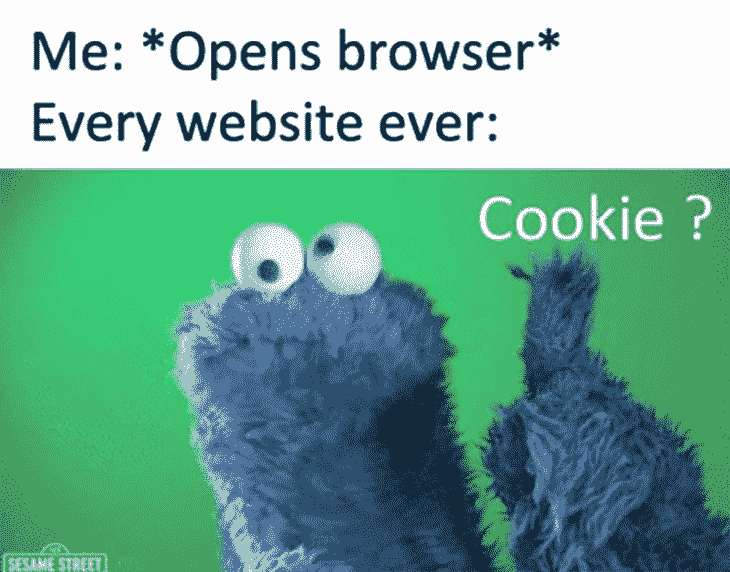
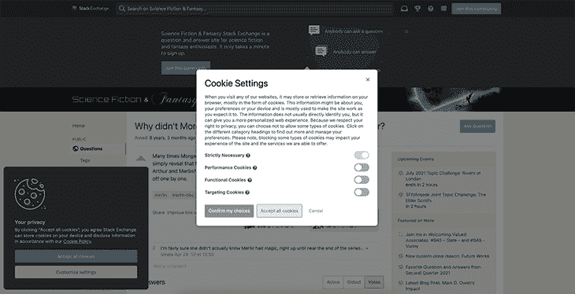
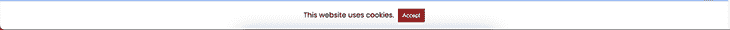
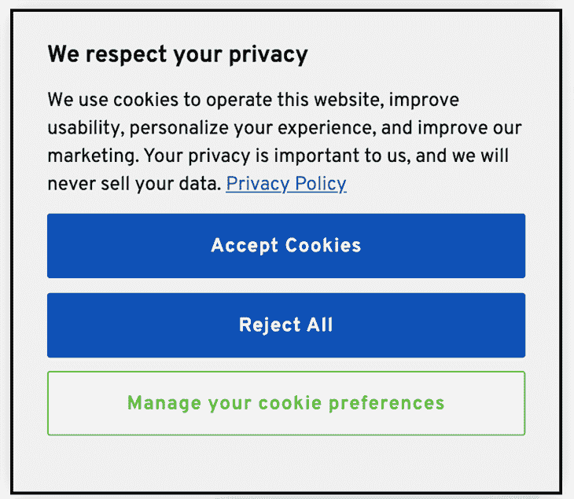
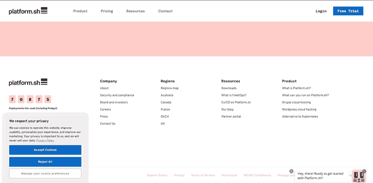
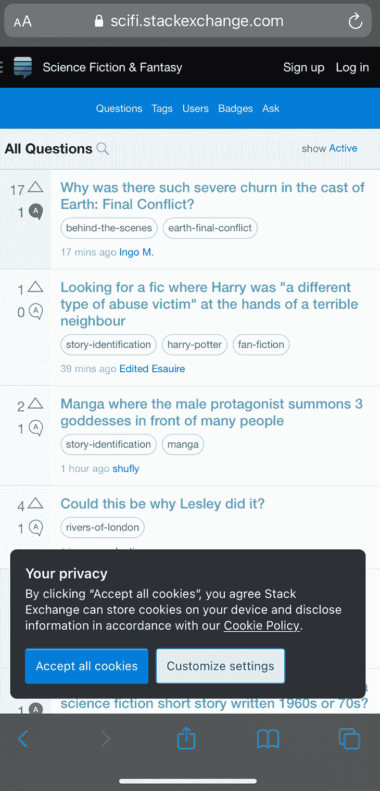

# cookie 通知的 UI/UX 最佳实践

> 原文：<https://blog.logrocket.com/ui-ux-best-practices-cookie-notifications/>

## 介绍

今天几乎没有任何网站不希望让用户接受或承认 cookies。这种情况经常发生，以至于互联网上充斥着 cookie 迷因。这些饼干——不像甜的、可食用的饼干——经常被用来追踪用户在浏览器上的匿名和独特的详细信息。



Source: [https://awwmemes.com](https://awwmemes.com/).

### 网站可以用 cookies 做什么？

Cookies 是小文本文件，是网站在浏览器上跟踪用户独特细节的好方法。使用 cookies 可以做的一些事情包括:

*   跟踪你在一个网站上花了多少时间
*   你购物车里有什么东西
*   记录您过去访问过的链接和页面
*   您选择的跟踪选项、首选项和设置
*   决定给你看什么广告或信息

如您所见，这些 cookies 主要用于收集用户信息以改善他们的体验。但 cookies 也带来了隐私问题，因为它们允许网站存储个人信息——包括但不限于你的浏览习惯——并可以对其做任何事情。

### 为什么到处都是 cookie 通知？

2018 年，欧盟颁布了[通用数据保护条例(GDPR)](https://gdpr.eu/) ，这是一部数据隐私法，旨在让个人对如何在网上收集、使用和保护他们的数据有更多的控制权。这确保了组织，[甚至那些欧盟](https://gdpr.eu/companies-outside-of-europe/)以外的组织，必须通知他们的用户他们收集的数据类型，并给予他们更多的控制权来选择他们与这些网站共享的信息。

组织已经采取了[不同的方法](https://blog.logrocket.com/the-async-cookie-store-api-a-new-treat-for-web-developers/)来实现这些通知，这些方法以这样或那样的方式影响了用户的体验。有些遵循黑暗的实践，呈现出选择的幻觉，而有些则呈现出定制空间的灵活性，而不是要求用户盲目地接受他们的 cookies(来自陌生人😀 ).

### 你必须接受饼干吗？

你不必总是接受饼干。

然而，一些组织不会让你使用他们的网站，如果你不接受他们的 cookies。这通常是因为这些网站依赖于 cookies，如果用户不允许使用它们，它们就无法正常工作。

## 构建 cookie 通知的推荐做法

GDPR 的这一要求导致了各种各样的 cookie 通知实现，遗憾的是，并不是所有的实现都能为用户提供良好的体验。

Cookie 通知本身是一个颇具争议的话题，很多用户最终还是会点击“接受”,但是如果你想实现一个 cookie 通知，我们将介绍一些最佳实践来帮助你为你的网站用户建立一个良好的体验。

我们希望实现的是一个 cookie 通知，解决网站的要求，要么允许用户拒绝所有的 cookie，要么方便快捷地让用户决定他们希望被跟踪，最好没有很多切换或穿越多个屏幕。

## 优化 cookie 通知以提高性能

在某些情况下，网站通常使用第三方脚本来处理 cookie 通知或利用 cookie 的服务。您需要确保这些脚本不会妨碍网站实际脚本的加载。

使用第三方脚本时，您可以异步加载它们，如下所示:

```
<script src="https://show-cookies.com/example-script.js" async>

```

## 默认情况下，关闭不必要的 cookies

如果您的网站不收集或跟踪用户的任何个人数据，或者如果它只收集匿名数据，您可能首先不需要 cookie 通知。默认情况下，不必要的 cookies 应该是关闭的。



例如，网站 [StackExchange](https://stackexchange.com/) 默认启用运行网站所必需的基本 cookie，然后允许用户选择继续或切换其他 cookie。

## 用清晰的文本展示行动号召按钮

对于仅使用简单通知的通知，如“通过使用我们的网站，您同意我们使用 cookies”，您必须确保用户仍然可以选择确认。“接受并继续”按钮比“关闭”按钮更清晰。

在下面的例子中，用户不知道他们真正同意的条款是什么。“这个网站使用 cookie”——但是是哪些呢？



下面的备选横幅简短描述了该网站的 cookies 的用途，每个按钮都包含明确说明将采取哪些行动的文本。用户还可以选择他们支持的特定 cookie 首选项。



## 通过定制提供灵活性

就像上面的例子一样，我们将遵循默认关闭非必要 cookies 的建议，但是，我们也应该允许用户在适当的时候调整他们的隐私设置。

为此，我们可以增加以下内容:

*   更改 cookie 首选项的选项
*   概述不同组的 cookies，其中一些是站点完美运行所必需的(这些是基本要素)，其他的是可选的

Cookie 选项也应该根据目的进行分组，例如有针对性的广告、分析以及网站运行所必需的任何内容。这很有帮助，因为它允许用户一次选择或取消选择整个类别，而不必手动选择每个子选项。



## 确定页面上的正确位置

与本文中的其他建议一样，我们需要确保我们的 cookie 通知不会妨碍网站上的内容，除非绝对必要。Cookie 通知通常放在页眉或页脚区域。有时，它们会占据整个页眉或页脚，有时它们会突然出现在某个角落。

将 cookie 通知放在页脚是最受欢迎的，因为它不太打扰人。文件夹上方的内容仍然按照预期显示，通知很少与页面上的其他组件争夺注意力。

需要重点关注的是通知的[移动响应](https://blog.logrocket.com/using-react-responsive-to-implement-responsive-design/)。在手机上，页脚或页眉通知很容易占据页面的大部分。建议我们确保通知尽可能少地覆盖页面，不管它放在页面的什么位置。



再看一下 StackExchange，您可以看到他们有一个移动 cookie 通知，它不太具有干扰性，在页面上占用很少的空间，同时仍然提供与桌面上相同的选项。

Cookie 通知也可以以模态显示，但是这将注意力从内容上完全转移到了 cookie 通知上，所以应该小心使用。通常，绝对需要 cookie 同意的网站会遵循这种方法。

如果您的网站使用特定的 cookie，如果不被接受，将会阻碍网站正常运行，那么您应该将它们视为必需的 cookie。如果这些 cookies 不跟踪任何个人数据，它们中的一些可以被默认启用。但是，如果他们这样做了，那么重要的是，用户被告知这一点，并仍然可以在他们继续之前接受这些 cookies。

总的来说，微妙的通知是首选，确保它们不会妨碍内容，尽管它们应该包含所有必要的信息，但它们占用的空间越少越好。

## 结论！

Cookie 通知以及如何设置它们是一个有争议的话题，但本文的目标是确保您的用户得到适当的通知，并且能够轻松地同意共享他们喜欢的信息级别，而不会影响他们的用户体验。

## 使用 [LogRocket](https://lp.logrocket.com/blg/signup) 消除传统错误报告的干扰

[](https://lp.logrocket.com/blg/signup)

[LogRocket](https://lp.logrocket.com/blg/signup) 是一个数字体验分析解决方案，它可以保护您免受数百个假阳性错误警报的影响，只针对几个真正重要的项目。LogRocket 会告诉您应用程序中实际影响用户的最具影响力的 bug 和 UX 问题。

然后，使用具有深层技术遥测的会话重放来确切地查看用户看到了什么以及是什么导致了问题，就像你在他们身后看一样。

LogRocket 自动聚合客户端错误、JS 异常、前端性能指标和用户交互。然后 LogRocket 使用机器学习来告诉你哪些问题正在影响大多数用户，并提供你需要修复它的上下文。

关注重要的 bug—[今天就试试 LogRocket】。](https://lp.logrocket.com/blg/signup-issue-free)