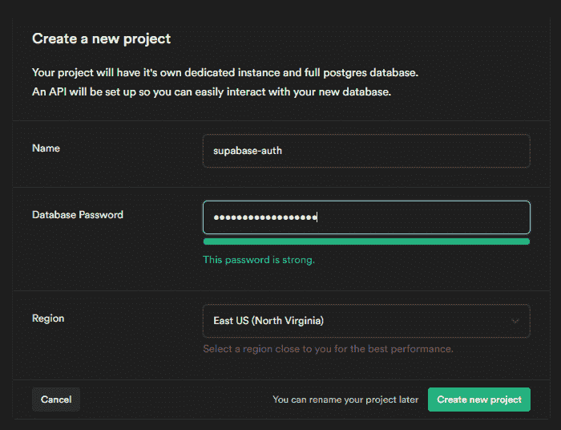
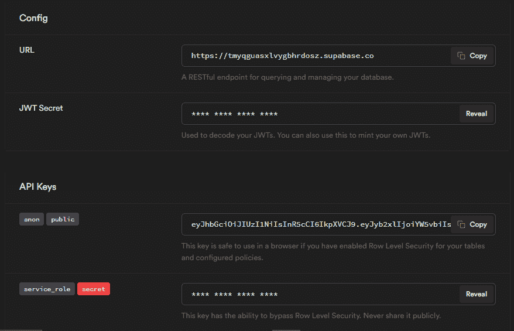

# Vue.js 中使用 Supabase 进行身份验证的终极指南

> 原文：<https://blog.logrocket.com/ultimate-guide-authentication-vue-js-supabase/>

## 介绍

身份验证是当今 web 应用程序中的一个重要特性，但是许多开发人员很难设置它。令人欣慰的是，有一些服务和图书馆可以帮助我们摆脱这个沉重的负担。

今天我们将讨论如何使用 Supabase 在 Vue.js 应用程序中处理用户认证。Supabase 将作为一个具有登录和注册功能的应用程序的后端认证，以及一个只能通过有效凭据访问的私人路由。

## 什么是 Supabase？

Supabase 通常被描述为 Firebase 的开源替代方案。它提供了 Firebase 的一些关键特性，其中之一包括用户认证和管理。

Supabase 为不同的外部身份认证提供者(如密码、电话号码)和身份认证提供者(如 Google、Twitter、脸书和 Github)提供支持。

## 设置 Vue.js

首先，我们将使用 [Vue CLI](https://blog.logrocket.com/getting-started-with-the-new-vue-cli-3-43bcbe1ae759/) 快速搭建一个新项目。通过运行以下命令，可以全局安装 CLI:

```
npm install -g @vue/cli
# OR
yarn global add @vue/cli

```

接下来，运行以下命令创建一个 Vue 项目:

```
vue create supabase-auth

```

系统会提示您选择一个预设；选择手动选择特征的选项。
一旦到达，选择**路由器**和 **Vuex** 并点击**进入**，然后选择 **Vue 版本 3.x** ，因为我们将使用新的组合 API。最后，在所有其他选项上点击**回车**，准备好你的 Vue 应用。

## 建立超级数据库

首先，你必须通过访问 [Supabase 登录页面](https://app.supabase.io/api/login)创建一个帐户，然后使用你的 Github 帐户登录。

登录仪表板后，点击**新项目**按钮创建您的第一个项目。您应该会看到以下模式弹出:



为您的项目选择一个名称、一个数据库密码和一个靠近您的地区。项目完全创建需要一些时间。

完成后，进入**设置**，然后进入 **API** ，复制 URL 和匿名公共 API 密钥:



在项目的根目录下创建一个`.env.local`文件，并将凭证保存在其中，如下所示:

```
VUE_APP_SUPABASE_URL=YOUR_SUPABSE_URL
VUE_APP_SUPABASE_PUBLIC_KEY=YOUR_SUPABSE_PUBLIC_KEY

```

## 设置 Supabase 客户端库

运行以下命令安装 Supabase 客户端库:

```
yarn add @supabase/supabase-js

```

接下来，我们必须通过在我们的`src`目录中创建一个`supabase.js`文件并粘贴以下代码来初始化 Supabase:

```
 import { createClient } from '@supabase/supabase-js'

 const supabaseUrl = process.env.VUE_APP_SUPABASE_URL
 const supabaseAnonKey = process.env.VUE_APP_SUPABASE_KEY

 export const supabase = createClient(supabaseUrl, supabaseAnonKey)

```

## 创建我们的页面

现在让我们创建一些 Vue 组件页面来处理我们项目的注册和登录功能，以及一个仪表板页面。

在本教程中，为了避免混淆我们的 HTML 标记，我们不会对我们的应用程序进行样式化，但是您可以随时选择自己喜欢的样式。

下面是我们的`SignIn`页面的标记:

```
<!-- src/views/SignIn.vue -->
 <template>
  <div>
      <h1>Login Page</h1>
      <form @submit.prevent="signIn">
        <input
          class="inputField"
          type="email"
          placeholder="Your email"
          v-model="form.email"
        />
        <input
          class="inputField"
          type="password"
          placeholder="Your Password"
          v-model="form.password"
        />
        <button type="submit">Sign In</button>
      </form>
      <p>
        Don't have an account? 
        <router-link to="/sign-up">Sign Up</router-link>
      </p>
    </div>
</template>

```

现在让我们为我们的`SignUp`页面做标记:

```
<!-- src/views/SignUp.vue -->
<template>
  <div>
      <h1>SignUp Page</h1>
      <form @submit.prevent="signUp">
        <input
          class="inputField"
          type="email"
          placeholder="Your email"
          v-model="form.email"
        />
        <input
          class="inputField"
          type="password"
          placeholder="Your Password"
          v-model="form.password"
        />
        <button type="submit">Sign Up</button>
      </form>
      <p>
        Already have an account? 
        <router-link to="/sign-in">Log in</router-link>
      </p>
    </div>
</template>

```

最后，我们的`Dashboard`页面:

```
<!-- src/views/Dashboard.vue -->
<template>
  <div>
    <h1>Welcome to our Dashboard Page</h1>
    <button @click.prevent="signOut">Sign out</button>
    <p>Welcome: {{ userEmail }}</p>
  </div>
</template>

```

## 使用 Vue 路由器设置路由

现在我们已经创建了我们的页面，我们需要设置路线，以便我们可以在它们之间移动。为此，我们将使用 [Vue 路由器。](https://blog.logrocket.com/router-options-compared/)

让我们在路由器文件中为不同的页面声明路由，如下所示:

```
// router/index.js
import { createRouter, createWebHistory } from 'vue-router';
function loadPage(view) {
  return () =>
    import(
      /* webpackChunkName: "view-[request]" */ `@/views/${view}.vue`
    );
}
const routes = [
  {
    path: '/',
    name: 'Dashboard',
    component: loadPage("Dashboard"),
    meta: {
      requiresAuth: true,
    }
  },
  {
    path: '/sign-up',
    name: 'SignUp',
    component: loadPage("SignUp")
  },
  {
    path: '/sign-in',
    name: 'SignIn',
    component: loadPage("SignIn")
  },
]
const router = createRouter({
  history: createWebHistory(process.env.BASE_URL),
  routes
})

router.beforeEach((to, from, next) => {
  // get current user info
  const currentUser = supabase.auth.user();
  const requiresAuth = to.matched.some
  (record => record.meta.requiresAuth);

  if(requiresAuth && !currentUser) next('sign-in');
  else if(!requiresAuth && currentUser) next("/");
  else next();
})

export default router

```

第一个路由中的`meta`对象用于保存关于该路由的额外信息。它有一个名为`requiresAuth`的属性，该属性被设置为`true`，我们将使用该属性来防止未经授权的用户访问该路由。

从第 34 行到第 42 行，我们正在设置一个被称为[导航保护](https://router.vuejs.org/guide/advanced/navigation-guards.html)的东西。

代码中发生的事情是检查确定某个路由是否需要身份验证，以及用户当前是否登录。如果该路线需要认证，并且没有人登录，则用户被重定向到`sign-in`路线。但是，如果路由需要身份验证，并且有用户登录，则用户会被重定向到仪表板专用路由。

## 设置 Vuex

Vuex 是 Vue 应用中的一个工具，用于存储我们应用中所有组件可访问的数据。它有自己的一套规则，确保存储的数据可以相应地更改和更新。

我们将把组件的所有逻辑存储在 Vuex 中。

使用 Vuex 的一个注意事项是，一旦页面被重新加载，所有存储的数据都会重置。为了解决这个问题，我们将使用 [vuex-persistedstate](https://www.npmjs.com/package/vuex-persistedstate) 。这个包有助于保存存储在 Vuex 中的数据，即使在页面重新加载之后。

在终端中输入以下内容以安装 vuex-persistedstate:

```
yarn add vuex-persistedstate
#OR
npm install --save vuex-persistedstate

```

### 配置我们的 Vuex 商店

在这里，我们正在配置`vuex-persistedstate`，然后导入 Supabase 和 Vue 路由器。我们将需要他们来创建我们的 Vuex 商店活动:

```
import { createStore } from 'vuex'
import createPersistedState from "vuex-persistedstate";
import router from '../router';
import { supabase } from "../supabase";

// Create store
export default createStore({
  state:{},
  mutations:{},
  actions:{},
  plugins: [createPersistedState()]
});

```

### 将数据存储在`State`中

我们的 Vuex 存储中的`state`对象是实际存储数据的对象。在这里，我们可以定义数据的默认值:

```
state: {
  user:null
};

```

在我们的`state`对象中，我们将`user`的默认值设置为`null`，因为这是用户没有登录到我们的应用程序时的值。

### 通过突变改变状态

突变是我们改变 Vuex 存储中的`state`对象的唯一方法。

一个变异接受`state`和一个来自提交它的动作的值，如下所示:

```
  mutations: {
    setUser(state, payload) {
      state.user = payload;
    },
  },

```

当这个突变被提交时，它将我们的`user`状态的默认值更改为传递给它的任何值。

### 使用`Actions`提交突变

`actions`对象包含可用于提交突变的函数，以改变我们的应用程序的状态。动作也可以分派其他动作。对于我们的示例应用程序，我们将使用三种不同的操作:注册、登录和注销。

#### 注册行动

我们的`signUpAction`动作接收表单数据，然后调用 Supabase 注册函数。该函数接收收集的表单数据，对其进行验证，并在满足所有要求的情况下创建一个新用户:

```
  async signUpAction({dispatch}, form) {
      try {
        const { error } = await supabase.auth.signUp({
          email: form.email,
          password: form.password,
        });
        if (error) throw error;
        alert("You've been registered successfully");
        await dispatch("signInAction", form)
      } catch (error) {
        alert(error.error_description || error.message);
      }
    },

```

一旦创建了用户，就会弹出一个带有成功消息的警报，然后调度`signInAction`动作。`singInAction`接收我们的表单数据并记录我们新注册的用户，这样他们就可以访问私有的仪表板路径。如果在任何时候失败，就会弹出一个错误警告。

#### 行动中签名

`signInAction`动作还接收用户填写的表单数据。它将该数据传递给我们的 Supabase `signIn`函数，该函数根据我们的用户表验证该数据，以检查该用户是否存在。如果是，用户登录并重定向到专用仪表板路由。

接下来，我们提交`setUser`变异，它将我们的`user`状态的值设置为当前登录用户的电子邮件:

```
  async signInAction({ commit }, form) {
    try {
      const { error, user } = await supabase.auth.signIn({
        email: form.email,
        password: form.password,
      });
      if (error) throw error;
      alert("You've Signed In successfully");
      await router.push('/')
      commit('setUser', user.email)
    } catch (error) {
      alert(error.error_description || error.message);
    }
  },

```

#### 注销操作

我们的`signOutAction`动作调用 Supabase `signOut`函数，将我们的`user`状态的值重置回 null，然后将用户重定向回登录页面:

```
  async signOutAction({ commit }) {
    try {
      const { error } = await supabase.auth.signOut();
      if (error) throw error;
      commit('setUser', null)
      alert("You've been logged Out successfully");
      await router.push("/sign-in");
    } catch (error) {
      alert(error.error_description || error.message);
    }
  },

```

最后，您的 Vuex 商店应该是这样的:

```
// src/store/index.js
import { createStore } from 'vuex'
import createPersistedState from "vuex-persistedstate";
import router from '../router';
import { supabase } from "../supabase";
export default createStore({
  state: {
    user: null,
  },
  mutations: {
    setUser(state, payload) {
      state.user = payload;
    },
  },
  actions: {
    async signInAction({ commit }, form) {
      try {
        const { error, user } = await supabase.auth.signIn({
          email: form.email,
          password: form.password,
        });
        if (error) throw error;
        alert("You've Signed In successfully");
        await router.push('/')
        commit('setUser', user.email)
      } catch (error) {
        alert(error.error_description || error.message);
      }
    },
    async signUpAction({dispatch}, form) {
      try {
        const { error} = await supabase.auth.signUp({
          email: form.email,
          password: form.password,
        });
        if (error) throw error;
        alert("You've been registered successfully");
        await dispatch("signInAction", form)
      } catch (error) {
        alert(error.error_description || error.message);
      }
    },
    async signOutAction({ commit }) {
      try {
        const { error } = await supabase.auth.signOut();
        if (error) throw error;
        commit('setUser', null)
        alert("You've been logged Out successfully");
        await router.push("/sign-in");
      } catch (error) {
        alert(error.error_description || error.message);
      }
    },
  },
  modules: {
  },
  plugins: [createPersistedState()],
})

```

## 向组件添加逻辑

是时候让我们倒回去一点，通过添加一些逻辑来使我们不久前创建的组件完全起作用了。

让我们从我们的`SignUp`组件开始:

```
<!-- src/views/SignUp.vue -->
<template>
  <div>
   <!-- Our markup goes here -->
  </div>
</template>
<script>
import { reactive } from "vue";
import { useStore } from "vuex";
export default {
  setup() {
    // wrap data gotten from form input in vue's reactive object
    const form = reactive({
      email: "",
      password: "",
    });
    //create new store instance
    const store = useStore();
    const signUp = () => {
      // dispatch the signup action to register new user
      store.dispatch("signUpAction", form);
    };
    return {
      form,
      signUp,
    };
  },
};
</script>

```

现在，让我们给我们的`SignIn`组件添加逻辑。`SignIn`和`SignUp`组件相似；唯一的区别是调用了`signIn`函数而不是`signUp`函数:

```
<!-- src/views/SignIn.vue -->
<template>
  <div>
   <!-- Our markup goes here -->
  </div>
</template>
<script>
import { reactive } from "vue";
import { useStore } from "vuex";
export default {
  setup() {
    // wrap data gotten from form input in vue's reactive object
    const form = reactive({
      email: "",
      password: "",
    });
    //create new store instance
    const store = useStore();
    const signUp = () => {
      // dispatch the sign in action to Log in the user
      store.dispatch("signInAction", form);
    };
    return {
      form,
      signIn,
    };
  },
};
</script>

```

让我们也向`Dashboard`组件添加逻辑，以便我们的登录用户可以在他们需要时注销:

```
<!-- src/views/Dashboard.vue -->
<template>
  <div>
    <h1>Welcome to our Dashboard Page</h1>
    <button @click.prevent="signOut">Sign out</button>
    <p>Welocome: {{ userEmail }}</p>
  </div>
</template>
<script>
import { useStore } from "vuex";
import { computed } from "vue";
export default {
  setup() {
    //create store instance
    const store = useStore();
    // Fetches email of logged in user from state
    const userEmail = computed(() => store.state.user);
     const signOut = () => {
      // dispatch the sign out action to log user out
      store.dispatch("signOutAction");
    };
    return {
      signOut,
      userEmail,
    };
  },
};
</script>

```

这就包含了让我们的组件启动并运行所需的所有逻辑。

## 结论

在本教程中，我们回顾了如何使用 Supabase 和 Vue 执行用户身份验证。我们还学习了如何通过新的组合 API 在我们的 Vue 应用中使用 Vuex 和 Vue 路由器。

如果您想立即投入使用，可以在[这里](https://github.com/codiini/supabase-auth)找到本教程的完整源代码。

## 像用户一样体验您的 Vue 应用

调试 Vue.js 应用程序可能会很困难，尤其是当用户会话期间有几十个(如果不是几百个)突变时。如果您对监视和跟踪生产中所有用户的 Vue 突变感兴趣，

[try LogRocket](https://lp.logrocket.com/blg/vue-signup)

.

[](https://lp.logrocket.com/blg/vue-signup)[https://logrocket.com/signup/](https://lp.logrocket.com/blg/vue-signup)

LogRocket 就像是网络和移动应用程序的 DVR，记录你的 Vue 应用程序中发生的一切，包括网络请求、JavaScript 错误、性能问题等等。您可以汇总并报告问题发生时应用程序的状态，而不是猜测问题发生的原因。

LogRocket Vuex 插件将 Vuex 突变记录到 LogRocket 控制台，为您提供导致错误的环境，以及出现问题时应用程序的状态。

现代化您调试 Vue 应用的方式- [开始免费监控](https://lp.logrocket.com/blg/vue-signup)。