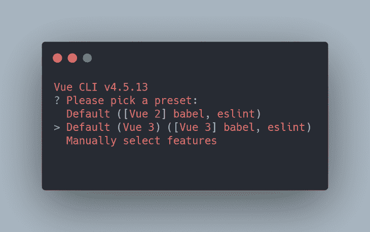
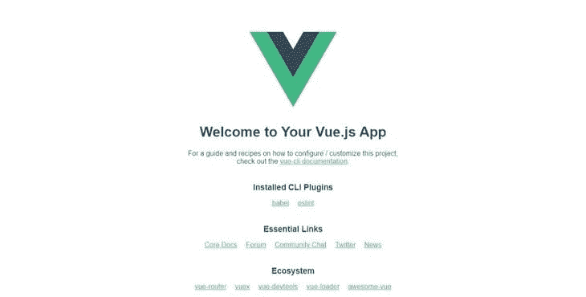

# Vue 路由器终极指南

> 原文：<https://blog.logrocket.com/ultimate-guide-vue-router/>

## 介绍

web 开发中的路由是一种机制，其中 HTTP 请求被路由到处理它们的代码。简单来说，有了路由器，你就决定了当用户访问你网站上的某个页面时应该发生什么。

在 JavaScript 框架的现代时代，网络路由的工作方式有点不同；你可以说它变得更容易实现了。

在 Vue 中，使用 Vue 路由器包处理路由。如果您的 web 应用程序或网站是用 Vue 构建的，并且包含用户需要在其中切换的多个页面，那么您肯定需要 Vue 路由器。

## 目标

在本教程中，我们将通过构建一个迷你演示应用程序，来看看如何使用 Vue 路由器在 [Vue 应用程序](https://blog.logrocket.com/methods-optimizing-vue-js-applications/)中实现路由。

这个演示程序是一个显示啤酒厂相关信息的应用程序:它们的位置、类型和网站。我们将从 [Open Brewery DB API](https://www.openbrewerydb.org/) 中提取数据。

请记住，我们将在我们的应用程序中使用最新版本的 [Vue 路由器](https://next.router.vuejs.org/)和 [Vue](https://v3.vuejs.org/) 。

## 先决条件

本教程假设读者的计算机上安装了以下软件:

*   Node.js 10.6.0 或以上
*   纱线/非织造布
*   Vue CLI
*   VS 代码

强烈建议具备 JavaScript 和 Vue 的工作知识。

您可以使用以下命令安装 Vue CLI:

```
yarn global add @vue/cli
# OR
npm install -g @vue/cli

```

## 入门指南

我们将使用 Vue CLI 工具来引导一个新的 Vue 项目。这个工具让我们在开始使用我们的应用程序时不用担心配置，因为我们可以手动选择所需的包。

让我们创建我们的项目！

打开终端，键入以下命令创建一个新的 Vue 项目:

```
vue create breweries-app

```

会有一个选择预置的提示。选择**默认(Vue 3) ([Vue 3] babel，eslint)** 快速设置。



使用 Vue CLI，我们可以安装 Vue 路由器包，并通过选择**手动选择功能**选项，然后选择 **Vue 路由器**作为我们项目配置的一部分，让它自动设置。但那就没什么意思了，不是吗？

在本教程中，我们将学习如何自己手动设置和配置 Vue 路由器。

现在，使用以下命令将目录切换到项目文件夹:

```
cd breweries-app

```

然后，像这样开始项目:

```
yarn serve
#OR
npm run serve

```

可以访问运行在 [https://localhost:8080](https://localhost:8080) 上的应用。



## 创造我们的观点

在我们进行项目的实质性工作之前，我们必须先研究我们的观点。视图是当用户访问我们的网站或应用程序时向他们显示的页面。

首先，让我们在您喜欢的代码编辑器中打开项目。

接下来，在终端上更改目录以移动到`src`目录:

```
cd src

```

然后，运行以下命令创建一个名为`views`的文件夹:

```
mkdir views

```

在我们刚刚创建的`views`目录中创建以下文件:`AllBreweries.vue`、`BreweryDetail.vue`和`NotFound.vue`。

打开新创建的文件，并粘贴以下特定于每个文件的代码。

首先是我们的`AllBreweries.vue`页面，这是用户访问我们网站时提供的第一个页面:

```
<!-- Vue.Js -->
<!-- AllBreweries.vue -->
<template>
  <div class="container">
    <div class="breweries-grid">
      <div
        class="brewery"
        v-for="brewery in allBreweriesList"
        :key="brewery.id"
      >
        <div class="brewery-info">
          <h3>{{ brewery.name }}</h3>
          <p>{{ brewery.country }}</p>
          <a :href="brewery.website_url">
            {{ brewery.website_url || `Not available`}}
          </a>
        </div>
      </div>
    </div>
  </div>
</template>
<script>
import { onMounted, ref } from "vue";
export default {
  setup() {
    const apiUrl = "https://api.openbrewerydb.org/breweries/";
    // We declare our list and make it reactive
    let allBreweriesList = ref([]);
    onMounted(() => {
      // We call our function here when the component is first instantiated
      fetchAllBreweries();
    });
    const fetchAllBreweries = () => {
      // Function to retrieve  a list of all breweries from the API
      fetch(apiUrl)
        .then((response) => response.json())
        .then((data) => {
          // here we set the data gotten from the API to equal our array
          allBreweriesList.value = data;
        });
    };
    return {
      allBreweriesList,
      fetchAllBreweries,
    };
  },
};
</script>
<style>
html {
  padding: 0;
  margin: 0;
}
.container {
  min-height: 100vh;
  height: 100%;
  margin: 0 auto;
  padding: 0 20px;
  margin: 0 auto;
}
.brewery {
  height: 200px;
  min-width: 280px;
  margin: 0 auto;
  border-radius: 10px;
  box-shadow: 1.5px 1.5px 11px hsla(208.4, 23.5%, 31.8%, 0.39),
    -1.5px -1.5px 11px rgba(0, 0, 0, 0);
  background-color: rgba(50, 155, 29, 0.568);
  cursor: pointer;
}
.breweries-grid {
  display: grid;
  grid-template-columns: repeat(auto-fill, minmax(260px, 1fr));
  grid-gap: 3rem;
  grid-auto-rows: minmax(100px, auto);
  padding: 50px 0;
  margin: 0 auto;
}
.brewery-info {
  padding-left: 20px;
}
</style>

```

在`AllBreweries.vue`中，我们已经成功地从 API 中检索了数据，然后遍历该数据，将其显示在模板中。

接下来，让我们做我们的`BreweryDetail.vue`页面，当点击它时，它包含关于一个特定酿酒厂的额外信息:

```
<!-- Vue.Js -->
<!-- BreweryDetail.vue -->
<template>
  <div class="brewery-detail">
     <ul>
        <li><strong>Name: </strong></li>
        <li><strong>Type: </strong></li>
        <li><strong>Country: </strong></li>
        <li><strong>State: </strong></li>
        <li><strong>Street: </strong>
        </li>
        <li>
          <strong>Website: </strong> 
            <a href=""></a>
        </li>
      </ul>
    </div>
</template>

```

现在，在我们的`BreweryDetail.vue`页面中，除了一些基本的 HTML 之外，这里没有更多的东西。这是因为随着我们的进展，我们将一点一点地完成这个组件。

最后，让我们为我们的`NotFound.vue`组件做一些标记:

```
<!-- Vue.Js -->
<!-- NotFound.vue -->
<template>
  <div>
    <h1>
  Sorry, this page doesn't exist or has been moved to another location
    </h1>
  </div>
</template>

```

我们的`NotFound.vue`是当用户访问一条不存在的路线时，我们将提供给他们的页面。我们将在后面的章节中了解更多。

## 路由器设置和配置

现在，我们正在安装和配置 [Vue 路由器](https://blog.logrocket.com/router-options-compared/)的有趣部分！

首先，使用以下命令将目录改回我们项目文件夹的根目录:

```
cd ..

```

要在我们项目的根文件夹中安装 Vue 路由器，请运行以下命令:

```
yarn add [email protected]
#OR
npm install [email protected]

```

接下来，将目录改回到`src`文件夹:

```
cd src

```

在`src`目录下创建一个名为`router`的文件夹:

```
mkdir router

```

再次更改目录，移动到新创建的`router`文件夹:

```
cd router

```

最后，在这个目录中创建一个名为`index.js`的文件:

```
touch index.js

```

这个文件将作为我们的路由器配置文件。

在新创建的`index.js`文件中，粘贴以下代码:

```
// src/router/index.js
import { createRouter, createWebHistory } from 'vue-router';
import AllBreweries from "@/views/AllBreweries.vue"
const routes = [
    {
        path: "/",
        name: "AllBreweries",
        component: AllBreweries,
    },
]

const router = createRouter({
  history: createWebHistory(),
  routes
})

export default router

```

让我们深入了解一下这里的代码意味着什么。

首先，我们需要从 Vue 路由器导入函数`createRouter`和`createWebHistory`。这些函数创建一个用户可以返回的历史，并分别为 Vue 构造一个路由器对象。

请注意我们如何在数组中创建我们的`routes`，其中每条路线都是一个具有以下属性的对象:

*   `Path`，可以找到该路由的 URL 路径
*   `Name`，链接到此路线时使用的可选名称
*   `Component`，调用此路线时加载哪个组件

然后我们创建`router`对象来调用`createRouter`函数，然后传入`history`键值和`routes`数组作为参数，然后导出它。

接下来，打开`src`文件夹中的`main.js`文件，在`import App from './App.vue'`后添加`import router from "./router"`，在`createApp(App)`和`.mount('#app')`之间添加`.use(router)`。

上面的代码导入 Vue 路由器，并在全局 Vue 实例上实例化它。

接下来，打开`src`目录中的`App.vue`文件，删除其所有内容，只留下以下内容:

```
<!-- Vue.Js -->
<!--App.vue -->
<template>
<!-- This serves all our pages using vue router -->
 <router-view />
</template>
<script>
export default {
  name: 'App',
}
</script>

```

我们在第四行添加的`router-view`组件是一个功能组件，它呈现给定路径的匹配组件。

## 惰性装载路线

让我们倒回去学习一个有趣的路由技巧，叫做延迟加载。

因为我们的应用程序随着增长会变得越来越复杂，所以我们的包的大小会增加，这会减慢加载时间。幸运的是，Vue 路由器有延迟加载功能，这使我们能够推迟加载特定的路由，直到它们被用户访问。

让我们尝试在路由器配置文件中实现这一点。在`router/index.js`中，在`name: "AllBreweries",`后添加以下代码:

```
         component: () => import(
    /* webpackChunkName: "AllBreweries" */ '../views/AllBrewries.vue')

```

完成后，文件应该如下所示:

```
// router/index.js
import { createRouter, createWebHistory } from 'vue-router';

const routes = [
    {
        path: "/",
        name: "AllBreweries",
         component: () => import(
    /* webpackChunkName: "AllBreweries" */ '../views/AllBrewries.vue')
    }
]
const router = createRouter({
    history: createWebHistory(process.env.BASE_URL),
    routes
})
export default router

```

请注意，我们已经删除了之前位于顶部的 import 语句，并用动态 import 语句替换了 route 的`component`属性。当访问路由时，该语句获取所需的文件。这就是它的全部；我们已经实现了延迟加载功能。

## 动态路由

对于我们正在构建的应用程序，当用户点击一个特定的啤酒厂时，它会将他们带到一个包含该啤酒厂更多详细信息的页面。现在，我们不能为 API 中列出的每个啤酒厂手动创建一条路线。我们如何解决这个问题？

幸运的是，Vue 路由器有一个称为动态路由的功能，它使我们能够通过我们的路由加载动态数据。让我们看看如何利用这一点。

首先，我们需要修改我们的`router/index.js`文件来为`BreweryDetail.vue`页面创建路径:

```
//router/index.js
...
const routes = [
    {
        path: "/",
        name: "AllBreweries",
        component: () => import(
    /* webpackChunkName: "AllBreweries" */ '../views/AllBrewries.vue')
    },
    {
        path: "/brewery/:id",
        name: "BreweryDetail",
        component: () => import(
  /* webpackChunkName: "BreweryDetail" */ '../views/BreweryDetail.vue')
    }
...

```

路线的路径有一个动态的`:id`段，称为“param”param 用于使用通过`:id`传递的任何值来操纵路由组件的状态，并且可以使用我们模板中的`$route.params`来访问，从而使路由成为动态的。

接下来，让我们研究一下`BreweryDetail.vue`页面路由背后的逻辑:

```
<!-- Vue.Js -->
<!-- BreweryDetail.vue -->
...
<script>
import { onMounted, ref } from "vue";
import { useRoute } from "vue-router";
export default {
  setup() {
      // create object that brewery information from API will be stored in
    let breweryDetails = ref({});
    const apiUrl = "https://api.openbrewerydb.org/breweries/";
    // here we instantiate the useRoute method in our component
    const route = useRoute();
    onMounted(() => {
        // invoke the function when our component is mounted on DOM
      fetchAllBreweryDetail();
    });
    // function to fetch all brewery information
    const fetchAllBreweryDetail = () => {
     // append the route params to the url to get information on the specific brewery clicked by user
      fetch(apiUrl + route.params.id)
        .then((response) => response.json())
        .then((data) => {
          //set data gotten from API call to our breweryDetails Object
          breweryDetails.value = data;
        });
    };
    return {
      fetchAllBreweryDetail,
      breweryDetails,
    };
  },
};
</script>
...

```

我们可以更新模板部分，如下所示:

```
<!-- Vue.Js -->
<!-- BreweryDetail.vue -->
<template>
  <div class="brewery-detail">
      <!-- Button users can click to back to the previous route  -->
    <button class="back-btn" @click="$router.back()">Go back</button>
      <ul>
          <!-- Up here in the template, we access the data gotten from the API -->
        <li><strong>Name: </strong>
          {{ breweryDetails.name }}
        </li>
        <li><strong>Type: </strong>
          {{ breweryDetails.type || `Not available` }}
        </li>
        <li><strong>Country: </strong>
          {{ breweryDetails.country }}
        </li>
        <li><strong>State: </strong>
          {{ breweryDetails.state }}
        </li>
        <li><strong>Street: </strong>
          {{ breweryDetails.street || `Not available` }}
        </li>
        <li>
          <strong>Website: </strong> 
            <a :href="breweryDetails.website_url">
            {{ breweryDetails.website_url || `Not Available` }}
            </a>
        </li>
      </ul>
    </div>
</template>

```

在这里，我们的代码从`breweryDetails`对象获取数据，并在我们的模板上更新它。

如果你已经注意到了，我们已经添加了一个漂亮的小按钮，用户可以点击它返回到以前访问过的路线。它的工作原理就像点击浏览器上的后退按钮一样。

## 在路线之间导航

为了让用户能够导航到啤酒厂的特定页面，我们将修改`AllBreweries.vue`的模板部分中的代码。

代替我们常规的 HTML `anchor`标签，Vue Router 有它自己的`router-link`组件，我们可以把它传递给`to` prop，它接受一个带有一堆键或值对的对象。

使用`router-link`组件有两种方式在路线之间导航:通过 path 属性和命名路线。

### 路径属性

在使用 path 属性方法时，我们只需要传入我们希望用户在单击链接时访问的 URL 路径。然后，追加从 API 检索的 ID，并将其设置为 param 值。

URL 路径总是与路由器配置文件中定义的路径相同。您的代码应该如下所示(注意第 12 行和第 14 行):

```
<!-- Vue.Js -->
<!-- AllBreweries.vue -->
<template>
  <div class="container">
    <div class="breweries-grid">
      <div
        class="brewery"
        v-for="brewery in allBreweriesList"
        :key="brewery.id"
      >
        <div class="brewery-info">
          <router-link :to="'/brewery/' + brewery.id">
          <h3>{{ brewery.name }}</h3>
          </router-link>
          <p>{{ brewery.country }}</p>
          <a :href="brewery.website_url">
            {{ brewery.website_url || `Not available`}}
          </a>
        </div>
      </div>
    </div>
  </div>
</template>

```

### 命名路线

对于 named routes 方法，我们传入了可以访问`name`属性的`name`键，作为我们创建的每条路由的值。

我们还传入了接受一个对象的`params`键。在对象内部，我们有`id`键，我们用它来设置 param 的值等于从 API 中检索的 ID。

您的代码应该是这样的(注意第 12、13 和 15 行):

```
<!-- Vue.Js -->
<!-- AllBreweries.vue -->
<template>
  <div class="container">
    <div class="breweries-grid">
      <div
        class="brewery"
        v-for="brewery in allBreweriesList"
        :key="brewery.id"
      >
        <div class="brewery-info">
          <router-link 
            :to="{name: 'BreweryDetail', params: {id: brewery.id}}">
            <h3>{{ brewery.name }}</h3>
          </router-link>
          <p>{{ brewery.country }}</p>
          <a :href="brewery.website_url">
            {{ brewery.website_url || `Not available`}}
          </a>
        </div>
      </div>
    </div>
  </div>
</template>

```

这两种方法都有效，但是在我们必须更改我们希望用户访问的 URL 路径的名称的场景中，我们必须在每个实例中手动更改它。

现在，这在这里不是一个大问题，因为它只在一个地方使用，但是想想如果我们在一千个实例中使用这个 URL 路径，我们必须经历的所有压力。

然而，如果我们使用命名路由方法，我们将只需要在一个实例中改变 URL 路径:我们的路由器文件配置。听起来很简单，对吗？

既然我们已经讨论了命名路由方法的优点，我们将在本教程中继续讨论。

## 处理 404 错误

假设一个用户访问了一个我们之前没有在路由器配置文件中创建的路由。我们的应用程序将加载，但没有组件。当这种情况发生时，我们需要一种方法来告诉我们的路由器做什么。

为了实现这个特性，我们需要修改路由器配置文件，将以下代码添加到我们的`index.js`文件中:

```
    {
        path: "/:catchAll(.*)",
        component: () => import(
        /* webpackChunkName: "NotFound" */ '../views/NotFound.vue')
    },
...

```

Vue 路由器使用自定义正则表达式来实现这一点。`:catchAll`是动态段，`(.*)`是一个正则表达式，Vue 路由器使用它来评估正在访问的路由是否已经在我们路由器的配置文件中定义。如果它不存在，我们的`NotFound.vue`组件就会被呈现在屏幕上。

## 路线转换

给我们的用户体验增加一点美感的一个有趣的方法是通过[路线转换](https://blog.logrocket.com/creating-transitions-in-your-vue-app-with-vue-router/)。

要将它添加到我们的应用程序中，我们所需要的就是用 Vue 路由器的自定义`transition`元素标签周围的`v-slot`属性包装`<router-view/>`元素标签。

接下来，在`transition`标签之间，我们添加 Vue 的`component`元素，并将其`is`属性绑定到我们从 Vue 插槽中获得的组件的值。

我们还向它传递一个值为`$route.path`(当前路径)的`key`属性，以确保转换正确工作，并且当路径改变时，它仍然会销毁和重新创建所有页面。

在`transition`元素中，我们为`name`属性赋予了`fade`的值，该值决定了将应用于该元素的 CSS 类的名称。`transition`元素有一个`mode`属性，指示 Vue 路由器如何处理页面之间的转换。

接下来，在样式部分，我们可以定义当路由改变时应用于页面的 CSS 属性。

下面是我们如何将它添加到我们的应用程序中:

```
<!-- Vue.Js -->
<!-- App.vue -->
<template>
<!-- This serves all our pages using vue router -->
<router-view v-slot="{ Component }">
  <transition name="fade" mode="out-in">
    <component :is="Component" :key="$route.path"/> 
  </transition>
</router-view>
</template>

<style>
.fade-enter-active, .fade-leave-active {
  transition: opacity .4s;
}
.fade-enter, .fade-leave-to {
  opacity: 0;
}
</style>

```

## 结论

在我们的 Vue 应用中使用 Vue 路由器非常简单明了。在本文中，我们学习了如何添加页面路由功能，以及如何利用 Vue 路由器的一些特性，在用户浏览我们的应用程序时，为他们提供美妙的体验。

要了解更多关于 Vue 路由器的信息，我建议通读他们的文档。

[你可以在这里找到本教程的源代码](https://github.com/codiini/vue-router-tutorial)。

## 像用户一样体验您的 Vue 应用

调试 Vue.js 应用程序可能会很困难，尤其是当用户会话期间有几十个(如果不是几百个)突变时。如果您对监视和跟踪生产中所有用户的 Vue 突变感兴趣，

[try LogRocket](https://lp.logrocket.com/blg/vue-signup)

.

[](https://lp.logrocket.com/blg/vue-signup)[https://logrocket.com/signup/](https://lp.logrocket.com/blg/vue-signup)

LogRocket 就像是网络和移动应用程序的 DVR，记录你的 Vue 应用程序中发生的一切，包括网络请求、JavaScript 错误、性能问题等等。您可以汇总并报告问题发生时应用程序的状态，而不是猜测问题发生的原因。

LogRocket Vuex 插件将 Vuex 突变记录到 LogRocket 控制台，为您提供导致错误的环境，以及出现问题时应用程序的状态。

现代化您调试 Vue 应用的方式- [开始免费监控](https://lp.logrocket.com/blg/vue-signup)。