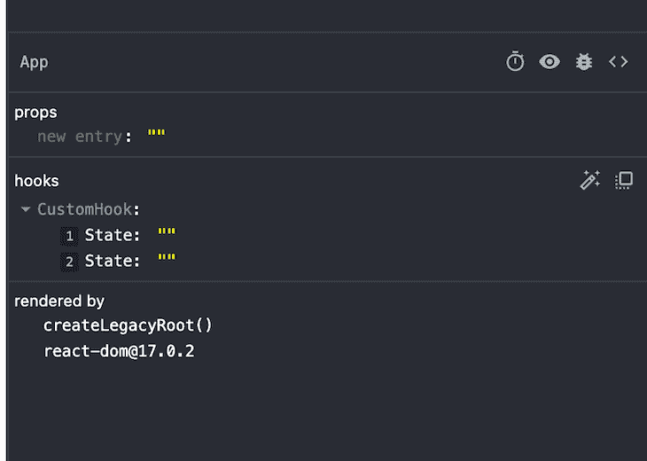
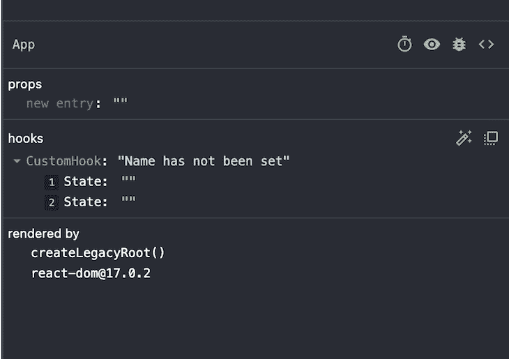

# 被低估的 React 钩子你错过了

> 原文：<https://blog.logrocket.com/underrated-react-hooks-youre-missing-out-on/>

***编者按**:这篇文章最后一次更新和准确性验证是在 2022 年 9 月 16 日。*

React 挂钩为我们提供了在功能组件的上下文中访问核心 React 功能的途径。传统上，为了优化 React，开发人员必须在功能组件和类组件之间切换。然而，React 钩子的引入使得我们可以在项目中使用功能组件，无论是小型还是大型应用程序。

如果您是一名 React 开发人员，喜欢编写功能组件而不是类组件，那么这篇文章适合您；我们将看看三个有用但有些被低估的 React 钩子，它们可能不太熟悉， [`useImperativeHandle`，`useLayoutEffect`和`useDebugValue`](https://blog.logrocket.com/react-reference-guide-hooks-api/#useimperativehandle) 。我们将探索它们的用例、语法和一些代码示例。我们开始吧！

## 反应`useImperativeHandle`钩子

在 React 中，数据通过 props 从父组件传递到子组件，这就是所谓的单向数据流。父组件不能直接调用子组件中定义的函数，也不能向下抓取自己的值。

在某些情况下，我们希望父组件向下到达子组件，获取来自子组件的数据供自己使用。我们可以用 [`useImperativeHandle`钩子](https://reactjs.org/docs/hooks-reference.html#useimperativehandle)实现这种类型的数据流，它允许我们通过`ref`向父组件公开子组件中的值、状态或函数。您还可以决定父组件可以访问哪些属性，从而维护子组件的私有范围。

### 句法

```
useImperativeHandle(ref, createHandle, [dependencies])

```

*   `ref`:父组件传下来的参照
*   `createHandle`:向父组件公开的值
*   `dependencies`:一个值数组，当钩子发生变化时，它会重新运行

### 用例

当您需要双向数据和逻辑流，但又不想通过引入状态管理库使事情过于复杂时，`useImperativeHandle`钩子是一个很好的选择。

当你想实现命令式逻辑来告诉用户一个动作应该如何在你的应用中执行时,`useImperativeHandle`也很有帮助。例如，您可以通过编程方式，在用户一到达表单的第一个输入字段时就聚焦它，而不是让用户单击表单来聚焦它。

有一次，当父组件中的一个按钮被点击时，当我需要打开一个模态组件时，我使用了`useImperativeHandle`钩子。在父组件中定义状态会导致父组件及其子组件在每次单击模式按钮时重新呈现，因此，我希望在子组件中定义状态。相反，我使用`useImperativeHandle`和`forwardRef`将模态状态存储在`Modal`组件中:

```
import React, { useRef } from 'react';
import Child from './Child';

 const ParentComponent = () => {

    const childRef = useRef(null);

    const handleOpenModal = (value) => {
        childRef.current.openModal(value);
    }

    return (
        <div>
            <p>This is a parent component</p>
            <Child ref={childRef}/>

            <button onClick={() => handleOpenModal(true)}>Open modal</button>
        </div>
    )

}

export default ParentComponent;

```

在上面的代码中，我们定义了一个`ref`，并将其传递给子组件。在下面的代码中，`ref`将是传递给子组件中的`useImperativeHandle`的第一个参数。

我们还定义了一个`handleOpenModal`函数，它返回从带有`childRef.current.openModal(value)`的子组件向上传递的`openModal`函数。然后，当单击按钮时，调用该函数。

子组件应该类似于下面的代码:

```
import React, { forwardRef, useImperativeHandle, useState } from 'react';

function ChildComponent (props, ref) {
 const [openModal, setOpenModal] = useState(false);

 useImperativeHandle(ref, () => ({
  openModal: (value) => setOpenModal(value),
 }));

  if(!openModal) return null;

    return (
        <div>
            <p>This is a modal!</p>
            <button onClick={() => setOpenModal(false)}> Close </button>
        </div>
    )

}

export default forwardRef(ChildComponent);

```

我们将子组件包装在一个`forwardRef`中，以公开在`useImperativeHandle`中定义的`openModal`函数。在父组件中，子组件中定义的状态被更改，导致只重新呈现子组件。问题解决了！

## 反应`useLayoutEffect`钩子

像`useEffect`钩子一样， [`useLayoutEffect`钩子](https://reactjs.org/docs/hooks-reference.html#uselayouteffect)允许您执行副作用，比如 API 调用、设置订阅和手动操作函数组件中的 DOM。

尽管 React 在执行 DOM 更新后触发了`useEffect`和`useLayoutEffect`，但在浏览器绘制这些更新供用户查看之前会同步调用`useLayoutEffect`，而在浏览器绘制这些更新之后会异步调用`useEffect`。

因此，在`useLayoutEffect`运行之前，浏览器无法绘制任何浏览器更新。出于这个原因，您将主要使用`useEffect`，当副作用正在运行时，它在浏览器中向您的用户显示类似加载器的东西。

然而，在一些情况下，我们希望在向用户显示更新之前运行副作用并更新 DOM。我们可以通过下面的语法使用`useLayoutEffect`来实现。

### 句法

```
useLayoutEffect(callback, [dependencies])

```

*   `callback`:包含副作用逻辑的功能
*   `dependencies`:依赖关系数组。当任何依赖关系的值改变时，回调函数再次运行

考虑下面的代码:

```
import React, {
    useState,
    useLayoutEffect,
    useEffect
  } from 'react';

  const TestHooks = () => {
    const [randomNumber, setRandomNumber] = useState(0);

    useEffect(() => {
    if (randomNumber === 0) {
        setRandomNumber(Math.random() * 1000);
    }
  }, [randomNumber]);

    return (
        <div className='App'>
            <p>{randomNumber}</p>
            <button onClick={() => setRandomNumber(0)}>
                Change value 
            </button>
        </div>
    );
  };

  export default TestHooks;

```

在上面的代码中，我们有一个用随机数更新状态的副作用，并包括一个将状态重置为`0`的按钮。如果我们用`useEffect`钩子运行上面的代码，你会注意到当点击重置按钮时，数字从`0`变成下一个随机数时会有闪烁的效果。

现在，将`useEffect`改为`useLayoutEffect`，再次点击按钮。向下一个随机数的过渡更加平滑。

下面的代码片段分别代表带有`useEffect`和`useLayoutEffect`的代码:

```
DOM updates => Browser paints the update for users to see => useEffect is run => another DOM update => Broswer paints the second update for user to see

DOM updates => useLayoutEffect is run =>another DOM update => Broswer paints the overall update for user to see

```

您可以尝试使用[代码](https://codesandbox.io/s/youthful-shadow-0ey4y?file=/src/App.js)来了解更多信息。

### 用例

有一次，当我为一个客户开发一个静态网站时，我使用了`useLayoutEffect` Hook 和 [React Router DOM 来路由](https://blog.logrocket.com/react-router-dom-tutorial-examples/)。然而，当在不同页面之间导航时，我注意到页面的窗口滚动位置没有移动到顶部，而是从上一页的位置开始滚动，这在 React Router DOM 中并不少见。

我们可以用`useLayoutEffect`如下解决这个问题:

```
import { useLayoutEffect } from "react";
import { useLocation } from "react-router-dom";

export default function ScrollToTop() {
  const { pathname } = useLocation();

  useLayoutEffect(() => {
    window.scrollTo(0, 0);
  }, [pathname]);

  return null;
}

```

`index.js`文件看起来像下面的代码:

```
function Index() {
  return (
    <Router>
      <ScrollToTop />
      <App />
    </Router>
  );
}

```

基本上，在上面的代码中，我们告诉浏览器在向用户显示任何内容之前，将用户带到页面的顶部。有了`useLayoutEffect`，我们可以让这个过程变得天衣无缝。

`useLayoutEffect`钩还有其他几种实际应用。所有 DOM 突变后，`useLayoutEffect`同步开火；因此，它可以用来读取和更改 DOM 中的布局，从获取元素的滚动位置或其他样式到在特定的滚动位置添加动画。但是要小心，在运行这个钩子并进行另一次 DOM 更新之前，用户不会看到任何东西。

## 反应`useDebugValue`钩子

与我们讨论过的用于改善用户体验的其他挂钩不同， [`useDebugValue`](https://reactjs.org/docs/hooks-reference.html#usedebugvalue) 改善了开发人员的体验，帮助开发人员以更简单的格式在 React DevTools 中记录信息。注意`useDebugValue`挂钩[只能与定制的反作用挂钩](https://blog.logrocket.com/create-your-own-react-hooks/)结合使用。

### 句法

```
useDebugValue(value)

```

如果你熟悉 React DevTools，那么你就会知道，每当一个内置的 React 钩子像`useState`或`useRef`被用在一个定制钩子中，它就会在 React DevTools 中调试它各自的值。

例如，考虑下面的自定义挂钩:

```
import { useDebugValue, useState } from "react"

export default function useCustomHook() {
  const [name, setName] = useState("")
  const [address, setAddress] = useState("")

  return [name, setName, address, setAddress]
}

```

让我们调用`App.js`中的自定义钩子并检查 DevTools:

```
import useCustomHook from './useCustomHook';

function App() {

  useCustomHook();

  return (
    <>
    <div className="App">
      <p>hey</p>
    </div>
    </>
  );
}

export default App;

```

检查 React DevTools，我们看到已经为我们记录了`useState`的值。我们有两种状态用于`name`和`address`:



此时，我们不知道空字符串属于哪个状态值。如果我们正在构建一个简单的定制钩子，我们可以很容易地运行回代码，看到`name`出现在最前面，所以它应该是 DevTools 中的第一个状态。

然而，如果我们正在构建一个复杂的定制钩子以在各种组件中使用，我们将需要一种方法来在调试时跟踪哪些值属于哪些状态。为此，我们可以使用`useDebugValue`在 React DevTools 的自定义钩子中显示值的标签。

请参见下面更新的自定义挂钩:

```
import { useDebugValue, useState } from "react"

export default function useCustomHook() {
  const [name, setName] = useState("")
  const [address, setAddress] = useState("")

  useDebugValue(name ? 'Name has been set' : 'Name has not been set')

  return [name, setName, address, setAddress]
}

```

更新后的 DevTools 如下:



我们能够使用`useDebugValue`来监控`name`的值，因为它的状态发生了变化，所以我们不必猜测它的值是多少。当钩子的状态从 DevTools 中的值看不出来时,`useDebugValue`很有用。

[`useDebugValue`接受可选的第二个参数](https://blog.logrocket.com/improve-custom-hook-debugging-with-usedebugvalue/)，一个格式化函数。假设您接收的值在可读之前需要进行格式化，比如解析 JSON 数据或格式化日期。该函数接收调试值并返回一个格式化的值，但是，它仅在 DevTools 打开并且正在检查该值时运行:

```
useDebugValue(date, date => date.toDateString());

```

## 结论

在本教程中，我们讨论了三个 React 挂钩，它们在大多数情况下并不需要，但在我们面临某些极端情况时却能让我们的生活变得更加轻松。

`useImperativeHandle`钩子允许我们向父组件公开子组件中的值、状态或函数。`useLayoutEffect`允许我们执行副作用，比如 API 调用、设置订阅和手动操作函数组件中的 DOM。最后，`useDebugValue`钩子使得开发者更容易在 React DevTools 中记录信息。

现在，您应该熟悉这些特殊的 React 挂钩，并知道当您发现自己处于其中一种情况时如何使用它们。我希望这篇文章对你有帮助！

## [LogRocket](https://lp.logrocket.com/blg/react-signup-general) :全面了解您的生产 React 应用

调试 React 应用程序可能很困难，尤其是当用户遇到难以重现的问题时。如果您对监视和跟踪 Redux 状态、自动显示 JavaScript 错误以及跟踪缓慢的网络请求和组件加载时间感兴趣，

[try LogRocket](https://lp.logrocket.com/blg/react-signup-general)

.

[ ](https://lp.logrocket.com/blg/react-signup-general) [](https://lp.logrocket.com/blg/react-signup-general) 

LogRocket 结合了会话回放、产品分析和错误跟踪，使软件团队能够创建理想的 web 和移动产品体验。这对你来说意味着什么？

LogRocket 不是猜测错误发生的原因，也不是要求用户提供截图和日志转储，而是让您回放问题，就像它们发生在您自己的浏览器中一样，以快速了解哪里出错了。

不再有嘈杂的警报。智能错误跟踪允许您对问题进行分类，然后从中学习。获得有影响的用户问题的通知，而不是误报。警报越少，有用的信号越多。

LogRocket Redux 中间件包为您的用户会话增加了一层额外的可见性。LogRocket 记录 Redux 存储中的所有操作和状态。

现代化您调试 React 应用的方式— [开始免费监控](https://lp.logrocket.com/blg/react-signup-general)。