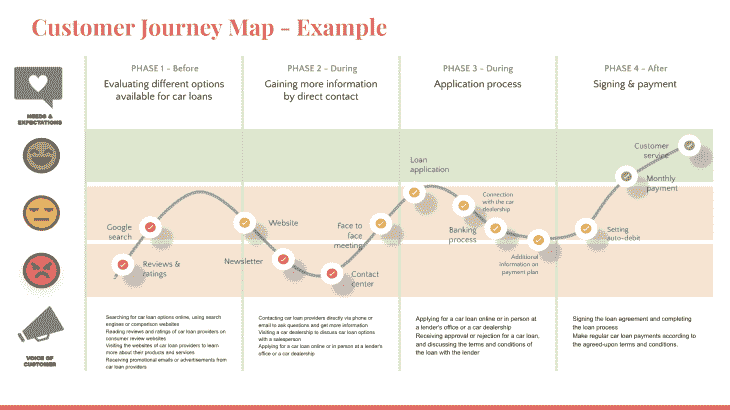
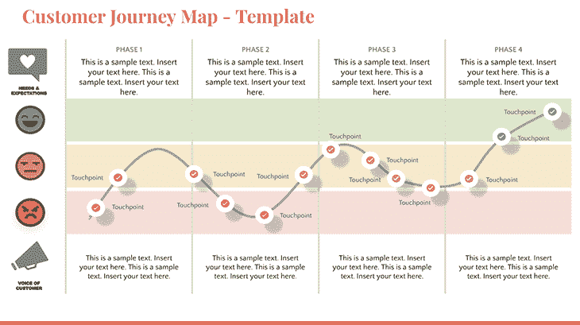

# 通过客户旅程图更好地了解用户

> 原文：<https://blog.logrocket.com/product-management/understand-users-better-customer-journey-mapping/>

作为产品人员，我们专注于为我们的产品和服务创造世界级的用户体验。虽然在与我们的产品或服务互动时，良好的用户体验至关重要，但我们经常错过在产品流之外创造影响的前景。

我们日常使用且容易回忆/记住的伟大品牌已经掌握了这个概念。他们通过在使用其产品和服务之前、期间和之后创造体验，对客户产生积极影响。因此，好的品牌是在向顾客推销体验。

这种深远的影响可以通过跟踪客户的旅程，了解他们来自哪里，管理他们的期望，并在实现目标后继续关注来实现。

随着数字化和新兴技术的发展，存在多种渠道与客户沟通，从而重新定义了客户的期望。因此，客户在做出购买决定时的设想会发生重大转变。

为了保持忠诚度，公司必须考虑不同的方法来满足这些新的期望，并使每个客户的旅程顺利愉快。获得深入知识以提供良好体验的最佳方式是创建客户旅程图。

* * *

## 目录

* * *

## 什么是客户旅程映射？

顾客旅程图是指你绘制出顾客在选择和使用你的产品时所经历的各个阶段，以及他们使用后所做的事情。

数字时代为我们提供了无数与客户沟通的机会。然而，这也意味着我们必须了解我们的客户如何体验所有这些接触点。

从决定购买我们的产品/服务到售后服务等等，客户旅程图将客户的体验可视化。这是一种将他们的里程碑视为与我们的产品和服务互动点的方式。这最终有助于我们深入了解客户体验，以及我们如何在每一点上优化客户体验，打造愉快的旅程。

客户旅程图最有利于现有产品和服务识别挑战和改进。不过，通过分析潜在客户的期望和衡量竞争对手的品牌体验，它也有助于新产品开发。

## 客户旅程图的目标是什么？

通过创建客户旅程图，您可以确定客户体验中的难点和改进机会，从而帮助您提供更好的服务并留住客户。此外，客户旅程图可以帮助跨职能团队和不同的 SME(主题专家)就客户体验达成共识。这可以导致更有效和高效的产品开发和运营，从而提高客户满意度和忠诚度。

创建客户旅程图的四个主要目标是:

### 创造可靠的用户体验

[以客户为中心](https://blog.logrocket.com/product-management/what-is-customer-centricity-how-to-achieve-it/)并根据反馈和数据做出决策以改善用户体验是伟大产品或服务开发的坚实基础。以客户为中心可以通过可视化客户旅程图所获得的共识来推动。

### 更加深入地了解你的客户

对客户行为的深入了解包括收集和分析客户在每个阶段如何与每个接触点互动的数据。它可以包括研究客户人口统计、行为模式、感受和动机。

通过分析这些数据，您可以深入了解是什么推动了客户行为，以及客户行为如何随着时间的推移而变化，从而帮助您做出明智的决策，改善客户体验并最终推动产品增长。

### 创建个性化

了解客户行为可以帮助公司预测客户的需求和偏好。它允许我们驱动行为数据驱动的开发，将我们的产品推向提供个性化体验和与他们建立更强关系的下一个层次。

### 在组织内建立对共同目标的共识

通过创建客户旅程图，整个组织将通过对客户体验的共同理解朝着同一目标努力。这可以带来更好的协作，并最终带来更积极的客户体验。它还有助于确定优先级和[设置共享 KPI(关键绩效指标](https://blog.logrocket.com/product-management/what-metrics-kpis-product-managers-track/))。

## 如何创建顾客旅程图

接下来，我们将讨论如何创建客户旅程图。这并不像人们想象的那么难！

### 识别和创建客户群

创建客户旅程图的第一步是识别和开发客户群。这包括根据共同的特征，如人口统计、需求、行为和目标，将您的客户分组。

让我们举一个汽车贷款申请的例子。你的公司帮助人们获得汽车贷款，并使用数字产品来帮助这个过程。

第一个客户群可以是年龄在 18-25 岁之间的人，他们在职业生涯早期首次拥有汽车，希望获得可承受的利率和简单的审批流程，最好能够通过电话执行端到端流程。

* * *

订阅我们的产品管理简讯
将此类文章发送到您的收件箱

* * *

另一个客户群可以是希望购买第二辆汽车的家庭成员，年龄在 30-55 岁之间，希望与配偶共同申请，家庭总收入超过 100，000 美元。

### 创建角色

一旦你确定了你的客户群，你就可以为每个客户群创建角色。人物角色是代表特定客户群的虚构角色，它们可以帮助您更好地了解客户的需求、动机、感受和行为。

以下是基于第一个客户群的不同角色的示例:

*   18 岁的大学生安娜在当地一家餐馆开始了兼职工作，她正在寻找一辆汽车，以便于上下班和晚上工作
*   24 岁的大学毕业生约翰开始在一家营销公司实习，他正在寻找一辆能方便上班的汽车
*   19 岁的 Emelie 是一名学生，也是一名有影响力的人，她最近名声大噪，并得到了大型时尚品牌的赞助，她打算购买自己的第一辆别致的跑车，以适应她的个性和生活方式

### 创造背景故事

背景故事帮助我们与我们的人物角色联系起来，并赋予他们一个特征。我们可以根据他们的需求和要求来确定他们的经历，并了解他们来自哪里，对他们来说什么是重要的，以及他们希望服务提供商如何对待他们。

让我们为我们的第一个角色安娜创造一个背景故事。

安娜是一名十八九岁的大学生。她全职上课，兼职工作来维持自己的经济。尽管安娜工作繁忙，但她有很高的积极性，并决心在学业和工作上取得成功。

作为一名大学生，安娜总是忙忙碌碌，总是在寻找节省时间和金钱的方法。她是一个狂热的技术用户，使用智能手机和笔记本电脑与朋友和同学保持联系。她还使用网上购物和拼车应用程序，使她的日常生活更加方便。

安娜最近决定申请汽车贷款来买她的第一辆车。她相信拥有一辆车会给她更多的自由和灵活性，她对自己开车去上课和上班的前景感到兴奋。她目前正在研究汽车贷款选项，并比较不同贷款人的利率，以找到最佳交易。

作为汽车贷款提供商的潜在客户，Anna 面临着许多机遇和挑战。一方面，她是一个年轻有上进心的人，很可能是一个负责任的借款人。另一方面，她有限的收入和缺乏信用记录可能会使她很难获得贷款。一个汽车贷款提供商可以为像安娜这样的年轻借款人提供灵活的条款和低利率，可能会赢得她的业务。

### 标出所有接触点

一旦你创建了你的人物角色，你就可以开始规划每个人物角色的客户之旅。这包括识别每个人物角色的关键接触点和体验，从他们第一次意识到你的产品到他们作出购买决定，等等。

安娜在研究汽车贷款时可能会遇到几个接触点。一些可能的接触点包括:

*   在线搜索汽车贷款选项，使用搜索引擎或比较网站
*   在消费者评论网站上阅读汽车贷款提供商的评论和评级
*   访问汽车贷款提供商的网站，了解他们的产品和服务
*   收到汽车贷款提供商的促销电子邮件或广告
*   与已经办理汽车贷款的朋友或家人交谈，获得他们的建议和推荐
*   通过电话或电子邮件直接联系汽车贷款提供商，询问问题并获取更多信息
*   拜访汽车经销商，与销售人员讨论汽车贷款选项
*   在线申请汽车贷款，或亲自到贷款人的办公室或汽车经销商处申请
*   接收汽车贷款的批准(或拒绝)并与贷方讨论贷款的条款和条件
*   签署贷款协议并完成贷款流程
*   根据商定的条款和条件定期支付汽车贷款

这些接触点代表了与 Anna 接触的机会，为她提供了做出汽车贷款明智决策所需的信息、支持和指导。

通过在每个接触点提供积极和无缝的体验，您的公司可以与 Anna 建立信任和信誉，最终赢得她的长期忠诚客户。我们的目标是在 Anna 以后想要升级或者想要更多车的时候，让她一直处于领先地位。

### 创建一个感受板

您可以使用各种工具和技术来创建客户旅程图，例如流程图、图表和故事板。客户旅程图的目标是提供客户体验的可视化表示，突出任何难点或改进机会。

虽然这是一个感觉图，但创建此板的输入完全是数据驱动的。要创建感觉图，您需要收集客户对每个接触点的反馈和评价。你可以通过定量测试(从你的接触点收集反馈)或定性调查(通过采访一些潜在/现有客户，询问他们的体验如何，并了解它是顺利还是令人沮丧)来做到这一点。

每一个障碍和烦恼都是产品团队在该领域进行改进的机会:

如何根据我们在本文中使用的示例创建客户旅程图的示例。

### 创建机会画布

除了识别/评估客户的负面印象/痛点之外，还要定义解决这些痛点的解决方案，并创建机会画布以提供一流的体验。该机会画布应包括客户体验中所有低谷的数据，以便您可以将其纳入改进的重点领域，并为未来的发展确定明确的优先事项。

客户之旅的结果不应仅限于识别和评估客户之旅，而应是建议的结果。基于分析创建机会画布提供了具体的改进路线图，并有助于确定未来发展的优先顺序。

继续上面的贷款申请示例，一些明显的改进机会如下:

*   提高搜索引擎优化排名，获得更高的谷歌搜索和优化有机交通
*   通过提供准确的信息来改善呼叫中心的质量和排队情况。也许创建一个聊天机器人或 FAQ 部分，让客户能够收集信息，而不必排长队
*   改进申请流程，使其更容易理解，并在填写申请时提供适当的指导

## 客户旅程图模板

正如在上一节的截图中预览的那样，我制作了一个免费模板，您可以用它来帮助绘制客户旅程图。请随意使用它来创建您的客户旅程图:

## 摘要

客户旅程映射对于改善客户体验和获得长期忠诚度至关重要，从长远来看，这将产生有机业务。当一个产品或服务给客户留下印象时，不仅客户会因为未来的需求而回来，还会传播好的话语并产生额外的业务。它还增加了品牌的商誉、信任和声誉。

另一方面，如果公司忽视创建客户旅程图和识别问题，它不仅会带来糟糕的客户体验，而且会随着时间的推移不断失去业务。当然，当单独查看每个接触点时，问题有多大可能并不明显。

然而，当我们编制客户旅程图时，客户的挫折感是如何累积并导致业务损失的就变得很明显了。体验有很长的路要走，如果我们希望我们的业务随着时间的推移有机增长，我们必须专注于改善我们在每个渠道为客户提供的体验。

*精选图片来源:[icon scout](https://iconscout.com/icon/customer-satisfaction-2047186)*

## [LogRocket](https://lp.logrocket.com/blg/pm-signup) 产生产品见解，从而导致有意义的行动

[LogRocket](https://lp.logrocket.com/blg/pm-signup) 确定用户体验中的摩擦点，以便您能够做出明智的产品和设计变更决策，从而实现您的目标。

使用 LogRocket，您可以[了解影响您产品的问题的范围](https://logrocket.com/for/analytics-for-web-applications)，并优先考虑需要做出的更改。LogRocket 简化了工作流程，允许工程和设计团队使用与您相同的[数据进行工作](https://logrocket.com/for/web-analytics-solutions)，消除了对需要做什么的困惑。

让你的团队步调一致——今天就试试 [LogRocket](https://lp.logrocket.com/blg/pm-signup) 。

[Bindiya Thakkar Follow](https://blog.logrocket.com/author/bindiyathakkar/) Experienced product manager and product owner with a demonstrated history of working in the Omni channel and digital tools. Skilled in product management, digital strategy, roadmapping, business strategy, and user experience.