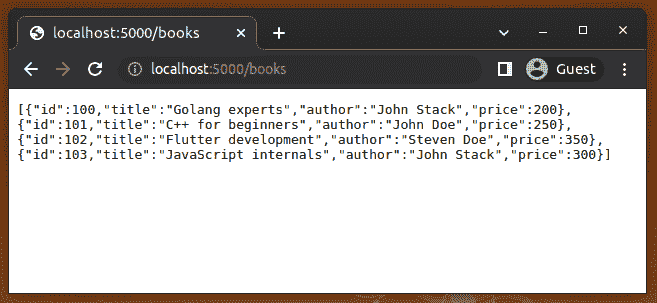
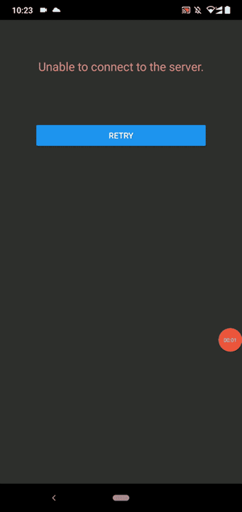

# 在 React Native 中理解 AJAX 请求

> 原文：<https://blog.logrocket.com/understanding-ajax-requests-react-native/>

曾经，大多数 web 应用程序通过用户操作刷新整个网页来与 web 服务器通信。后来，AJAX(异步 JavaScript 和 XML)概念通过提供一种在后台与 web 服务器通信的方式，使 web 应用程序内容动态化，而无需重新加载网页。

AJAX 随后成为 W3C 认可的 web 标准。因此，开发人员现在可以在任何标准浏览器中使用 AJAX APIs，通过 HTTP 协议获取 web 页面中的 JSON、XML、HTML 或原始字符串内容。

React 本机框架提供了一个跨平台的应用程序开发解决方案，其中包含嵌入式 JavaScript 引擎(Hermes)、特定于平台的 UI 元素包装器和 React。React Native 框架通过底层平台特定的网络 API 实现了 AJAX 浏览器 API 的 polyfills，因此我们可以使用标准的 JavaScript web APIs 在 React Native 中发送 AJAX 请求。

在本教程中，我将通过实例演示在 React 本地应用中处理 AJAX 请求的各种方法。此外，我将解释如何以用户友好的方式处理 AJAX 错误和网络延迟。

*向前跳转:*

## 在 React Native 中生成 AJAX 请求的方法

让我们首先确定在 React Native 中生成 AJAX 请求的可能方法——然后，我们可以用例子实际测试它们。我们可以称这些为 HTTP 客户端库或 API，因为它们都帮助我们使用 HTTP 协议与服务器通信。

我们可以使用以下内置的和基于库的方法来发出 AJAX 请求:

### 内置的获取 API

2015 年， [Fetch API](https://blog.logrocket.com/data-fetching-react-native/#using-inbuilt-fetch-api) 作为著名的遗留 XMLHttpRequest API 的现代继承者被引入。Fetch 提供了一个基于 promise 的现代接口，用于发送带有许多 HTTP 配置的 AJAX 请求，比如 HTTP 方法、头、有效负载等。在 React Native 中使用 Fetch 不需要第三方 polyfill，因为它是 React Native 框架中预先包含的功能。

### 内置的 XMLHttpRequest API

XMLHttpRequest(又名 XHR)是 Fetch API 之前最古老的发送 AJAX 请求的标准 API。XHR API 为 AJAX 编程提供了传统的基于事件的方法。React Native 为网络需求提供了这个 API 和 Fetch API。现代开发人员现在不再尝试直接使用 XHR API，这主要归功于 Fetch 和其他开发人员友好的 AJAX 库，如 Axios。

### 阿克斯

[Axios](https://blog.logrocket.com/how-to-make-http-requests-like-a-pro-with-axios/) 是一个流行的开源 HTTP 客户端库，可以在浏览器环境(包括 IE 11)和 Node.js 上工作。如今大多数前端开发人员[选择 Axios](https://blog.logrocket.com/how-to-make-http-requests-like-a-pro-with-axios/) 是因为它的最小化、基于承诺的 API、自动请求/响应转换和全局配置支持。

### 可选的 AJAX 库

虽然 Axios 是一个流行的 HTTP 客户端库，但 JavaScript 库生态系统有数百种开源替代方案。这些备选方案充当了`XMLHttpRequest`对象或`Fetch`函数的包装器，就像 Axios 一样。

[坏蛋](https://github.com/elbywan/wretch)和[超级代理](https://github.com/visionmedia/superagent)库是 Axios 的流行替代品。

### 带有缓存库的 AJAX

大多数 web 应用程序通过与 RESTful web API 通信来执行 CRUD 操作，RESTful web API 使用 AJAX 概念与其后端 web API 通信。开发人员经常需要编写额外的代码来提高前端 CRUD 操作的可用性。

例如，我们可以通过在前端缓存数据来更快地在 UI 上加载经常使用的数据，并通过对网络调用进行重复数据删除来最小化带宽使用。类似于 TanStack Query(以前的 React Query)和 SWR 的缓存库帮助开发人员通过编写更少的代码，高效地、以用户友好的方式发出 AJAX 请求。

## 一个 React 原生 AJAX 教程六种方式

我们将创建一个列出图书详细信息的全栈移动应用程序。首先，让我们创建一个简单的 RESTful API，然后我们可以使用上面的各种内置 AJAX APIs 和库来使用它，以了解如何在 React Native 中发出 AJAX 请求。

### 创建 RESTful 后端

使用以下命令创建一个新的目录和 Node.js 项目:

```
mkdir bookstore-backend
cd bookstore-backend

npm init
# --- or ---
yarn init

```

添加 Express.js 库，开始创建 RESTful API:

```
npm install express
# --- or ---
yarn add express

```

创建一个名为`server.js`的新文件，并添加以下代码:

```
const express = require('express');
const app = express();
const books = [
    {
        id: 100,
        title: 'Golang experts',
        author: 'John Stack',
        price: 200
    },
    {
        id: 101,
        title: 'C++ for beginners',
        author: 'John Doe',
        price: 250
    },
    {
        id: 102,
        title: 'Flutter development',
        author: 'Steven Doe',
        price: 350
    },
    {
        id: 103,
        title: 'JavaScript internals',
        author: 'John Stack',
        price: 300
    }
];

const port = 5000;

app.get('/books', (req, res) => {
  res.json(books);
});

app.listen(port, () => {
    console.log(`Bookstore API is running at port ${port}`);
});

```

这里，我们通过`GET /books`端点返回一个硬编码的图书列表。使用以下命令启动 RESTful API 服务器:

```
node server.js

```

通过从浏览器导航到 [`http://localhost:5000/books`](http://localhost:5000/books) 或使用`curl`命令发出请求来测试应用后端。您将获得 JSON 数组形式的图书列表，如下所示:



Our Bookstore API returns data in Google Chrome

让我们通过创建一个简单的 React Native bookstore 应用程序，使用上述 API 和库向`GET /books`端点发出 AJAX 请求。您可以让这个服务器实例在后台运行，因为我们在实现 UI 后不久就需要它。

### 创建应用前端

现在，我们将创建我们的应用的 React 本地前端，它将具有最少的错误处理功能和本地加载指示器。

首先，我们将在客户端开发带有硬编码图书列表的前端，然后我们将修改应用程序的源代码，通过各种 AJAX APIs 和库从后端获取图书信息。

创建新的 React 本机项目:

```
npx react-native init Bookstore

```

上面的命令将在`Bookstore`目录中搭建一个新项目。接下来，在物理设备或仿真器/模拟器上运行应用程序，以确保一切正常:

```
cd Bookstore

npm start
# --- or ---
yarn start

npx react-native run-android
# --- or ---
npx react-native run-ios

```

用以下源代码替换您的`App.js`源文件的内容:

```
import React, { useState, useEffect } from 'react';
import {
  SafeAreaView,
  View,
  FlatList,
  StyleSheet,
  Text,
  ActivityIndicator,
} from 'react-native';

const BookItem = ({ title, author, price }) => (
  <View style={styles.item}>
    <View style={styles.itemLeft}>
      <Text style={styles.title}>{title}</Text>
      <Text style={styles.author}>{author}</Text>
    </View>
    <View style={styles.itemRight}>
      <Text style={styles.price}>${price}</Text>
    </View>
  </View>
);

const BookList = () => {
  const [books, setBooks] = useState([]);
  const [loading, setLoading] = useState(true);
  const [error, setError] = useState(false);

  async function getBooks() {
    await new Promise((resolve) => setTimeout(resolve, 2000));
    setBooks([{
        id: 100,
        title: 'Golang experts',
        author: 'John Stack',
        price: 200
    },
    {
        id: 101,
        title: 'C++ for beginners',
        author: 'John Doe',
        price: 250
    }]);
    setLoading(false);
  }

  useEffect(() => {
      getBooks();
  }, []);

  if(error)
    return <Text style={styles.errorMsg}>Unable to connect to the server.</Text>;

  if(loading)
      return <ActivityIndicator size='large'/>;

  return (
    <FlatList
      data={books}
      renderItem={({ item }) => <BookItem {...item} />}
      keyExtractor={item => item.id}
    />
  );
}

const App = () => {
  return (
    <SafeAreaView style={styles.container}>
      <BookList/>
    </SafeAreaView>
  );
}

const styles = StyleSheet.create({
  container: {
    flex: 1,
    marginTop: '10%',
  },
  item: {
    flex: 1,
    flexDirection: 'row',
    flexWrap: 'wrap',
    alignItems: 'flex-start',
    backgroundColor: '#eee',
    padding: 12,
    marginVertical: 8,
    marginHorizontal: 16,
  },
  itemLeft: {
    width: '70%'
  },
  itemRight: {
    width: '30%',
  },
  title: {
    fontSize: 22,
    color: '#222',
  },
  author: {
    fontSize: 16,
    color: '#333',
  },
  price: {
    fontSize: 20,
    color: '#333',
    textAlign: 'right'
  },
  errorMsg: {
    color: '#ee8888',
    fontSize: 20,
    padding: 24,
    textAlign: 'center'
  },
});

export default App;

```

上面的代码使用内置的 [React Native `FlatList`组件](https://blog.logrocket.com/deep-dive-react-native-flatlist/)呈现图书列表。如前所述，我们还没有使用任何 AJAX 请求处理程序，但是我们用`getBooks`异步函数模拟了一个网络请求。我们最初使用模拟网络操作和硬编码数据来实现应用程序，只需修改`getBooks`函数就可以轻松演示所有 AJAX 处理方法。

`getBooks`函数用`setTimeout`函数模拟网络延迟，并在 2000 毫秒后返回硬编码数据。如果我们调用`setError(true)`，UI 会呈现一个加载动画来指示网络延迟和错误消息。

我在`App`组件中使用了`loading`和`error`状态变量，因为我只调用了一次`getBooks`函数。但是，如果我们在很多地方调用`getBooks`，为了更好的代码质量，我们可以实现一个可重用的自定义钩子`useBooks`。从本文的[中了解更多关于创建定制钩子的信息。](https://blog.logrocket.com/create-your-own-react-hooks/)

一旦运行以上代码，您将看到以下结果:


Our bookstore app with hard-coded data in the frontend

### 使用获取 API

让我们用内置的 Fetch API 将书籍从后端 web 服务加载到 React Native bookstore 应用程序中。我们不需要导入任何其他东西，因为`fetch`函数驻留在类似于浏览器环境的全局脚本范围内。

对现有的`getBooks`功能使用以下代码:

```
async function getBooks() {
    try {
      const books = await fetch('http://<computer_ip>:5000/books')
                      .then((response) => response.json() );
      setBooks(books);
    }
    catch(err) {
      setError(true);
    }
    finally {
      setLoading(false);
    }
  }

```

确保您的计算机和移动测试设备使用相同的 WiFi 网络，然后在上面显示`computer_ip`的 URL 中输入您计算机的本地 IP 地址。等待的`fetch`函数不直接返回 JSON(它返回一个 [`Response`对象](https://developer.mozilla.org/en-US/docs/Web/API/Response)，所以我们必须使用`then`一次来获得承诺，然后解析为接收到的 JSON 内容。

运行该应用程序后，您将看到来自后端的图书详细信息，如下所示:


Our bookstore app with server-side data

`fetch`接受一个选项对象，让你设置 HTTP 方法、正文、标题等。看看下面执行一个`POST`请求的代码片段:

```
const options = {
  method: 'POST',
  body: JSON.stringify({inStock: false})
};

await fetch('/books', options)
  .then((response) => response.json() );

```

如果向多个端点发出 AJAX 请求，可以使用 Fetch API，如`fetch('/books')`、`fetch('/books/100')`等。通过实现一个全局的[获取拦截器](https://blog.logrocket.com/intercepting-javascript-fetch-api-requests-responses/)，使用一个全局的基本 URL 配置。

之前，我们没有机会执行基本的错误处理测试，因为我们没有调用`setError(true)`函数。现在，我们可以通过运行前端而不运行服务器来测试它。您应该得到一条错误消息，而不是图书列表，如下所示:


Showing an AJAX error message in our bookstore app

我们将在单独的章节中讨论其他流行的 AJAX 错误处理策略。

### 使用 Axios

首先，安装 Axios 包:

```
npm install axios
# --- or ---
yarn add axios

```

接下来，导入`axios`对象，如下图所示:

```
import axios from 'axios';

```

现在，用下面的代码更新`getBooks`函数，用 Axios 发出 AJAX 请求:

```
async function getBooks() {
    try {
      const { data: books } = await  axios.get('http://<computer-ip>:5000/books');
      setBooks(books);
    }
    catch(err) {
      setError(true);
    }
    finally {
      setLoading(false);
    }
  }

```

Axios 根据 HTTP 响应内容类型转换数据，因此我们不需要像在 Fetch API 示例中那样显式请求 JSON。这里，我们使用 JavaScript 的[析构](https://developer.mozilla.org/en-US/docs/Web/JavaScript/Reference/Operators/Destructuring_assignment)语法将`data`属性值立即赋给`books`变量。

Axios 为我们提供了方便的 HTTP 方法函数。例如，我们可以发出如下的`POST`请求:

```
await axios.post('/books/101', {inStock: false});

```

类似于`GET`响应，我们可以不使用`JSON.stringify`函数直接发布 JSON 内容，不像使用`fetch`那样。

如果向多个端点发出 AJAX 请求，可以使用像`axios.get('/books')`、`axios.patch('/books/100')`等 Axios。，通过更新您的[配置默认值](https://axios-http.com/docs/config_defaults)，使用全局基本 URL 配置。

### 使用可选的 AJAX 库 SuperAgent 和 unwrap

有许多 Axios 替代产品。让我们来试试两个趋势 HTTP 客户端库: [SuperAgent](https://github.com/visionmedia/superagent) 和[wrough](https://github.com/elbywan/wretch)。
安装 SuperAgent 软件包开始使用:

```
npm install superagent
# --- or ---
yarn add superagent

```

现在，导入`superagent` API，如下所示:

```
import superagent from 'superagent';

```

将以下代码添加到`getBooks`函数中，以完成实现:

```
async function getBooks() {
    try {
      const { body: books } = await superagent.get('http://<computer-ip>:5000/books');
      setBooks(books);
    }
    catch(err) {
      setError(true);
    }
    finally {
      setLoading(false);
    }
 }

```

SuperAgent 提供了一个类似于 Axios 的基于承诺的 API，所以我们可以使用 modern `await`关键字，如上所示。它提供了一个插件系统来扩展库的功能。例如，我们可以使用 [`superagent-use`插件](https://github.com/koenpunt/superagent-use)来定义全局配置，使用 [`superagent-prefix`](https://github.com/johntron/superagent-prefix) 来定义所有请求的基本 URL。

wrough 是一个对`fetch`的包装器，具有比 Fetch 更可读的 API。它消除了请求 JSON 数据时内置的`fetch`函数中过多的回调。让我们在应用程序中使用 wrough！

首先，安装坏蛋包:

```
npm install wretch
# --- or ---
yarn add wretch

```

接下来，使用`getBooks`函数中的`wretch`函数，如下所示:

```
async function getBooks() {
    try {
      const books = await wretch('http://<computer-ip>:5000/books').get().json();
      setBooks(books);
    }
    catch(err) {
      setError(true);
    }
    finally {
      setLoading(false);
    }
  }

```

正如你所看到的，`wretch`试图提供一个比`fetch`更简单的 API，使用一个对开发者更友好的语法。`json`函数提供了解析 JSON 内容的承诺——我们可以用比内置的`fetch`更直观的方式使用`await`。

wrough 为您提供预建的现代[中间件](https://github.com/elbywan/wretch#middlewares)，用于请求重复数据删除、缓存、重试和延迟请求。处理`POST`请求也像 Axios 一样简单:

```
await wretch('/books/101').post({inStock: false}).json();

```

### 使用临时查询

以上所有方法都为在 React Native 中处理 AJAX 请求提供了很好的解决方案——我们可以使用它们通过 HTTP 协议连接应用前端和 RESTful 后端。但是一个典型的现代 React 原生应用程序超越了基本的 AJAX 处理，具有缓存、请求重复数据删除、自动重试和各种可用性增强。有些 AJAX 库，如 unworth，为这些需求提供了现代的中间件，但是使用专用的缓存库会为您带来许多预构建的可用性和处理 AJAX 数据的性能增强。

您可以将缓存库与首选的 AJAX 库集成在一起，以提高可用性和性能。让我们结合 Axios 使用 [TanStack Query](https://github.com/TanStack/query) 来更好地处理 AJAX。

确保您已经将 Axios 库安装到项目中。接下来，安装 TanStack 查询库，如下所示:

```
npm install @tanstack/react-query
# --- or ---
yarn add @tanstack/react-query

```

现在，用下面的代码替换您的`App.js`源代码:

```
import React, { useState } from 'react';
import {
  SafeAreaView,
  View,
  FlatList,
  StyleSheet,
  Text,
  ActivityIndicator,
} from 'react-native';
import {
  useQuery,
  useQueryClient,
  QueryClient,
  QueryClientProvider,
} from '@tanstack/react-query';
import axios from 'axios';

const BookItem = ({ title, author, price }) => (
  <View style={styles.item}>
    <View style={styles.itemLeft}>
      <Text style={styles.title}>{title}</Text>
      <Text style={styles.author}>{author}</Text>
    </View>
    <View style={styles.itemRight}>
      <Text style={styles.price}>${price}</Text>
    </View>
  </View>
);

const BookList = () => {
  const [books, setBooks] = useState([]);
  const [loading, setLoading] = useState(true);
  const queryClient = useQueryClient();
  const query = useQuery(['books'], getBooks);

  async function getBooks() {
    const response = await axios.get('http://<computer-ip>:5000/books');
    return response.data;
  }

  if(query.isLoading)
    return <ActivityIndicator size='large'/>;

  if(query.isError)
    return <Text style={styles.errorMsg}>Unable to connect to the server.</Text>;

  return (
    <FlatList
      data={query.data}
      renderItem={({ item }) => <BookItem {...item} />}
      keyExtractor={item => item.id}
    />
  );
}

const App = () => {
  const queryClient = new QueryClient();
  return (
    <QueryClientProvider client={queryClient}>
      <SafeAreaView style={styles.container}>
        <BookList/>
      </SafeAreaView>
    </QueryClientProvider>
  );
}

const styles = StyleSheet.create({
  container: {
    flex: 1,
    marginTop: '10%',
  },
  item: {
    flex: 1,
    flexDirection: 'row',
    flexWrap: 'wrap',
    alignItems: 'flex-start',
    backgroundColor: '#eee',
    padding: 12,
    marginVertical: 8,
    marginHorizontal: 16,
  },
  itemLeft: {
    width: '70%'
  },
  itemRight: {
    width: '30%',
  },
  title: {
    fontSize: 22,
    color: '#222',
  },
  author: {
    fontSize: 16,
    color: '#333',
  },
  price: {
    fontSize: 20,
    color: '#333',
    textAlign: 'right'
  },
  errorMsg: {
    color: '#ee8888',
    fontSize: 20,
    padding: 24,
    textAlign: 'center'
  }
});

export default App;

```

如您所见，TanStack Query 为您提供了数据加载和错误状态，因此您不需要定义多个状态变量或定制钩子来实现加载状态和错误消息。这里，我们根据`isLoading`属性显示加载动画，根据`isError`属性显示错误消息。

TanStack Query 默认实现查询重复数据删除，因此，如果您使用同一个请求两次，您的应用程序将只发出一个 HTTP 请求。使用两个`BookList`组件实例来验证它，如下所示:

```
<SafeAreaView style={styles.container}>
  <BookList/>
  <BookList/>
</SafeAreaView>

```

您可以通过使用一个断点或一个简单的`console.log`来查找`GET /books`端点的调用次数，如下所示:

```
app.get('/books', function (req, res) {
  console.log('Test');
  res.json(books);
});

```

通过这篇文章学习更多关于缓存库的知识，并找到一个符合您需求的首选库。

## 处理 AJAX 错误

AJAX 请求可能由于网络问题、服务器端故障和 web 域配置问题而失败。如果我们不在前端处理这样的错误，用户可能会面临非用户友好的应用行为。因此，在面向 AJAX 的 React 原生应用程序中实现错误处理策略以增强用户友好性总是好的。

开发人员通常使用以下策略之一以用户友好的方式处理 AJAX 错误:

*   通过解释失败原因向用户显示错误消息，就像我们在前面的例子中所做的那样
*   自动重试几次 AJAX 请求，如果仍然失败，就显示一条错误消息
*   为用户提供一种通过按钮手动重试失败请求的方法
*   实现自动重试、开发人员友好的错误消息和手动重试操作
*   当用户在 AJAX 请求传输期间离线后连接到互联网时重试

TanStack Query 会多次重试失败的请求，直到从数据提供程序函数接收到数据。Fetch 用户可以使用 [`fetch-retry`包](https://github.com/jonbern/fetch-retry)，Axios 用户可以使用 [`axios-retry`包](https://github.com/softonic/axios-retry)实现对 AJAX 请求的自动重试。

例如，看看下面使用 axios-retry 的代码片段。

```
import axiosRetry from 'axios-retry';
axiosRetry(axios, {
  retryCondition: () => true,
  retries: 3,
  retryDelay: () => 1000
});

```

这里，我们设置了三次重试，每次重试之间有 1000 毫秒的延迟。将上述代码添加到书店应用程序中，在不运行后端的情况下启动应用程序，让加载动画旋转一秒钟，然后启动 RESTful 服务器。由于自动重试，您将看到图书列表:


Loading data by retrying AJAX requests

如果我们三秒钟不启动 RESTful 服务器，您将会看到错误消息，因为 axios-retry 库在上述设置下不会进行超过三次的重试:


Our bookstore app displays an AJAX error after several retries

我们还可以使用[指数补偿](https://en.wikipedia.org/wiki/Exponential_backoff)重试概念，通过考虑设备和服务器端资源使用来实现重试。选择一个好的 AJAX 错误处理策略，比如自动重试，以提高应用程序的可用性。

您还可以使用以下代码添加手动重试按钮:

```
import React, { useState, useEffect } from 'react';
import {
  Button,
  SafeAreaView,
  View,
  FlatList,
  StyleSheet,
  Text,
  ActivityIndicator,
} from 'react-native';
import axios from 'axios';
import axiosRetry from 'axios-retry';

axiosRetry(axios, {
  retryCondition: () => true,
  retries: 3,
  retryDelay: () => 1000
});

const BookItem = ({ title, author, price }) => (
  <View style={styles.item}>
    <View style={styles.itemLeft}>
      <Text style={styles.title}>{title}</Text>
      <Text style={styles.author}>{author}</Text>
    </View>
    <View style={styles.itemRight}>
      <Text style={styles.price}>${price}</Text>
    </View>
  </View>
);

const BookList = () => {
  const [books, setBooks] = useState([]);
  const [loading, setLoading] = useState(true);
  const [error, setError] = useState(false);

  async function getBooks() {
    try {
      setLoading(true);
      setError(false);
      const { data: books } = await axios.get('http://<computer-ip>:5000/books');
      setBooks(books);
    }
    catch(err) {
      setError(true);
    }
    finally {
      setLoading(false);
    }
  }

  useEffect(() => {
      getBooks();
  }, []);

  if(error)
    return (
      <View>
        <Text style={styles.errorMsg}>Unable to connect to the server.</Text>
        <View style={styles.btnWrapper}>
          <Button onPress={() => getBooks()} title="Retry"></Button>
        </View>
      </View>
    );

  if(loading)
      return <ActivityIndicator size='large'/>;

  return (
    <FlatList
      data={books}
      renderItem={({ item }) => <BookItem {...item} />}
      keyExtractor={item => item.id}
    />
  );
}

const App = () => {
  return (
    <SafeAreaView style={styles.container}>
      <BookList/>
    </SafeAreaView>
  );
}

const styles = StyleSheet.create({
  container: {
    flex: 1,
    marginTop: '10%',
  },
  item: {
    flex: 1,
    flexDirection: 'row',
    flexWrap: 'wrap',
    alignItems: 'flex-start',
    backgroundColor: '#eee',
    padding: 12,
    marginVertical: 8,
    marginHorizontal: 16,
  },
  itemLeft: {
    width: '70%'
  },
  itemRight: {
    width: '30%',
  },
  title: {
    fontSize: 22,
    color: '#222',
  },
  author: {
    fontSize: 16,
    color: '#333',
  },
  price: {
    fontSize: 20,
    color: '#333',
    textAlign: 'right'
  },
  errorMsg: {
    color: '#ee8888',
    fontSize: 20,
    padding: 24,
    textAlign: 'center'
  },
  btnWrapper: {
    paddingLeft: '15%',
    paddingRight: '15%',
    paddingTop: '15%'
  },
});

export default App;

```

上面的代码在 AJAX 请求失败后产生一个重试按钮。如果点击**重试**按钮，网络服务器再次工作，图书列表将照常工作，如下图预览所示:



A manual **Retry** button in the bookstore app

## Fetch vs. Axios vs .其他 HTTP 客户端 vs. TanStack 查询

现在，我们已经通过内置的 API 和各种第三方库向 RESTful web API 发送了 AJAX 请求。每种方法都很有竞争力，但你打算在下一个 React 原生应用中使用哪一种呢？

在您做出决定之前，值得注意的是，TanStack Query 还不是另一个 HTTP 客户端——它是一个缓存库，您可以与任何 HTTP 客户端库一起使用，以同步您的应用程序前端和 web 服务。

根据以下比较因素选择一个:

| 比较因素 | 取得 | Axios | 其他客户(SuperAgent、wrough 等。) | 转移查询 |
| --- | --- | --- | --- | --- |
| API 类型 | 基于承诺的最小 | 基于承诺的最小 | 基于承诺的最小/详细、基于遗留事件或基于回拨 | 基于回调的详细 OOP |
| 全局配置支持 | 不支持作为内置特性，但是通过创建包装器/拦截器是可能的 | 受支持，称为配置默认值 | 大多数库都支持通过创建自定义库实例来设置全局配置 | 受支持，通过 QueryClient 类提供 |
| Hermes 中使用的底层 React 本地 JavaScript API | 取得 | XMLHttpRequest | 获取，XMLHttpRequest | 取决于 HTTP 客户端 |
| 可用性和性能增强:缓存、重复数据删除请求等。 | 开发人员必须自己实现它们或者使用社区库 | 开发人员必须自己实现它们或者使用社区库 | 开发人员必须自己实现它们，或者使用社区库。wrough 为重复数据删除请求、重试、延迟请求和缓存提供了官方扩展 | 缓存、缓存操作(用于构建实时 ui)、重复数据删除请求和默认的自动重试。开发人员可以很容易地实现在焦点上重新获取数据、网络状态改变数据重新获取等。 |
| 扩展 AJAX 请求/响应处理逻辑 | 可能使用包装器/拦截器 | 可能使用请求/响应拦截器 | 大多数库都有内置的插件系统。即[坏蛋中间件](https://github.com/elbywan/wretch#middlewares)、[超级代理插件](https://github.com/elbywan/wretch#middlewares)等。 | 发送 AJAX 请求的责任不属于这个库，因为它通过一个承诺期待数据。请扩展您的 AJAX 库。 |

## 结论

在本教程中，我们研究了在 React Native 中发送 AJAX 请求的各种方法。我们基于几个关键的比较因素对每种方法进行了比较。过去，web 应用程序使用 AJAX 获取 XML 文档和 HTML 片段，以使网页动态化。Web 和 React 本地移动应用程序通常通过 AJAX 使用基于 RESTful JSON 的 web APIs。

可以使用任何首选的文档格式，如 YAML、XML 等。，作为 web 服务的通信消息格式。但是，如今，JSON 是业界使用 AJAX 传输数据的默认方式。React 本地开发人员也可以使用 WebSockets 超越 AJAX 的请求-响应模型。

许多开发人员更喜欢 AJAX，因为它具有可读性和对开发人员友好的 RESTful 模型、内置的 API 和库可用性，以及易于进行面向 HTTP 的开发。从上述方法中选择一种方法发送 AJAX 请求，并以用户友好和硬件资源友好的方式处理错误。

## [LogRocket](https://lp.logrocket.com/blg/react-native-signup) :即时重现 React 原生应用中的问题。

[](https://lp.logrocket.com/blg/react-native-signup)

[LogRocket](https://lp.logrocket.com/blg/react-native-signup) 是一款 React 原生监控解决方案，可帮助您即时重现问题、确定 bug 的优先级并了解 React 原生应用的性能。

LogRocket 还可以向你展示用户是如何与你的应用程序互动的，从而帮助你提高转化率和产品使用率。LogRocket 的产品分析功能揭示了用户不完成特定流程或不采用新功能的原因。

开始主动监控您的 React 原生应用— [免费试用 LogRocket】。](https://lp.logrocket.com/blg/react-native-signup)