# 理解 CSS 中的动画和过渡计时功能

> 原文：<https://blog.logrocket.com/understanding-animation-transition-timing-functions-css/>

一本字典将动画定义为运动的幻觉。像卡通一样，动画是连续拍摄的多幅图画，以创造运动的幻觉。动画被用来使网站更吸引人，可以用来吸引用户的注意力，经常显示一个按钮是可点击的。

动画可以是微妙的，也可以是复杂的——由你决定。在本帖中，我们将看看计时功能。计时功能有助于控制动画在指定持续时间内的行为方式。在我们更进一步之前，让我们首先来看看负责创建动画的 CSS 属性。
在 CSS 中有两种方法来激活 web 元素:`animation`和`transition`属性。

属性允许您在特定的持续时间内改变元素的属性，而属性定义了元素在特定的持续时间内如何改变。

你可能会想，这有什么区别呢？我告诉你。`animation`需要`@keyframes`，意味着必须指定起点和终点。关键帧用于多步动画。

使用`transition`可以创建更简单的网络动画。动画必须由某种东西触发，比如点击或`:hover`。

`animation`和`transition`是控制持续时间、延迟、迭代等的属性数组的缩写。但是，如前所述，这篇文章将只关注计时功能。

## 内容

## 什么是定时功能？

计时功能定义了 web 元素在动画的每一帧中的行为。`animation-timing-function`和`transition-timing-function`可以作为单独的 CSS 属性独立存在，也可以作为一个值包含在`animation`或`transition`速记属性中。

所以，你可以这样做:

```
animation: <name> <duration> <timing-function>;

```

或者像这样:

```
animation-name: name;
animation-duration: 500ms;
animation-timing-function: ease;

```

同`transition`:

```
transition: <property> <duration> <timing-function>;

```

或者:

```
transition-property: transform;
transition-duration: 500ms;
transition-timing-function: ease;

```

## `transition-timing-function`

`transition-timing-function`指定过渡效果的速度曲线。从图形上看，曲线是多个点的连接。每个`transition`周期被分成组成速度曲线的点。

CSS 中有六个`transition-timing-functions`，它们包括:

1.  `linear`
2.  `ease`
3.  `ease-in`
4.  `ease-out`
5.  `ease-in-out`
6.  `cubic-bezier()`/李>

这些也称为缓动功能。

### `linear`计时功能

动画以恒定的速度移动。这个函数不完全是一个缓和函数，因为从开始到结束没有变化。速度曲线将是一条直线图。

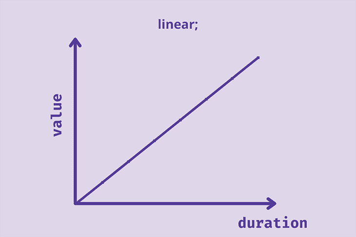

### `ease`计时功能

[带有`ease`功能](http://https//blog.logrocket.com/how-to-incorporate-elastic-ease-in-css-animations/)的动画缓慢开始，加速，然后缓慢结束。如果动画中没有添加计时功能，这是默认的计时功能。

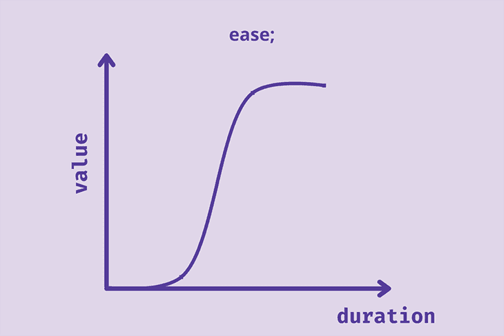

动画结束时的速度比开始时慢。

让我们来演示这两个计时功能。我们要进行一场穿越星球的比赛！
见见我们的赛车手，`ease`和`linear`:

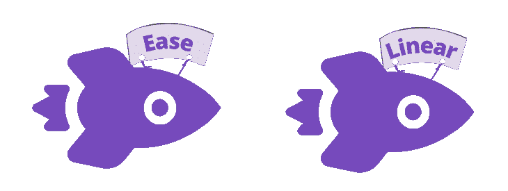

让我们使用一个简单的 HTML 标记:

```
<body>
  <div class="container">
    <div class="rockets rocket-1"></div>
    <div class="rockets rocket-2"></div>
  </div>
</body>

```

然后是一些基本的 CSS:

```
body {
  margin: 0px;
  padding: 0px;
}
*{
  box-sizing: border-box;
}
.container{
  width: 100%;
  height: 300px;
  background: rgba(224,214,233, 0.5)
}
.rockets{
  width: 500px;
  height: 100px;
  transition-duration: 2s;
  transition-property: transform;
  display: flex;
  align-items: center;
}
.rockets img{
  height: 100px;
  border-right: 1px solid red;/*To track the speed easily*/
}

```

现在，我们将添加动画属性；触发器将会是`:hover`。

```
.container:hover .rockets{
  transform: translateX(500px);
}
.rocket-1{
  transition-timing-function: linear;
}
.rocket-2{
  transition-timing-function: ease;
}

```

生成的动画:

参见 [CodePen](https://codepen.io) 上 Oscar-Jite([@ Oscar-Jite](https://codepen.io/oscar-jite))
的笔 [线性 vs 缓时功能](https://codepen.io/oscar-jite/pen/RwxZXoW)。

乍一看，`ease`比`linear`快，但它们都有相同的`animation-duration`。当你仔细观察时，你会发现它们都在同一点结束。看来我们打成平局了！

### `ease-in`、`ease-out`和`ease-in-out`计时功能

带有`ease-in`计时功能的动画开始时速度较慢，接近结束时速度加快。`ease-out`则相反，开始快，结束慢。

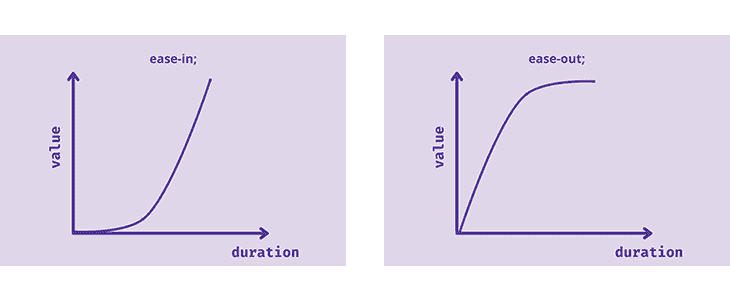

`ease-in-out`动画开始慢，中间加速，结束慢。这类似于`ease`计时功能，但这里的曲线是对称的。动画开始时的速度等于结束时的速度。

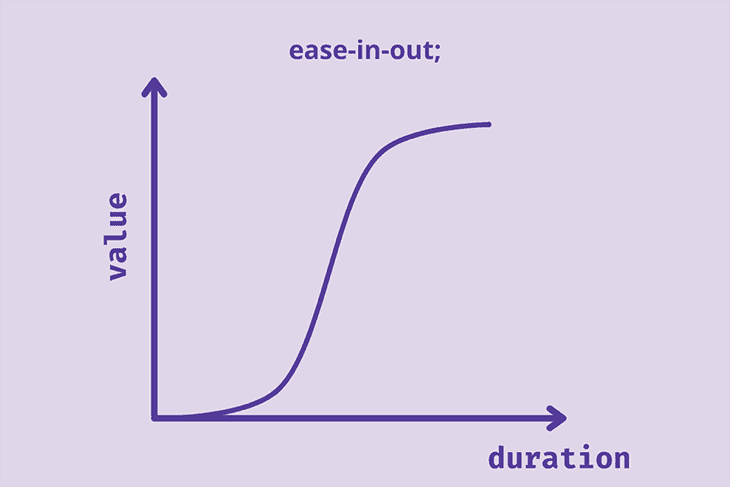

准备好第二场比赛了吗？

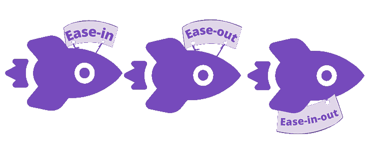

```
.rocket-1{
  transition-timing-function: ease-in;
}
.rocket-2{
  transition-timing-function: ease-out;
}
.rocket-3{
  transition-timing-function: ease-in-out
}

```

准备，设置，`:hover`，开始！

看 [CodePen](https://codepen.io) 上 Oscar-Jite([@ Oscar-Jite](https://codepen.io/oscar-jite))
的笔[、渐入、渐出、渐出](https://codepen.io/oscar-jite/pen/ZEvXQmV)。

### `cubic-bezier()`计时功能

三次贝塞尔曲线由绘制平滑曲线的控制点定义。所有缓动函数都有贝塞尔曲线。

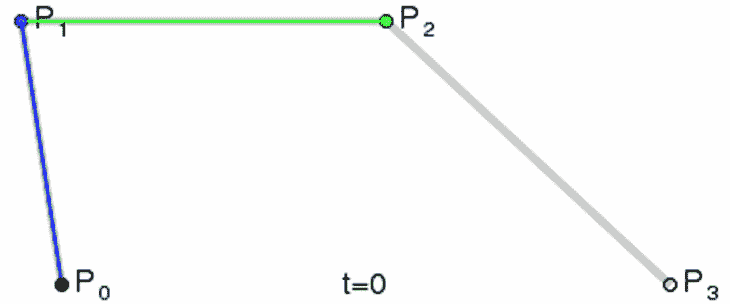

`linear`计时函数是一条只有两个控制点的贝塞尔曲线。也可以是二次曲线，有三个控制点。

```
cubic-bezier(P1,P2,P3,P4)

```

`P1`和`P3`必须在`0`和`1`之内。`P2`和`P4`可以尽可能高，也可以保持负值。最好将所有控制点保持在`-1`和`1`之间，以避免动画过于不平稳和有弹性。

我们来演示一下。我们将用随机值作为控制点。

```
.rocket-1{
  transition-timing-function: cubic-bezier(.66,.39,.21,.67);
}
.rocket-2{
  transition-timing-function: cubic-bezier(1,-0.42,.42,-0.39);
}
.rocket-3{
  transition-timing-function: cubic-bezier(.57,1.34,.21,0);
}

```

悬停在火箭上查看结果:

参见 [CodePen](https://codepen.io) 上 Oscar-Jite([@ Oscar-Jite](https://codepen.io/oscar-jite))
的笔 [三次贝塞尔计时函数](https://codepen.io/oscar-jite/pen/dyJVWwV)。

您可以选择手动输入控制点的值，但是为动画找到正确的缓动可能需要一些时间。有两种方法可以选择完美的`cubic-bezier()`速度:使用检查工具或使用三次贝塞尔发生器。

首先，动画元素应该被赋予任何计时功能。通过右击 web 元素并根据浏览器选择**检查**或**检查元素**来访问开发工具。
如果您使用的是`animation`或`transition`速记关键字，在酒店名称旁边会有一个下拉图标。单击该按钮可显示包含计时功能的多个属性值的列表。否则，它就是你的单独财产。

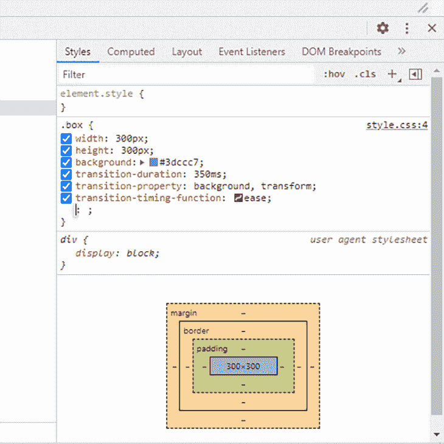

您会在打开三次贝塞尔编辑器的计时函数名称旁边找到一个曲线图标。您可以比较默认的缓动功能。

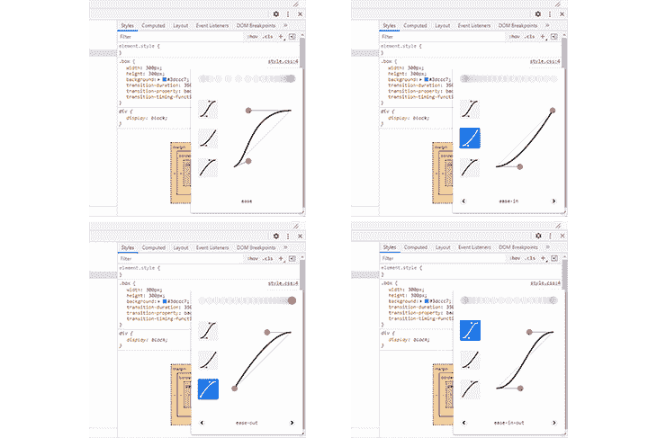

或者在它们的变化中循环。点击并调整手柄以获得`cubic-bezier()`。有一个可视化工具可以帮助你决定。

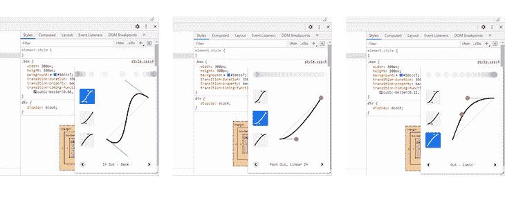

当你找到合适的速度曲线，复制`cubic-bezier()`并粘贴到你的项目中。

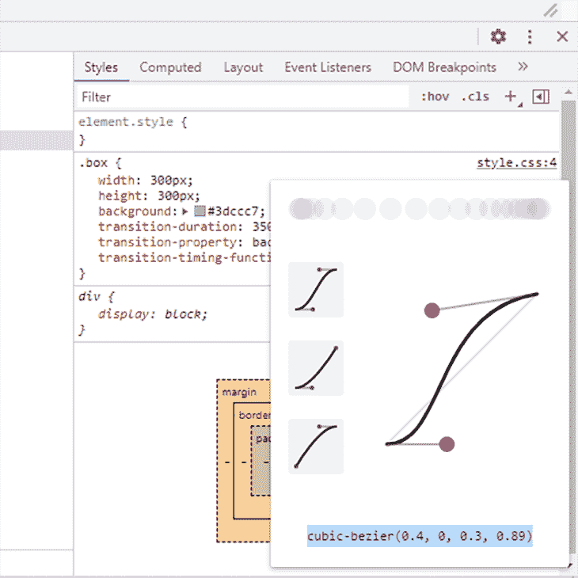

N.B., screenshots are from Chrome. It would look different on other browsers.

#### 使用三次贝塞尔发生器

前往[cubic-bezier.com](https://cubic-bezier.com/)，你会发现一个帮助你创建贝塞尔速度曲线的伟大工具。摆弄手柄，直到你得到你喜欢的曲线。预览并与默认缓动功能进行比较。复制并粘贴到您的项目中，一切就绪！

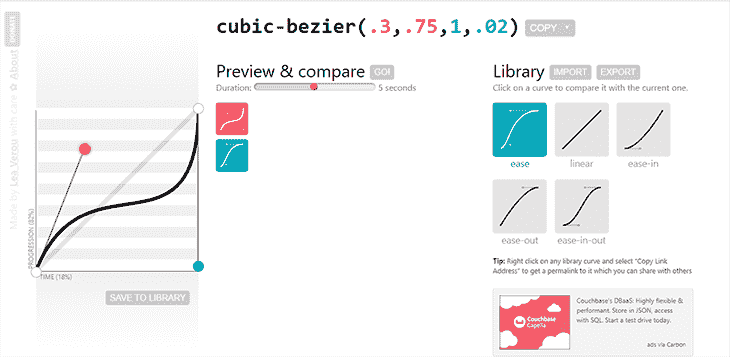

## `animation-timing-function`

`animation-timing-function`指定动画的速度曲线。似曾相识。`animation`属性分为`@keyframes`，像相机的 FPS(每秒帧数)。`animation-timing-function`可以使用任何缓动功能，以及其他三种计时功能:`step-end`、`step-start`和`steps`。

当缓动函数与`animation`属性一起使用时，它必须具有带起点和终点的`@keyframes`。既然我们已经知道了缓动函数是如何工作的，那么让我们来看一个更实际的例子，来演示一个缓动函数如何与`animation`属性一起使用。

我们将创建一些滚动动画。当你向下滚动页面时，这些元素就会出现。

参见 [CodePen 上](https://codepen.io) [@oscar-jite](https://codepen.io/oscar-jite) )
的笔 [滚动动画计时功能](https://codepen.io/oscar-jite/pen/JjvGbgv)。

在这里，您可以在向下滚动时看到所有的缓动功能。HTML 很简单。

我们从一个简单的设置开始:

```
<section class="container">
     <h2>Ease-in, Ease-out, and Ease-in-out</h2>
        <div class="text-container">
          <div class="text-box reveal box-3">
            <h3>Ease-in</h3>
            <p>Random text</p>
          </div>
          <div class="text-box reveal box-4">
            <h3>Ease-out</h3>
            <p>Random text</p>
          </div>
          <div class="text-box reveal box-5">
            <h3>Ease-in-out</h3>
            <p>Random text</p>
          </div>
        </div>
</section>

```

在一些基本的样式之后，每个元素都被赋予了自己的`animation`:

```
.active.box-1 {
  animation: box-1 1s ease;
}
.active.box-2 {
  animation: box-2 1s linear;
}
.active.box-3 {
  animation: box-3 1s ease-in;
}
.active.box-4 {
  animation: box-4 1s ease-out;
}
.active.box-5 {
  animation: box-5 1s ease-in-out;
}
.active.box-6 {
  animation: box-6 1s cubic-bezier(.66,.39,.21,.67);
}
.active.box-7 {
  animation: box-7 1s cubic-bezier(1,-0.42,.42,-0.39);
}
.active.box-8 {
  animation: box-8 1s cubic-bezier(.57,1.34,.21,0);
}

```

所有将被动画化的元素都有一个`reveal`类，它将隐藏元素直到动画被触发。你可以给它起任何你喜欢的名字。

```
.reveal {
  position: relative;
  opacity: 0;
}
.reveal.active {
  opacity: 1;
}

```

滚动动画由这个 JavaScript 函数控制:

```
  function reveal() {
        var reveals = document.querySelectorAll(".reveal");
        for (var i = 0; i < reveals.length; i++) {
          var windowHeight = window.innerHeight;
          var elementTop = reveals[i].getBoundingClientRect().top;
          var elementVisible = 150;
          if (elementTop < windowHeight - elementVisible) {
            reveals[i].classList.add("active");
          } else {
            reveals[i].classList.remove("active");
          }
        }
      }
      window.addEventListener("scroll", reveal);

```

触发动画的条件是当您向下滚动时元素出现在视图中。该函数跟踪元素在页面上滚动的距离`elementTop`，直到它到达应该可见的预定义距离`elementVisible`。

`getBoundingClientRect().top`是距视口顶部的距离，`window.innerHeight`是视口的高度。

接下来，是`@keyframes`:

```
@keyframes box-1 {
  0% {
    transform: translateY(100px);
    opacity: 0;
  }
  100% {
    transform: translateY(0);
    opacity: 1;
  }
}
@keyframes box-2 {
  0% {
    transform: translateY(100px);
    opacity: 0;
  }
  100% {
    transform: translateY(0);
    opacity: 1;
  }
}
@keyframes box-3 {
  0% {
    transform: translateY(100px);
    opacity: 0;
  }
  100% {
    transform: translateY(0);
    opacity: 1;
  }
}
@keyframes box-4 {
  0% {
    transform: translateY(100px);
    opacity: 0;
  }
  100% {
    transform: translateY(0);
    opacity: 1;
  }
}
@keyframes box-5 {
  0% {
    transform: translateY(100px);
    opacity: 0;
  }
  100% {
    transform: translateY(0);
    opacity: 1;
  }
}
@keyframes box-6 {
  0% {
    transform: translateY(100px);
    opacity: 0;
  }
  100% {
    transform: translateY(0);
    opacity: 1;
  }
}
@keyframes box-7 {
  0% {
    transform: translateY(100px);
    opacity: 0;
  }
  100% {
    transform: translateY(0);
    opacity: 1;
  }
}
@keyframes box-8 {
  0% {
    transform: translateY(100px);
    opacity: 0;
  }
  100% {
    transform: translateY(0);
    opacity: 1;
  }
}

```

### `step-end`、`step-start`和`steps()`计时功能

这些计时功能将动画分成相等的部分或步骤。

`step-end`计时功能在第一个`@keyframe`之后开始动画，并在最后跳过一步。`step-start`则相反:动画一开始，步骤就开始了。

让我们演示一下它是如何工作的:

```
.rockets{
  width: 500px;
  height: 100px;
  animation-duration: 2s;
  animation-name: flight;
  animation-iteration-count: infinite;
  animation-direction: alternate-reverse;
  display: flex;
  align-items: center;
}
.rocket-1{
  animation-timing-function: step-end;
}
.rocket-2{
  animation-timing-function: step-start;
}
@keyframes flight{
  0%{transform: none;}
  25%{transform: translateX(125px);}
  50%{transform: translateX(250px);}
  75%{transform: translateX(375px);}
  100%{transform: translateX(500px);}
}

```

结果是:

看[码笔](https://codepen.io)上 Oscar-Jite([@ Oscar-Jite](https://codepen.io/oscar-jite))
的笔 [步末 vs 步起](https://codepen.io/oscar-jite/pen/QWaqYxY)。

`step-start`火箭领先一步，因为动画一开始它就跳到第一个`@keyframe`。

如果你想变得更复杂一点，你可以使用`steps()`来指定你想要在动画中的步骤或部分的数量。例如:

```
.rocket-1{
  animation-timing-function: steps(5);
}
.rocket-2{
  animation-timing-function: steps(10);
}
.rocket-3{
  animation-timing-function: steps(20);
}
@keyframes flight{
  0%{transform: none;}
  100%{transform: translateX(500px);}
}

```

在此查看结果:

参见 [CodePen](https://codepen.io) 上 Oscar-Jite([@ Oscar-Jite](https://codepen.io/oscar-jite))
的 Pen [步骤()计时功能](https://codepen.io/oscar-jite/pen/ZEvXwdG)。

除了步数之外，还有一些关键字可用于`steps()`计时功能:

1.  `jump-start`
2.  `jump-end`
3.  `jump-both`
4.  `jump-none`

`jump-start`和`jump-end`的工作方式与`step-start`和`step-end`相同。`jump-both`表示动画在两端跳过一步。`jump-none`表示动画不跳过一个步骤，并且每个步骤在整个持续时间内间隔均匀。

```
.rocket-1{
  animation-timing-function: steps(5,jump-end);
}
.rocket-2{
  animation-timing-function: steps(5,jump-start);
}
.rocket-3{
  animation-timing-function: steps(5,jump-both);
}
.rocket-4{
  animation-timing-function: steps(5,jump-none);
}
@keyframes flight{
  0%{transform: none;}
  100%{transform: translateX(500px);}
}

```

结果在这里:

看笔 [步跳](https://codepen.io/oscar-jite/pen/jOYGJMO)by Oscar-Jite([@ Oscar-Jite](https://codepen.io/oscar-jite))
on[code Pen](https://codepen.io)。

全局计时功能

## 这些全局属性适用于每个 CSS 属性。它们包括:

如果子元素可以被继承的话，这将赋予子元素与父元素相同的属性。如果属性没有被继承，它们将恢复到`initial`

*   `initial`:你可能认为使用`initial`只是使用 CSS 属性默认值的另一种方式，但事实并非总是如此。对于定时功能，`initial`与默认值`ease`相同
*   `revert`:将元素的属性设置为浏览器的默认 CSS 值
*   `unset`:这个关键字的工作方式类似于`revert`，但有所不同。它影响继承的和非继承的属性
*   以上元素是 [CSS 继承属性](https://developer.mozilla.org/en-US/docs/Web/CSS/inheritance)。不幸的是，`animation-timing-function`和`transition-timing-function`都是非继承属性，所以我们不会看到什么新的东西，但是让我们一个接一个地看。

因此，如果属性是继承的，`unset`会给它一个`inherit`值。如果它是非继承的，属性被设置为它的`initial`值。

浏览器支持

## 所有现代浏览器都支持以下属性和功能[:](https://caniuse.com/css-animation)

safari 4–5 不支持任何`step`定时功能。除了 Internet Explorer、Microsoft Edge 12–18、Firefox 2–64、Chrome 4–76、Safari 3.1–13.1 和 Opera 10–63 之外，所有浏览器都支持`jump`关键字。

奖金属性(`animation-delay`和`transition-delay`)

## 因为我们处理的是计时，所以有一个属性可以和计时函数一起使用:`-delay`。

`animation-delay`和`transition-delay`让动画在开始前等待片刻。
你可以用简写来包括它:

无论属性的顺序如何，声明中的第二个时间值将始终是 delay 属性。所以，如果我们有这样一个声明:

```
animation: <name> <duration> <timing-function> <delay>;

transition: <property> <duration> <timing-function> <delay>;

```

`transition-delay`就是`1s`。这也适用于`animation`。

```
transition: transform 2s 1s ease;

```

让我们用火箭来演示一下:

请看 [CodePen](https://codepen.io) 上 Oscar-Jite([@ Oscar-Jite](https://codepen.io/oscar-jite))
的 Pen [延时动画](https://codepen.io/oscar-jite/pen/OJzxYYo)。

```
.rocket-1{
   transition-timing-function: cubic-bezier(.66,.39,.21,.67);
   transition-delay: 500ms;
}
.rocket-2{
   transition-timing-function: cubic-bezier(.66,.39,.21,.67);
   transition-delay: 700ms;
}
.rocket-3{
  transition-timing-function: cubic-bezier(.66,.39,.21,.67);
  transition-delay: 1s;
}

```

See the Pen [Delayed animation](https://codepen.io/oscar-jite/pen/OJzxYYo) by Oscar-Jite ([@oscar-jite](https://codepen.io/oscar-jite))
on [CodePen](https://codepen.io).

这可以用来加载网页的不同部分，而不必为每个部分定义不同的`animation`或`transition`。

结论

## 动画是与访问者互动和传递引人入胜的内容的好方法。但是，将它们保持在最低限度是很重要的，因为在同一网页上或同时动画显示太多属性会对性能产生不利影响。此外，我建议保持持续时间短。一秒比你想象的要长，动画最好以毫秒为单位。

我们已经了解了计时功能如何控制网页动画的速度和行为。从缓和到阶跃函数，在实际场景中能看到吗？按钮、进度条、文本卡片等等可以被动画化。尝试它们，创造一些伟大的东西！

你的前端是否占用了用户的 CPU？

## 随着 web 前端变得越来越复杂，资源贪婪的特性对浏览器的要求越来越高。如果您对监控和跟踪生产环境中所有用户的客户端 CPU 使用、内存使用等感兴趣，

.

[try LogRocket](https://lp.logrocket.com/blg/css-signup)

LogRocket 就像是网络和移动应用的 DVR，记录你的网络应用或网站上发生的一切。您可以汇总和报告关键的前端性能指标，重放用户会话和应用程序状态，记录网络请求，并自动显示所有错误，而不是猜测问题发生的原因。

[](https://lp.logrocket.com/blg/css-signup)[https://logrocket.com/signup/](https://lp.logrocket.com/blg/css-signup)

现代化您调试 web 和移动应用的方式— [开始免费监控](https://lp.logrocket.com/blg/css-signup)。

Modernize how you debug web and mobile apps — [Start monitoring for free](https://lp.logrocket.com/blg/css-signup).