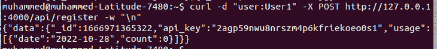
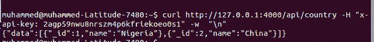

# 了解 Node.js 中的 API 密钥认证

> 原文：<https://blog.logrocket.com/understanding-api-key-authentication-node-js/>

使用 Node.js 构建 API 时，有不同的认证选项。其中包括 JSON Web 令牌、OAuth、API 密匙等等。在本文中，我们将学习如何使用 API 密钥来认证 Node.js API。

如果您想要设置一个限制或者跟踪特定用户使用 API 的频率，那么使用 API 键是有优势的。通过使用 API 密钥，用户无需担心用户名和密码的多重身份验证。您的 API 用户将能够在应用程序上自动获取数据。

在本教程中，我们将使用 Node.js 创建一个 API。然后，我们将创建一个身份验证系统，每当用户在应用程序上注册时，该系统都会创建一个 API 密钥。使用新创建的 API 键，用户将能够访问 API 上的所有路线。

你可以在 [GitHub](https://github.com/khabdrick/api-key-nodejs) 上找到完整的代码。要阅读本文，您需要:

*   Node.js 的基础知识
*   [节点](https://nodejs.org/en/download/) [。js](https://nodejs.org/en/download/) 安装在您的机器上

## 目录

## 初始项目设置

首先，我们将处理运行应用程序的所有安装和初始设置。我们将使用 [Express](https://expressjs.com/) 来开发 API，使用 [Nodemon](https://nodemon.io/) 来运行 API 服务器，并实时监听代码中的变化。

我们必须安装它们，但是首先，为您的项目创建一个文件夹，并运行以下命令为您的项目创建一个`package.json`文件:

```
$ npm init -y

```

现在，用下面的代码更新您的`package.json`文件中的`"scripts"`模块，以便我们能够用 Nodemon 运行服务器:

```
...
"scripts": {
    "test": "echo \"Error: no test specified\" && exit 1",
    "dev": "nodemon Server.js"
  }
...

```

在本文的后面，我们将创建`Server.js`文件，从中运行服务器。现在，通过运行以下命令安装 Nodemon 和 Express:

```
npm install express nodemon

```

## 构建认证系统

身份验证系统接收给定的用户名并创建用户数据，其中包含用户名、API 密钥和特定日期的使用次数。我们需要这个计数，这样我们就可以限制用户在某一天使用 API 的次数。

我们将从创建一个名为`genAPIKey()`的函数开始，该函数在创建新用户时生成 API。该函数将在`A-Z`和`0-9`中生成一个包含 30 个字符的`base-36`字符串，它将代表 API 键。首先，您可以创建一个名为`apiAuth.js`的新 JavaScript 文件，并粘贴以下代码:

```
const genAPIKey = () => {
  //create a base-36 string that contains 30 chars in a-z,0-9
  return [...Array(30)]
    .map((e) => ((Math.random() * 36) | 0).toString(36))
    .join('');
};

```

接下来，我们将开发一个在输入用户名时创建用户数据的函数。我们将把这个新用户存储在一个数组中，所以我们需要一些初始数据来开始。创建一个名为`initialData.js`的新文件，并粘贴以下代码:

```
const users = [
  {
    _id: 1587912,
    api_key: "rwuy6434tgdgjhtiojiosi838tjue3",
    username: "username",
    usage: [{ date: "2022-10-10", count: 17 }],
  },
];
const Countries = [
  { _id: 1, name: "Nigeria" },
  { _id: 2, name: "China" },
];
module.exports = { users, Countries };

```

现在，我们将开发通过在`apiAuth.js`文件中粘贴以下代码来创建用户的函数:

```
const users = require('./initialData').users; // import initial data
...

const createUser = (_username, req) => {
  let today = new Date().toISOString().split('T')[0];
  let user = {
    _id: Date.now(),
    api_key: genAPIKey(),
    username: _username,
    usage: [{ date: today, count: 0 }],
  };

  console.log('add user');
  users.push(user);
  return user;
};

```

接下来，我们将开发一个验证 API 密钥的函数，以便您可以访问 API 的指定部分。该函数将注册的 API 密钥与请求中的`x-api-key`进行比较。

如果请求通过，每天的计数会增加，如果您达到了每天的最大请求数，您会收到一个错误。将以下代码粘贴到您的`apiAuth.js`文件中:

```
const authenticateKey = (req, res, next) => {
  let api_key = req.header("x-api-key"); //Add API key to headers
  let account = users.find((user) => user.api_key == api_key);
  // find() returns an object or undefined
  if (account) {
    //If API key matches
    //check the number of times the API has been used in a particular day
    let today = new Date().toISOString().split("T")[0];
    let usageCount = account.usage.findIndex((day) => day.date == today);
    if (usageCount >= 0) {
      //If API is already used today
      if (account.usage[usageCount].count >= MAX) {
        //stop if the usage exceeds max API calls
        res.status(429).send({
          error: {
            code: 429,
            message: "Max API calls exceeded.",
          },
        });
      } else {
        //have not hit todays max usage
        account.usage[usageCount].count++;
        console.log("Good API call", account.usage[usageCount]);
        next();
      }
    } else {
      //Push todays's date and count: 1 if there is a past date
      account.usage.push({ date: today, count: 1 });
      //ok to use again
      next();
    }
  } else {
    //Reject request if API key doesn't match
    res.status(403).send({ error: { code: 403, message: "You not allowed." } });
  }
};
module.exports = { createUser, authenticateKey };

```

我们正在导出以便`Server.js`可以使用这些函数。

## 为服务器开发路由

在本节中，我们将创建在应用 API 键检查时用于访问 API 中的数据的路由。我们将创建端点来注册用户，将国家添加到国家列表中，并获取国家列表。添加或获取国家/地区的请求将需要 API 密钥认证。

首先，创建一个名为`Server.js`的新文件，并粘贴下面的代码。该代码包含我们稍后将使用的导入，以及将在主页上输出的内容:

```
const express = require('express');
const app = express();
const port = 4000;
const API = require('./apiAuth');

// Get initial data for users and countries
const { users, Countries } = require('./initialData');
//handle json body request
app.use(express.json());

app.get('/', (req, res) => {
  //home page
  res.status(200).send({ data: { message: 'You can get list of countires at /api/country.' } });
});

```

使用我们之前开发的`createUser()`函数，我们将创建一个向用户列表添加新用户并生成用户数据的路由。将以下代码粘贴到您的`Server.js`文件中:

```
...
app.post('/api/register', (req, res) => {
  //create a new with "user:Username"
  let username = req.body.username;
  let user = API.createUser(username, req);
  res.status(201).send({ data: user });
});

```

现在，我们将开发创建和获取国家的路线。在这个路径中，我们将包含我们之前开发的`authenticateKey()`函数，以便在请求头中发送的 API 密钥可以被认证，并且请求可以被计数。然后，我们将最终设置服务器应该监听的端口。将以下代码粘贴到您的`Server.js`文件中:

```
app.get('/api/country', API.authenticateKey, (req, res) => {
  //get list of all Countries   
  let today = new Date().toISOString().split('T')[0];
  console.log(today);
  res.status(200).send({
    data: Countries,
  });
});
app.post('/api/country', API.authenticateKey, (req, res) => {
  //add a new country
  let country = {
    _id: Date.now(),
    name: req.body.country,
  };
  Countries.push(country);
  res.status(201).send({
    data: country,
  });
});

app.listen(port, function (err) {
  if (err) {
    console.error('Failure to launch server');
    return;
  }
  console.log(`Listening on port ${port}`);
});

```

现在，我们已经完成了本教程的编码部分，我们可以进入测试了。我们将使用 [cURL](https://curl.se/) 测试 API 端点。在测试之前，打开您的终端并运行以下命令来启动服务器:

```
npm run dev

```

打开另一个终端窗口，运行以下命令创建一个新用户。一旦命令运行，您将获得一些用户数据，其中一个包括 API 键:

```
curl -d "user:User1" -X POST http://127.0.0.1:4000/api/register -w "\n"

```



现在您已经创建了一个用户，您可以使用国家端点。让我们尝试使用提供给我们的 API 键来检索列表中的国家。您可以通过运行下面的命令来做到这一点。确保用您自己的 API 密钥替换下面命令中的`2agp59nwu8nrszm4p6kfriekoeo0s1`:

```
curl http://127.0.0.1:4000/api/country -H "x-api-key: 2agp59nwu8nrszm4p6kfriekoeo0s1" -w  "\n"

```



## 结论

在本教程中，我们用 Node.js 创建了一个 API，并开发了一个身份验证系统，每当用户注册时，该系统都会生成一个 API 密钥。使用新创建的 API 键，用户能够访问 API 上的所有路线，并且可以跟踪 API 的使用情况。

您可以通过向使用数据库存储数据的 Node.js API 添加 API 密钥身份验证来构建您在本文中获得的知识。除了用户身份验证之外，您还可以使用 API 密匙来获得本文介绍部分提到的优势。

## 200 只显示器出现故障，生产中网络请求缓慢

部署基于节点的 web 应用程序或网站是容易的部分。确保您的节点实例继续为您的应用程序提供资源是事情变得更加困难的地方。如果您对确保对后端或第三方服务的请求成功感兴趣，

[try LogRocket](https://lp.logrocket.com/blg/node-signup)

.

[](https://lp.logrocket.com/blg/node-signup)[https://logrocket.com/signup/](https://lp.logrocket.com/blg/node-signup)

LogRocket 就像是网络和移动应用程序的 DVR，记录下用户与你的应用程序交互时发生的一切。您可以汇总并报告有问题的网络请求，以快速了解根本原因，而不是猜测问题发生的原因。

LogRocket 检测您的应用程序以记录基线性能计时，如页面加载时间、到达第一个字节的时间、慢速网络请求，还记录 Redux、NgRx 和 Vuex 操作/状态。

[Start monitoring for free](https://lp.logrocket.com/blg/node-signup)

.