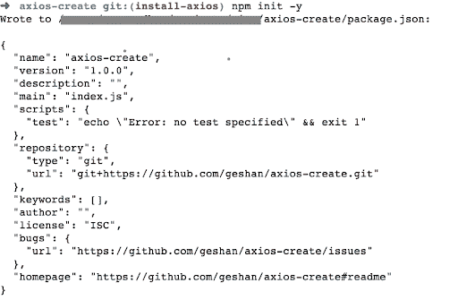
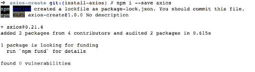
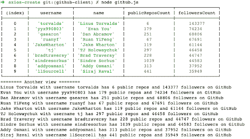

# 了解 axios.create - LogRocket 博客

> 原文：<https://blog.logrocket.com/understanding-axios-create/>

拥有超过 1950 万的周下载量，Axios 是最受欢迎的 Javascript 库之一，你可以用它来发出 HTTP 请求。它既可以在浏览器中使用，也可以与 Node.js 一起使用，这增加了它的受欢迎程度。

由于支持承诺和请求-响应、转换和拦截器等强大特性，Axios 是进行 HTTP 调用的绝佳选择。

`Axios.create`是 Axios 中的一个便利特性，用于创建带有自定义配置的新实例。使用`axios.create`，我们可以为任何 API 生成一个客户端，并使用同一个客户端为任何调用重用配置，正如我们将在下面的示例中看到的。

在这篇文章中，我们将学习如何在 GitHub API 示例中使用`axios.create`,这样你就可以跟上了。

## 介绍

Axios 是一个简单的基于 Promise 的 HTTP 客户端，用于浏览器和节点。它提供了一个易于使用、占地面积小的库。它还有一个可扩展的接口和强大的特性，比如 JSON 数据的自动转换，以及针对 XSRF 的客户端支持等等。

对于服务器端(节点)，它依赖于本机 Node.js HTTP 模块，而在客户端(浏览器)，它使用`XMLHttpRequest`。由于是同构的，Axios 是少数几个可以在浏览器和服务器端轻松使用的库之一。

如果我们用 Axios 执行常规的`require`，我们将会收到默认的实例。但是如果我们想要添加一个定制的配置，比如一秒钟的超时，这对于`const axios = require('axios')`来说是不容易实现的，那该怎么办呢？

这就是 Axios.create 与 Axios 通常的“require”相比的亮点，尽管两者都返回 Axios 的实例。使用`axios.create`，我们可以设置一个类似`baseUrl`的配置，所有的调用只需要 HTTP 调用的 URI，而不需要完整的 URL。

## 先决条件

在我们深入研究代码之前，请确保您具备以下条件，以便按照本教程进行操作:

*   JavaScript 的工作知识
*   Node.js(最好是最新的 LTS 版本),或者你可以试试 JSFiddle 的例子
*   国家预防机制职能的工作知识

对于本指南，我将使用一个类似 Unix 的系统。

接下来，我们将看看如何在一个演示节点应用程序上安装 Axios。

## 如何安装 Axios

如果您想在浏览器上快速运行这个演示节点项目，也可以在 [JSFiddle](https://jsfiddle.net/taLqzxho/3/) 上测试。

为了建立一个新项目，我们将运行以下命令:

```
mkdir axios-create
cd axios-create
npm init -y

```

它将添加`package.json`文件并给出如下输出:



因此，我们将安装包含以下内容的 Axios npm 软件包:

```
npm i --save axios

```

它将呈现并输出以下内容:



太好了，现在我们的演示节点项目中已经安装了 Axios！

您可以在此[拉动请求](https://github.com/geshan/axios-create/pull/1/files)中查看到此步骤为止对此项目的更改。接下来我们将看看为什么你应该使用`axios.create`以及如何在我们的演示应用中安装它。

## 为什么要用`axios.create`？

本质上是一个创建 Axios 新实例的工厂。假设您想要两个 Axios 实例:一个调用服务 A，另一个调用服务 B，其中 A 可以超时 100 毫秒，B 需要超时 500 毫秒。使用`axios.create`很容易做到这一点。

Axios 可以和普通的`require`一起使用，比如`const axios = require('axios')`，但是因为没有办法传入配置，所以需要另一个步骤来正确配置 Axios。

使用带有`axios.create`的 Axios 更有优势，因为它创建了一个带有自定义配置的 Axios 新实例。这允许我们为该特定实例进行的所有调用重用所提供的配置。

例如，如果我们调用的 API 只与`application/vnd.api+json`的`accept`头一起工作，它可以被设置一次。然后，除非被覆盖，否则我们使用 Axios 实例进行的所有调用都将包含该头。它合并了默认配置，并为新创建的 Axios 实例提供自定义配置。

类似于使用带有`require`或`import`的 Axios，[配置优先顺序](https://github.com/axios/axios#config-order-of-precedence)被遵守，即使是由`axios.create`创建的实例。因此，如果 config 在请求或调用级别设置了自定义头，它将覆盖在`create`调用上提供的 config 值。

当我们讨论如何使用`axios.create`时，我们将在下面的例子中看到这一点。

## 如何使用`axios.create`

为了演示如何使用`axios.create`，我们将构建一个简单的 GitHub API 客户端来调用几个端点。这里的目的是获取拥有最多追随者的 GitHub 用户，并打印他们拥有的公共存储库的数量及其追随者的数量。

我们会这样处理它:

1.  首先，我们根据关注者的数量调用 GitHub [“搜索用户”API](https://docs.github.com/en/github/searching-for-information-on-github/searching-on-github/searching-users) ，限制为 10 个
2.  然后，我们将在一个数组中收集用户名
3.  之后，我们将调用[“通过用户名获取单个用户”API](https://docs.github.com/en/rest/reference/users#get-a-user) ，与`[Promise.all](https://blog.logrocket.com/understanding-promise-all-in-javascript/)`同时获取该用户的公共存储库和追随者的数量
4.  最后，我们将把数据打印成控制台表，并用`console.log`循环显示

这些步骤反映在以下代码中，这些代码写在一个名为`GitHub.js`的文件中:

```
const axios = require('axios');
const GitHubClient = axios.create({
  baseURL: 'https://api.GitHub.com/',
  timeout: 1000,
  headers: {
    'Accept': 'application/vnd.GitHub.v3+json',
    //'Authorization': 'token <your-token-here> -- https://docs.github.com/en/authentication/keeping-your-account-and-data-secure/creating-a-personal-access-token'
  }
});

async function getMostFollowedUsers() {
  const noOfFollowers = 35000;
  const perPage = 10;
  //ref: https://docs.github.com/en/github/searching-for-information-on-github/searching-on-github/searching-users
  const response = await GitHubClient.get(`search/users?q=followers:>${noOfFollowers}&per_page=${perPage}`, {timeout: 1500});
  return response.data.items;
}

async function getCounts(username) {
  const response = await GitHubClient.get(`users/${username}`);
  return {
    username,
    name: response.data.name,
    publicReposCount: response.data.public_repos,
    followersCount: response.data.followers
  };  
}

(async () => {
  try {
    const mostFollowedUsers = await getMostFollowedUsers();
    const popularUsernames = mostFollowedUsers.map(user => user.login);
    const popularUsersWithPublicRepoCount = await Promise.all(popularUsernames.map(getCounts));
    console.table(popularUsersWithPublicRepoCount);

    console.log(`======== Another view ========`);
    popularUsersWithPublicRepoCount.forEach((userWithPublicRepos) => {
      console.log(`${userWithPublicRepos.name} with username ${userWithPublicRepos.username} has ${userWithPublicRepos.publicReposCount} public repos and ${userWithPublicRepos.followersCount} followers on GitHub`);
    });
  } catch(error) {
    console.log(`Error calling GitHub API: ${error.message}`, error);
  }
})();

```

我们来分解一下上面的代码。首先，我们需要 Axios，我们已经在上一步中安装了它。然后，我们使用`axios.create`创建一个新的 Axios 实例，它有一个自定义配置，有一个基本 URL `[https://api.github.com/](https://api.github.com/)`，超时为 1s。

该配置还有一个值为`application/vnd.GitHub.v3+json`的`Accept`头，正如 GitHub API 文档中推荐的[。我已经评论了`Authorization`标题，这是可选的。](https://docs.github.com/en/rest/overview/resources-in-the-rest-api#current-version)

如果我们从同一个 IP 向 GitHub API 发送超过 60 个请求/小时，我们将需要一个 GitHub 令牌，根据他们对未认证用户的速率限制策略。这里要注意的主要事情是，对于所有的 API 调用，除非每次调用都被覆盖，否则将使用这些配置。

接下来，我们有一个名为`getMostFollowedUsers`的异步函数，它在搜索用户 GitHub API 中查询拥有超过 35K 关注者的用户。它只返回其中的 10 个，因为`per_page`参数被设置为 10。

有趣的是，这个特定 API 调用的超时被设置为`1500`，即 1.5s，比之前设置的默认超时多了 0.5s。这是因为搜索用户 API 可能比获取用户 API 慢一点。它从响应中发回项目数组。

* * *

### 更多来自 LogRocket 的精彩文章:

* * *

接下来，我们有一个`getCounts`异步函数，它将用户名作为参数，并发送给 GitHub“get users”API 端点。从响应中，它解析出用户名、公共回复数和关注者数，然后将其作为对象返回。

此时，它将使用默认的 1s 超时，因为没有配置覆盖。类似地，它也将使用其他配置，如`Accept`头值。

最后，我们有一个未命名的异步[立即调用函数表达式](https://developer.mozilla.org/en-US/docs/Glossary/IIFE)(life)，它将所有这些粘合在一起。在一个 try-catch 块中，它首先从其 API 获取 GitHub 上 10 个最受关注的用户列表。然后，它从这 10 个用户对象中提取用户名。

然后，它将用户名发送给`getCounts`函数，同时发送一个方便的`Promise.all`调用。当结果以数组的形式返回时，它首先以表格的形式打印出来，然后用一个`forEach`遍历结果，并打印出最受关注用户的文本视图，包括他们的姓名、用户名、公开转发次数以及关注者数量。

如果您想在浏览器上查看输出，请在 JSFiddle 上尝试，运行它，并查看控制台输出。

我们还可以使用 Axios 的拦截器特性来记录所有请求和响应，并使用一个流行的[节点日志库](https://geshan.com.np/blog/2021/01/nodejs-logging-library/)来以更好的方式格式化和显示日志。

当使用`node GitHub.js`运行上述代码时，它将产生类似如下的输出:



从这里，我们知道 Linus Travolts 是 GitHub 上最受关注的用户，拥有超过 143，000 名关注者，并且只有公开的回复。为谷歌工作的艾迪·奥斯马尼拥有近 3.8 万名粉丝和 313 个公开回复。

您也可以以[拉请求](https://github.com/geshan/axios-create/pull/2)的形式查看上面的代码。请注意，每次脚本运行时，它会发出 11 个请求，所以如果您运行多次，您将从 GitHub API 返回 403。为了克服这一点，您将需要添加一个[认证令牌](https://docs.github.com/en/authentication/keeping-your-account-and-data-secure/creating-a-personal-access-token)，它将为认证用户提供每小时 5000 个请求的更高的速率限制。

## 结论

在本文中，我们学习了如何使用`axios.create`为 GitHub API 创建一个客户端，其中的配置在每个后续调用中重用。我们还学习了如何在需要时覆盖每个调用的配置。在这个过程中，我们找出了最受关注的 GitHub 用户，以及他们的关注者数量和公共存储库的数量。

同样，可以使用`axios.create`来创建一个可以与任何 REST API 通信的功能客户机。如果要调用不止一个 REST API，可以用`axios.create`创建一个新的 Axios 实例，并独立使用。

因为这个特定实例的配置将在调用中重用，所以使用由`axios.create`创建的实例进行后续的 HTTP 调用非常容易。这些实用的特性使得`axios.create`成为一个非常有用的工具，开发者应该使用它来最大限度地调用 HTTP APIs。

## 使用 [LogRocket](https://lp.logrocket.com/blg/signup) 消除传统错误报告的干扰

[](https://lp.logrocket.com/blg/signup)

[LogRocket](https://lp.logrocket.com/blg/signup) 是一个数字体验分析解决方案，它可以保护您免受数百个假阳性错误警报的影响，只针对几个真正重要的项目。LogRocket 会告诉您应用程序中实际影响用户的最具影响力的 bug 和 UX 问题。

然后，使用具有深层技术遥测的会话重放来确切地查看用户看到了什么以及是什么导致了问题，就像你在他们身后看一样。

LogRocket 自动聚合客户端错误、JS 异常、前端性能指标和用户交互。然后 LogRocket 使用机器学习来告诉你哪些问题正在影响大多数用户，并提供你需要修复它的上下文。

关注重要的 bug—[今天就试试 LogRocket】。](https://lp.logrocket.com/blg/signup-issue-free)