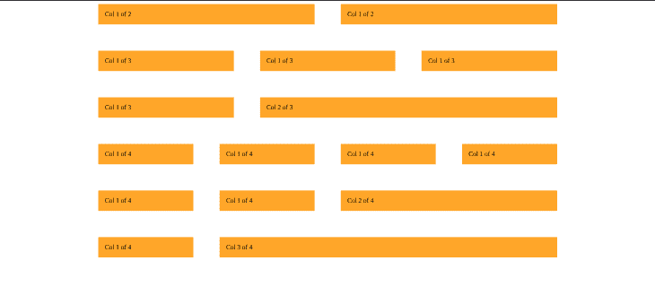
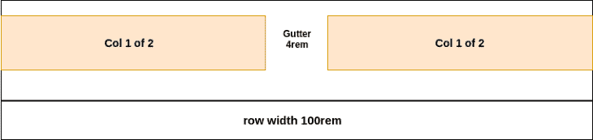
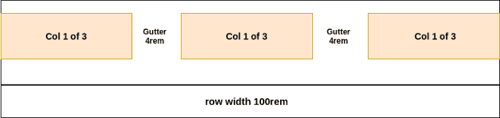
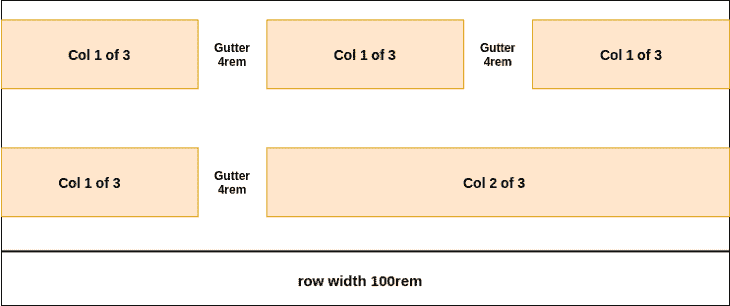
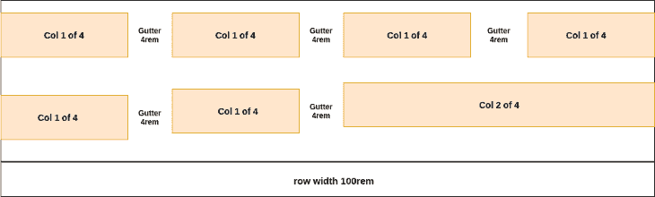
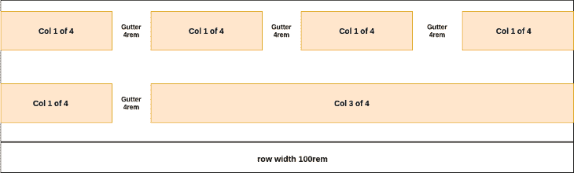

# 如何用 SASS - LogRocket 博客构建自定义网格

> 原文：<https://blog.logrocket.com/understanding-css-grid-by-building-your-own-grid/>

## 介绍

网格或网格系统是垂直和水平线条的集合，它定义了一种以一致和可管理的方式堆叠设计元素的结构。

网格与项目无关，这意味着它们可以用于任何项目。网格通常由行、列和间距(行和列之间的空间)组成。它们使设计元素能够垂直或水平堆叠。

像 HTML 和 CSS 这样的 Web 技术在没有网格系统的情况下已经存在了很多年。然而，CSS 框架如 [Bootstrap](https://getbootstrap.com/) 已经普及了网格系统在 web 上的使用。

另外， [W3C](https://en.wikipedia.org/wiki/World_Wide_Web_Consortium) 已经发布了 [CSS 网格模块 1](https://www.w3.org/TR/css-grid-1/) 来定义基于二维网格的布局。 [CSS 网格](https://en.wikipedia.org/wiki/CSS_grid_layout)或 [CSS 网格布局](https://en.wikipedia.org/wiki/CSS_grid_layout)目前还不是一个官方标准，它是一个 [W3C 候选推荐标准](https://en.wikipedia.org/wiki/World_Wide_Web_Consortium#Candidate_recommendation_(CR))，但是它已经被大多数主流浏览器所支持。

## 你将学到什么

在本文中，您将了解以下内容:

*   网格系统
*   如何构建自定义网格
*   如何设置 CSS 工作流以使用响应单元(`em`)
*   如何使用 CSS `calc()`函数
*   如何使用`:not() pseudo-selector`和`last-child pseudo-class`

## 为什么选择网格系统？

网格系统使得创建响应性网页设计、移动友好设计变得非常容易，并且非常适合几乎任何类型的布局。它们还为脚手架布局设计提供了一种简单且可预测的方法，有助于提高生产率。

## 我们将会建造什么

有几种方法可以在 CSS 中构建自定义网格。我们可以使用普通的、旧的 [CSS 浮动属性](https://developer.mozilla.org/en-US/docs/Web/CSS/float)、flexbox 或 CSS 网格。在本文中，我们将使用 float，因为它非常简单，所有浏览器都支持它。下面是我们将在本部分构建的网格的图像:



## 项目设置

我们将使用`HTML 5`和`SASS`构建我们的网格(它编译成纯 CSS)。我们使用`SASS` ( `SCSS`)是因为它给 CSS 增加了很多功能和优雅。`SASS`在本项目中广泛使用了`[nesting](https://sass-lang.com/documentation/style-rules/parent-selector#advanced-nesting)`和`[parent selector](https://sass-lang.com/documentation/style-rules/parent-selector#advanced-nesting)`等特征。它们一起使我们的代码干净和可维护。

我已经建立了一个启动项目，让我们很容易开始。通过克隆[这个库](https://github.com/lawrenceagles/css-grid-starter)来获得启动文件。然后按照以下步骤启动`dev server`:

您现在可以在`127.0.0.1:8080`查看您的应用程序

这开始观察我们的`SCSS`文件，并将其编译到我们的`style.css`文件中。我们的项目设置现在已经完成。我们可以在下一部分开始构建网格。

## 构建自定义网格

起始文件中已经提供了网格的标记。在本节中，我们将按照以下步骤重点介绍网格的样式:

## 使用通用选择器进行基本复位*

`universal selector (*)`将声明的样式应用于页面中的所有 HTML 元素:

```
*{
  margin: 0px;
  padding: 0px;
  box-sizing: border-box;
}

```

在上面的代码中，我们将边距和填充重置为`0px.`，这是因为默认情况下，浏览器会给某些元素添加一些边距或填充(例如`h1`元素)。我们不希望这样，因为它会使我们的计算复杂化。

第二个(`[box-sizing](https://developer.mozilla.org/en-US/docs/Web/CSS/box-sizing)`)规则更有趣。这个 CSS 属性允许我们改变`CSS box model`的行为。

因此，我们改变了元素的总宽度和高度的计算方式。

属性`box-sizing`的值可以用来调整`CSS box model`的行为。默认情况下，该值设置为`content-box`。

这意味着元素的任何边框或填充的宽度都会添加到该元素的最终宽度中。这使得计算最终宽度变得不清楚。

通过将`box-sizing`属性设置为`border-box`，浏览器不会将元素的填充和边框添加到其总宽度中。因此，很容易计算元素的宽度。

## 设置工作流程以使用响应单元(`rem`)

这种模式为我们提供了一种简单的方法，通过一个简单的设置就可以改变页面上的所有尺寸。它涉及到设置我们的根字体大小，为了便于计算，使用如下的`rem`:

```
html {
  font-size: 10px;
}

```

因为`1rem`等于`root font-size`。`1rem`在我们这里就是现在的`10px`。这将使我们的计算更容易前进。既然我们知道`2rem`应该是`20px`，`1.6rem`应该是`16px`等等。

此外，我们现在可以通过改变上面指定的根字体大小来改变页面上的所有尺寸。

这一点非常重要。例如，当我们点击一个断点在移动设备上显示我们的页面时。我们需要一种方法来同时减少页面上的所有尺寸。

使用我们当前的模式，我们不必编写复杂的媒体查询。我们通过改变全局字体大小来处理这个问题。

接下来，我们将把静态值保存到`SCSS variables`中，如下所示:

```
// GRID
$grid-width: 100rem; // 1000px
$gutter-vertical: 4rem; //40px
$gutter-horizontal: 4rem; // 40px

```

添加网格标记:

```
<section class="grid-test">
   <div class="row">
       <div class="col-1-of-2">
           Col 1 of 2
       </div>
       <div class="col-1-of-2">
           Col 1 of 2
       </div>
   </div>
   <div class="row">
       <div class="col-1-of-3">
           Col 1 of 3
       </div>
       <div class="col-1-of-3">
           Col 1 of 3
       </div>
       <div class="col-1-of-3">
           Col 1 of 3
       </div>
   </div>
   <div class="row">
       <div class="col-1-of-3">
           Col 1 of 3
       </div>
       <div class="col-2-of-3">
           Col 2 of 3
       </div>
   </div>
   <div class="row">
       <div class="col-1-of-4">
           Col 1 of 4
       </div>
       <div class="col-1-of-4">
           Col 1 of 4
       </div>
       <div class="col-1-of-4">
           Col 1 of 4
       </div>
       <div class="col-1-of-4">
           Col 1 of 4
       </div>
   </div>
   <div class="row">
       <div class="col-1-of-4">
           Col 1 of 4
       </div>
       <div class="col-1-of-4">
           Col 1 of 4
       </div>
       <div class="col-2-of-4">
           Col 2 of 4
       </div>
   </div>
   <div class="row">
       <div class="col-1-of-4">
           Col 1 of 4
       </div>
       <div class="col-3-of-4">
           Col 3 of 4
       </div>
   </div>
</section>

```

上面的标记由六行组成。每个都有不同数量的列。每个作为行的 div 都有一个名为 row 的类，而每个作为列的 div 都有一个名以 col-开头的类。column 类的命名取决于行中有多少列。

*请考虑下面的代码:*

```
<div class="row">
  <div class="col-1-of-2">
      Col 1 of 2
  </div>
  <div class="col-1-of-2">
      Col 1 of 2
  </div>
</div>

```

上面的代码是针对具有两个相等列的行的。所以每一列都有一个名为`col-1-of-2`的类。这种命名约定贯穿整个标记。这种模式使我们能够针对各种各样的元素进行样式设计，我们将在下一节中看到这一点。

## 设置行和列的样式

```
.row {
    max-width: $grid-width;
    margin: 0 auto;

    [class^="col-"] {
        float: left;
        background-color: orange;
        padding: 1rem;
    }
}

```

上面的代码给所有的`rows`赋予了一个`max-width`。使用`max-width`是因为它在小视窗设备上表现更好。

块级元素(比如我们的行)总是伸展并占据其容器的整个宽度。通过设置宽度，我们将防止这种行为。但是如果浏览器的窗口小于元素的宽度，就会出现问题。在这种情况下，浏览器会在页面上添加一个水平滚动条。

* * *

### 更多来自 LogRocket 的精彩文章:

* * *

为了防止这种情况，使用了`max-width`而不是 width 属性。如果浏览器的窗口小于指定的`max-width`，这将导致元素占据视口的`100%`。因此，这在较小的设备中表现更好。

`margin: 0 auto;`规则将一个块元素集中在另一个块元素中。所以，我们的网格是居中对齐的。

我们通过使用复杂的属性选择器 `[class^="col-"]`来设计列的样式。这里我们获得了上面提到的列类命名模式的好处。属性选择器`[class^="col-"]`以类名以`col-`开头的所有元素为目标，并对它们应用声明的样式。所以上面的 CSS 规则，向左浮动我们所有的列，设置`background-color`为橙色，并应用`1rem` ( `10px`)的填充。

属性选择器还有其他匹配模式。例如:

*   `[class$="col-"]`将选择类名以`"col-"`结尾的任何元素
*   `[class*="col-"]`将选择类名包含`"col-"`的任何元素

你可以在这里获得更多关于这个[的信息。](https://developer.mozilla.org/en-US/docs/Web/CSS/Attribute_selectors#syntax)

当我们浮动一个父元素(行)中的所有子元素(列)时，父元素就会折叠。因此，父元素的高度是`0`。为了解决这个问题，我们使用了`clearfix`黑客。`clearfix`黑客在一个元素后附加一个`pseudo element`来清除浮动，如下所示:

```
.row::after {
    content: "";
    display: table;
    clear: both;
}

```

我们可以像这样使用`SCSS`嵌套和`&`选择器将它添加到我们的代码中:

```
.row {
    max-width: $grid-width;
    margin: 0 auto;
    &::after {
        content: "";
        display: table;
        clear: both;
    }
    [class^="col-"] {
        float: left;
        background-color: orange;
        padding: 1rem;
    }
}

```

在`SCSS`中，`&`选择器引用父元素，在本例中是(行)。

## 创建垂直和水平檐槽

我们已经在第二步中声明了存储垂直和水平间距值的变量，如下所示:

```
$gutter-vertical: 4rem;
$gutter-horizontal: 4rem;

```

这里我们将使用这些变量创建垂直和水平的檐槽。

为了创建垂直装订线，我们为除最后一行之外的所有行添加底部边距。为了创建水平装订线，我们给一行中的所有列添加右边距，除了最后一列。

这并不简单，因为在这两种情况下，我们都不希望 CSS 规则应用于最后一个元素。为此，我们将使用`[:not()](https://developer.mozilla.org/en-US/docs/Web/CSS/:not)` `pseudo-selector`和`last-child pseudo-class`。

这些使我们能够像这样有选择地应用 CSS 规则:

```
.row {
    max-width: $grid-width;
    margin: 0 auto;
    &:not(:last-child) {
        margin-bottom: $gutter-vertical;
    }

    &::after {
        content: "";
        display: table;
        clear: both;
    }

    [class^="col-"] {
        float: left;
        background-color: orange;
        padding: 1rem;
        &:not(:last-child) {
            margin-right: $gutter-horizontal;
        }
    }
}

```

`last-child` `pseudo-class`选择同级元素列表中的最后一个元素。因此，当与`:not()` `pseudo-selector`一起使用时，`:not()` `pseudo-selector`现在会选择同级元素列表中除`last-child`之外的所有元素。所以我们的 gutter 应用于列表中除了`last-child`元素之外的所有兄弟元素。

## 计算网格列的宽度

这是一个棘手的计算，我们将使用极其强大的 CSS `[calc()](https://developer.mozilla.org/en-US/docs/Web/CSS/calc())`函数。在指定 CSS 属性时，`calc()`函数使我们能够在 CSS 中执行计算。`calc()`函数的一个很大的优点是，它允许我们在执行数学运算时混合使用不同的单位，如下所示:

```
div {
  width: calc(60% - 50px);
  height: calc(100rem / 20%);
}

p {
  font-size: calc(1.5rem + 1vh);
}

```

在我们的网格中，我们有六行，每一行都有不同数量的列，因此我们将连续进行计算。

## 计算第 1 列(共 2 列)的宽度



上图展示了第一行。它有一个`100 rem`的`max-width`。两列(`col 1 of 2`)之间的间距为`4rem`。为了得到每一列的宽度，我们从该行的`width`的`100%`中减去水平装订线(`$gutter-horizontal`)。这给出了两个(`col 1 of 2`)列的宽度，然后我们将结果除以 2，得到每个(`col 1 of 2`)列的宽度，如下所示:

```
.col-1-of-2 {
  width: calc((100% - $gutter-horizontal) / 2);
}

```

## 计算第 1 列(共 3 列)的宽度



这和我们之前的计算差不多。但是从上面的图像中，我们有两个水平的水槽，这需要在我们的计算中考虑。

从该行的宽度`100%`中减去两个水平间距(2 * `$gutter-horizontal`)将得到所有三列的宽度。然后将这个结果除以三，将得到每个`col 1 of 3`列的宽度:

```
.col-1-of-3 {
  width: calc((100% - 2 * $gutter-horizontal) / 3);
}

```

## 计算第 1 列(共 4 列)的宽度


如上图所示，这也类似于我们的前两个计算。然而，在这种情况下，我们有三个水平檐槽。

通过从行的宽度`100%`中减去这些水平间距(3 * `$gutter-horizontal`)，我们得到所有四个`col-1-of-4`列的宽度。然后我们将结果除以 4，得到每个`col 1 of 4`列的宽度:

```
.col-1-of-4 {
  width: calc((100% - 3 * $gutter-horizontal) / 4);
}

```

## 计算第 2 列(共 3 列)的宽度



从上面的图像来看，`col-2-of-3`列的宽度是两个`col-1-of-3`列和水平装订线的宽度。因为我们知道这给了我们一个`col-1-of-3`列的宽度:

```
calc((100% - 2 * $gutter-horizontal) / 3)

```

我们简单地将它乘以 2，并在结果中添加一个水平装订线，就可以得到`col-2-of-3`列的宽度，如下所示:

```
.col-2-of-3 {
  width: calc(2 * ((100% - 2 * $gutter-horizontal) / 3) + $gutter-horizontal);
}

```

## 计算第 2 列(共 4 列)的宽度



从上面的图片中我们可以看到，`col-2-of-4`列的宽度是两个`col-1-of-4`列和水平装订线的宽度。

我们可以使用下面的方法得到一个`col-1-of-4`列的宽度:

```
calc((100% - 3 * $gutter-horizontal) / 4)

```

现在，我们简单地将它乘以 2，并将水平装订线添加到结果中，得到`col-2-of-4`列的宽度，如下所示:

```
.col-2-of-4 {
  width: calc(2 * ((100% - 3 * $gutter-horizontal) / 4) + $gutter-horizontal);
}

```

## 计算第 3 列(共 4 列)的宽度



从上图中，我们看到`col-3-of-4`列的宽度是三个`col-1-of-4`列的宽度和两个水平槽的宽度。

我们可以使用下面的代码获得一个`col-1-of-4`列的宽度:

```
calc((100% - 3 * $gutter-horizontal) / 4)

```

现在，我们简单地将它乘以 3，并添加两个水平间距(`2 * $gutter-horizontal`)到结果中，如下所示:

```
.col-2-of-4 {
  calc(3 * ((100% - 3 * $gutter-horizontal) / 4) + 2 * $gutter-horizontal)
}

```

最终的 SCSS 代码如下所示:

```
// GRID
$grid-width: 100rem;
$gutter-vertical: 4rem;
$gutter-horizontal: 4rem;

* {
  margin: 0;
  padding: 0;
  box-sizing: border-box;
}

html {
   font-size: 10px
}

.row {
    max-width: $grid-width;
    margin: 0 auto;
    &:not(:last-child) {
        margin-bottom: $gutter-vertical;
    }

    &::after {
        content: "";
        display: table;
        clear: both;
    }

    [class^="col-"] {
        float: left;
        background-color: orange;
        padding: 1rem;
        &:not(:last-child) {
            margin-right: $gutter-horizontal;
        }
    }

    .col-1-of-2 {
        width: calc((100% - #{$gutter-horizontal}) / 2);

    }

    .col-1-of-3 {
        width: calc((100% - 2 * #{$gutter-horizontal}) / 3);
    }

    .col-2-of-3 {
        width: calc(2 * ((100% - 2 * #{$gutter-horizontal}) / 3) + #{$gutter-horizontal});
    }

    .col-1-of-4 {
        width: calc((100% - 3 * #{$gutter-horizontal}) / 4);
    }

    .col-2-of-4 {
        width: calc(2 * ((100% - 3 * #{$gutter-horizontal}) / 4) + #{$gutter-horizontal});
    }

    .col-3-of-4 {
        width: calc(3 * ((100% - 3 * #{$gutter-horizontal}) / 4) + 2 * #{$gutter-horizontal});
    }

}

```

*需要注意的是，在 SCSS，我们必须将变量包装在* `#{ }` *中，然后它们才能与 CSS* `calc function`一起工作。

你可以在 [CodePen](https://codepen.io/Lawrenceagles/pen/gOLajoa) 上或者通过克隆[这个库](https://github.com/lawrenceagles/custom-css-grid-complete)来获得这个网格的所有代码。

## 结论

我们上面的网格覆盖了很多场景，并且可以根据需要添加更多，因为它是定制的。在构建这个网格的时候，我们提到了一些高级的 CSS，希望你会感兴趣。虽然我们使用 float 构建了这个网格系统，但是也可以使用 flexbox 或 CSS 网格。

最后，我希望通过构建上面的定制网格，您知道网格系统是如何配置的，它们是如何工作的，并且现在可以构建您自己的定制网格了。

## 你的前端是否占用了用户的 CPU？

随着 web 前端变得越来越复杂，资源贪婪的特性对浏览器的要求越来越高。如果您对监控和跟踪生产环境中所有用户的客户端 CPU 使用情况、内存使用情况等感兴趣，

[try LogRocket](https://lp.logrocket.com/blg/css-signup)

.

[](https://lp.logrocket.com/blg/css-signup)[https://logrocket.com/signup/](https://lp.logrocket.com/blg/css-signup)

LogRocket 就像是网络和移动应用的 DVR，记录你的网络应用或网站上发生的一切。您可以汇总和报告关键的前端性能指标，重放用户会话和应用程序状态，记录网络请求，并自动显示所有错误，而不是猜测问题发生的原因。

现代化您调试 web 和移动应用的方式— [开始免费监控](https://lp.logrocket.com/blg/css-signup)。