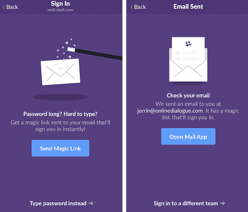
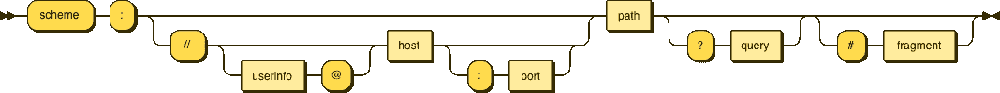
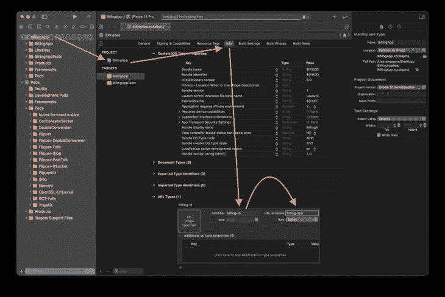
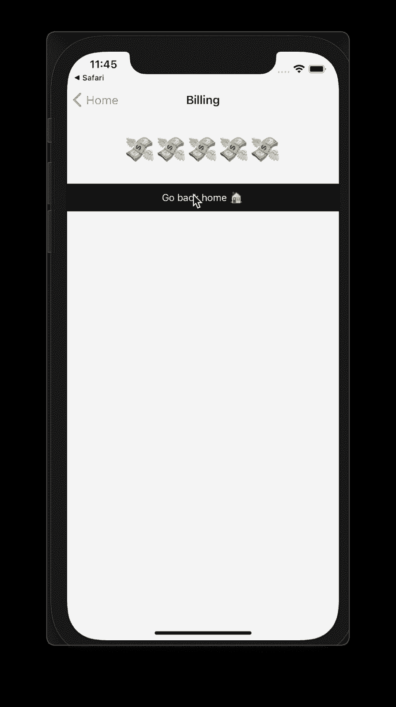
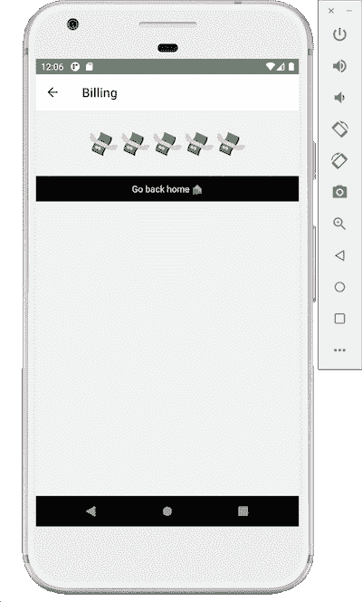

# 了解 React Native - LogRocket 博客中的深层链接

> 原文：<https://blog.logrocket.com/understanding-deep-linking-in-react-native/>

## 介绍

深度链接和通用链接是进入你的应用程序的入口。深度链接已经是任何移动应用程序都应该拥有的无缝体验的一部分。

最终，它们有助于减少用户流失，提高用户的忠诚度。正确实施它们将直接影响您在应用程序中掌握活动和开展促销的能力。

深度链接问题在今天比以往任何时候都重要，特别是考虑到广告商的标识符(IDFA)和越来越多的围墙花园(T1)。执行良好的深度链接将支持您的重新定位活动，并将参与度提升到一个新的水平，让最终用户在 web 和您的应用程序之间获得无缝的一键式体验。

一旦用户发现并安装了你的应用，深度链接就成了在你的应用中留住新用户的完美工具。

在本文中，我概述了如何实现深度链接以及如何使用 React Native Typescript 代码库测试它的现有方法。

你可以在 [GitHub](https://github.com/eugenehp/react-native-deep-linking) 上找到该项目的完整源代码。

## 什么是深度链接，为什么它很重要？

简而言之，深度链接是一种将用户从一个网页重定向到您的应用程序的方式，以便显示带有所请求内容的特定屏幕。它可以是产品、文章、付费墙后面的安全内容或登录屏幕。

最著名的例子之一是他们发送到你的电子邮件中的 Slack 链接，它可以在应用程序中打开，授权你使用你的帐户——不需要密码。



深度链接在 2021 年至关重要。引导用户进入应用程序并提高他们参与度的每一项努力都将在很大程度上取决于基于深度链接之上的策略。

总结深层链接为什么重要的要点:

*   营销活动
*   用户保持率
*   网络和移动之间的无缝重定向
*   付费墙或登录认证后的内容交付
*   延长客户生命周期
*   提高忠诚度
*   最大限度减少流失
*   改进的搜索引擎排名

实现深度链接需要对 iOS 和 Android 有更复杂的理解，以便在 React 原生项目中对每个平台进行额外配置。

以下面 URL 的这个[语法图](https://en.wikipedia.org/wiki/Uniform_Resource_Identifier)为例:

```
billing-app://billing/1
```



Whenever you navigate to a website using, for example, [https://reactivelions.com](https://reactivelions.com), you use a URL in which the URL scheme is “https”. In the example above, `billing-app` is a URL scheme for your deep linking URL.

## iOS 中的深度链接和通用链接

从 iOS 9 开始，苹果推出了[通用链接](https://developer.apple.com/ios/universal-links/)，以减少混乱，简化用户体验。

使用通用链接背后的想法是连接特定的网站 URL，这些 URL 将您网站上的内容与您应用程序内部的内容相匹配。这个 URL 的作用与我在上一节中展示的深度链接 URL 相同:

```
https://app.reactivelions.com/billing/3

```

配置通用链接在服务器端和移动端都需要额外的步骤。

首先从服务器端开始，您需要上传一个 JSON 格式的文件，该文件定义了网站与移动应用程序的关联及其特定的路由。

假设您运行 example.com 域，并且想要创建一个关联文件。首先在根域`.well-known`中创建一个文件夹或路由，然后在`apple-app-site-association`中添加 JSON 内容:

```
https://example.com/.well-known/apple-app-site-association

```

添加 JSON 内容以定义网站关联:

```
{
   "applinks": {
       "apps": [],
       "details": [
           {
               "appID": "ABCD1234.com.your.app",
               "paths": [ "/billing/", "/billing/*"]
           },
           {
               "appID": "ABCD1234.com.your.app",
               "paths": [ "*" ]
           }
       ]
   }
}

```

## **如何配置你的 Xcode 项目**

为了演示深度链接是如何工作的，我们将构建一个简单的测试应用程序。该应用程序将使用`@react-navigation`组件在`Home`和`Billing`屏幕之间进行直接导航:

```
npx react-native init BillingApp --template

```

打开您的 Xcode 工作区:

```
open BillingApp/ios/BillingApp.xcworkspace
```



In your Xcode window, select your newly created project in the left pane (in our case it’s **BillingApp**). Next, select the **BillingApp** target inside the newly opened left pane of the internal view for the `BillingApp.xcodeproj`.

导航到该视图顶部中间的**信息**部分，然后转到最底部，点击 **URL 类型**下的加号( **+** )。确保添加 **billing-id** 作为新的**标识符**，并将 **URL Schemes** 指定为 **billing-app** 。

通过遵循上面的这些步骤，您已经使 iOS 项目配置能够在稍后的 Objective C 和 JavaScript 代码中使用像`billing-app://billing/4`这样的深层链接。

配置 Xcode 后，下一步将关注 React Native。我将从名为`LinkingIOS`的 React 原生内核的链接部分开始。你可以在官方文档[这里](https://reactnative.dev/docs/linking#enabling-deep-links)读到更多。

它的主要目标是构建一个桥，使 JavaScript 线程能够从应用程序的本机部分接收更新，您可以在下面的`AppDelegate.m`部分了解更多信息。

转到 **ios/Podfile** 并在**目标**下添加这一行:

```
pod 'React-RCTLinking', :path => '../node_modules/react-native/Libraries/LinkingIOS'

```

然后确保使用以下命令更新您的 pod:

```
cd ios && pod install

```

下一步是让应用程序的主入口点能够控制通过深度链接打开应用程序时调用的回调。

在这种情况下，我们用选项实现函数`openURL`，并通过名为`RCTLinkingManager`的本机模块将其上下文传递给`RCTLinkingManager`。

```
#import <React/RCTLinkingManager.h>

- (BOOL)application:(UIApplication *)application
openURL:(NSURL *)url
options:(NSDictionary<UIApplicationOpenURLOptionsKey,id> *)options
{
return [RCTLinkingManager application:application openURL:url options:options];
}

```

对于通用链接，我们将需要实现一个回调函数`continueUserActivity`，它也将通过`RCTLinkingManager`将应用程序和当前通用链接的上下文传递到 JavaScript 上下文中。

```
- (BOOL)application:(UIApplication *)application continueUserActivity:(nonnull NSUserActivity *)userActivity
restorationHandler:(nonnull void (^)(NSArray<id<UIUserActivityRestoring>> * _Nullable))restorationHandler
{
return [RCTLinkingManager application:application
continueUserActivity:userActivity
restorationHandler:restorationHandler];
}

```

## **安卓深度链接**

与 iOS 相比，Android 深度链接的工作方式略有不同。这种配置在 [Android 意图](https://developer.android.com/reference/android/content/Intent)之上运行，是要执行的操作的抽象。大部分配置存储在 AndroidManifest.xml 下，并通过实际指向执行深度链接时将打开哪个[意图](https://developer.android.com/guide/components/intents-filters)来工作。

## **如何配置您的 Android Studio 项目**

在您的 Android manifest `android/app/src/main/AndroidManifest.xml`中，我们需要执行以下操作:

*   配置`Intent`过滤器
*   定义主`View`动作，并指定两个主要类别:`DEFAULT`和`BROWSABLE`
*   通过将方案设置为`billing-app`并将主路径定义为`billing`来完成配置

通过这种方式，Android 将知道这个应用程序已经为这个路由`billing-app://billing/*`配置了深度链接:

```
<intent-filter android:label="filter_react_native">
 <action android:name="android.intent.action.VIEW" />
 <category android:name="android.intent.category.DEFAULT" />
 <category android:name="android.intent.category.BROWSABLE" />
 <data android:scheme="billing-app" android:host="billing" />
</intent-filter>
```

## 导航和深层链接

在大多数生产级应用程序中，您最终会有多个屏幕，并且您很可能最终会使用某种形式的组件来实现这种导航。但是，您可以通过 JavaScript 直接调用`Linking`来调用 React Native 的核心库，从而退出并使用没有导航上下文的深度链接。

您可以使用以下两种方法在 React 本机代码中实现这一点:

1.  如果应用程序已经打开:

    ```
    Linking.addEventListener('url', ({url}) => {})
    ```

2.  如果应用程序还没有打开，并且您想要获得初始 URL，使用这个调用:

    ```
    Linking.getInitialURL()
    ```

根据应用程序的逻辑，使用获得的深度链接 URL 来显示不同的内容。

* * *

### 更多来自 LogRocket 的精彩文章:

* * *

如果你正在使用`@react-navigation`，你可以选择使用它的路由逻辑来配置深度链接。

为此，您需要为通用链接和深度链接定义您的`prefixes`。您还需要用`screens`定义`config`，如果您的应用程序有许多屏幕并且非常复杂，还需要包含嵌套屏幕。

下面是我们应用程序的配置示例:

```
import { NavigationContainer } from '@react-navigation/native';
export const config = {
 screens: {
   Home: {
     path: 'home/:id?',
     parse: {
       id: (id: String) => `${id}`,
     },
   },
   Billing: {
     path: 'billing/:id?',
     parse: {
       id: (id: String) => `${id}`,
     },
   },
 },
};
const linking = {
 prefixes: ['https://app.reactivelions.com', 'billing-app://home'],
 config,
};
function App() {
 return (
   <NavigationContainer linking={linking} fallback={<Text>Loading...</Text>}>
     {/* content */}
   </NavigationContainer>
 );
}
```

在上面的代码部分中，我们介绍了通用链接，并逐步介绍了在您网站的服务器端定义通用链接关联所需的步骤。在 Android 中有类似的东西叫做[验证的 Android 应用链接](https://developer.android.com/training/app-links/verify-site-associations)。

使用 Android 应用程序链接可以帮助你避免打开不属于你的其他应用程序的深层链接的困惑。Android 通常建议使用浏览器打开未经验证的深度链接，只要它不确定它们是否是应用程序链接(而不是深度链接)。

要启用应用程序链接验证，您需要更改清单文件中的意图声明，如下所示:

```
<intent-filter android:autoVerify="true">

```

要创建应用程序验证的链接，您需要生成一个 JSON 验证文件，该文件将与 Xcode 部分放在同一个`.well-known`文件夹中:

```
keytool -list -v -keystore my-release-key.keystore
```

此命令将通过使用您的密钥库文件对配置进行签名来生成与您的域的关联:

```
[{
  "relation": ["delegate_permission/common.handle_all_urls"],
  "target": {
    "namespace": "android_app",
    "package_name": "com.mycompany.app1",
    "sha256_cert_fingerprints":
    ["14:6D:E9:83:C5:73:06:50:D8:EE:B9:95:2F:34:FC:64:16:A0:83:42:E6:1D:BE:A8:8A:04:96:B2:3F:CF:44:E5"]
  }
}]
```

然后使用以下路径将生成的文件放在您的网站上:

```
https://www.example.com/.well-known/assetlinks.json
```

## 如何测试深层链接

在经历了所有的配置和实现之后，您想要确保您已经正确地设置了一切，并且深层链接在您选择的每个平台上都可以工作。

在您测试通用链接或 Android 应用验证链接之前，请确保您的每个域的所有 JSON 文件都已上传、可用并且是最新的。根据您的 web 基础设施，您甚至可能想要刷新您的内容交付网络(CDN)缓存。

成功的深度链接测试意味着，在浏览器中打开一个深度链接后，您将转到您的应用程序，并且您可以看到带有给定内容的所需屏幕。

当你进入账单屏幕时，你可以指定一个数字，应用程序将会显示相同数量的带有飞行美元纸币的表情符号。我们的应用程序有`Home`和`Billing`屏幕。

如果你试图从你的`Home`屏幕转到`Billing`屏幕，它不会传递任何内容，因此也不会呈现任何表情符号。

在您的终端中，您可以使用这些命令来测试每个平台的深度链接。通过改变深度链接 URL 末尾的数字来查看不同数量的表情符号。

1.  iOS

    ```
    npx uri-scheme open billing-app://billing/5 --ios
    ```

    你也可以打开 Safari，在地址栏输入`billing-app://billing/5`，然后点击**前往**。

    

2.  Android

    ```
    npx uri-scheme open billing-app://billing/5 --android
    ```

    

## 后续步骤

您可能已经注意到，我使用 TypeScript 来编写这个项目的代码。对于这个项目，我实现了自定义属性类型，需要为每个屏幕自定义声明。检查 [props.ts](https://github.com/eugenehp/react-native-deep-linking/blob/main/src/routes/props.ts) 以查看这些类型声明。

正如我前面提到的，如果您正在构建一个生产级的应用程序，您很可能最终会构建复杂的路由，并且需要使用导航库来实现嵌套路由。

嵌套导航将使您能够将每个屏幕分解成更小的组件，并根据您的业务逻辑拥有子路线。点击了解更多关于使用`@react-navigation` [构建嵌套路径的信息。](https://reactnavigation.org/docs/nesting-navigators/)

期待看到你用这个做的东西！

## [LogRocket](https://lp.logrocket.com/blg/react-native-signup) :即时重现 React 原生应用中的问题。

[](https://lp.logrocket.com/blg/react-native-signup)

[LogRocket](https://lp.logrocket.com/blg/react-native-signup) 是一款 React 原生监控解决方案，可帮助您即时重现问题、确定 bug 的优先级并了解 React 原生应用的性能。

LogRocket 还可以向你展示用户是如何与你的应用程序互动的，从而帮助你提高转化率和产品使用率。LogRocket 的产品分析功能揭示了用户不完成特定流程或不采用新功能的原因。

开始主动监控您的 React 原生应用— [免费试用 LogRocket】。](https://lp.logrocket.com/blg/react-native-signup)