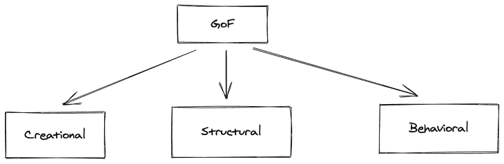
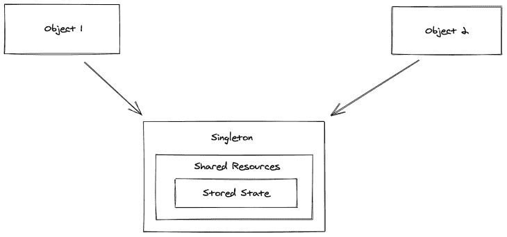
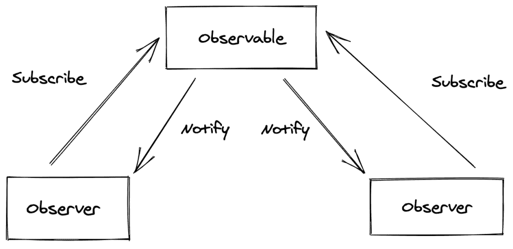
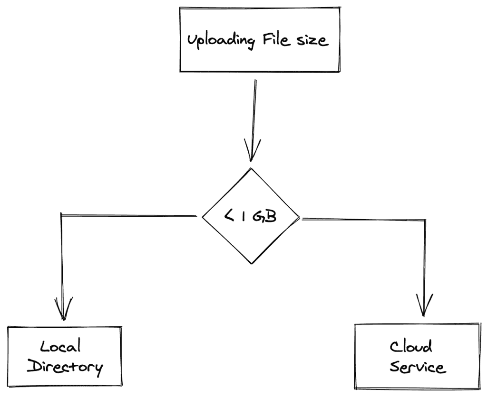
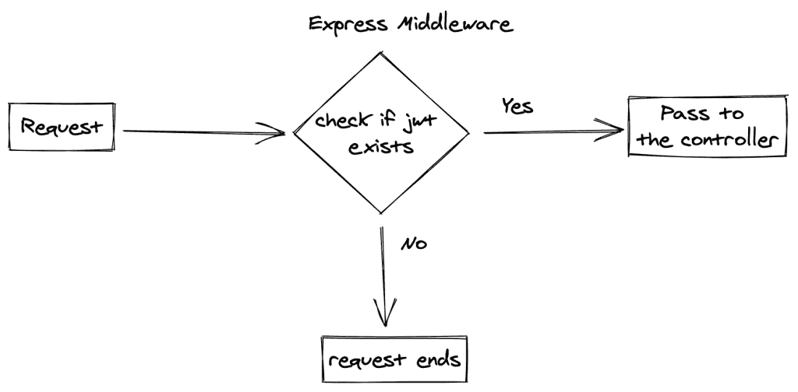

# 理解 TypeScript 和 Node.js 中的设计模式

> 原文：<https://blog.logrocket.com/understanding-design-patterns-typescript-node-js/>

***编者按**:这篇文章于 2022 年 9 月 27 日更新，增加了关于打字稿中的状态模式和反模式的信息，并对文章进行了一般性修改。*

设计模式是软件应用程序开发中反复出现的问题的解决方案。有三种基本的设计模式，每一种都有许多独特的模式可供选择。

在本文中，我们将讨论 TypeScript 和 Node.js 中的不同设计模式。我们将讨论这三种类型及其含义，每个类别中的常见设计模式、反模式、类复杂性等等。

## TypeScript 中的设计模式是什么？

设计模式是开发人员实现的最佳实践。它们解决软件开发阶段出现的一般问题。这些设计模式是在一段时间内经过几轮反复试验后发明出来的。

## 什么是四人帮(g of)？

1994 年，四位作者 Erich Gamma、Richard Helm、Ralph Johnson 和 John Vlissides 出版了一本名为《设计模式:可重用面向对象软件的元素》的书。这些作者通常被称为“四人帮”。

## 有哪些不同类型的设计模式？

你可能知道也可能不知道，有三种设计模式。它们是:

*   创造结构行为
*   但是等等。那是什么意思？
*   创建模式与我们以面向对象的方式创建对象的方式有关。它以我们实例化一个类的方式应用模式。

结构模式关注的是我们的类和对象如何在应用程序中组成一个更大的结构。

最后，行为模式关心的是对象如何在没有紧密耦合的情况下有效地交互。



本教程将向您解释一些可以在 Node.js 应用程序中使用的最常见的设计模式。我们将使用 TypeScript 来简化实现。

单一模式

单例模式意味着一个类应该只有一个实例。用外行人的话来说，一个国家在同一时间应该只有一位总统。通过遵循这种模式，我们可以避免一个特定的类有多个实例。

## 单一模式的一个很好的例子是我们应用程序中的数据库连接。在我们的应用程序中有多个数据库实例会使应用程序不稳定。因此，[singleton 模式通过管理应用程序中的单个实例为这个问题提供了一个解决方案。](https://blog.logrocket.com/youre-wrong-about-singletons/)



让我们看看如何用 TypeScript 在 Node.js 中实现上面的示例:

这里，我们有一个带有属性实例的类`DBInstance`。在`DBInstance`中，我们有静态方法`getInstance`，我们的主要逻辑驻留在那里。

它检查是否已经有一个数据库实例。如果有，它将返回。否则，它将为我们创建一个数据库实例并返回它。

```
import {MongoClient,Db} from 'mongodb'
class DBInstance {

    private static instance: Db

    private constructor(){}

    static getInstance() {
        if(!this.instance){
            const URL = "mongodb://localhost:27017"
            const dbName = "sample"    
            MongoClient.connect(URL,(err,client) => {
                if (err) console.log("DB Error",err)
                const db = client.db(dbName);
                this.instance = db
            })

        }
        return this.instance
    }
}

export default DBInstance
```

下面是一个我们如何在 API 路由中使用单例模式的例子:

理解工厂模式

在进入抽象工厂的解释之前，我想让你知道工厂模式是什么意思。

```
import express,{  Application, Request, Response } from 'express'
import DBInstance from './helper/DB'
import bodyParser from 'body-parser'
const app = express()

async function start(){

    try{

        app.use(bodyParser.json())
        app.use(bodyParser.urlencoded({extended : true}))
        const db = await DBInstance.getInstance()

        app.get('/todos',async (req : Request,res : Response) => {
            try {
                const db = await DBInstance.getInstance()

                const todos = await db.collection('todo').find({}).toArray()
                res.status(200).json({success : true,data : todos})
            }
            catch(e){
                console.log("Error on fetching",e)
                res.status(500).json({ success : false,data : null })
            }

        })

        app.post('/todo',async (req : Request,res : Response) => {
            try {
                const db = await DBInstance.getInstance()

                const todo = req.body.todos
               const todoCollection =  await db.collection('todo').insertOne({ name : todo })

                res.status(200).json({ success : true,data : todoCollection })
            }
            catch(e){
                console.log("Error on Inserting",e)
                res.status(500).json({ success : false,data : null })
            }
        })

        app.listen(4000,() => {
            console.log("Server is running on PORT 4000")
        })
    }
    catch(e){
        console.log("Error while starting the server",e)
    }
}

start()
```

## 简单工厂模式

为了简单起见，我给你打个比方。假设你饿了，想吃点东西。你可以自己做饭，也可以从餐馆点菜。那样的话，你不需要学习或知道如何烹饪来吃一些食物。

### 类似地，工厂模式只是为用户生成一个对象实例，而不向客户机公开任何实例化逻辑。

现在我们知道了简单工厂模式，让我们回到抽象工厂模式。

抽象工厂模式

扩展我们简单的工厂示例，假设您饿了，并且您决定从餐馆点餐。根据你的喜好，你可以点不同的菜肴。然后，你可能需要根据菜系选择最好的餐馆。

### 如你所见，你的食物和餐馆之间存在依赖关系。不同的餐馆更适合不同的菜肴。

更多来自 LogRocket 的精彩文章:

让我们在 Node.js 应用程序中实现一个抽象工厂模式。现在，我们将建立一个拥有不同种类电脑的笔记本电脑商店。几个主要部件是`Storage`和`Processor`。

* * *

### 让我们为它建立一个界面:

* * *

接下来，让我们在类中实现`storage`和`processor`接口:

现在，我们将创建一个工厂接口，它有诸如`createProcessor`和`createStorage`的方法。

```
export default interface IStorage {
     getStorageType(): string
}
import IStorage from './IStorage'
export default interface IProcessor {
    attachStorage(storage : IStorage) : string

    showSpecs() : string
}
```

一旦创建了工厂接口，就在`Laptop`类中实现它。在这里，它将是:

```
import IProcessor from '../../Interface/IProcessor'
import IStorage from '../../Interface/IStorage'

export default class MacbookProcessor implements IProcessor {

    storage: string | undefined

    MacbookProcessor() {
        console.log("Macbook is built using apple silicon chips")    
    }

    attachStorage(storageAttached: IStorage) {
        this.storage = storageAttached.getStorageType()
        console.log("storageAttached",storageAttached.getStorageType())
        return this.storage+" Attached to Macbook"
    }
    showSpecs(): string {
        return this.toString()
    }

    toString() : string {
        return "AppleProcessor is created using Apple Silicon and "+this.storage;
    }

}
import IProcessor from '../../Interface/IProcessor'
import IStorage from '../../Interface/IStorage'

export default class MacbookStorage implements IStorage {

    storageSize: number

    constructor(storageSize : number) {
        this.storageSize = storageSize
        console.log(this.storageSize+" GB SSD is used")
    }

    getStorageType() {
        return  this.storageSize+"GB SSD"
    }

}
```

最后，创建一个调用工厂方法的函数:

```
import IStorage from '../Interface/IStorage'
import IProcessor from '../Interface/IProcessor'

export default interface LaptopFactory {
    createProcessor() : IProcessor

    createStorage() : IStorage
}
```

构建器模式

```
import LaptopFactory from '../../factory/LaptopFactory'
import MacbookProcessor from './MacbookProcessor'
import MacbookStorage from './MacbookStorage'

export class Macbook implements LaptopFactory {
    storageSize: number;

    constructor(storage : number) {
        this.storageSize = storage
    }

    createProcessor() : any{
        return new MacbookProcessor()
    }

    createStorage(): any {
        return new MacbookStorage(this.storageSize)
    }
}
```

builder 模式允许您创建不同风格的对象，而无需在类中使用构造函数。

```
import LaptopFactory from '../factory/LaptopFactory'
import IProcessor from '../Interface/IProcessor'

export const buildLaptop =  (laptopFactory : LaptopFactory) : IProcessor => {
    const processor = laptopFactory.createProcessor()

    const storage = laptopFactory.createStorage()

    processor.attachStorage(storage)

    return processor
}
```

## 但是为什么，我们不能只用一个构造函数呢？

嗯，在某些情况下,`constructor`有一个问题。假设您有一个`User`模型，它具有如下属性:

要使用它，您可能需要像这样实例化它:

在这里，我们有一个有限的论点。但是，一旦属性增加，就很难维持了。为了解决这个问题，我们需要构建器模式。

```
export default class User {

    firstName: string
    lastName : string
    gender: string
    age: number
    address: string
    country: string
    isAdmin: boolean

    constructor(firstName,lastName,address,gender,age,country,isAdmin) {
        this.firstName = builder.firstName
        this.lastName = builder.lastName
        this.address = builder.address
        this.gender = builder.gender
        this.age = builder.age
        this.country = builder.country
        this.isAdmin = builder.isAdmin
    }

}
```

像这样创建一个`Builder`类:

```
const user = new User("","","","",22,"",false)
```

这里，我们使用`getter`和`setter`来管理我们的`Builder`类中的属性。之后，在我们的模型中使用`Builder`类:

适配器模式

```
import User from './User'

export default class UserBuilder {

    firstName = ""
    lastName = ""
    gender = ""
    age = 0
    address = ""
    country = ""
    isAdmin = false

    constructor(){

    }

    setFirstName(firstName: string){
        this.firstName = firstName
    }

    setLastName(lastName : string){
        this.lastName = lastName
    }

    setGender(gender : string){
        this.gender = gender
    }

    setAge(age : number){
        this.age = age
    }

    setAddress(address : string){
        this.address = address
    }

    setCountry(country : string){
        this.country = country
    }

    setAdmin(isAdmin: boolean){
        this.isAdmin = isAdmin
    }

    build() : User {
        return new User(this)
    }

    getAllValues(){
        return this
    }
}
```

适配器模式的一个经典例子是不同形状的电源插座。有时候，插座和设备插头不匹配。为了确保它能正常工作，我们将使用一个适配器。这正是我们在适配器模式中要做的。

```
import UserBuilder from './UserBuilder'

export default class User {

    firstName: string
    lastName : string
    gender: string
    age: number
    address: string
    country: string
    isAdmin: boolean

    constructor(builder : UserBuilder) {
        this.firstName = builder.firstName
        this.lastName = builder.lastName
        this.address = builder.address
        this.gender = builder.gender
        this.age = builder.age
        this.country = builder.country
        this.isAdmin = builder.isAdmin
    }

}
```

## 它是将不兼容的对象包装在适配器中以使其与另一个类兼容的过程。

到目前为止，我们已经看到了一个理解适配器模式的类比。让我给你一个真实的用例，其中适配器模式可以拯救生命。

假设我们有一个`CustomerError`类:

现在，我们在应用程序中使用这个`CustomError`类。一段时间后，由于某种原因，我们需要改变类中的方法。

`New Custom Error`类会是这样的:

```
import IError from '../interface/IError'
export default class CustomError implements IError{

    message : string

    constructor(message : string){
        this.message = message
    }

    serialize() {
        return this.message
    }
}
```

我们的新变化将使整个应用程序崩溃，因为它改变了方法。为了解决这个问题，适配器模式开始发挥作用。

让我们创建一个`Adapter`类来解决这个问题:

```
export default class NewCustomError{

    message : string

    constructor(message : string){
        this.message = message    
    }

    withInfo() {
        return { message : this.message } 
    }
}
```

我们在整个应用程序中使用的是`serialize`方法。我们的应用程序不需要知道我们正在使用哪个类。`Adapter`类为我们处理它。

观察者模式

```
import NewCustomError from './NewCustomError'
// import CustomError from './CustomError'
export default class ErrorAdapter {
    message : string;
    constructor(message : string) {
        this.message = message
    }

    serialize() {
              // In future replace this function
        const e = new NewCustomError(this.message).withInfo()
        return e
    }

}
```

观察者模式是在另一个对象发生状态变化时更新从属对象的一种方式。通常包含`Observer`和`Observable`。`Observer`订阅`Observable`，如果有变化，observable 会通知观察者。

## 

为了理解这个概念，让我们来看一个观察者模式的真实用例:


这里，我们有`Author`、`Tweet`和`follower`实体。`Followers`可以订阅`Author`。每当有新的`Tweet`时，`follower`就会更新。

让我们在 Node.js 应用程序中实现它:

这里，我们有接口`IObservable`和`IObserver`，其中有`onTweet`和`sendTweet`方法:

接下来，`Follower.ts`:

```
>import Tweet from "../module/Tweet";

export default interface IObserver {
    onTweet(tweet : Tweet): string
}
import Tweet from "../module/Tweet";

export default interface IObservable{

    sendTweet(tweet : Tweet): any
}
```

和`Tweet.ts`:

```
import IObservable from "../interface/IObservable";
import Tweet from "./Tweet";
import Follower from './Follower'
export default class Author implements IObservable {

    protected observers : Follower[] = []

    notify(tweet : Tweet){
        this.observers.forEach(observer => {
            observer.onTweet(tweet)
        })
    }

    subscribe(observer : Follower){
        this.observers.push(observer)
    }

    sendTweet(tweet : Tweet) {
        this.notify(tweet)
    }
}
```

`index.ts`:

```
import IObserver from '../interface/IObserver' import Author from './Author' import Tweet from './Tweet' export default class Follower implements IObserver { name : string constructor(name: string){ this.name = name } onTweet(tweet: Tweet) { console.log( this.name+" you got tweet =>"+tweet.getMessage()) return this.name+" you got tweet =>"+tweet.getMessage() } }
```

战略模式

```
export default class Tweet {

    message : string
    author: string

    constructor(message : string,author: string) {
        this.message = message
        this.author= author
    }

    getMessage() : string {
        return this.message+" Tweet from Author: "+this.author
    }
}
```

策略模式允许您在运行时选择算法或策略。此场景的真实用例是基于文件大小切换文件存储策略。

```
import express,{  Application, Request, Response } from 'express'
// import DBInstance from './helper/DB'
import bodyParser from 'body-parser'
import Follower from './module/Follower'
import Author from './module/Author'
import Tweet from './module/Tweet'

const app = express()

async function start(){

    try{

        app.use(bodyParser.json())
        app.use(bodyParser.urlencoded({extended : true}))
        // const db = await DBInstance.getInstance()

        app.post('/activate',async (req : Request,res : Response) => {
            try {

                const follower1 = new Follower("Ganesh")
                const follower2 = new Follower("Doe")

                const author = new Author()

                author.subscribe(follower1)
                author.subscribe(follower2)

                author.sendTweet(
                   new Tweet("Welcome","Bruce Lee")
                )

                res.status(200).json({ success : true,data:null })

            }
            catch(e){
                console.log(e)
                res.status(500).json({ success : false,data : null })
            }
        })

        app.listen(4000,() => {
            console.log("Server is running on PORT 4000")
        })
    }
    catch(e){
        console.log("Error while starting the server",e)
    }
}

start()
```

## 假设您希望在应用程序中根据文件大小处理文件存储:



这里，我们想要上传文件并根据文件大小决定策略，文件大小是一个运行时条件。让我们使用一个`strategy`模式来实现这个概念。

创建一个需要由`Writer`类实现的接口:

之后，创建一个`class`来处理大文件:

然后，创建一个`class`来处理较小的文件:

```
export default interface IFileWriter {
    write(filepath: string | undefined) : boolean
}
```

一旦我们有了它们，我们需要创建一个可以使用其中任何`strategy`的客户机:

```
import IFileWriter from '../interface/IFileWriter'

export default class AWSWriterWrapper implements IFileWriter {

    write() {
        console.log("Writing File to AWS S3")
        return true
    }
}
```

最后，我们可以根据以下条件使用策略:

```
import IFileWriter from '../interface/IFileWriter'

export default class DiskWriter implements IFileWriter {

    write(filepath : string) {
        console.log("Writing File to Disk",filepath)
        return true
    }
}
```

责任链

```
import IFileWriter from '../interface/IFileWriter'

export default class Writer {

    protected writer
    constructor(writer: IFileWriter) {
        this.writer = writer
    }

    write(filepath : string) : boolean {
        return this.writer.write(filepath)
    }
}
```

责任链允许对象经历一系列条件或功能。它不是在一个地方管理所有的功能和条件，而是分成对象必须通过的条件链。

```
let size = 1000

                if(size < 1000){
                    const writer = new Writer(new DiskFileWriter())
                    writer.write("file path comes here")
                }
                else{
                    const writer = new Writer(new AWSFileWriter())
                    writer.write("writing the file to the cloud")
                }
```

## 这种模式的一个最好的例子是`express middleware`:



我们将功能构建为一个中间件，与 express 中的每个请求绑定在一起。我们的请求必须通过中间件内部的条件。这是责任链的最好例子:

立面图案

facade 模式允许我们将相似的功能或模块包装在一个接口中。这样，客户端就不需要知道它内部是如何工作的。

## 一个很好的例子就是启动你的电脑。当你打开电脑时，你不需要知道电脑内部发生了什么。你只需要按一个按钮。这样，facade 模式可以帮助我们实现高级逻辑，而不需要客户端实现所有的东西。

让我们以用户配置文件为例，我们有如下功能:

每当用户帐户被停用时，我们需要更新状态和银行详细信息。

让我们使用 facade 模式在应用程序中实现这个逻辑:

*   最后，我们的`Facade`类将是:

这里，我们结合了每当用户帐户被停用时需要调用的方法。

```
import IUser from '../Interfaces/IUser'

export default class User {
    private firstName: string
    private lastName: string
    private bankDetails: string | null
    private age: number
    private role: string
    private isActive: boolean

    constructor({firstName,lastName,bankDetails,age,role,isActive} : IUser){
        this.firstName = firstName
        this.lastName = lastName
        this.bankDetails = bankDetails
        this.age = age
        this.role = role
        this.isActive = isActive
    }

    getBasicInfo() {
        return {
            firstName: this.firstName,
            lastName: this.lastName,
            age : this.age,
            role: this.role
        }
    }

    activateUser() {
        this.isActive = true
    }

    updateBankDetails(bankInfo: string | null) {
        this.bankDetails= bankInfo
    }

    getBankDetails(){
        return this.bankDetails
    }

    deactivateUser() {
        this.isActive = false
    }

    getAllDetails() {
        return this
    }
}
export default interface IUser {
    firstName: string
    lastName: string
    bankDetails: string
    age: number
    role: string
    isActive: boolean
}
```

状态模式

```
import User from '../module/User'

export default class UserFacade{

    protected user: User
    constructor(user : User){
        this.user = user
    }

    activateUserAccount(bankInfo : string){
        this.user.activateUser()
        this.user.updateBankDetails(bankInfo)

        return this.user.getAllDetails()
    }

    deactivateUserAccount(){
        this.user.deactivateUser()
        this.user.updateBankDetails(null)
    }

}
```

状态模式封装了对象的状态，因此可以独立地对其进行更改和访问。它们让对象在状态改变时改变其行为:

## [完整的源代码可以在这里找到](https://github.com/ganeshmani/design-patterns-typescript-examples)。

Typescript 中的反模式

```
interface state {
  react(): string
}

class Happy implements State {
  react() {
    return 'I am Happy';
  }
}

class Sad implements State {
  react() {
    return 'I am Sad';
  }
}

class Person {
  state: State;

  constructor() {
    this.state = new Happy();
  }

  changeState(state) {
    this.state = state;
  }

  react() {
    return this.state.react();
  }
}

const person = new Person();
console.log(person.react());
person.changeState(new Sad());
console.log(person.react());

```

到目前为止，我们已经看到了 TypeScript 中的设计模式。同时，了解实现以获得更好的代码质量和代码可维护性也很重要。让我们看看 TypeScript 中的反模式。

## 过度使用`any`类型

为变量和函数定义`any`类型是 TypeScript 世界中常见的错误之一。当您使用`any`类型时，它完全消除了应用程序中类型检查的目的。

### 类别复杂性

如您所知，TypeScript 允许您以面向对象(OOP)和函数式编程(FP)范式编写代码。但是，大多数来自 Java 和 C#背景的开发人员倾向于选择 OOP 方法。别误会，各有强弱。

### 但是，当我们只需要单个实例时，就不需要用`class`包装它了。这会给你的申请带来麻烦。本质上，在使用 TypeScript 构建应用程序时，有两个概念需要考虑:类实例化和定义对象文本。

类实例化

一旦我们定义了`class`并想在应用程序中使用`class`，我们需要调用构造函数来获得`class`的实例。如果逻辑需要单个实例，这会给应用程序带来额外的复杂性。我们还需要决定谁创建实例以及何时创建。尽管这不是一个大问题，但仍然会带来一些复杂性。

#### 为了解决这个问题，当一个应用程序只需要一个实例时，我们可以定义一个对象文字，这样就不需要调用构造函数了。

定义对象文字

在我们实现 object literal 之前，让我们看看如何用基于类的方法实现该功能:

#### 让我们使用 object literal 实现相同的功能:

对象文字避免了代码中不必要的复杂化。如果您只需要一个实例，您可能不需要`class`。您可以用 object literal 实现同样的功能。

```
 class HelloWorld {
  getNameById(id:string): string {
   return "Typescript Design Patterns";
  }
}

const hello = new HelloWorld()
hello.getNameById();

```

使用`Function`类型

```
const HelloWorld = {
  getNameById(id:string):string {
   return "Typescript Design Patterns";
  }
}

HelloWorld.getNameById();

```

在 TypeScript 中实现函数回调时，为回调函数中作为参数传递的函数定义`type`非常重要。

### 尽管 TypeScript 允许我们使用`Function`类型，但我们并不推荐这样做。这类似于定义应用于函数的`any`类型。不用定义为`Function`类型，可以用`input`和`response`参数类型定义。

不是像这样定义`Function`类型:

您可以使用`input`和`response`参数类型定义一个函数:

结论

```
type IFunction = {
  handleFunction(callback: Function)
}

```

我们只看到了应用程序开发中常用的设计模式。在软件开发中还有许多其他设计模式。请随意评论您最喜欢的设计模式及其用例。

```
type ICallbackFn = (value: string): string

type IFunction {
 handleFunction(callback: ICallbackFn)
}

```

## [LogRocket](https://lp.logrocket.com/blg/typescript-signup) :全面了解您的网络和移动应用

LogRocket 是一个前端应用程序监控解决方案，可以让您回放问题，就像问题发生在您自己的浏览器中一样。LogRocket 不需要猜测错误发生的原因，也不需要向用户询问截图和日志转储，而是让您重放会话以快速了解哪里出错了。它可以与任何应用程序完美配合，不管是什么框架，并且有插件可以记录来自 Redux、Vuex 和@ngrx/store 的额外上下文。

## 除了记录 Redux 操作和状态，LogRocket 还记录控制台日志、JavaScript 错误、堆栈跟踪、带有头+正文的网络请求/响应、浏览器元数据和自定义日志。它还使用 DOM 来记录页面上的 HTML 和 CSS，甚至为最复杂的单页面和移动应用程序重新创建像素级完美视频。

[](https://lp.logrocket.com/blg/typescript-signup)

200 只显示器出现故障，生产中网络请求缓慢

部署基于节点的 web 应用程序或网站是容易的部分。确保您的节点实例继续为您的应用程序提供资源是事情变得更加困难的地方。如果您对确保对后端或第三方服务的请求成功感兴趣，

## .

LogRocket 就像是网络和移动应用程序的 DVR，记录下用户与你的应用程序交互时发生的一切。您可以汇总并报告有问题的网络请求，以快速了解根本原因，而不是猜测问题发生的原因。

[try LogRocket](https://lp.logrocket.com/blg/node-signup)

LogRocket 检测您的应用程序以记录基线性能计时，如页面加载时间、到达第一个字节的时间、慢速网络请求，还记录 Redux、NgRx 和 Vuex 操作/状态。

[](https://lp.logrocket.com/blg/node-signup)[https://logrocket.com/signup/](https://lp.logrocket.com/blg/node-signup)

.

.

[Start monitoring for free](https://lp.logrocket.com/blg/node-signup)

.

[Try it for free](https://lp.logrocket.com/blg/typescript-signup)

.