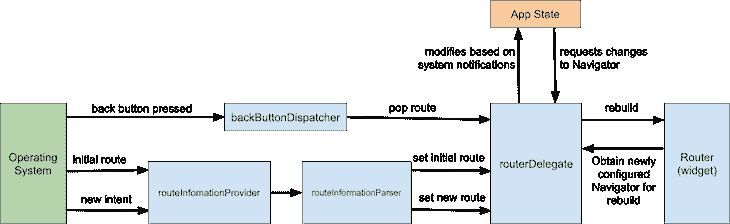

# 了解颤振导航和路由-日志火箭博客

> 原文：<https://blog.logrocket.com/understanding-flutter-navigation-routing/>

[Flutter](https://blog.logrocket.com/pros-and-cons-of-flutter-app-development/) 已经成为构建跨平台应用的流行工具包。它支持所有主要平台，包括 Android、iOS 和 web。

导航对于任何应用程序都非常重要。它为各种平台提供的导航 API 提供了统一的抽象。Flutter 为导航提供了两种类型的 API:命令式和声明式。

在本教程中，我们将介绍在 Flutter 1.0 中使用的命令式导航方法，以及现在在 Flutter 2.0 中使用的声明式方法。

我们将讨论以下内容:

## 命令式导航(颤振 1.0)

Flutter 1.0 采用了[命令式导航方式](https://flutter.dev/docs/cookbook/navigation)。

在 Flutter 中，导航由一堆小部件组成，其中小部件被推到顶部，也从顶部弹出。

### 颤振`Navigator`级

[`Navigator`类](https://api.flutter.dev/flutter/widgets/Navigator-class.html)提供了一个 Flutter 应用程序中的所有导航功能。

`Navigator`提供通过推入堆栈或从堆栈弹出来改变堆栈的方法。`Navigator.push`方法用于导航到新的页面，而`Navigator.pop`用于从当前页面返回。

这里有一个`pop`和`push`的基本例子:`push`方法把`BuildContext`作为第一个自变量，第二个自变量是一个`PageBuilder`。这个例子使用了`MaterialPageRoute`，它提供了过渡动画并处理路线变化:

```
import 'package:flutter/material.dart';

void main() {
  runApp(MaterialApp(
    title: 'My App',
    home: Main(),
  ));
}

class Main extends StatelessWidget {
  @override
  Widget build(BuildContext context) {
    return Scaffold(
      appBar: AppBar(
        title: Text('Main Route'),
      ),
      body: Center(
        child:RaisedButton(
          child: Text('Open route'),
          onPressed: () {
// pushing SecondRoute
            Navigator.push(
              context,
              MaterialPageRoute(builder: (context) => SecondRoute()),
            );
          },
        ),
      ),
    );
  }
}

```

`pop`方法只取`BuildContext`，改变当前路线。

```
class SecondRoute extends StatelessWidget {
  @override
  Widget build(BuildContext context) {
    return Scaffold(
      appBar: AppBar(
        title: Text("Second Route"),
      ),
      body: Center(
        child: RaisedButton(
          onPressed: () {
// Removing SecondRoute
            Navigator.pop(context);
          },
          child: Text('Go back!'),
        ),
      ),
    );
  }
}

```

`Navigator`提供了更多的方法，包括`*pushReplacement*`，使论点类似于`push`。它将替换当前路线，因此无法导航回旧路线。

例如，成功登录后，您可能希望使用`*pushReplacement*`来阻止用户返回登录屏幕。

## 命名路线

命名路由允许您通过使用字符串而不是提供组件类来更改路径，从而使您能够重用代码。

命名路线被定义为`MaterialApp`上的地图。这些路由可以在应用程序的任何部分使用。

### 定义路线

route 是一个带有字符串键和值的地图，比如传递给`MaterialApp`上的`routes`属性的 builders:

```
void main() {
  runApp(MaterialApp(
    title: 'My App',
    home: Main(),
// Routes defined here
    routes: {
      "second":(context)=>SecondRoute()
    },
  ));
}

```

### 使用命名路由

用`pushNamed`代替`push`，是为了换到新的路线。同样，用`*pushReplacementNamed*`代替`pushReplacement`。所有路线的`pop`方法都是一样的。

```
class Main extends StatelessWidget {
  @override
  Widget build(BuildContext context) {
    return Scaffold(
      appBar: AppBar(
        title: Text('Main Route'),
      ),
      body: Center(
        child:RaisedButton(
          child: Text('Open route'),
          onPressed: () {
            Navigator.pushReplacementNamed(context, "second");
          },
        ),
      ),
    );
  }
}

```

## 声明式导航(Flutter 2.0)

Flutter 2.0 带来了改进的导航，这在很大程度上要归功于它对声明式方法的支持。这使得路由成为状态的函数，即，页面随着状态的改变而改变。

Flutter 2.0 对 web 上的导航[也有更好的支持。](https://blog.logrocket.com/how-to-migrate-a-flutter-mobile-app-to-the-web/)

这张图由 Flutter 团队公开分享，以发布 [Flutter Navigation 2.0 和路由器](https://docs.google.com/document/d/1Q0jx0l4-xymph9O6zLaOY4d_f7YFpNWX_eGbzYxr9wY/edit)，它很好地描述了流程:



## 颤振导航仪

导航器获取页面列表并显示最后一页。您可以通过在列表末尾添加或删除页面来更改其页面。

下面的示例演示了如何通过基于页面的导航将 Navigator 类与新的 Flutter Navigator 一起使用。

`_page`是由这个类管理的状态。对于导航，这个`_page`是在`setState`调用中操纵的:

```
class _App extends State {
// Creating state for pages
  List<Page> _pages=[];

```

`_page`被传递给导航器类。导航器将根据`_page`的值改变当前页面。

`onPopPage`在进行基于 OS 的导航时调用，比如在 Android 上按后退键等。

```
   @override
  Widget build(BuildContext context) {
    return MaterialApp(
      home: Navigator(
        onPopPage: (route,result){
// check if route removed
          if(route.didPop(result)){
// remove the last page
            _pages.removeLast();
            return true;
          }
          return false;
        },
        pages: _pages,
      ),
    );
  }
}

```

初始页面可以通过在`initState`生命周期方法中添加页面来设置:

```
  @override
  void initState() {
    super.initState();
// setting intial page
    _pages=[_buildMain()];
  }

```

要创建新的材料页面，使用`MaterialPage`小部件。`MaterialPage`带一个孩子和一把钥匙。导航器使用`key`来区分页面并检测页面变化。

按下`click`按钮，一个新页面被添加到`_page`状态。调用`setState`来触发小部件的重建，`Navigator`自动处理页面变化。

```
// This function creates a Page using MaterialPage  
Page _buildMain(){
    return MaterialPage(child: Scaffold(
      body: Center(
        child: ElevatedButton(
          child: Text("click"),
          onPressed: (){
// When clicked add a new Page to _page list
            _pages.add(_buildSecondPage());
// call setState to trigger rebuild for Widget
            setState(() {
// create a copy of array
              _pages=_pages.toList();
            });
          },
        ),
      ),
// This helps Navigator to distigush between different pages
    ),key: ValueKey("home"));
  }

```

这个页面的构建方式与`_buildMain`相同，但是它不是添加一个新页面，而是删除一个页面并触发重建。

```
// This function perform same task as _buildMain  
Page _buildSecondPage(){
    return MaterialPage(child: Scaffold(
      body: Center(
        child: ElevatedButton(
          child: Text("back"),
          onPressed: (){
// This will take back to main
// remove the last page
            _pages.removeLast();
// call setState to trigger a rebuild
            setState(() {
// creating a copy of list
              _pages=_pages.toList();
            });
          },
        ),
      ),
    ),key: ValueKey("second"));
  }

```

除了使用`_pages`列表作为状态之外，您可以使用任何其他状态来执行导航。这是另一个例子:

```
class _App extends State {
  String _selected="main";

  Page _buildMain(){
    return MaterialPage(child: Scaffold(
      appBar: AppBar(),
      body: Center(
        child: ElevatedButton(
          child: Text("click"),
          onPressed: (){
            setState(() {
// add a new page
              _selected="second";
            });
          },
        ),
      ),
    ),key: ValueKey("home"));
  }

  Page _buildSecondPage(){
    return MaterialPage(child: Scaffold(
      appBar: AppBar(),
      body: Center(
        child: ElevatedButton(
          child: Text("back"),
          onPressed: (){
            setState(() {
// change back state to main
             _selected="main";
            });
          },
        ),
      ),
    ),key: ValueKey("second"));
  }

  @override
  Widget build(BuildContext context) {
    return MaterialApp(
      home: Navigator(
        onPopPage: (route,result){
          if(route.didPop(result)){
            _selected="main";
            return true;
          }
          return false;
        },
        pages: [
           _buildMain(),
// only show select if state has second selected
          if (_selected=="second") _buildSecondPage()
        ],
      ),
    );
  }
}

```

## 使用`RouterDelegate`

`RouterDelegate`是`Router`使用的核心 widget。它响应引擎的路线推送和路线弹出的意图。新的导航允许创建`RouterDelegate`来更好地控制导航。

* * *

### 更多来自 LogRocket 的精彩文章:

* * *

通过用`PopNavigatorRouterDelegateMixin,ChangeNotifier`混合扩展`RouterDelegate<AppRouteState>`类来创建`RouterDelegate`。

`_selected`追踪当前路线。这类似于前面示例中使用的状态。

```
class AppRouter extends RouterDelegate<AppRouteState> with PopNavigatorRouterDelegateMixin,ChangeNotifier {
  String _selected="main";

```

路由器使用它来获取路由器的最新状态，并更改地址栏中的 URL。

```
// get correct state of router  
@override
  AppRouteState get currentConfiguration => AppRouteState(_selected);

```

导航键用于支持旧的导航。

```
// This for older navigation support. 
 final _navigation= GlobalKey<NavigatorState>();
  @override
  GlobalKey<NavigatorState> get navigatorKey => _navigation;

```

使用`notifyListeners`代替`setState`来触发重建。`_selected`是改了改路线。

```
  Page _buildMain(){
    return MaterialPage(child: Scaffold(
      appBar: AppBar(),
      body: Center(
        child: ElevatedButton(
          child: Text("click"),
          onPressed: (){
            _selected="second";
// notify route changes
           notifyListeners();
          },
        ),
      ),
    ),key: ValueKey("home"));
  }

```

这类似于`_buildMain`:

```
  Page _buildSecondPage(){
    return MaterialPage(child: Scaffold(
      appBar: AppBar(),
      body: Center(
        child: ElevatedButton(
          child: Text("back"),
          onPressed: (){
              _selected="main";
// notify route changes
          notifyListeners();
          },
        ),
      ),
    ),key: ValueKey("second"));
  }

```

`build`函数返回 Navigator 小部件，用于布局其他页面。该功能类似于上一个功能中的`build`。用`notifyListeners`代替`setState`来触发重建。

```
  @override
  Widget build(BuildContext context) {
    return MaterialApp(
      home: Navigator(
        key: _navigation,
        onPopPage: (route,result){
          if(!route.didPop(result)){
            return false;
          }
          _selected="main";
// notify route changes
          notifyListeners();
          return true;

        },
        pages: [
          _buildMain(),
// if Route is second show SecondPage
          if (_selected=="second") _buildSecondPage()
        ],
      ),
    );
  }

```

此功能使用路由器传递的信息来更改路由。当引擎通过路线推送或弹出的意图时，调用此函数来更改路线。这里传递的信息由另一个类解析，我们将在后面讨论。

```
  @override
  Future<void> setNewRoutePath(configuration) async {
// update page based on 
    _selected=configuration.selected;
  }
}

```

## `RouteInformationParser`

`setNewRoutePath`从路由器接收配置。这个配置由`RouteInformationParser`解析。

用于由操作系统、引擎等传递的解析状态。，一个类应该扩展`RouteInformationParser`。`restoreRouteInformation`从`currentConfiguration`获取返回值并将其转换为`RouteInformation`。

`parseRouteInformation`返回路由器状态，并传递给`setNewRoutePath`。

```
class AppRouteInformationParser extends RouteInformationParser<AppRouteState>{
  // This converts route state to route information.
  @override
  RouteInformation restoreRouteInformation(configuration) {
    if(configuration.selected=="main") {
      return RouteInformation(location:"/main");
    } else {
      return RouteInformation(location: "/second");
    }

  }

// This converts route info to router state
  @override
  Future<AppRouteState> parseRouteInformation(RouteInformation routeInformation)async{
    var url=Uri.parse(routeInformation.location);
    print(url.path);
    if (url.path == "/") return AppRouteState("main");
    return AppRouteState(url.path.replaceAll("/", ""));
  }

}

```

## 把所有的放在一起

`MaterialApp`现在有了一个新命名的构造函数，它实现了一个以`Delegate`和`InformationParser`为参数的路由器。

```
class _App extends State {
  @override
  Widget build(BuildContext context) {
    return MaterialApp.router(routeInformationParser: AppRouteInformationParser(), routerDelegate: AppRouter());
  }
}

```

## 结论

在本 Flutter 导航教程中，我们将带您了解如何根据 Flutter 1.0 中使用的命令式方法和 Flutter 2.0 中引入的新声明式导航在 Flutter 应用程序中实现导航。

根据您的 Flutter 项目的性质，这两种类型的导航都可能是合适的，但都不是最好的。您应该始终选择最适合您需求的方法，即使这意味着同时使用两种方法。

为了开始在 Flutter 中导航，我建议查看一下 [Fluro](https://pub.dev/packages/fluro) 和 [Voyager](https://pub.dev/packages/voyager) 软件包。

## 使用 [LogRocket](https://lp.logrocket.com/blg/signup) 消除传统错误报告的干扰

[](https://lp.logrocket.com/blg/signup)

[LogRocket](https://lp.logrocket.com/blg/signup) 是一个数字体验分析解决方案，它可以保护您免受数百个假阳性错误警报的影响，只针对几个真正重要的项目。LogRocket 会告诉您应用程序中实际影响用户的最具影响力的 bug 和 UX 问题。

然后，使用具有深层技术遥测的会话重放来确切地查看用户看到了什么以及是什么导致了问题，就像你在他们身后看一样。

LogRocket 自动聚合客户端错误、JS 异常、前端性能指标和用户交互。然后 LogRocket 使用机器学习来告诉你哪些问题正在影响大多数用户，并提供你需要修复它的上下文。

关注重要的 bug—[今天就试试 LogRocket】。](https://lp.logrocket.com/blg/signup-issue-free)