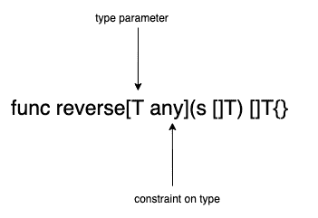

# 理解 Go 1.18 中的泛型

> 原文：<https://blog.logrocket.com/understanding-generics-go-1-18/>

泛型的加入是 Go(前身为 Golang)自问世以来最重大的变化。自语言诞生以来，Go 社区一直要求将泛型作为一种特性，现在终于实现了。

Go 泛型的实现与 C++中的传统实现有很大不同，但与 Rust 的泛型实现有相似之处——在这篇综述文章中，我们将看看如何理解 Go 中的泛型。

## 什么是泛型？

为了能够正确地使用泛型，需要理解什么是泛型以及为什么需要泛型。泛型允许您编写代码，而无需显式提供它们接受或返回的特定数据类型——换句话说，在编写一些代码或数据结构时，您不需要提供值的类型。

这些类型值将在以后传递。泛型允许 Go 程序员以后指定类型，避免样板代码。

## 为什么是仿制药？

泛型的目的是减少样板代码。例如，一个反向数组函数不需要知道数组元素的类型，但是如果没有泛型，就没有类型安全的方法来表示它而不重复。相反，您必须为每个类型实现一个反向函数，这将创建大量的代码，需要与相应维护的每个类型实现保持同步。

这个问题是泛型最终要解决的。

## 泛型语法

Go `1.18.0`引入了一种新的语法，用于提供关于类型的额外元数据和定义对这些类型的约束。

```
package main

import "fmt"

func main() {
        fmt.Println(reverse([]int{1, 2, 3, 4, 5}))
}

// T is a type parameter that is used like normal type inside the function
// any is a constraint on type i.e T has to implement "any" interface
func reverse[T any](s []T) []T {
        l := len(s)
        r := make([]T, l)

        for i, ele := range s {
                r[l-i-1] = ele
        }
        return r
}

```

[游乐场链接](https://go.dev/play/p/mqrxpG0xTfx)



如上图所示，`[]`括号用于指定类型参数，它是一个标识符列表和一个约束接口。这里，`T`是一个类型参数，用于定义自变量并返回函数的类型。

该参数也可以在函数内部访问。`any`是一个接口；`T`必须实现这个接口。Go 1.18 引入`any`作为`interface{}`的别名。

类型参数就像一个类型变量——所有普通类型支持的操作都被类型变量支持(例如，`make` function)。使用这些类型参数初始化的变量将支持约束的操作；在上面的例子中，约束是`any`。

```
type any = interface{}

```

该函数的返回类型为`[]T`，输入类型为`[]T`。这里，类型参数`T`用于定义函数内部使用的更多类型。这些泛型函数通过将类型值传递给类型参数来实例化。

```
reverseInt:= reverse[int]

```

[游乐场链接](https://go.dev/play/p/gQkKZ651kUu)

(注意:当一个类型参数被传递给一个类型时，它被称为“实例化”)

Go 的编译器通过检查传递给函数的参数来推断类型参数。在我们的第一个例子中，它自动推断类型参数是`int`，通常你可以跳过传递它。

```
// without passing type
fmt.Println(reverse([]int{1, 2, 3, 4, 5}))

// passing type
fmt.Println(reverse[int]([]int{1, 2, 3, 4, 5}))

```

## 类型参数

正如您在上面的片段中看到的，泛型通过提供一个用实际类型表示代码的解决方案，减少了样板代码。可以向函数或结构传递任意数量的类型参数。

### 函数中的类型参数

在函数中使用类型参数允许程序员在类型上编写代码泛型。

编译器将为实例化时传递的每种类型组合创建一个单独的定义，或者创建一个基于接口的定义，该定义来自使用模式和其他一些超出本文范围的条件。

```
// Here T is type parameter, it work similiar to type
func print[T any](v T){
 fmt.Println(v)
}

```

[游乐场链接](https://go.dev/play/p/fj2GkvJofWF)

### 特殊类型中的类型参数

泛型对于特殊类型非常有用，因为它允许我们在特殊类型上编写实用函数。

#### **切片**

创建切片时，只需要一种类型，因此只需要一个类型参数。下面的示例显示了切片的类型参数`T`的用法。

* * *

### 更多来自 LogRocket 的精彩文章:

* * *

```
// ForEach on slice, that will execute a function on each element of slice.
func ForEach[T any](s []T, f func(ele T, i int , s []T)){
    for i,ele := range s {
        f(ele,i,s)
    }
}

```

[游乐场链接](https://go.dev/play/p/o6HmleC9Hqx)

#### **地图**

地图需要两种类型，一种`key`类型和一种`value`类型。值类型没有任何约束，但是键类型应该总是满足`comparable`约束。

```
// keys return the key of a map
// here m is generic using K and V
// V is contraint using any
// K is restrained using comparable i.e any type that supports != and == operation
func keys[K comparable, V any](m map[K]V) []K {
// creating a slice of type K with length of map
    key := make([]K, len(m))
    i := 0
    for k, _ := range m {
        key[i] = k
        i++
    }
    return key
}

```

类似地，泛型也支持通道。

### struts 中的类型参数

Go 允许用类型参数定义`structs`。语法类似于通用函数。类型参数可用于结构的方法和数据成员中。

```
// T is type parameter here, with any constraint
type MyStruct[T any] struct {
    inner T
}

// No new type parameter is allowed in struct methods
func (m *MyStruct[T]) Get() T {
    return m.inner
}
func (m *MyStruct[T]) Set(v T) {
    m.inner = v
}

```

在结构方法中不允许定义新的类型参数，但是在结构定义中定义的类型参数在方法中是可用的。

### 泛型类型中的类型参数

泛型类型可以嵌套在其他类型中。函数或结构中定义的类型参数可以传递给任何其他带有类型参数的类型。

```
// Generic struct with two generic types
type Enteries[K, V any] struct {
    Key   K
    Value V
}

// since map needs comparable constraint on key of map K is constraint by comparable
// Here a nested type parameter is used
// Enteries[K,V] intialize a new type and used here as return type
// retrun type of this function is slice of Enteries with K,V type passed
func enteries[K comparable, V any](m map[K]V) []*Enteries[K, V] {
    // define a slice with Enteries type passing K, V type parameters
    e := make([]*Enteries[K, V], len(m))
    i := 0
    for k, v := range m {
        // creating value using new keyword
        newEntery := new(Enteries[K, V])
        newEntery.Key = k
        newEntery.Value = v
        e[i] = newEntery
        i++
    }
    return e
}

```

[游乐场链接](https://go.dev/play/p/EDoYMtkdfgD)

```
// here Enteries type is instantiated by providing required type that are defined in enteries function
func enteries[K comparable, V any](m map[K]V) []*Enteries[K, V]

```

## 类型约束

与 C++中的泛型不同，Go 泛型只允许执行一个接口中列出的特定操作，这个接口称为约束。

编译器使用约束来确保为函数提供的类型支持由使用类型参数实例化的值执行的所有操作。

例如，在下面的代码片段中，类型参数`T`的任何值都只支持`String`方法——您可以对它使用`len()`或任何其他操作。

```
// Stringer is a constraint
type Stringer interface {
 String() string
}

// Here T has to implement Stringer, T can only perform operations defined by Stringer
func stringer[T Stringer](s T) string {
 return s.String()
}

```

[游乐场链接](https://go.dev/play/p/M1B_R61QdFA)

### 约束中的预定义类型

Go 的新增功能允许像`int`和`string`这样的预定义类型实现约束中使用的接口。这些具有预定义类型的接口只能用作约束。

```
type Number {
  int
}

```

在 Go 编译器的早期版本中，预定义的类型除了`interface{}`之外从来没有实现过任何接口，因为在这些类型上没有方法。

不能使用具有预定义类型和方法的约束，因为预定义类型在这些已定义类型上没有方法。因此，不可能实现这些约束。

```
type Number {
  int
  Name()string // int don't have Name method
}

```

操作符将允许类型的联合(即，多个具体类型可以实现单个接口，并且产生的接口允许所有联合类型中的公共操作)。

```
type Number interface {
        int | int8 | int16 | int32 | int64 | float32 | float64
}

```

在上面的例子中，`Number`接口现在支持所有在提供的类型中常见的操作，如`<`、`>`和`+`—`Number`接口支持所有的算法操作。

```
// T as a type param now supports every int,float type
// To able to perform these operation the constrain should be only implementing types that support arthemtic operations
func Min[T Number](x, y T) T {
        if x < y {
                return x
        }
        return y
}

```

[游乐场链接](https://go.dev/play/p/AMLHjMFJuPR)

使用多种类型的联合允许执行这些类型支持的常见操作，并编写适用于联合中所有类型的代码。

## 类型近似

Go 允许从预定义的类型创建用户定义的类型，如`int`、`string`等。`~`操作符允许我们指定接口也支持具有相同底层类型的类型。

例如，如果你想给`Min`函数添加对带有下划线的类型`int`的类型`Point`的支持；使用`~`可以做到这一点。

```
// Any Type with given underlying type will be supported by this interface
type Number interface {
        ~int | ~int8 | ~int16 | ~int32 | ~int64 | ~float32 | ~float64
}

// Type with underlying int
type Point int

func Min[T Number](x, y T) T {
        if x < y {
                return x
        }
        return y
}

func main() {
        // creating Point type
        x, y := Point(5), Point(2)

        fmt.Println(Min(x, y))

}

```

[游乐场链接](https://go.dev/play/p/5XOkNHZ_9_D)

所有预定义的类型都支持这种近似类型——`~`操作符只处理约束。

```
// Union operator and type approximation both use together without interface
func Min[T ~int | ~float32 | ~float64](x, y T) T {
        if x < y {
                return x
        }
        return y
}

```

[游乐场链接](https://go.dev/play/p/w8lEJn933zL)

约束也支持嵌套；可以从`Integer`约束和`Float`约束建立`Number`约束。

```
// Integer is made up of all the int types
type Integer interface {
        ~int | ~int8 | ~int16 | ~int32 | ~int64
}

// Float is made up of all the float type
type Float interface {
        ~float32 | ~float64
}

// Number is build from Integer and Float
type Number interface {
        Integer | Float
}

// Using Number
func Min[T Number](x, y T) T {
        if x < y {
                return x
        }
        return y
}

```

[游乐场链接](https://go.dev/play/p/l5A8ENUhCb9)

## `constraints`包装

Go 团队提供了一个包含有用约束集合的新包——这个包包含了对`Integer`、`Float`等的约束。

该包导出预定义类型的约束。因为新的预定义类型可以添加到语言中，所以最好使用在`constraints`包中定义的约束。其中最重要的一个是`[Ordered]([https://pkg.go.dev/golang.org/x/exp/constraints#Ordered](https://pkg.go.dev/golang.org/x/exp/constraints#Ordered))`约束。它定义了支持`>`、`<`、`==`和`!=`运算符的所有类型。

```
func min[T constraints.Ordered](x, y T) T {
    if x > y {
        return x
    } else {
        return y
    }
}

```

[游乐场链接](https://go.dev/play/p/TDt_NcpypY6?v=gotip)

## 接口与泛型

泛型不是接口的替代品。泛型被设计成与接口一起工作，使 Go 更加类型安全，也可以用来消除代码重复。

接口表示实现接口的一组类型，而泛型是实际类型的占位符。在编译期间，泛型代码可能会被转换为基于接口的实现。

## 结论

本文介绍了如何定义类型参数，以及如何将类型参数与现有的构造(如函数和结构)一起使用。

我们还研究了 union 操作符和新的语法，用于实现预定义类型的接口，以及使用类型近似和具有特殊类型(如 structs)的泛型。

一旦你有了基础扎实的所有基础知识，你就可以更深入地钻研更高级的课题；比如使用带有类型断言的泛型。

泛型将成为 JavaScript 生态系统中类似于`lodash`的伟大库的构建模块。泛型也有助于为 Map、Slice 和 Channel 编写实用函数，因为没有`reflect`包很难编写支持每种类型的函数。

为了您的方便，这里有一些我从泛型的原始草稿中编写或收集的代码样本。

## 使用 [LogRocket](https://lp.logrocket.com/blg/signup) 消除传统错误报告的干扰

[](https://lp.logrocket.com/blg/signup)

[LogRocket](https://lp.logrocket.com/blg/signup) 是一个数字体验分析解决方案，它可以保护您免受数百个假阳性错误警报的影响，只针对几个真正重要的项目。LogRocket 会告诉您应用程序中实际影响用户的最具影响力的 bug 和 UX 问题。

然后，使用具有深层技术遥测的会话重放来确切地查看用户看到了什么以及是什么导致了问题，就像你在他们身后看一样。

LogRocket 自动聚合客户端错误、JS 异常、前端性能指标和用户交互。然后 LogRocket 使用机器学习来告诉你哪些问题正在影响大多数用户，并提供你需要修复它的上下文。

关注重要的 bug—[今天就试试 LogRocket】。](https://lp.logrocket.com/blg/signup-issue-free)