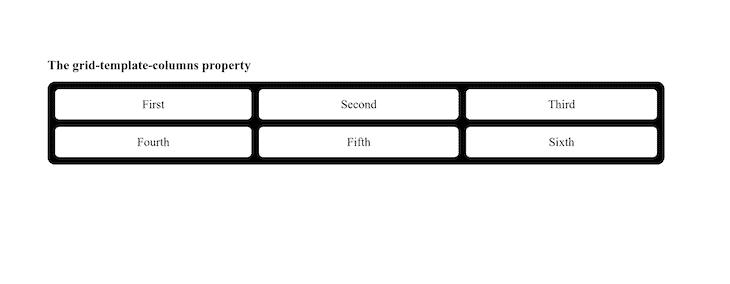
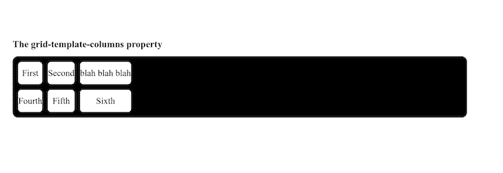
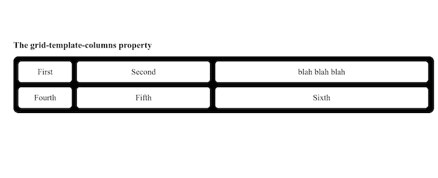

# 了解 CSS 中的网格-模板-列

> 原文：<https://blog.logrocket.com/understanding-grid-template-columns-css/>

属性只是 CSS 网格的一小部分。为了特别理解这个属性，你首先需要对 CSS 网格是什么有一个[的理解。](https://blog.logrocket.com/css-grid-getting-started/)

为了让您快速了解，网格布局基本上提供了一个基于网格的布局系统。要设计页面或模板，可以使用行和列，而不是使用像`float: right;`这样的技术。

在本文中，我们将探索 CSS 中的`grid-template-columns`，理解它是什么以及如何最好地使用它。我们开始吧！

## 什么是`grid-template-columns`？

简单地说，`grid-template-columns`是一个属性，它指定网格布局中的列数以及所述列的宽度。此属性的值由空格分隔，每个值指定其各自列的大小:

```
grid-template-columns: auto auto auto;
grid-template-columns: auto auto;
grid-template-columns: 20% 20% 20% 20%;

```

上面一行是你如何使用`grid-template-columns`的基本演示。三个`auto`分隔的值代表三个宽度相同的列。这同样适用于以下两个`auto`值。至于四个`20%`值，列的宽度是父元素的 20%。

语法非常简单，但是除了百分比和`auto`之外还有更多值。考虑以下代码:

```
grid-template-columns: none|auto|max-content|min-content|length|initial|inherit;

```

由管道分隔的每一个值都是可以用于`grid-template-columns`属性的可能值。每一种都有自己的目的，我们将在本文后面讨论。

理解这个[属性是可动画化的](https://blog.logrocket.com/new-in-firefox-66-animating-css-grid-b4ed90ac32f5/)也很重要。`grid-template-columns`可用于动画和过渡，意味着列可以从一个值逐渐变为另一个值:

```
<!DOCTYPE html>
<html>
<head>
<style>
.grid-container {
  display: grid;
  grid-template-columns: auto auto auto auto;
  grid-gap: 10px;
  background-color: black;
  padding: 10px;
  animation: mymove 5s infinite;
  border-radius: 2vw;
}

.grid-container > div {
  background-color: white;
  text-align: center;
  padding: 20px 0;
  font-size: 30px;
  border-radius: 1.5vw;
}

@keyframes mymove {
  20% {grid-template-columns: auto}
  40% {grid-template-columns: auto auto}
  50% {grid-template-columns: auto auto auto;}
  60% {grid-template-columns: auto auto}
  80% {grid-template-columns: auto}
}
</style>
</head>
<body>

<h1>Animation of the grid-template-columns Property</h1>

<p>The animation will change the number of columns from 1 to 3 then back to 1 and finally the original 4\. on repeat </p>

<div class="grid-container">
  <div class="item1">1</div>
  <div class="item2">2</div>
  <div class="item3">3</div>  
  <div class="item4">4</div>
  <div class="item5">5</div>
  <div class="item6">6</div>
  <div class="item7">7</div>
  <div class="item8">8</div>
</div>

</body>
</html>

```

这只是一个简单的演示，演示了如何在动画和过渡中使用这个属性。

## 理解价值观

让我们回到下面一行:

```
grid-template-columns: none|auto|max-content|min-content|length|initial|inherit;
```

我们将研究每个值，以便您了解布局中的列发生了什么变化。首先，我们将把`initial`和`inherit`去掉，因为对于这个特定的属性来说，它们并不那么有趣。`initial`只是将`grid-template-columns`属性设置为默认值，在本例中就是`none`。`inherit`值基本上继承了该属性在其父元素上的值。

`none`是缺省值，在需要时生成列，根据容器大小和列内内容的大小计算宽度。

`max-content`根据列中最大的项目调整列宽。`min-content`根据列中最小的项目调整列宽。`length`设置给定值为列宽。

使用下面的代码作为我的简单 HTML，我将为属性的每个值调整 CSS:

```
<!DOCTYPE html>
<html>
  <head>
    <link rel="stylesheet" href="index.css" />
  </head>
  <body>
    <h1>The grid-template-columns property</h1>
    <div id="test-div">
      &lt;div class="item1">First</div>
      <div class="item2">Second</div>
      <div class="item3">Third</div>
      <div class="item4">Fourth</div>
      <div class="item5">Fifth</div>
      <div class="item6">Sixth</div>
    </div>
  </body>
</html>

```

## `none`

说到`none`，没有明确的网格。基本上，列的大小要么取全宽，要么由另一个属性`grid-auto-columns`决定。下面的代码显示了`none`属性以及它如何处理输出:

```
body {
  background-color: white;
  padding: 10vw;
}
#test-div {
  height: auto;
  display: grid;
  border-radius: 1vw;
  gap: 1vw;
  background-color: black;
  padding: 1vw;
  grid-template-columns: none;
}
#test-div div {
  background-color: white;
  text-align: center;
  padding: 20px 0;
  font-size: 30px;
  border-radius: 0.5vw;
}

```

以下是输出:


## `auto`

当您将`auto`作为属性值时，它只是将整个宽度除以您拥有的列数。每个将具有相同的宽度。在下面的代码中，请注意，`grid-template-columns`属性的值使用了三次`auto`。因此，您将有三列相同的宽度:

```
body {
  background-color: white;
  padding: 10vw;
}
#test-div {
  height: auto;
  display: grid;
  border-radius: 1vw;
  gap: 1vw;
  background-color: black;
  padding: 1vw;
  grid-template-columns: auto auto auto;
}
#test-div div {
  background-color: white;
  text-align: center;
  padding: 20px 0;
  font-size: 30px;
  border-radius: 0.5vw;
}

```

输出如下所示:



有了`auto`值，您可以潜得更深一点。如果该属性有另一个值，比如说`grid-template-columns: auto 3px auto 50px;`，那么 UI 将有四列。第一个将与第三个具有相同的宽度，而第二个和第四个将具有唯一指定的宽度。现在，这应该告诉您`auto`获取任何可用的空间，并在具有所述值的任何列中平均分配它。

## `max-content`

需要一点 HTML 的调整，因为它将占用最大内容的宽度。下面代码显示了六个不同的 div 和一些随机内容。与前面的例子一样，您在`grid-template-columns`属性上指定任意次的值将决定您获得的列数:

```
<!DOCTYPE html>
<html>
  <head>
    <link rel="stylesheet" href="index.css" />
  </head>
  <body>
    <h1>The grid-template-columns property</h1>
    <div id="test-div">
      <div class="item1">First</div>
      <div class="item2">Second</div>
      <div class="item3">blah blah blah</div>
      <div class="item4">Fourth</div>
      <div class="item5">Fifth</div>
      <div class="item6">Sixth</div>
    </div>
  </body>
</html>

```

在这段代码中，`grid-template-columns: max-content max-content max-content;`产生三列。也就是说，即使它们具有相同的值，列的宽度也将由 div 中内容的宽度决定。因此，内的内容决定了 div 的宽度:

```
body {
  background-color: white;
  padding: 10vw;
}
#test-div {
  height: auto;
  display: grid;
  border-radius: 1vw;
  gap: 1vw;
  background-color: black;
  padding: 1vw;
  grid-template-columns: max-content max-content max-content;
}
#test-div div {
  background-color: white;
  text-align: center;
  padding: 20px 0;
  font-size: 30px;
  border-radius: 0.5vw;
}

```

输出如下所示:



注意，`blah blah blah`是最大的内容，因此，它决定了三列的宽度。同样的概念也适用于`min-content`值。然而，问题是你会有一些溢出。

## `length`

`length`不是指字面上的字，长度。`length`基本上代表 CSS 中给出的实际值。这些包括您可能想要使用的任何和所有 CSS 单元；它们都适用，不管你用`vw`、`rem`、`em`、`fr`等等。定义的每个列值都将反映在您的 UI 中:

```
body {
  background-color: white;
  padding: 10vw;
}
#test-div {
  height: auto;
  display: grid;
  border-radius: 1vw;
  gap: 1vw;
  background-color: black;
  padding: 1vw;
  grid-template-columns: 10vw 25vw 40vw;
}
#test-div div {
  background-color: white;
  text-align: center;
  padding: 20px 0;
  font-size: 30px;
  border-radius: 0.5vw;
}

```

上面的代码将赋予第一列宽度`10vw`，第二列宽度`25vw`，第三列宽度`40vw`。输出如下所示:



您可以一起或统一使用这些值。作为设计师，你拥有自由。慢慢来，尝试这些价值观，记得从中获得乐趣。

## 摘要

正如我在本文开头所说的，`grid-template-columns`只是整个网格系统的一个方面。在本文中，我们学习了如何使用`none`、`auto`、`max-content`、`min-content`和`length`值来操作列宽。

如果这让你兴奋，那么你可以深入研究 CSS 中的 `display: grid` 行所包含的一切。可能性是无限的。编码快乐！

## 你的前端是否占用了用户的 CPU？

随着 web 前端变得越来越复杂，资源贪婪的特性对浏览器的要求越来越高。如果您对监控和跟踪生产环境中所有用户的客户端 CPU 使用、内存使用等感兴趣，

[try LogRocket](https://lp.logrocket.com/blg/css-signup)

.

[](https://lp.logrocket.com/blg/css-signup)[https://logrocket.com/signup/](https://lp.logrocket.com/blg/css-signup)

LogRocket 就像是网络和移动应用的 DVR，记录你的网络应用或网站上发生的一切。您可以汇总和报告关键的前端性能指标，重放用户会话和应用程序状态，记录网络请求，并自动显示所有错误，而不是猜测问题发生的原因。

现代化您调试 web 和移动应用的方式— [开始免费监控](https://lp.logrocket.com/blg/css-signup)。