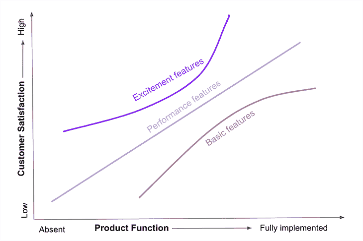
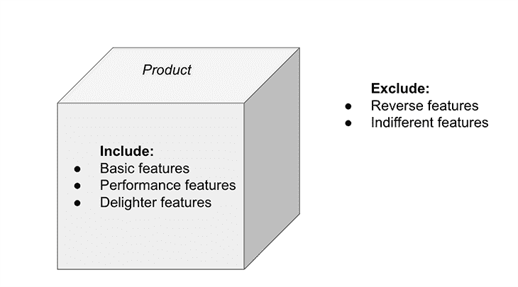
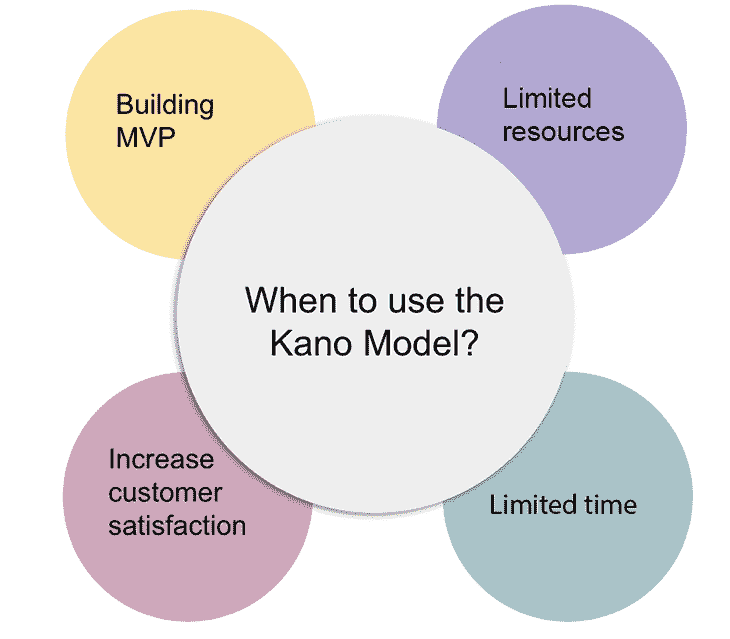

# 了解卡诺模型

> 原文：<https://blog.logrocket.com/product-management/understanding-kano-model/>

将客户需求分类并整合到产品中不是一件容易的事情。有多种框架和工具可以帮助产品团队实现这一点，Kano 模型是一个流行的选择。

Kano 模型有助于了解客户的需求，并根据预期向用户提供的价值，对路线图上的潜在功能进行优先排序。

在本文中，我们将讨论 Kano 模型是什么，它是如何工作的，它的特性和好处，并给出它的使用示例。我们还将讨论何时使用它，以及将它有效地整合到您的产品流程中的最佳实践。

* * *

## 目录

* * *

## 卡诺模型是什么？

Kano 模型是一个特性优先级框架。它用于根据产品带给用户的客户满意度来确定产品的重要特性。

除了 Kano 模型之外，还有许多特性优先级框架可以帮助产品经理。Kano 模型侧重于根据客户满意度对功能进行优先排序，这使它与其他模型有所不同。

## 卡诺模型简史

Kano 模型是由东京科学大学质量管理教授 Noriaki Kano 于 1984 年提出的。在研究客户满意度和忠诚度提高因素时，他受到启发开发了这个框架。

在 Kano 模型出现之前，整合客户投诉和改进流行功能是留住客户最常用的方法。然而，卡诺教授认为，顾客忠诚度与对产品特征的情感反应有关。

Noriaki Kano 开发了 Kano 模型来衡量功能满足客户的能力。他将对某个特征的情绪反应分为五种类型，从不满意到顾客高兴。他对 900 名参与者进行了一项研究，并将情绪反应绘制成卡诺反应图上的曲线。

这个模型帮助团队识别必须优先于其他功能的潜在功能，而不是仅仅依赖流行功能或客户投诉。产品团队可以将潜在功能的客户满意度与其实现成本进行比较，以确定哪些功能应该添加到产品路线图中。

## 卡诺模型如何工作

对潜在的特性列表进行分类并不完全取决于产品团队。理想的方法是在一组现有的忠实客户中进行调查，询问他们对每个潜在功能的满意度。这些功能根据两个因素进行评估:

1.  满足客户需求的潜在功能
2.  特性的实现投资水平。

针对这两个因素，将特征绘制在图表上，以显示产品功能和客户满意度之间的非线性关系。该图中的 y 轴表示客户满意度的增加，x 轴表示产品功能的增加。

一旦这些特征被绘制在该图上，就可以根据它们的位置将它们归类到五个类别中的一个。每个类别代表客户反应:兴奋特征、表现特征、基本特征、无动于衷特征和相反特征:

## 了解卡诺模型的特征类别

Kano 模型确定了对特征的五种情绪反应类型。产品经理和他们的团队一起确定产品的潜在功能列表，然后将这些功能组织成五个类别。

### 1.基本特征

这些是产品必须具备的功能。如果这些功能缺失，客户甚至无法使用该产品。

这些不是令人高兴的东西——它们满足了客户的基本需求，被客户视为理所当然。例如，前灯、方向盘、刹车和座椅都是汽车的基本特征。没有这些，客户甚至不会考虑购买汽车。

### 2.性能特征

性能特点使产品在市场上比其他产品更具竞争力。例如，在经济型汽车市场，除了汽车的基本特征之外，诸如良好的行驶里程、事故中的安全性和较低的价格等特征会增加顾客的满意度。

性能特征增加了基本特征并提高了产品性能，从而为用户提供了更多的便利。产品的性能特征越多，顾客就越满意。如果产品中没有这些功能，将会引起客户的不满。

### 3.令人兴奋/愉快的特征

这类特征在目标市场中引起了兴奋。如果这种类型的特征不存在于产品中，顾客不会错过它，也不会引起顾客的任何不满。

然而，如果产品中包含令人愉快的内容，客户满意度会显著提高。激动人心或令人愉快的功能提供了超越竞争对手产品的更大优势。这些都是创新的或独特的功能，是客户所没有预料到的，但增加后会对产品产生积极的反应。

我们再以汽车为例。360 度摄像头、自动泊车功能、盲点监测、带按摩器的汽车座椅或无钥匙进入等功能都是创新功能的例子，这些功能可以让客户满意，并使产品在竞争中更具优势。

* * *

订阅我们的产品管理简讯
将此类文章发送到您的收件箱

* * *

### 4.冷漠的特征

无关紧要的功能对用户没有任何正面或负面的影响。用户不会在意这个特性是否存在，如果不存在，他们也不会错过。团队应该避免开发这些类型的特性。

### 5.反转特征

反向特征是可能引起用户不满和沮丧的特征类型。这些应该完全从产品中剔除——在产品中包含这些会促使用户考虑替代产品。

列出所有的特性，然后将它们分配到这五个类别中，这有助于产品团队区分要实现的特性的优先级，并剔除那些相反的和无关紧要的特性。

## 卡诺模型示例和模板

[产品经理可以选择一组目标客户](https://blog.logrocket.com/product-management/consumer-insights-how-to-use-examples/)填写问卷。这份问卷将帮助他们了解对潜在功能的看法。例如，您可以设计一个标准问卷，如下所示:

| **问题** | **我喜欢它** | **我期待它** | **我是中立的** | **我可以忍受** | 我不喜欢它 |
| ***功能*** |  |  |  |  |  |
| 如果产品有…，你会有什么感觉？ |  |  |  |  |  |
| 如果有更多的…，你会有什么感觉？ |  |  |  |  |  |
|  |  |  |  |  |  |
| 如果产品没有…，你会有什么感觉？ |  |  |  |  |  |
| 如果……少了，你会有什么感觉？ |  |  |  |  |  |

接下来，您可以根据调查问卷答案的组合来确定每个类别:

| **功能性** | **功能失调** | **类别** |
| 我期待它 | 我不喜欢它 | 基础 |
| 我喜欢它 | 我不喜欢它 | 表演 |
| 我喜欢它 | 我是中立的 | 高兴者 |
| 我是中立的 | 我是中立的 | 中立的 |
| 我不喜欢它 | 我期待它 | 反面的 |
| 我是中立的 | 我不喜欢它 | 基础 |
| 我可以忍受 | 我不喜欢它 | 基础 |
| 我喜欢它 | 我期待它 | 高兴者 |
| 我喜欢它 | 我可以忍受 | 高兴者 |

之后，将整理回答，并为每个回答定义一个类别，如上所示。然后，您可以根据受访者的回答，查看每个功能最常被分配的类别名称，从而得出每个功能的类别。这种分析可以帮助您了解客户对潜在功能的反应，从而确定是否值得在它上面花费宝贵的时间和资源。

这里有一个谷歌表单模板和一个例子。您可以利用 Kano 模型分析来获得产品的潜在特性列表。

## 使用卡诺模型的好处

Kano 模型可以帮助产品团队对功能进行优先排序，并创建客户满意度更高的产品。让我们回顾一下卡诺模型的一些主要优势。

### 节省时间和资源

Kano 模型是一种更简单的方法，可以节省时间和资源，而不是通过市场研究和可用的产品使用数据来确定最理想的功能。

对目标客户进行调查，直接询问他们对一系列功能的偏好是非常有效的。

### 提高客户满意度

Kano 模型有助于产品团队识别客户不期望但乐于体验的创新功能。这些特性为产品提供了超越竞争对手的优势，并有助于留住现有客户。

### 制定产品路线图

产品经理经常在潜在功能列表中为项目的优先级排序而努力。Kano 模型有助于证明他们对某个特性的假设，并找出最值得投资的特性。

刺激、性能和基本特性[被放在产品路线图](https://blog.logrocket.com/product-management/what-is-a-product-roadmap-templates/)上。

### 构建 MVP

[最小可行产品是产品的基本版本](https://blog.logrocket.com/product-management/what-is-minimum-viable-product-mvp-how-to-define/)。它具有在最短的时间内用最少的资源构建的核心功能。MVP 必须具有由 Kano 模型分类的基本特征，并以客户期望的最低水平运行。

## 何时使用卡诺模型

任何开发新产品或增强现有产品的团队都可以使用 Kano 模型来区分特性的优先级。在团队时间和资源有限的情况下，或者在构建 MVP 并试图找出核心特性的情况下，这个模型非常有用。

该模型指导团队识别必须具备的特性、性能和更令人愉快的特性，这些特性可以带来客户满意度并使产品更受欢迎。

另一方面，如果产品团队已经从产品使用中获得了明确表明需要某个特性的客户数据，那么使用这种模型可能就没有意义了。

## 使用卡诺模型的最佳实践

为了充分利用 Kano 模型分析，采取适当的步骤和实施最佳实践是至关重要的。这将有助于团队专注于正确的功能集并分析调查结果，而不会造成太多混乱。

让我们了解一些使用 Kano 模型时的最佳实践。

### 使用正确的功能集

首先，产品团队需要写下所有潜在的功能集。然后，基于团队的假设和市场调查，需要使用 Kano 模型对功能进行分析并入围。

在最终确定这些功能时，听取关键利益相关方的意见也很重要。建议调查中分析的特征不要超过 20 个，因为超过 20 个会导致大量问题。长时间的调查会降低参与者的积极性，从而导致调查损耗。

### 使用正确的客户群

考虑你的目标客户群的不同样本量。不仔细选择调查对象会导致不确定的调查结果。一般来说，一组 15-20 人的参与者对于使用 Kano 模型分析数据来说已经足够了。这将有助于获得足够的仍可管理的数据。

### 调查项目的表示

以易于理解的方式提出调查问题至关重要。只要有可能，包含图片或 gif 来描述特征总是一个好的做法。这将有助于收件人理解清楚，不会留下任何假设的余地。

让另一双眼睛来检查调查问题，以确保问题是清楚的，这是一种很好的做法。这些调查可以包括开放式问题，以帮助团队了解客户的偏好。

### 组织后续采访

根据调查结果，很少有客户会被要求进行面对面的访谈，以了解他们对某项功能的看法和感受。这将有助于团队理解客户对特性的看法以及他们对产品预期行为的观点。

## 结论

Kano 模型有助于产品经理优先考虑入围的功能，从而提高客户满意度和保留率。它可以在产品的任何阶段使用——无论是进入市场的新产品还是希望提高客户满意度的现有产品。

实现最佳实践以避免被分析淹没是至关重要的。一旦分析完成，特性被分类并绘制出来，你就可以制定产品策略了。

与营销团队合作更新营销信息[也将有助于推动产品适应产品市场](https://blog.logrocket.com/product-management/what-is-product-market-fit-measure-examples/)。

*精选图片来源:[icon scout](https://iconscout.com/icon/agile-prioritize-2310243)*

## [LogRocket](https://lp.logrocket.com/blg/pm-signup) 产生产品见解，从而导致有意义的行动

[LogRocket](https://lp.logrocket.com/blg/pm-signup) 确定用户体验中的摩擦点，以便您能够做出明智的产品和设计变更决策，从而实现您的目标。

使用 LogRocket，您可以[了解影响您产品的问题的范围](https://logrocket.com/for/analytics-for-web-applications)，并优先考虑需要做出的更改。LogRocket 简化了工作流程，允许工程和设计团队使用与您相同的[数据进行工作](https://logrocket.com/for/web-analytics-solutions)，消除了对需要做什么的困惑。

让你的团队步调一致——今天就试试 [LogRocket](https://lp.logrocket.com/blg/pm-signup) 。

[Monica Dhiman Follow](https://blog.logrocket.com/author/monicadhiman/) I am passionate about solving business problems by bringing the team together and removing impediments. I started my career as a business analyst before moving into product management. I am a Certified Scrum Master and I also write my thoughts about product management at [MonicaDhiman.com](http://monicadhiman.com).