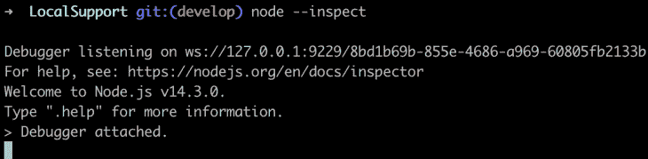
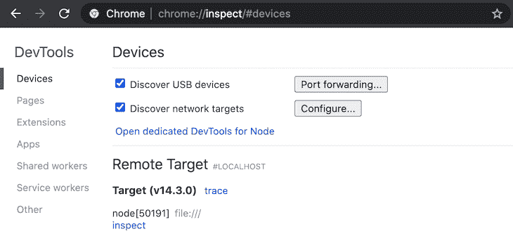
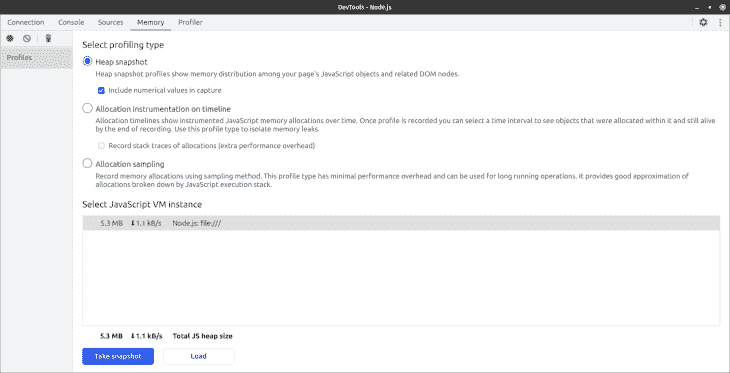

# 了解 Node.js 应用程序中的内存泄漏

> 原文：<https://blog.logrocket.com/understanding-memory-leaks-node-js-apps/>

***编者按:**本文最后一次更新于 2022 年 7 月 4 日，以更新节点 v18 的信息。*

在本文中，我们将了解什么是内存泄漏、导致内存泄漏的原因以及它们在 Node.js 应用程序中的含义。

尽管 Node 由于其可伸缩性可以很好地与许多应用程序一起工作，但它在堆大小方面有一些限制。为了提高节点应用程序的效率，理解为什么会发生内存泄漏，以及如何调试内存泄漏是非常重要的。

理解内存管理可以减少浪费应用程序资源的可能性，但是内存泄漏难以捉摸的本质以及它们对性能的意外影响意味着理解 Node 如何管理内存是至关重要的。

### 内容

## Node.js 如何管理内存？

性能对于应用程序的采用和使用至关重要，这使得内存管理成为软件开发的一个重要方面。因此，Node 有一些与对象生存期相关的内置内存管理机制。

例如，当对象被创建时，Node 动态地为它们分配内存，当这些对象不被使用时，Node 释放内存空间。一旦内存被释放，它可以被重新用于其他计算。

内存的分配和释放主要由垃圾收集器(GC)处理。垃圾收集指的是找到所有有效值并将无效值使用的内存返回给系统的过程，以便它们可以在以后被回收。

创建对象时，节点 GC 使用堆数据结构来存储对象的内存引用。这个堆的大小是有限的，GC 会计算资源耗尽的速度，以判断是否存在内存泄漏。

每一次内存分配都会让您更接近垃圾收集器暂停。GC 通过来自活动对象的指针链来识别死内存区域或不可达对象，然后将内存重新分配或释放给操作系统。

在较低的级别上，Node 使用 V8 JavaScript 引擎。[用它自己的话说](https://v8.dev/)，“V8 是谷歌的开源、高性能 JavaScript 和 WebAssembly 引擎，用 C++编写。”V8 执行代码并管理其运行时执行所需的内存。

管理是通过分配和释放程序所需的内存来完成的。虽然节点 GC 在管理内存方面做得相当好，但是由于各种原因，泄漏仍然会发生。

## 为什么会出现内存泄漏？

当长寿命对象被附加到预期的短寿命对象时，就会发生内存泄漏。

下面的代码片段展示了内存泄漏的真实例子:

```
const requests = new Map();
app.get( "/", (req,res) => {
    requests.set(req.id, req);
    res.status(200).send("Hello World");
});

```

上面的例子可能会导致内存泄漏，因为变量`requests`是全局的，它保存了`Map`对象的一个新实例。因此，每次请求到达服务器时，都会有一个内存分配给该对象。

保证内存分配给新实例意味着对象将永远存在。当请求数量消耗的内存超过应用程序可用的资源时，应用程序最终会耗尽内存并崩溃。

如果没有被注意到，内存泄漏可能会造成问题，尤其是在生产环境中。当应用程序中不可理解的 CPU 和内存使用量增加时，就有可能出现内存泄漏。

您可能与此有关:内存使用增长到应用程序变得无响应的程度。当内存已满且没有剩余空间用于内存分配时，会发生这种情况，从而导致服务器故障。

当这种情况发生时，我们大多数人倾向于重启应用程序，瞧！所有性能问题都解决了。然而，这种临时解决方案并没有消除 bug，而是忽略了它，这可能会引发意想不到的副作用，尤其是在服务器负载很重的情况下。

## 调试内存泄漏

在许多情况下，对于为什么会发生内存泄漏并没有明确的理解。事实上，这样的观察可能在发生时被忽略，尤其是在开发期间。

这里的假设是，一旦实现了功能，它将在以后被修复。在那个特定的时刻，这些事情可能不会困扰大多数人，他们会继续前进。请记住，内存泄漏并不那么明显，当内存不断增长时，最好调试代码来检查内存使用和响应时间之间的相关性。

一种这样的调试策略是查看对象生存期中的必要条件。即使一个程序的性能可能是稳定的或者看起来是最佳的，它的某些方面也有可能触发内存泄漏。

* * *

### 更多来自 LogRocket 的精彩文章:

* * *

某一天正确运行的代码版本可能会在将来由于负载的变化、新的集成或应用程序运行环境的变化而泄漏内存。

### 垃圾收集不是应该解决这个问题吗？

在内存管理的上下文中，垃圾指的是内存中无法到达的所有值，正如我们前面提到的，垃圾收集指的是识别活值并将死值使用的内存返回给系统的过程。

这意味着垃圾收集器通过跟踪哪些对象可由来自某些“根”对象的引用链到达来确定哪些对象应该被解除分配；剩下的都被认为是垃圾。垃圾收集的主要目的是减少程序中的内存泄漏。

但是垃圾收集并不能完全解决内存泄漏问题，因为垃圾收集只收集它知道不会被使用的内容。从根可到达的对象不被认为是垃圾。

GC 是处理内存泄漏最方便的方法，尽管它的一个缺点是在决定释放哪些空间的过程中会消耗额外的资源。这将因此减慢进程，影响应用程序的性能。

## 管理内存泄漏

内存泄漏不仅难以捉摸，而且难以识别和调试，尤其是在使用 API 时。在这一节中，我们将学习如何使用可用的工具来捕获内存泄漏。

我们还将讨论在生产环境中调试泄漏的合适方法——不会破坏代码的方法。在开发过程中发现的内存泄漏比生产过程中发现的内存泄漏更容易调试。

如果您怀疑您的应用程序中存在内存泄漏，很有可能是由于应用程序的常驻集大小(RSS)无上限的增加导致的，这使得它没有平稳地增加。结果，RSS 变得太高，应用程序无法处理工作负载，这可能导致它在没有“内存不足”警告的情况下崩溃。

这些都清楚地表明程序可能存在内存泄漏。为了管理和/或调试这种情况，有一些工具可以用来使努力更有成效。

### 节点堆转储

[node-heapdump](https://github.com/bnoordhuis/node-heapdump) 模块适合事后调试。它会在 SIGUSR2 上生成堆转储。为了帮助在开发环境中容易地捕获 bug，将 node-heapdump 作为依赖项添加到您的项目中，如下所示:

```
npm install heapdump --save

```

然后，将其添加到您的根文件中:

```
const heapdump = require("heapdump");

```

现在，您可以使用 node-heapdump 来拍摄一些堆快照。您可以调用该函数:

```
heapdump.writeSnapshot(function(err, filename){
  console.log("Sample dump written to", filename);
});

```

一旦您将快照保存到文件中，您就可以比较它们，并获得导致应用程序内存泄漏的提示。

### `v8.writeHeapSnapshot`法

您也可以使用内置的`v8`模块，而不是像我们在上一小节中那样使用第三方包来捕获堆快照。

`v8`模块的`writeHeapSnapshot`方法将 V8 堆写入一个 JSON 文件，您可以使用 Chrome DevTools。根据节点文档，由`writeHeapSnapshot`方法生成的 JSON 模式是没有文档记录的，并且特定于 V8 引擎，并且可能因 V8 版本的不同而不同:

```
require(v8).writeHeapSnapshot();

```

`v8`模块并非全球可用。因此，像上面的例子一样，在调用`writeHeapSnapshot`之前导入它。它在 Node v.11.13.0 及更高版本中可用。对于 Node 的早期版本，您需要使用上一节中描述的 node-heapdump 包。

堆快照是在生产环境中调试泄漏的有效方法。它们允许开发人员记录堆并在以后进行分析。

但是，请注意，这种方法在生产中有潜在的缺点，因为它可能会触发延迟高峰。拍摄堆快照可能会很昂贵，因为我们必须在每次拍摄快照后进行一次完整的垃圾收集。甚至有可能使您的应用程序崩溃。

### Clinic.js

Clinic.js 是一个方便的工具集，用于诊断和查明节点应用程序中的性能瓶颈。这是一个由[开发的开源工具。](https://www.nearform.com/)

要使用它，您需要从 npm 安装它。诊断内存泄漏的特定工具是 Clinic.js [HeapProfiler](https://clinicjs.org/heapprofiler/) :

```
npm install -g clinic
clinic heapprofiler --help

```

Clinic.js HeapProfiler 使用火焰图来突出显示内存分配。您可以将它与诸如[auto canon](https://www.npmjs.com/package/autocannon)之类的工具一起使用，以便在分析时模拟 HTTP 负载。它会将结果编译成一个 HTML 文件，您可以在浏览器中查看，并且您可以解释火焰图来查明您的节点应用程序中的泄漏功能。

### `process.memoryUsage`法

`process.memoryUsage`方法提供了一种简单的方法来监控节点应用程序中的内存使用情况。

方法返回具有以下属性的对象:

*   `rss`或常驻集大小，指进程在主存中占用的空间量，包括代码段、堆和栈。如果您的 RSS 在上升，那么您的应用程序有可能正在泄漏内存
*   `heapTotal`，JavaScript 对象可用的内存总量
*   `heapUsed`，JavaScript 对象占用的内存总量
*   `external`，节点使用的堆外数据(缓冲区)消耗的内存量；这是存储对象、字符串和闭包的地方
*   `arrayBuffers`、`ArrayBuffers`和`SharedArrayBuffers`的内存分配量(`external`内存大小也包括该内存值)

根据文档，当您将 Node 用作嵌入式库时，`arrayBuffers`属性的值可能为零，因为`ArrayBuffers`的分配可能不会被跟踪。

例如，这段代码:

```
console.log(process.memoryUsage());

```

会返回类似这样的内容:

```
{
  rss: 4935680,
  heapTotal:1826816,
  heapUsed:650472,
  external: 49879,
  arrayBuffers: 17310,
}

```

这显示了您的应用程序消耗了多少内存。在生产环境中，这不是一个好方法，因为它会打开浏览器页面并向您显示数据。

### 节点检查器

[节点](https://github.com/node-inspector/node-inspector)Inspector 是节点应用的调试器接口。用`--inspect`标志运行 Node 来使用它，它开始监听一个调试客户机。这是用 Chrome DevTools 捕获堆快照的最简单的方法之一。为了掌握 Node Inspector 是如何工作的，你可以在这里[阅读更多信息。](https://nodejs.org/en/docs/guides/debugging-getting-started/)

下一节解释了如何在 Chrome DevTools 中使用节点检查器。

#### Chrome 开发工具

Chrome DevTools 在捕捉和调试内存泄漏方面非常有用。要打开开发工具，打开 Chrome，点击汉堡图标，选择**更多工具**，然后点击**开发者工具**。

Chrome 提供了一系列工具来帮助调试内存和性能问题，包括分配时间表、采样堆分析器和堆快照，等等。

要设置 Chrome DevTools 来调试节点应用程序，您需要:

*   节点的最新版本
*   您首选的代码编辑器
*   当然是 Chrome 网络浏览器

在您的终端上打开您的节点项目，并键入`node --inspect`来启用节点检查器。



在浏览器中，键入`about:inspect`。这将打开一个如下所示的窗口:



最后，点击**打开节点**的专用开发工具，开始调试代码。



在专用 DevTools 窗口的底部，有一个按钮，用于获取正在运行的应用程序的堆快照配置文件并加载堆快照文件。

在开发环境中，您可以使用**获取快照**按钮来获取正在运行的应用程序的堆快照配置文件。默认情况下，堆快照选项处于选中状态。您还可以从文件中加载堆快照。

## 针对内存泄漏进行优化

我们都关心性能和保持页面的速度，确保我们只使用最少量的必要内存。内存分析可能很有趣，但有时感觉像一个黑盒。

很难避免内存泄漏，因为您无法真正了解随着时间的推移您的对象将如何被使用。但是，有一些方法可以减少节点应用程序中的内存泄漏。下面是开发人员在编写应用程序时容易陷入的陷阱。

### 留意对 DOM 元素的持久引用

JavaScript 对象到 DOM 对象的引用是极好的，直到 DOM 对象链接回这样一个 JavaScript 对象，形成一个引用循环。这变得很成问题，尤其是在长时间运行的应用程序中，因为没有从循环的对象中释放内存，从而导致内存泄漏。为了确保没有从 DOM 元素到真实事件处理程序的直接引用，您应该通过数组间接引用事件处理程序。

### 避免循环对象引用

循环引用意味着一个对象调用它自己，创建一个循环。这使得对象永远存在，最终可能导致内存泄漏。

下面是一个对象引用自身的示例:

```
var obj = {}
obj.a = a;

```

在上面的例子中，`obj`是一个空对象，`a`是一个反向引用同一个对象的属性。

通常，当这种情况发生时，对象引用它自己，因此形成一个循环。这有时会有问题，因为我们基本上做的是将这个函数绑定为永久存在。只要全局变量存在，局部变量也存在。

这种行为将导致无法修复的内存泄漏。最好的方法是去掉对象引用。

### 取消绑定事件侦听器

将事件侦听器绑定到许多元素会降低应用程序的速度。因此，如果需要在浏览器环境中类似地监听许多 DOM 元素上的同一事件，可以考虑使用事件委托。您可以将事件处理程序绑定到父元素，然后使用处理程序中的`event.target`属性来定位事件发生的位置并采取适当的操作。

然而，像往常一样，上述性能优化建议有一个警告。最佳实践是运行性能测试，以确保应用上述优化能够为您的特定用例带来性能提升。

### 管理本地缓存

缓存存储数据，以便在以后需要时更快更方便地检索。当计算速度很慢时，缓存是提高性能的好方法。[内存缓存模块](https://www.npmjs.com/package/memory-cache)是在节点应用程序中进行内存缓存的好工具。

## 结论

很难避免内存泄漏，因为许多程序在运行时会增加内存占用。关键的洞察力是理解预期对象的生命周期，并学习如何使用可用的工具来有效地减少内存泄漏。

## 200 只显示器出现故障，生产中网络请求缓慢

部署基于节点的 web 应用程序或网站是容易的部分。确保您的节点实例继续为您的应用程序提供资源是事情变得更加困难的地方。如果您对确保对后端或第三方服务的请求成功感兴趣，

[try LogRocket](https://lp.logrocket.com/blg/node-signup)

.

[](https://lp.logrocket.com/blg/node-signup)[https://logrocket.com/signup/](https://lp.logrocket.com/blg/node-signup)

LogRocket 就像是网络和移动应用程序的 DVR，记录下用户与你的应用程序交互时发生的一切。您可以汇总并报告有问题的网络请求，以快速了解根本原因，而不是猜测问题发生的原因。

LogRocket 检测您的应用程序以记录基线性能计时，如页面加载时间、到达第一个字节的时间、慢速网络请求，还记录 Redux、NgRx 和 Vuex 操作/状态。

[Start monitoring for free](https://lp.logrocket.com/blg/node-signup)

.