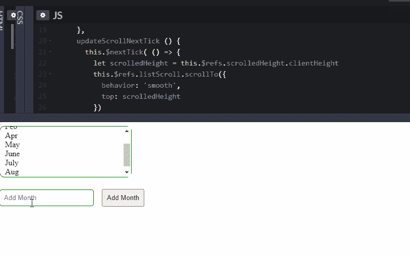

# 理解 Vue.js 中的$nextTick

> 原文：<https://blog.logrocket.com/understanding-nexttick-in-vue-js/>

一个前端开发人员(假设他的名字是 Eric)走进一个 Vue 酒吧。

埃里克点了他最喜欢的鸡尾酒:Nuxt。酒保正在努力。然后他开始咆哮。

他开始讲述了他是如何在 Vue 3 文档中的实例方法下发现`$nextTick`的，并被震惊了。埃里克使用 Vue 已经有一段时间了，他习惯于将`$watch`和`$emit`作为实例方法来编写。那么`$nextTick`是干什么用的呢？ [Vue 文档](https://vuejs.org/v2/api/#Vue-nextTick)说它“将回调推迟到下一个 DOM 更新周期之后执行。”

但是埃里克不相信。

他继续讲述他是如何尝试这样的事情的:

```
this.loadingAnimation = true
this.startVeryLongCalculation()
this.completeVeryLongCalculation()
this.loadingAnimation = false
```

但是浏览器什么也没显示。他转向堆栈溢出，有人推荐使用`$nextTick`。这个人说，“它推迟了回调，”但至少他们包括一个代码片段。Eric 修改了他的代码，如下所示:

```
this.loadingAnimation = true
this.$nextTick(() => this.startVeryLongCalculation())
this.endVeryLongCalculation()
this.loadingAnimation = false
```

它工作了。为什么？

在本文中，如果您处于与 Eric 相似的情况，您将会理解`nextTick`是如何工作的，并通过一个真实的用例来验证。

## 先决条件

你应该具备以下基本知识。如果没有，请查看以下主题:

*   事件循环
*   回调函数
*   微任务、队列和时间表
*   异步更新队列

## `nextTick`是做什么的？

`nextTick`接受一个被延迟到下一个 [DOM 更新周期](https://blog.logrocket.com/advanced-data-fetching-techniques-in-vue/)的回调函数。这只是一种简单的说法，“嘿，如果你想在 DOM 更新后执行一个函数(这种情况很少发生)，我希望你使用`nextTick`而不是`setTimeout`”:

```
Vue.nextTick(() => {}) // syntax
```

我们很快就会谈到`setTimeout`对`nextTick`的争论。让我们用这个例子来想象一下`nextTick`的行为:

```
<template>
  <div>
    {{ currentTime }}
  </div>
</template>

<script>
export default {
  name: 'getCurrentTime',
  data() {
    return {
      currentTime: ''
    }
  },
  mounted() {
    this.currentTime = 3;

    this.$nextTick(() => {
        let date = new Date()
        this.currentTime = date.getFullYear()
    });
  }
}
</script>
```

> **注意** : `this.$nextTick`与全局 API 方法`vue.nextTick`相同，只是回调函数的`this`自动绑定到调用它的实例。

在 JSFiddle 或您的计算机上运行这个代码片段。它将显示`2021`。并不是说去掉`nextTick`就不会得到同样的结果。但是，您应该理解 Vue 根据数据中的内容对 DOM 进行修改。

在上面的代码片段中，Vue 将 DOM 更新为`3`，然后调用回调，将 DOM 更新为`2021`，最后将控制权交给浏览器，浏览器显示`2021`。

到目前为止，我们已经研究了`nextTick`在回调队列中插入回调函数并在适当的时候执行该函数的部分。

你只需要知道这些。

但是您可能会感兴趣地知道，`nextTick`中的回调被用作事件循环中的微任务。`nextTick`的[源代码](https://github.com/vuejs/vue/blob/dev/src/core/util/next-tick.js)明确声明“`nextTick`行为利用微任务队列，该队列可以通过本机`Promise.then`或`MutationObserver`访问。”

### `setTimeout`对`nextTick`

另一种在 DOM 更新后执行函数的方法是使用 JavaScript `setTimeout()`函数。

让我们在上面的代码示例中用`setTimeout`替换`nextTick`:

```
<template>
  <div>
    {{ currentTime }}
  </div>
</template>

<script>
export default {
  name: 'getCurrentTime',
  data() {
    return {
      currentTime: ''
    }
  },
  mounted() {
    this.currentTime = 3;

    setTimeout(() => {
      let date = new Date()
      this.currentTime = date.getFullYear()
    }, 0);
  }
}
</script>
```

在您的本地服务器或[这个 JSFiddle](https://jsfiddle.net/grubkpdh/) 上运行这个代码片段。你会先看到`3`，再看到`2021`。这种情况发生得很快，所以如果一开始没有看到这种现象，您可能需要刷新浏览器。

在上面的代码片段中，Vue 将 DOM 更新为`3`，并给予浏览器控制权。然后浏览器显示`3`，调用回调，将 DOM 更新为`2021`，最后将控制权交给浏览器，浏览器现在显示`2021`。

在`Promise`和`MutationObserver`不可用的情况下，`nextTick`实现使用`setTimeout`作为浏览器(即 6–10 和 Opera Mini 浏览器)上最后的后备方法。对于不支持`Promise`和`MutationObserver`的浏览器(IE 10)，它甚至更喜欢`setImmediate`。

唯一没有所有这三种方法并且不得不依靠`setTimeout`的浏览器是 Opera Mini 浏览器。

## 何时使用`nextTick`

很少有情况会让你拿出大枪。其中一些案例是:

*   当你想使用`setTimeout`
*   当您想非常确定 DOM 反映了您的数据时
*   当您在尝试执行异步操作时遇到类似`Uncaught (in promise) DOMException`的错误时。记住，Vue 异步更新 DOM

让我们用 Vue 3 来看最后一个例子:

```
<div id="app">
  <div ref="listScroll" class="scrolledList">
    <ul ref="scrolledHeight">
      <li v-for="month in months">
        {{month}}
      </li>               
    </ul>
  </div>

  <input type="text" placeholder="Add Month" v-model="month">
  <button @click="addMessage" @keyup.enter="addMessage"> Add Month</button>
</div>

<script src="https://unpkg.com/[email protected]"> 
  Vue.createApp({
    data() {
      return {
        month: '',
        months: ['Jan', 'Feb', 'Apr', 'May', 'June', 'July', 'Aug']
      }
    },
    mounted() {
      this.updateScrollNextTick()
    },
    methods: {
      addMessage() {
        if(this.month == ''){
          return
        }

        this.months.push(this.month)
        this.month = ''
        this.updateScrollNextTick()
      },
      updateScrollNextTick () {
        let scrolledHeight = this.$refs.scrolledHeight.clientHeight

        this.$nextTick(() => {
          this.$refs.listScroll.scrollTo({
            behavior: 'smooth',
            top: scrolledHeight
          })
        })
      }
    },
  })
  .mount("#app")
</script>
```

在您的本地机器或 [CodePen](https://codepen.io/ammezie/pen/OJpOvQE) 上运行这个程序。您应该得到这样的结果:



在上面的代码片段中，当一个新项目被添加到列表中时，我们希望获得平滑的向下滚动效果。浏览代码并尝试通过删除`nextTick`来修改它，你将会失去平滑滚动的效果。你也可以试着用`setTimeout`代替`nextTick`。

## 结论

在本文中，我们探索了`nextTick`是如何工作的。我们进一步理解了它与普通 JavaScript `setTimeout`的不同之处，并涵盖了实际的用例。

前面提到的实例方法很少需要，所以如果你最近不得不使用它，请在这篇文章下发表评论并分享你的经验。

## 像用户一样体验您的 Vue 应用

调试 Vue.js 应用程序可能会很困难，尤其是当用户会话期间有几十个(如果不是几百个)突变时。如果您对监视和跟踪生产中所有用户的 Vue 突变感兴趣，

[try LogRocket](https://lp.logrocket.com/blg/vue-signup)

.

[](https://lp.logrocket.com/blg/vue-signup)[https://logrocket.com/signup/](https://lp.logrocket.com/blg/vue-signup)

LogRocket 就像是网络和移动应用程序的 DVR，记录你的 Vue 应用程序中发生的一切，包括网络请求、JavaScript 错误、性能问题等等。您可以汇总并报告问题发生时应用程序的状态，而不是猜测问题发生的原因。

LogRocket Vuex 插件将 Vuex 突变记录到 LogRocket 控制台，为您提供导致错误的环境，以及出现问题时应用程序的状态。

现代化您调试 Vue 应用的方式- [开始免费监控](https://lp.logrocket.com/blg/vue-signup)。