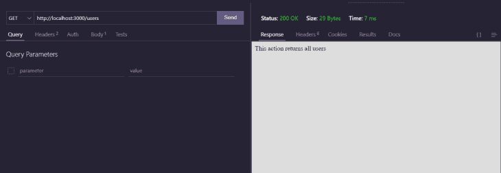
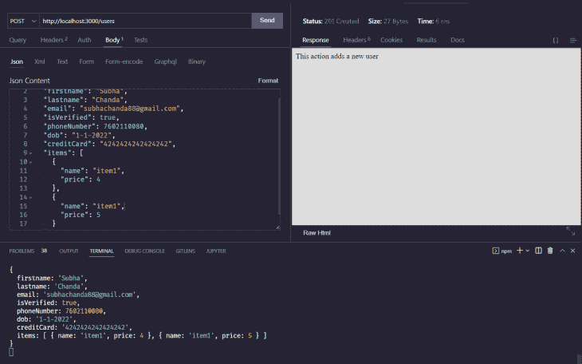

# 在 NestJS 中了解使用 Joi 进行对象验证

> 原文：<https://blog.logrocket.com/understanding-object-validation-joi-nestjs/>

当构建一个健壮的、可伸缩的 API 时，在应用程序中实现适当的验证是很重要的，这不仅是为了安全，也是为了保持数据库的整洁。如果您正在使用健壮的后端 API，NestJS 可能是一个很好的工具，而且，您可以使用 NestJS 和 Joi 添加对象验证来确保您的应用程序安全。

本文将通过一个基本的 CRUD 示例向您展示如何在 NestJS 中实现 Joi 对象验证。

### *向前跳转:*

## 什么是 NestJS？

NestJS 深受 Angular 的启发，是一个特别受欢迎的框架，用于构建可伸缩和健壮的应用程序。它提供了一个基于模块、控制器和提供者的清晰架构来帮助您入门。它支持 TypeScript，但是您也可以用普通的 JavaScript 编写应用程序。

NestJS 不会把任何编程范式强加给你。您可以自由使用面向对象、函数式或函数式反应式编程。它还提供了一个出色的路由机制，并且本机支持 HTTP 服务器框架 [Express](https://www.npmjs.com/package/express) 。您还可以配置您的 NestJS 应用程序来使用 [Fastify](https://www.fastify.io/) 。

### NestJS 的构建模块

NestJS 有三个主要的构建块:模块、控制器和提供者。

*   **模块**:模块用于将代码库模块化，拆分成可复用的组件。被分组的 TypeScript 文件用`@Module` decorator 来描述，以提供元数据。NestJS 使用这些文件来组织应用程序结构
*   **控制器**:控制器控制传入的请求，并向客户端发送适当的响应
*   **提供者**:提供者是 NestJS 的基本概念。服务、工厂、助手、仓库等。，在 Nest 中被视为提供者。提供者可以作为 Nest 中的依赖项注入

## 为什么要用 NestJS？

近年来，Node.js 已经成为一种流行的编程语言，而且，由于开发人员希望更快地编写生产就绪的 API，对高质量后端框架的需求也在增加。进入 NestJS，帮助开发者更快的写出高效的代码。

让我们讨论一下使用 NestJS 的好处。

*   **TypeScript** : NestJS 默认使用 TypeScript，但是您也可以用普通的 JavaScript 编写您的 NestJS 代码
*   **微服务** : NestJS 支持 [GraphQL](https://graphql.org/) 、 [WebSockets](https://developer.mozilla.org/en-US/docs/Web/API/WebSockets_API) 、 [gRPC](https://grpc.io/) 和 [MQTT](https://mqtt.org/) ，以及 REST APIs。对这些工具的支持有助于编写微服务
*   Nest 也有自己的命令行界面，可以让你创建、运行、构建你的应用等等
*   **高质量的文档** : NestJS 有很好的[文档](https://docs.nestjs.com/)，帮助你深入理解概念。它甚至提供由 NestJS 团队成员创建的官方课程
*   **Testing** : NestJS 支持用 Jest 或您选择的任何其他测试框架测试您的应用程序。NestJS 甚至提供了自己的[测试包](https://www.npmjs.com/package/@nestjs/testing)

## Joi 是什么？

所有开发人员都知道验证来自客户端的数据至关重要。如果您曾经在 Node.js 中使用过 MongoDB 和 mongose，您可能对[mongose 模式](https://mongoosejs.com/docs/guide.html)很熟悉。Mongoose 模式有助于描述数据，并轻松地为数据添加验证器。Joi 非常类似于模式。

Joi 是一个广泛使用的 Node.js 数据验证库，它提供了一个简单、直观、易读的 API 来描述数据。它主要用于验证从 API 端点发送的数据，并允许您创建想要接受的数据类型的蓝图。

下面是一个用 Joi 描述模式的简单例子:

```
 const schema = Joi.object().keys({ 
     name: Joi.string().alphanum().min(3).max(30).required(),
     birthyear: Joi.number().integer().min(1970).max(2013), 
});

```

## 用 NestJS 构建基本 API

NestJS 根据您的需要为支架代码提供了许多选项，比如 CRUD recipe。这允许您在几秒钟内从 Nest CLI 构建一个带有端点的 CRUD。

要在您的计算机上安装 Nest CLI，请运行以下命令:

```
npm i -g @nestjs/cli  

```

下一步是生成嵌套应用程序。Nest CLI 使用以下命令:

```
nest new project-name

```

这里，`project-name`是项目的名称。命令完成后，运行以下命令来搭建 CRUD 端点:

```
nest g resource users

```

它会问你几个问题，比如使用哪个传输层。一旦你根据自己的喜好选择了选项，Nest 就会搭建 CRUD API。例如，带有`users`端点的 API 将从上面的命令中生成。您可以看到新的`users`文件夹。

现在，如果您使用`npm run start:dev`运行应用程序，您将看到登录到控制台的端点。您的服务器将在端口`3000`启动。

您可以通过访问端点或打开`users.controllers.ts`文件来检查端点。这个文件包含 CRUD API 的路径。每个 API 的服务都在`users.service.ts`文件中定义，所有这些文件都在`users`文件夹下。

## 对象验证的重要性

如果您查看在`users.controllers.ts`文件中查找单个项目的`GET`方法，您会发现没有设置验证。可以使用任何东西作为 ID，Nest 不会抛出验证错误。

OWASP 十大安全风险列表中提到[注入攻击](https://owasp.org/Top10/A03_2021-Injection/)仍然是最常见的安全风险之一。OWASP 还提到，当“应用程序没有验证、过滤或清理用户提供的数据”时，应用程序容易受到注入攻击

这清楚地表明，在构建应用程序时，数据验证是一个需要牢记的重要安全问题。有内置的管道可以验证或修改输入。NestJS 有[个内置管道](https://docs.nestjs.com/pipes#built-in-pipes)。如果您希望 ID 只是整数类型，您可以使用`ParseIntPipe`管道。这里有一个例子:

```
@Get(':id')
findOne(@Param('id', ParseIntPipe) id: string) {
  return this.usersService.findOne(+id);
}

```

如果您尝试用除数值以外的任何 ID 访问端点，您将收到以下错误。


使用内置管道很简单，但是将它用于大型模式就很复杂了。Joi 使得在 NestJS 中设计模式和实现验证变得更加容易。让我们为 NestJS 项目实现 Joi。

## 在 NestJS 中实施 Joi

一般来说，任何可以注入 NestJS 的脚本都是`Pipe`类。管道主要有两个用例:

*   转换输入数据
*   验证输入数据

你可以在官方文档中阅读更多关于管道的内容。

第一步是安装必要的软件包。这里，只需要 Joi 包。运行以下命令安装软件包。

```
npm i joi

```

现在，在`users`目录中创建一个名为`validation.pipe.ts`的新文件。创建自定义管道来实现验证非常简单。这里有一段代码可以帮助你理解。

```
import {
  PipeTransform,
  BadRequestException,
    ArgumentMetadata
} from '@nestjs/common';

export class ValidationPipe implements PipeTransform {
  transform(value: any, metadata: ArgumentMetadata) {
    return value;
  }
}

```

将检查传入该管道构造函数的任何模式是否符合已配置的 Joi 验证模式。要让上面的验证器工作，打开`dto`文件夹中的`create-user.dto.ts`文件。

在这里，定义 API 在保存数据时将使用的模式类型。为简单起见，假设用户发送的模式和数据库保存的模式具有相同的结构。

让我们假设 API 将`firstname`、`lastname`、`email`、`isVerified`和`phoneNumber`作为输入。DTO 将会是这样的:

```
export class CreateUserDto {
  public firstname: string;
  public lastname: string;
  public isVerified: boolean;
  public email: string;
  public phoneNumber: number;
}

```

现在，在`user.dto.js`文件中定义 Joi 模式。您也可以使用单独的文件来存储模式。对于这个例子来说，Joi 用户模式很简单。

```
import Joi from 'joi';

export const UserSchema = Joi.object({
  firstname: Joi.string().required(),
  lastname: Joi.string().required(),
  email: Joi.string().email().required(),
  isVerified: Joi.boolean().required(),
  phoneNumber: Joi.number(),
}).options({
  abortEarly: false,
});

```

该模式非常简单明了。`string()`方法确保输入是`string`类型，而`required()`方法确保字段在输入内部。类似地，`boolean`和`number`确保类型是布尔型或数字型。

`options`方法接受对象内部的其他选项。当设置为`true`时，`abortEarly`方法在发现第一个错误时停止验证。否则，它将返回所有错误。

* * *

### 更多来自 LogRocket 的精彩文章:

* * *

既然模式已经准备好了，是时候相应地更新验证管道了。
这里是完整的`validation.pipe.ts`文件。

```
import { PipeTransform, BadRequestException } from '@nestjs/common';

import { CreateUserDto } from './dto/create-user.dto';

import { UserSchema } from './dto/user.dto';

export class CreateUserValidatorPipe implements PipeTransform<CreateUserDto> {
  public transform(value: CreateUserDto): CreateUserDto {
    const result = UserSchema.validate(value);
    if (result.error) {
      const errorMessages = result.error.details.map((d) => d.message).join();
      throw new BadRequestException(errorMessages);
    }
    return value;
  }
}

```

自定义验证器类接受并返回`CreateUserDto`类。`const result = UserSchema.validate(value);`根据定义的 Joi 模式验证结果。如果结果有任何错误，使用`map`方法映射结果。错误消息被连接在一起。最后，错误消息被发送到客户端。否则，它返回输入值。

如果输入通过了验证，它将根据在`user.service.ts`文件中定义的方法显示消息“`This action adds a new user`”。

我们现在已经在 NestJS 中实现了 Joi。您可以通过向端点`[http://localhost:3000/users](http://localhost:3000/users)`发送 JSON 有效负载来查看验证是否有效。

## 用 Joi 验证不同的数据类型

现在我们已经看到了一些先前的验证类型，让我们探索更多的类型。您将看到用 Joi 和 NestJS 验证日期、数组和字符串。

### 与 Joi 确认日期

用 Joi 验证日期也很简单。`date()`验证器检查传递的数据是否属于类型`date`。

在幕后，日期验证器使用 JavaScript `Date.parse`函数将一些无效日期转换成有效日期。比如用户通过了`2/31/2029`，就会转化为`3/3/2029`。

日期验证器有一些类似于`greater`、`less`和`iso`的方法。`greater`功能可以检查日期是否大于指定日期。类似地，`less`函数将检查该值是否小于给定日期。

让我们为出生日期创建一个验证字段。在`user.dto.ts`文件中，在`phoneNumber`下面添加以下一行:

```
dob: Joi.date().less('1-12-2022')

```

在这里，验证器将检查日期是否小于 2022 年 12 月 1 日。如果您试图传递一个大于给定日期的日期，它将返回一个错误。
`date`验证器还有一个`iso`方法，用于检查传递的日期是否是有效的 [ISO 8601](https://en.wikipedia.org/wiki/ISO_8601) 格式。你可以从[官方文档](https://joi.dev/api/?v=17.6.0#date)中了解更多关于日期函数的知识。

### 用 Joi 验证数组

带有 NestJS 的 Joi 也为数组提供了验证器。`array`验证器有多种可用的方法。例如，您可以使用带有`array`验证器的`length`函数来检查数组是否具有指定的长度。该模式将是:

```
arr: Joi.array().length(5)

```

上述对象将只接受长度为`5`的数组。使用`max`和`min`函数，您还可以设置可接受数组元素的最小或最大数量。

您还可以使用`array`验证器来验证对象数组。让我们看一下 validator 对象来理解它是如何实现的。

```
items: Joi.array().has(
    Joi.object({
      name: Joi.string().valid('item1', 'item2', 'item3').required(),
      price: Joi.number().required(),
    }),
  ),

```

这里，`item`对象将保存一个对象数组。对象可以有两个字段:`name`和`price`。`name`字段只能包含值`item1`、`item2`或`item3`。`valid`方法保存特定字段的有效值。并且`price`字段只能是数值类型。

项目请求必须类似于以下内容。否则，它会抛出一个错误:

```
 "items": [
    {
      "name": "item1",
      "price": 4
    },
    {
      "name": "item1",
      "price": 5
    }
  ]

```

在`array`验证器上还有许多其他可用的功能。你可以在这里检查所有的功能。

### 用 Joi 验证字符串

Joi 还包含多个函数，用于验证不同类型的字符串。默认情况下，您不能传递空字符串，但是可以使用`allow('')`方法覆盖这个规则。您也可以使用`default()`方法设置默认值。

琴弦上有多种方法，如`alphanum`、`base64`、`creditCard`、`ip`等。`creditCard`验证器方法使用 [Luhn 算法](https://en.wikipedia.org/wiki/Luhn_algorithm)来验证信用卡号码。用法与上述方法类似。您只需用验证器函数链接这些方法。这里有一个例子:

```
creditCard: Joi.string().creditCard().required(),

```

上面讨论的数据类型只是 Joi 提供的几种。使用 Joi 和 NestJS 可以很容易地验证许多其他类型的数据。您可以参考官方文档来扩展您的验证模式。

## 使用 Thunder 客户端测试模式

[迅雷客户端](https://www.thunderclient.com)是用于快速 API 测试的 VS 代码扩展。类似于邮差或者失眠，但是轻量级，功能比邮差少。

Thunder Client 足以进行测试，因为该应用内置的 API 仅由基本功能组成。如果你熟悉 Postman 或任何其他 REST 客户端，你会发现 Thunder 客户端非常相似。

默认情况下，它包含两个面板。左侧面板指定请求、类型、数据、标题、内容等。右栏显示请求的状态、响应和其他与响应相关的信息。

这个应用程序的 API 路径是`localhost:3000/users`。你可以用`GET`或`POST`的方法点击路线来检查它是否工作。但是在开始之前，请确保您的应用程序正在运行。您可以通过在终端中运行以下命令来运行应用程序:

```
npm run start:dev

```

现在，在迅雷客户端的左侧面板，将方法设置为`post`，将默认网址改为`[http://localhost:3000/users](http://localhost:3000/users)`。点击发送，右边的面板将显示如下结果。



现在，让我们尝试向同一个端点发送一个`POST`请求。`POST`请求应该包含一个 JSON 主体。JSON 主体应该包括以下字段:

*   `firstname`
*   `lastname`
*   `email`
*   `isVerified`
*   `phoneNumber`
*   `dob`
*   `creditCard`
*   `items`

让我们来看一个请求示例:

```
{
  "firstname": "Subha",
  "lastname": "Chanda",
  "email": "[email protected]",
  "isVerified": true,
  "phoneNumber": 7777777777,
  "dob": "1-1-2022",
  "creditCard": "4242424242424242",
  "items": [
    {
      "name": "item1",
      "price": 4
    },
    {
      "name": "item1",
      "price": 5
    }
  ]
}

```

上述 JSON 请求是有效的。尝试将此请求粘贴到 Thunder 客户端左侧面板的 JSON 内容字段中。另外，将请求类型更改为 POST。发送请求，您将收到如下所示的输出:



右侧面板将显示文本“该操作添加了一个新用户”, JSON 主体将被记录到控制台。

让我们将信用卡数据更改为无效数据。从信用卡中删除三个数字将使其无效。如果您在删除三个数字后发送请求，您将收到错误消息`"\"creditCard\" must be a credit card"`。

与此类似，您可以测试其他数据类型。对于无效数据，将返回一个 JSON 对象，对象中的消息键将包含错误。

## 结论

本文概述了 NestJS 和 Joi 以及验证在我们的应用程序中的重要性，然后带您在 NestJS 应用程序中实现验证。希望你觉得有用。

记住:实现适当的验证方法来构建健壮的应用程序是非常重要的。你可以查看一下 [Joi](https://joi.dev/api/) 和 [NestJS](https://docs.nestjs.com/) 文档来更好地理解这个库和框架。

## 使用 [LogRocket](https://lp.logrocket.com/blg/signup) 消除传统错误报告的干扰

[](https://lp.logrocket.com/blg/signup)

[LogRocket](https://lp.logrocket.com/blg/signup) 是一个数字体验分析解决方案，它可以保护您免受数百个假阳性错误警报的影响，只针对几个真正重要的项目。LogRocket 会告诉您应用程序中实际影响用户的最具影响力的 bug 和 UX 问题。

然后，使用具有深层技术遥测的会话重放来确切地查看用户看到了什么以及是什么导致了问题，就像你在他们身后看一样。

LogRocket 自动聚合客户端错误、JS 异常、前端性能指标和用户交互。然后 LogRocket 使用机器学习来告诉你哪些问题正在影响大多数用户，并提供你需要修复它的上下文。

关注重要的 bug—[今天就试试 LogRocket】。](https://lp.logrocket.com/blg/signup-issue-free)