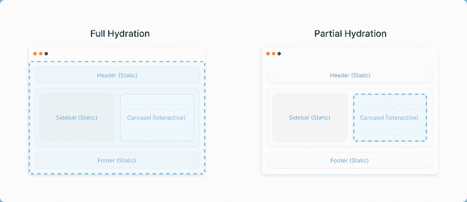

# 了解盖茨比 5 中的部分水合作用

> 原文：<https://blog.logrocket.com/understanding-partial-hydration-gatsby-5/>

在撰写本文时，Gatsby 的最新版本 v5 附带了部分水合功能。仍处于测试阶段，部分水合使您能够有选择地向完全静态的应用程序添加交互性，从而提高前端性能，同时仍保留客户端应用程序的优势。

在基于 React 的应用程序和网站中，所有的 JavaScript 代码都必须在页面变得可交互之前下载，这尤其会影响到交互的[时间](https://developer.chrome.com/en/docs/lighthouse/performance/interactive/) (TTI)指标。但是，由于 Gatsby 的部分水合，开发人员现在可以只水合 React 组件的必要 JavaScript 代码，从而减少 JavaScript 包的大小并提高页面速度。

在 React 中，[水合](https://www.gatsbyjs.com/docs/conceptual/react-hydration/)是使用客户端 JavaScript 向服务器呈现的 HTML 添加应用程序状态和交互性的过程。Gatsby 通过利用 React 服务器组件生成服务器组件的输出来实现部分水合，从页面级开始，一直到孤立的组件。在本文中，我们将探索 Gatsby 和 React 应用程序中的部分水合。

## 部分水合背后的动机

大多数 Gatsby 网站都是基于内容的，只需要几个部分是交互式的。然而，为了确保点击事件、效果和状态改变正确工作，我们必须下载处理这些事件的 JavaScript。不幸的是，这种行为会导致大量未使用的 JavaScript 代码被下载，使您的网站速度更慢、成本更高。在这里，部分水合作用就派上了用场。

根据 Gatsby 文档，部分水合对于具有交互组件的页面是有用的，其中一些组件需要页面上的交互性，而一些可以静态呈现，例如，具有大量静态内容和一些交互表单和按钮的产品页面。

看看下面这张来自 Gatsby 网站的图表。它解释了部分水合和完全水合之间的差异。

在这个虚构的页面中，组件大部分是静态的，除了 carousel，它是一个交互式组件。通常，当这个页面被加载时，我们会为静态的、不需要的站点部分请求 JavaScript 代码。然而，对于部分水合，我们只要求交互式组件的 JavaScript 代码:



## 什么是交互组件？

交互组件是包含`useEffect`、`useState`、`createContext`或事件处理程序的组件。类组件与服务器组件不兼容，也应该标记为交互式的。

## 《盖茨比》中如何使用部分水合

让我们通过一个例子来学习如何使用部分水合作用。要开始，安装最新版本的 Gatsby 和实验版本的 React 和`react-dom`:

```
npm install [email protected] [email protected] [email protected]

```

接下来，继续启用`gatsby-config`文件中的`PARTIAL_HYDRATION`标志:

```
//gatsby.config.js

flags: {
  PARTIAL_HYDRATION: true,
},

```

默认情况下，Gatsby 5 将每个组件视为一个服务器组件，从顶层页面开始，为每个页面生成 React 服务器组件(RSC)文件。因此，要告诉 Gatsby 启用组件的部分水合，您必须在组件的顶部添加指令[`"use client"`](https://github.com/reactjs/rfcs/blob/main/text/0227-server-module-conventions.md)，一个 RSC 约定:

```
// Component.js
"use client";

export function MyInteractiveComponent() {
  const [myState, setState] = useState(null);
  useEffect(() => { setTimeout(() => setState(‘interactive’) }, 3000)

  return <div>{myState}</div>
}

```

使用`"use client"`指令，组件将成为一个特殊的引用对象。不能在该文件中直接访问该对象，但是可以将它传递给 React，就像它是一个普通组件一样。然后，React 将知道将引用对象发送到客户机，客户机将在服务器上呈现为客户机组件。

你可以在[部分水合启动器](https://github.com/gatsbyjs/gatsby-partial-hydration-starter) GitHub 库中看到实现部分水合的完整例子。如果您导航到`[src/components/demo.js](https://github.com/gatsbyjs/gatsby-partial-hydration-starter/blob/main/src/components/demo.js)`文件，如下所示，您可以看到一个客户端部分水合的快速示例:

```
/**
 * To mark a component as client side, you add the "use client" directive.
 * @see {@link https://github.com/reactjs/rfcs/blob/serverconventions-rfc2/text/0000-server-module-conventions.md}
 */
"use client"

import React, { useCallback, useState } from "react"

export function Demo() {
  const [counter, setCounter] = useState(0)
  const onClick = useCallback(() => {
    setCounter(counter => counter + 1)
  }, [])
  return (
    <div style={{ marginTop: "10px", marginBottom: "10px" }}>
      <p style={{ margin: 0 }}>Current counter: {counter}</p>
      <button onClick={onClick}>Add counter</button>
    </div>
  )
}

```

在上面的代码块中，我们有一个带有按钮的简单组件，它将使用`useState`增加计数器。这个组件是交互式的，因为它使用了`useState`。该组件被导入并在`[src/pages/using-partial-hydration.js](https://github.com/gatsbyjs/gatsby-partial-hydration-starter/blob/main/src/pages/using-partial-hydration.js)`文件中使用，如下图所示:

```
import * as React from "react"
import { Link } from "gatsby"
import Layout from "../components/layout"
import Seo from "../components/seo"
import { Demo } from "../components/demo"

function usingPartialHydration() {
  return (
    <Layout>
      <h1>
        Gatsby supports <b>Partial Hydration</b>
      </h1>
      <p>
        You can now mark components as client side. This will reduce Javascript
        shipped to the user.
      </p>
      <p>
        The component below is such a component, if you check the Network Tab
        after a "gatsby build". You will see that we only load the component
        code and non of the layout
      </p>
      {/* Usage of the client component */}
      <Demo />
      <p>
        Checkout <a href="https://gatsby.dev/v5-partial-hydration">the RFC</a>{" "}
        to learn more.
      </p>
      <Link to="/">Go back to the homepage</Link>
    </Layout>
  )
}
export const Head = () => <Seo title="Using TypeScript" />

export default usingPartialHydration

```

除了`Demo`组件之外，这个`page`组件主要由一个内容填充页面组成。当 Gatsby 试图构建这个页面时，它将为该页面生成一个 RSC 文件。它不是在浏览器中获取`page`组件 JavaScript 文件，而是请求一个`page-data-rsc.json`文件。JSON 文件是 UI 的描述，任何客户端组件都作为一个包引用包含在内，以获取组件的实际代码。

目前，部分水合作用只在你为生产而建造时有效，即`gatsby build`或`gatsby serve`，而不是`gatsby develop`。当您运行`gatsby build`进行生产构建时，您应该在命令的输出中看到以下几行，这表示客户端组件在生产构建期间被部分水合:

```
success Building Partial Hydration renderer - 0.530s
...
success Building partial HTML for pages - 0.040s - 6/6 149.35/s

```

## 部分水合的已知问题

在撰写本文时，《盖茨比》中的部分水合作用仍处于测试阶段。让我们回顾一下你可能会遇到的一些目前已知的部分水合作用的问题。

### 样式库

当启用部分水合时，像`emotion`和`styled-components` [这样的样式库目前不工作](https://github.com/gatsbyjs/gatsby/discussions/36608#discussioncomment-3820128)。在撰写本文时，还不支持 React 服务器组件。

### `gatsby-plugin-offline`

[`gatsby-plugin-offline`](https://www.gatsbyjs.com/plugins/gatsby-plugin-offline/) 是用来让一个盖茨比的网站离线工作，更能抵御恶劣的网络连接。在部分水化的测试阶段，`gatsby-plugin-offline`不被支持，并且已经有[的报道称](https://github.com/gatsbyjs/gatsby/discussions/36608#discussioncomment-4027442)的盖茨比站点建设失败。

## 结论

为您的 Gatsby 站点设置部分水合将带来良好的用户体验，并显著提高页面加载速度。向客户端交付更少的 JavaScript 代码将直接影响您的性能分数，最显著的是交互测量的时间。

重要的是要记住，部分水合作用仍处于测试阶段。因此，在生产中使用它要自担风险，因为将来可能会有一些突破性的变化。

要了解更多关于盖茨比 5 的部分水合作用，请查看 [RFC](https://github.com/gatsbyjs/gatsby/discussions/36608) 和[概念指南](https://www.gatsbyjs.com/docs/conceptual/partial-hydration/)。我希望你喜欢这个教程，并快乐编码！

## 使用 LogRocket 消除传统反应错误报告的噪音

[LogRocket](https://lp.logrocket.com/blg/react-signup-issue-free)

是一款 React analytics 解决方案，可保护您免受数百个误报错误警报的影响，只针对少数真正重要的项目。LogRocket 告诉您 React 应用程序中实际影响用户的最具影响力的 bug 和 UX 问题。

[ ](https://lp.logrocket.com/blg/react-signup-general) [  ](https://lp.logrocket.com/blg/react-signup-general) [LogRocket](https://lp.logrocket.com/blg/react-signup-issue-free)

自动聚合客户端错误、反应错误边界、还原状态、缓慢的组件加载时间、JS 异常、前端性能指标和用户交互。然后，LogRocket 使用机器学习来通知您影响大多数用户的最具影响力的问题，并提供您修复它所需的上下文。

关注重要的 React bug—[今天就试试 LogRocket】。](https://lp.logrocket.com/blg/react-signup-issue-free)