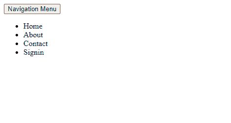
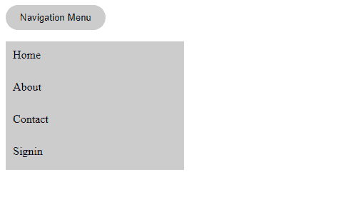
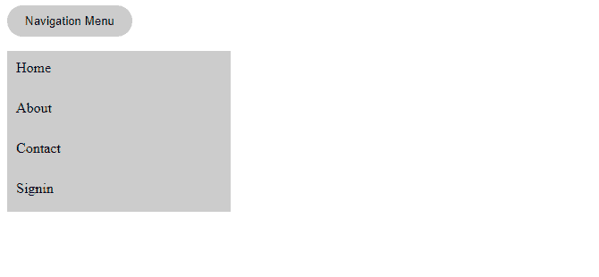

# 了解渐进式改进

> 原文：<https://blog.logrocket.com/understanding-progressive-enhancement/>

在 web 开发中，有几种内容分发的方法，但是大多数开发人员只是简单地采用静态或动态的内容交付，而没有考虑用户的可访问性。将可访问性放在网页设计的第一位是必须的，因为如果一个应用程序的内容是不可访问的，许多人将无法与该应用程序进行交互，不管它是静态的还是动态的。

许多开发人员创建 pwa(渐进式 web 应用程序)来为他们的用户创建可访问的、类似本机的体验，但是他们不明白它们是什么，也不明白为什么它们被称为“渐进式”我们将在本文后面讨论的短语“渐进增强”是受 PWA 中“渐进”的启发。作为一名开发人员，了解为什么渐进式改进是您的工具箱中的一项必要知识是很重要的。

在本文中，我们将回顾渐进式改进的基本原则，以及在 web 开发中使用它的相关性和批评。

### 内容

## 什么是渐进增强？

渐进式增强是一种 web 设计方法，可确保在拥有更高级浏览器功能和互联网连接的用户收到增强内容之前，web 应用程序的内容首先到达所有用户，无论他们的数字优势如何。

在“适度降级”中，网页内容旨在获得最佳体验，首先通过最新版本的浏览器交付给用户，然后降级以适应旧版本的浏览器。渐进增强则相反。

“表示和内容分离，内容和风格分离，或者语义和表示分离”的规则在标记界也被称为渐进增强。

## 渐进增强的核心原则

有许多指导方针可以帮助你坚持网页设计的渐进增强方法。它们如下:

首先，所有的网络浏览器都应该能够访问基本内容。有多种可用的 web 浏览器，每种浏览器都有自己的特性和功能。可能很难设计一个可以在所有不同浏览器上运行的网站。然而，有被所有浏览器接受的[全球网络标准](https://en.wikipedia.org/wiki/Web_standards)。

在实现新功能以探索特定浏览器之前，网站应该遵循 web 标准，以确保每个人都可以访问它们。

第二，基本功能和标准事件应该在所有 web 浏览器中都可用。在实现定制事件来处理高级功能之前，使用所有普通的 DOM 事件来管理用户在构建网站时的体验是至关重要的。

第三，所有内容都应该包含在最小的语义标记中。在网页设计中，关注内容传递而不是美学是至关重要的。网站的内容应该是正确的结构，如标准语义 HTML 所允许的。例如，代替文本的图片，合适的排版 HTML 语义可以用来显示文本。这增强了网站内容对那些可能无法查看图像的人的可访问性。

第四，外部连接的 JavaScript 应该提供增强的功能。使用第三方 JavaScript 库来提供扩展功能应该在网站证明它可以向无法访问此类第三方库的用户提供基本功能之后。即使某些 web 浏览器不支持 JavaScript，用户仍然应该能够访问一些信息并与之交互。

第五，外部连接的 CSS 应该提供改进的布局。用户应该能够看到没有任何 CSS 样式的网站，它仍然是像样的。CSS 样式的目的是改善网站的布局，并提供一些 HTML 无法提供的额外设计。CSS 的使用不应该被滥用来损害网站的可访问性。对于实验性的或非标准的样式属性，CSS 额外支持[供应商前缀](https://developer.mozilla.org/en-US/docs/Glossary/Vendor_Prefix)。

最后，应该尊重最终用户的网络浏览器偏好。用户应该能够使用他们希望的任何浏览器，而不应该被迫使用某个浏览器来访问网站内容。

## 渐进增强的实际例子

您是否遇到过这样的情况:当您的计算机连接到互联网时，网站功能可用，但当您的计算机与互联网断开时，网站功能不可用？这在渐进式 web 应用程序(PWAs)中很常见，这是渐进式增强的完美演示。

还有其他一些例子，比如客户端浏览器中没有启用 JavaScript 时的替代内容。在 Angular、Vue 或 React 等框架中，如果客户端浏览器中没有启用 JavaScript，则需要一个错误处理程序来显示应用程序中的替代内容。这是因为如果禁用 JavaScript，应用程序将无法正常运行，因此，开发人员不会让用户经历访问不完全正常运行的应用程序的痛苦，而是提供替代内容。

React 中的常见做法是添加一个带有消息的`noscript`标签，表明 JavaScript 是应用程序执行所必需的。这个标签可以在用`create-react-app`制作的应用的`public`文件夹中的`index.html`文件的`body`标签中找到。它看起来如下:

```
<body>
    <noscript>You need to enable JavaScript to run this app.</noscript>
    <div id="root"></div>
</body>

```

Web 字体是渐进增强的另一个例子。当自定义字体用于设计网站样式时，它们可能不被所有浏览器支持，或者可能需要很长时间来加载。如果自定义字体加载失败，开发人员会提供备用字体。

以下是导入替代字体的示例，但使用默认字体:

```
@import url(https://fonts.googleapis.com/css?family=Open+Sans);

body{
   font-family: 'Open Sans', sans-serif;
}

```

上面，我们导入了`Open Sans`，并将主体`font-family`设置为`Open Sans, sans-serif`。添加到字体列表中的`sans-serif`，是一种几乎所有浏览器都支持的通用字样。如果导入的字体(`Open Sans`)加载失败，则`font-family`将变为`san-serif`。

我们最后一个渐进增强的例子是 HTML5。当使用 HTML5 视频元素时，您可以定义当浏览器不支持视频或文件类型时将显示的文本。这通常是通过在开始和结束标记之间插入文本来实现的，如下所示:

```
<video width="320" height="240" controls>
  <source src="movie.mp4" type="video/mp4">
  Your browser does not support the video tag.
</video>   

```

如果您的浏览器不支持视频元素，则“您的浏览器不支持视频标签”的字样将出现在视频的部分。

## 为什么您应该对您的 web 应用程序应用渐进式改进

当谈到在线内容交付时，可能会出现各种各样的挑战，这些挑战可能是由用户或开发人员引起的。渐进式改进是一种解决方案，旨在减轻这些问题的后果，或者至少为最终用户提供一些(如果不是全部)信息。

* * *

### 更多来自 LogRocket 的精彩文章:

* * *

考虑进行渐进式改进的其他原因包括:

*   改进的 SEO:在网站上正确使用 HTML 语义将提高该网站的 SEO，因为屏幕阅读器、网络蜘蛛和搜索引擎将更容易访问这些信息
*   改进的兼容性和可访问性:网站的内容应该能够在各种设备上加载，因此如果用户的设备或浏览器不支持用于开发网站的语言，错误将会减少
*   简单的可伸缩性:网站应该达到最广泛的受众，同时仍然提供足够的信息。程序员应该确保他们能够在向用户传递信息的同时增加工作量
*   提高速度和用户体验:使用合适的语义提高了内容加载的速度，当网站快速加载内容时，用户体验得到了增强

## 如何实现渐进式增强

网页设计中渐进式改进的基本原则是，如果网页设计的上层不可用，为用户提供他们需要的适当内容。

例如，假设我们有一个用 JavaScript 作为第三层，CSS 作为第二层，HTML 作为第一层设计的站点。即使没有 JavaScript，网站设计也应该工作良好，这意味着 JavaScript 只是对已经正常工作的网站的补充。

让我们用一个示例下拉按钮来看看它是如何工作的。

### 第一层:HTML

这一层是语义标记，允许基于文本的老式浏览器、屏幕阅读器和用户代理正确地浏览和访问网站内容。

对于下拉按钮，这里有一个语义标记的例子:

```
<!DOCTYPE html>
<html lang="en">
<head>
    <meta charset="UTF-8">
    <meta http-equiv="X-UA-Compatible" content="IE=edge">
    <meta name="viewport" content="width=device-width, initial-scale=1.0">
    <title>Dropdown</title>
</head>
<body>
    <button id="dropbtn">Navigation Menu</button>
    <ul id="ul">
        <li><a href="/home"></a>Home</li>
        <li><a href="/about"></a>About</li>
        <li><a href="/contact"></a>Contact</li>
        <li><a href="/signin"></a>Signin</li>
    </ul>
</body>
</html>  

```

下拉菜单组织在一个无序的列表中，按钮目前不起作用。因此，菜单列表将保持静态，不能折叠或展开。

当您在浏览器中运行上述代码时，应该会看到以下内容:



### 第二层:CSS

这是附加功能的初始层。CSS 可能会也可能不会给网页带来功能；它主要用于组织和增强布局，以使网站在视觉上更具吸引力。

CSS 增强的一个示例如下:

```
<style>
    button {
        border-radius: 20px;
        border: none;
        padding: 10px 20px;
        cursor: pointer;
        background: #ccc;
        transition: all ease 0.2s;
    }
    button:hover {
        box-shadow: 2px 2px 4px rgb(90, 90, 90);
        filter: invert(1);
    }
    ul {
        list-style: none;
        padding: 0px;
        width: 250px;
    }
    .active {
        height: 0px;
        overflow-y: auto;
    }
    li {
        height: 25px;
        padding: 10px;
        background-color: #ccc;
    }
    li:hover {
        filter: invert(1);
    }
    li a {
        height: 100%;
        width: 100%;
        color: black;
        text-decoration: none;
    }
</style>

```

在网页的`head`和`body`标签之间添加 CSS 样式后，下拉列表应该是这样的:



### 第三层:JavaScript

这一层是功能层；我们可以选择以任何我们想要的方式操作 DOM 来产生新的用户体验，但是这不是必需的。

没有这一层 JavaScript，我们的下拉菜单仍然是可访问的。让我们来看看添加了附加功能脚本后会是什么样子。

下面是我们的下拉菜单可能具有的 JavaScript 功能的一个示例:

```
<script>
    window.addEventListener('load', () => {
        dropDownMenu = document.querySelector('#ul')
        btn = document.querySelector('#dropbtn')

        dropDownMenu.classList.add('closed')
        btn.addEventListener('click', (e) => {
            e.preventDefault()
            dropDownMenu.classList.toggle('closed')
        })
    })
</script>

```

在上面的代码中，我们监听`window.onload`事件，然后使用`querySelector`来选择`dropDownMenu`和`btn`。然后我们将默认的类`closed`添加到`dropDownMenu`来折叠它。每当点击`btn`时，就会切换`closed`类。

在网页的`body`结束标签之前添加了这个脚本，当页面加载到浏览器中时，下拉列表应该是这样的:


菜单列表被折叠；但是，如果您点击**导航条** u 按钮，菜单列表将展开如下:



我们仍然能够在添加每一层增强功能之前提供对菜单列表的访问，尽管这是一种非常用户友好的体验。

## 对渐进增强的批评

尽管这个概念看起来很吸引人，但是对于渐进式改进仍然有许多相反的观点。

一些人认为这是浪费时间，而其他人认为用户应该升级他们的浏览器以符合网站的标准。渐进式增强还被认为是针对那些故意在浏览器中禁用 JavaScript 的用户，这是不正确的。不管 JavaScript 是否被有意禁用，用户应该能够查看网站的内容。

其他人认为渐进式增强只在过时的浏览器中可用。但是用户可以使用他们喜欢的任何浏览器，不管它是旧的还是新的。开发者有责任确保网站与任何试图访问网站内容的浏览器兼容。

## 结束语

渐进式改进更关注网站的长期生存能力。如果您使用这种方法，将来扩展和过渡到更好的框架和技术会更容易。

我希望读者能够理解渐进增强的概念，并开始付诸实践。为了测试您对渐进式增强的了解，创建一个渐进式 web 应用程序(PWA ),并评估它是否符合本文中讨论的渐进式增强标准。

## 使用 [LogRocket](https://lp.logrocket.com/blg/signup) 消除传统错误报告的干扰

[](https://lp.logrocket.com/blg/signup)

[LogRocket](https://lp.logrocket.com/blg/signup) 是一个数字体验分析解决方案，它可以保护您免受数百个假阳性错误警报的影响，只针对几个真正重要的项目。LogRocket 会告诉您应用程序中实际影响用户的最具影响力的 bug 和 UX 问题。

然后，使用具有深层技术遥测的会话重放来确切地查看用户看到了什么以及是什么导致了问题，就像你在他们身后看一样。

LogRocket 自动聚合客户端错误、JS 异常、前端性能指标和用户交互。然后 LogRocket 使用机器学习来告诉你哪些问题正在影响大多数用户，并提供你需要修复它的上下文。

关注重要的 bug—[今天就试试 LogRocket】。](https://lp.logrocket.com/blg/signup-issue-free)