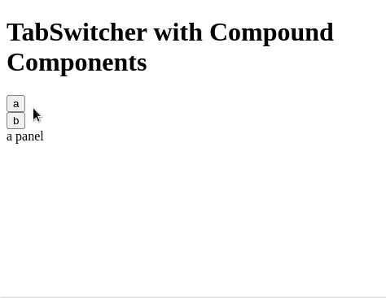

# 了解 React 复合组件- LogRocket 博客

> 原文：<https://blog.logrocket.com/understanding-react-compound-components/>

***编者按:**这篇文章于 2021 年 11 月 5 日进行了审查和更新，提供了相关信息和代码块。*

复合组件是一种高级模式，因此使用起来可能会有些力不从心。本指南旨在帮助您理解该模式，以便您能够自信而清晰地有效使用它。在本文中，我们将使用[上下文 API。](https://reactjs.org/docs/context.html)

### React 中的复合成分是什么？

复合组件是一种模式，在这种模式中，组件一起使用，从而共享一种隐式状态，使它们可以在后台相互通信。

换句话说，当多个组件一起工作以具有共享状态并一起处理逻辑时，它们被称为复合组件。

> 想想 HTML 中的复合组件，如`*<select>*`和`*<option>*`元素。分开时，它们不会做太多，但合在一起时，它们能让你创造完整的体验。— [肯特·c·多兹](https://blog.kentcdodds.com/advanced-react-component-patterns-56af2b74bc5f)

当你点击一个选项时，`select`知道你点击了哪个`option`。像`select`和`option`一样，组件自己共享状态，所以你不必显式地配置它们。

### 复合组分的例子

```
<TabSwitcher>
  <header>
    <ul className="tablist">
      <li>
        <Tab id="a">
          <button>Tab A</button>
        </Tab>
      </li>
      <li>
        <Tab id="b">
          <button>Tab B</button>
        </Tab>
      </li>
    </ul>
  </header>
  <main>
    <TabPanel whenActive="a">
      <div>
        a panel
      </div>
    </TabPanel>

    <TabPanel whenActive="b">
      <div>
        b panel
      </div>
    </TabPanel>
  </main>
</TabSwitcher>
```

当您点击`Tab`组件内的按钮时，相应选项卡面板的内容被渲染。此外，请注意，我们正在使用多个组件来创建一个复合组件。因此，这有助于代码的可重用性。

### 为什么我有渲染道具还需要它？

渲染道具是一个很好的模式。它功能多样，易于理解。然而，这并不意味着我们必须在任何地方都使用它。如果使用不慎，可能会导致代码混乱。

在标记中有太多的嵌套函数会使阅读变得困难。记住，没有什么是银弹，即使是渲染道具。

### 使用复合组件模式的优势

通过看这个例子，使用复合组件的一些优点是非常明显的。

例如，开发人员拥有标记。`TabSwitcher`的实现不需要固定的标记结构。你可以做任何你想做的事情，嵌套一个 10 层深的标签(我不是在评判)，它仍然可以工作。因为它们是复合在一起的，所以它们可以无缝地相互共享状态数据

此外，开发人员可以按任何顺序重新排列组件。假设您希望`Tabs`位于`Tab Panels`的下方。组件实现中不需要任何改变，我们只需要在标记中重新排列组件

最后，组件不必明确地挤在一起。它们可以独立编写，但仍然能够交流。在这个例子中，`Tab`和`TabPanel`组件没有直接连接，但是它们能够通过它们的父`TabSwitcher`组件进行通信。

### 复合组件如何工作

*   父组件(`TabSwitcher`)有一些状态
*   使用上下文 api，`TabSwitcher`与子组件共享它的状态和方法。在这种情况下，我们的子组件是`Tab`和`TabPanel`
*   子组件`Tab`使用共享方法与`TabSwitcher`通信
*   子组件`TabPanel`使用共享状态来决定是否应该呈现其内容

### 在 React 中实现`TabSwitcher`复合组件

为了实现复合组件，我通常遵循以下步骤。

1.  列出所需的组件
2.  写样板文件
3.  实现单个组件

#### 列出所需的组件

对于`TabSwitcher`，我们需要有两样东西。首先，您需要知道显示哪个选项卡内容，其次，它应该在用户单击时切换选项卡面板。

这意味着我们需要控制选项卡面板内容的呈现，并在选项卡上有一个单击事件监听器，所以当单击`Tab`时，相应的选项卡面板内容就会显示出来。

为此，我们需要三个组件:

1.  `TabSwitcher`:保持状态的父组件
2.  `Tab `:告诉其父组件它是否被点击的组件
3.  `TabPanel`:当父元素告诉组件呈现时，组件呈现

#### 写样板文件

复合组件模式有一些样板代码。这很好，因为在大多数情况下，我们可以不用想太多就能写出来。

```
import React, { useState, createContext, useContext } from "react";

//the name of this context will be DataContext
const DataContext = createContext({});

function Tab({ id, children }) {
  //extract the 'setActiveTabID` method from the DataContext state.
  const [, setActiveTabID] = useContext(DataContext);
  return (
    <div>
      <div onClick={() => setActiveTabID(id)}>{children}</div>
    </div>
  );
}
function TabPanel({ whenActive, children }) {
  //get the 'activeTabID' state from DataContext.
  const [activeTabID] = useContext(DataContext);
  return <div>{activeTabID === whenActive ? children : null}</div>;
}

function TabSwitcher(props) {
  const [activeTabID, setActiveTabID] = useState("a");
  //since this component will provide data to the child components, we will use DataContext.Provider
  return (
    <DataContext.Provider value={[activeTabID, setActiveTabID]}>
      {props.children}
    </DataContext.Provider>
  );
}

export default TabSwitcher;
export { Tab, TabPanel };
```

在这里，我们正在创造一个环境。子组件将从上下文中获取数据和方法。数据将是由父节点共享的状态，方法将用于将状态的改变传递回父节点。

#### 实现单个组件

`Tab`组件需要监听点击事件，并告诉父组件哪个标签被点击了。它可以这样实现:

```
function Tab({ id, children }) {
  //extract the 'setActiveTabID` method from the DataContext state.
  const [, setActiveTabID] = useContext(DataContext);
  return (
    <div>
      <div onClick={() => setActiveTabID(id)}>{children}</div>
    </div>
  );
}

```

选项卡组件接受`id`属性和点击事件调用`setActiveTabID`方法，并传递其 id。这样，家长就知道哪个`Tab`被点击了。

只有当组件是活动面板时，它才需要呈现其子组件。它可以这样实现:

```
function TabPanel({ whenActive, children }) {
  //get the 'activeTabID' state from DataContext.
  const [activeTabID] = useContext(DataContext);
  return <div>{activeTabID === whenActive ? children : null}</div>;
}

```

`TabPanel`接受`whenActive`道具，告诉它什么时候渲染孩子。上下文提供了`activeTabId`，通过它`TabPanel`决定是否应该渲染其子节点。`TabSwitcher`需要维护活动标签状态，并将状态和方法传递给子组件。

```
function TabSwitcher(props) {
  const [activeTabID, setActiveTabID] = useState("a");
  //since this component will provide data to the child components, we will use DataContext.Provider
  return (
    <DataContext.Provider value={[activeTabID, setActiveTabID]}>
      {props.children}
    </DataContext.Provider>
  );
}

```

`TabSwitcher`组件存储`activeTabID`。默认情况下，是`a`。因此，第一个面板最初是可见的。它有一个用于更新`activeTabID`状态的方法。`TabSwitcher`把状态和方法分享给消费者。

让我们看看它们是如何组合在一起的。

```
import React, { useState, createContext, useContext } from "react";

//the name of this context will be DataContext
const DataContext = createContext({});

function Tab({ id, children }) {
  //extract the 'setActiveTabID` method from the DataContext state.
  const [, setActiveTabID] = useContext(DataContext);
  return (
    <div>
      <div onClick={() => setActiveTabID(id)}>{children}</div>
    </div>
  );
}
function TabPanel({ whenActive, children }) {
  //get the 'activeTabID' state from DataContext.
  const [activeTabID] = useContext(DataContext);
  return <div>{activeTabID === whenActive ? children : null}</div>;
}

function TabSwitcher(props) {
  const [activeTabID, setActiveTabID] = useState("a");
  //since this component will provide data to the child components, we will use DataContext.Provider
  return (
    <DataContext.Provider value={[activeTabID, setActiveTabID]}>
      {props.children}
    </DataContext.Provider>
  );
}

export default TabSwitcher;
export { Tab, TabPanel };

```

复合组件可以这样使用:

```
import TabSwitcher, { Tab, TabPanel } from "./TabSwitcher";

function App() {
  return (
    <div className="App">
      <h1>TabSwitcher with Compound Components</h1>
      <TabSwitcher>
        <Tab id="a">
          <button>a</button>
        </Tab>
        <Tab id="b">
          <button>b</button>
        </Tab>

        <TabPanel whenActive="a">
          <div>a panel</div>
        </TabPanel>

        <TabPanel whenActive="b">
          <div>b panel</div>
        </TabPanel>
      </TabSwitcher>
    </div>
  );
}
export default App;

```

这将是输出:



这就是你对化合物组分进行反应的快速指南。感谢阅读！

## [LogRocket](https://lp.logrocket.com/blg/react-signup-general) :全面了解您的生产 React 应用

调试 React 应用程序可能很困难，尤其是当用户遇到难以重现的问题时。如果您对监视和跟踪 Redux 状态、自动显示 JavaScript 错误以及跟踪缓慢的网络请求和组件加载时间感兴趣，

[try LogRocket](https://lp.logrocket.com/blg/react-signup-general)

.

[ ](https://lp.logrocket.com/blg/react-signup-general) [](https://lp.logrocket.com/blg/react-signup-general) 

LogRocket 结合了会话回放、产品分析和错误跟踪，使软件团队能够创建理想的 web 和移动产品体验。这对你来说意味着什么？

LogRocket 不是猜测错误发生的原因，也不是要求用户提供截图和日志转储，而是让您回放问题，就像它们发生在您自己的浏览器中一样，以快速了解哪里出错了。

不再有嘈杂的警报。智能错误跟踪允许您对问题进行分类，然后从中学习。获得有影响的用户问题的通知，而不是误报。警报越少，有用的信号越多。

LogRocket Redux 中间件包为您的用户会话增加了一层额外的可见性。LogRocket 记录 Redux 存储中的所有操作和状态。

现代化您调试 React 应用的方式— [开始免费监控](https://lp.logrocket.com/blg/react-signup-general)。

* * *