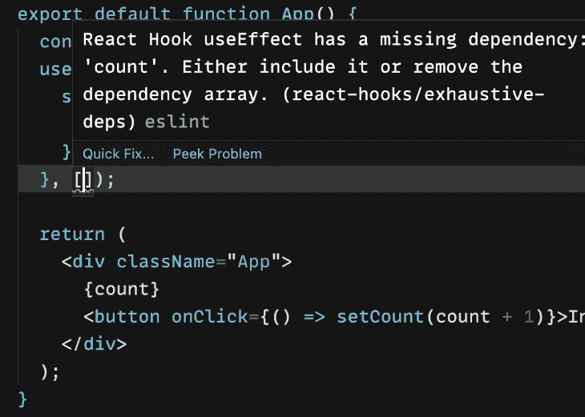

# 了解 React exhaustive-deps 林挺警告-日志火箭博客

> 原文：<https://blog.logrocket.com/understanding-react-exhaustive-deps-linting-warning/>

## 目录

当您在 React 中从使用类组件转向使用功能组件时，这可能会是一段不平坦的旅程。你必须学会如何使用 React 钩子。最有可能你学的第一个是`useState`。没有大问题，因为它的工作方式与`setState`相似。

但是之后你必须基于 prop 更新状态，这意味着是时候尝试`useEffect`了。起初，这看起来也很简单:你阅读了依赖数组，它是有意义的。但是使用`useEffect`的时候也很容易拐错弯。让我们看一个例子。

```
const App = () => {
   const [randomNumber, setRandomNumber] = useState();
   React.useEffect(() => {
     setRandomNumber(Math.random());
   }, [randomNumber]);
 }

```

上面代码中的错误非常明显，你可以在这里看到结果。上面的代码创建了一个无限循环。但是用`useEffect`犯错误的另一种方式是创建一个陈旧的闭包，这可能更难发现并导致难以跟踪的问题。

当`useEffect`中的变量从不更新时，就会发生这种情况。有时候这是你想要的，但大多数时候，你并不需要。下面是一个陈旧闭包的例子。

```
const App() {
  const [count, setCount] = useState(0);
  useEffect(function () {
    setInterval(function log() {
      console.log(`Count is: ${count}`);
    }, 2000);
  }, []);

  return (
    <div className="App">
      {count}
      <button onClick={() => setCount(count + 1)}>Increase</button>
    </div>
  );
}

```

你可以在这里看到这段代码运行[。当您单击按钮时，组件中呈现的`count`变量会更新，但是每两秒记录在`useEffect`中的值会一直保持为`0`。我们预料到了这一点，但是随着您的代码变得越来越复杂，发现问题可能会更加困难。幸运的是，在它变成 bug 之前，您可以使用 ESlint 插件来找到它。](https://codesandbox.io/s/exhaustive-deps-linting-warnings-2-f8n2ek)

## 什么是穷举 deps lint 规则？

如果您将鼠标悬停在[代码示例](https://codesandbox.io/s/exhaustive-deps-linting-warnings-2-f8n2ek?file=/src/App.js)中依赖数组下的曲线上，您将会看到 lint 为什么生气。



您将看到 lint 为您提供了几个选项:要么将`count`添加到依赖关系数组，要么完全删除依赖关系数组。如果删除依赖数组，里面的函数将在每次渲染时运行。我想这没什么，但它首先违背了拥有`useEffect`的目的。

显而易见的答案是将`count`变量添加到依赖数组中。在 [VS 代码中，](https://blog.logrocket.com/writing-vs-code-extensions-in-javascript/)带有 ESlint 扩展，在其他具有类似功能的 ide 中，你可以点击**快速修复**链接，`count`将会为你添加到依赖数组中。

林挺很有争议。大多数开发人员认为应该这样做，但是他们在如何做的问题上存在广泛的分歧。许多规则，比如关于缩进、花括号的间距以及其他规则，更多的是关于可读性，而不是确保良好的代码。

但是`[eslint-plugin-react-hooks](https://www.npmjs.com/package/eslint-plugin-react-hooks)`可以防止你在 React 钩子上犯错误，这些钩子很难跟踪和调试。这个 ESlint 插件将确保你遵循 React 代码中的钩子规则，它们是:

*   只调用顶层的钩子
*   仅从 React 函数调用挂钩

它还会检查挂钩中的依赖数组，以确保您从它们那里获得了预期的功能。

## 如何将此规则添加到 React 项目中

如果你正在使用 Create React App，那么 React Hooks 的 ESlint 插件已经默认包含在内了。要将其添加到现有项目中，只需用 npm 或 yarn 安装即可。

```
npm install eslint-plugin-react-hooks --save-dev
yarn add eslint-plugin-react-hooks --dev

```

接下来，将以下内容添加到 ESlint 配置中:

```
// ESLint configuration
{
  "plugins": [
    // ...
    "react-hooks"
  ],
  "rules": {
    // ...
    "react-hooks/rules-of-hooks": "error", // For checking rules of hooks
    "react-hooks/exhaustive-deps": "warn" // For checking hook dependencies 
  }
}

```

您还需要将 ESlint 扩展添加到您的 IDE 中，以便更容易地更正警告。对于 VS 代码，你可以使用这个[扩展](https://marketplace.visualstudio.com/items?itemName=dbaeumer.vscode-eslint)，对于 Atom，你可以使用这个[扩展](https://atom.io/packages/linter-eslint)。

## 如何修复详尽的 deps 警告

一旦您的 ESlint 配置中有了详尽的 deps 规则，您可能会遇到一些警告，这些警告可能比我们的第一个示例需要更多的思考。你可以在 [GitHub](https://github.com/facebook/react/issues/14920) 上找到一长串关于这条规则的评论，使用这条规则的开发者不太确定为什么他们会得到警告或者如何修复它。

我们得到的第一个详尽的 deps 警告是因为依赖数组中缺少一个原始变量。

```
const App() {
  const [count, setCount] = useState(0);
  useEffect(function () {
    console.log(`Count is: ${count}`);
  }, []);

  return (
    <div className="App">
      {count}
      <button onClick={() => setCount(count + 1)}>Increase</button>
    </div>
  );
}

```

很容易看出为什么会有警告，以及为什么通过在 IDE 中单击**快速修复**得到的修复会起作用。添加 count 变量将修复该问题，并且不会导致任何奇怪的问题。但有时，建议的解决方案在您使用之前必须经过检查。

### 使用对象和数组

```
export default function App() {
  const [address, setAddress] = useState({ country: "", city: "" });

  const obj = { country: "US", city: "New York" };

  useEffect(() => {
    setAddress(obj);
  }, []);

  return (
    <div>
      <h1>Country: {address.country}</h1>
      <h1>City: {address.city}</h1>
    </div>
  );
}

```

你可以在这里看到这段代码。注意，有一个关于依赖数组需要`obj`变量的警告。奇怪！它总是相同的值，那么为什么会发生这种情况呢？

JavaScript 中的对象和数组是通过引用进行比较的，而不是通过值。每次组件呈现时，该对象都具有相同的值，但引用不同。如果变量是一个数组，也会发生同样的事情。

要消除警告，您可以将`obj`变量添加到数组中，但这意味着`useEffect`中的函数将在每次渲染时运行。这也是点击**快速修复**将会做的，而不是你真正想要的应用程序如何运行。一种解决方案是在依赖数组中使用对象的属性。

```
  useEffect(() => {
    setAddress(obj);
  }, [obj.city]);

```

另一个选择是使用`useMemo`钩子来获取对象的内存值。

```
const obj = useMemo(() => {
    return { country: 'US', city: 'New York' };
  }, []);

```

你也可以将`obj`变量移入`useEffect`或者移出组件来移除警告，因为在这些位置，它不会在每次渲染时被重新创建。

```
// Move it here
// const obj = { country: "US", city: "New York" };
export default function App() {
  const [address, setAddress] = useState({ country: "", city: "" });

  const obj = { country: "US", city: "New York" };

  useEffect(() => {
    // Or here
    // const obj = { country: "US", city: "New York" };

    setAddress(obj);
  }, []);

  return (
    <div>
      <h1>Country: {address.country}</h1>
      <h1>City: {address.city}</h1>
    </div>
  );
}

```

上面的例子展示了当一个依赖数组警告看起来没有意义时，修复它的可能方法。这里有一个你可能想在你的代码中寻找的例子。

您确实想在不禁用 lint 规则的情况下修复警告，但是，就像上面的例子一样，这会导致`useEffect`中的函数不必要地运行来使用 lint 建议。在本例中，我们将道具传递到组件中:

```
import { getMembers } from '../api';
import Members from '../components/Members';

const Group = ({ group }) => {
  const [members, setMembers] = useState(null);

  useEffect(() => {
    getMembers(group.id).then(setMembers);
  }, [group]);

  return <Members group={group} members={members} />
}

```

如果`group`道具是一个对象，React 会检查当前渲染是否指向上一次渲染中的同一个对象。所以，即使对象是相同的，如果为后续的渲染创建了一个新的对象，`useEffect`将会运行。

我们可以通过检查`group`对象中我们知道会改变的特定属性来解决这个问题。

```
useEffect(() => {
    getMembers(group.id).then(setMembers);
  }, [group.id]);

```

如果任何值可能改变，您也可以使用`useMemo`钩子。

```
import { getMembers, getRelatedNames } from '../api';
import Members from '../components/Members';

const Group = ({ id, name }) => {
  const group = useMemo(() => () => return { id, name }, [
    id,
    name,
  ]);
  const [members, setMembers] = useState(null);
  const [relatedNames, setRelatedNames] = useState(null);

  useEffect(() => {
    getMembers(id).then(setMembers);
    getRelatedNames(names).then(setRelatedNames);
  }, []);

  return <Members group={group} members={members} />
}

```

这里，`id`或`name`值改变时，`group`变量会更新，而`useEffect`只有在`group`常量改变时才会运行。我们也可以简单地将这些值添加到依赖数组中，而不是使用`useMemo`。

### 处理缺失的功能

有时 lint 警告会告诉您数组中缺少一个函数。这将在它可能关闭状态的任何时候发生。这里有一个例子。

```
const App = ({ data }) => {
  const logData = () => {
    console.log(data);
  }

  useEffect(() => {
    logData();
  }, [])
}

```

这段代码会有一个 lint 警告，你可以在这里看到，建议你将`logData`添加到依赖数组中。这是因为它使用了可以改变的`data`道具。要解决这个问题，您可以按照建议将其添加到依赖关系数组中，或者执行以下操作:

```
const App = ({ data }) => {
  useEffect(() => {
    const logData = () => {
      console.log(data);
    }

    logData();
  }, [])
}

```

## 结论

由于 React Hooks 的复杂性和难以发现的问题，如果你在开发应用程序时走错了方向，那么添加详尽的 deps lint 规则以及 Hooks 规则是必要的。这些规则会节省你的时间，并在你做错的时候立即告诉你。

使用正确的 IDE 扩展，甚至可以为您解决问题。虽然“快速修复”解决方案经常有效，但是您应该始终检查您的代码，以了解为什么会出现警告。这样，如果你想防止不必要的渲染，你会找到最好的解决方案，甚至可能找到更好的解决方案。

## [LogRocket](https://lp.logrocket.com/blg/react-signup-general) :全面了解您的生产 React 应用

调试 React 应用程序可能很困难，尤其是当用户遇到难以重现的问题时。如果您对监视和跟踪 Redux 状态、自动显示 JavaScript 错误以及跟踪缓慢的网络请求和组件加载时间感兴趣，

[try LogRocket](https://lp.logrocket.com/blg/react-signup-general)

.

[ ](https://lp.logrocket.com/blg/react-signup-general) [](https://lp.logrocket.com/blg/react-signup-general) 

LogRocket 结合了会话回放、产品分析和错误跟踪，使软件团队能够创建理想的 web 和移动产品体验。这对你来说意味着什么？

LogRocket 不是猜测错误发生的原因，也不是要求用户提供截图和日志转储，而是让您回放问题，就像它们发生在您自己的浏览器中一样，以快速了解哪里出错了。

不再有嘈杂的警报。智能错误跟踪允许您对问题进行分类，然后从中学习。获得有影响的用户问题的通知，而不是误报。警报越少，有用的信号越多。

LogRocket Redux 中间件包为您的用户会话增加了一层额外的可见性。LogRocket 记录 Redux 存储中的所有操作和状态。

现代化您调试 React 应用的方式— [开始免费监控](https://lp.logrocket.com/blg/react-signup-general)。