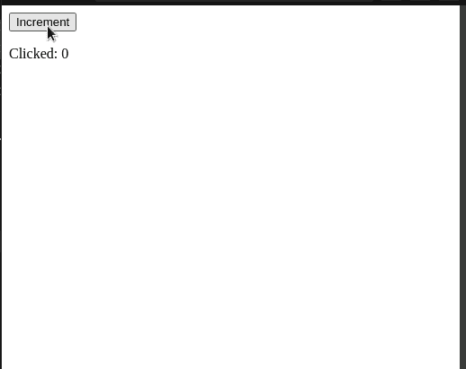
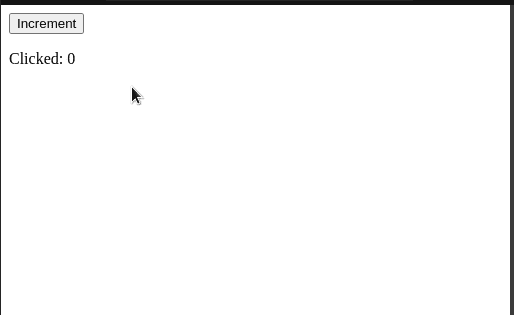
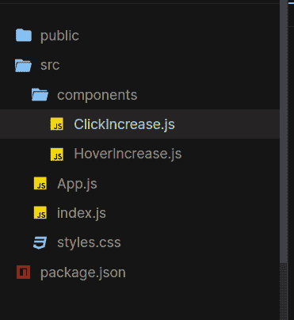
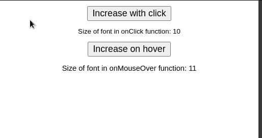
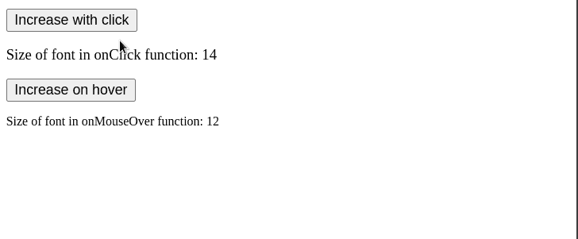
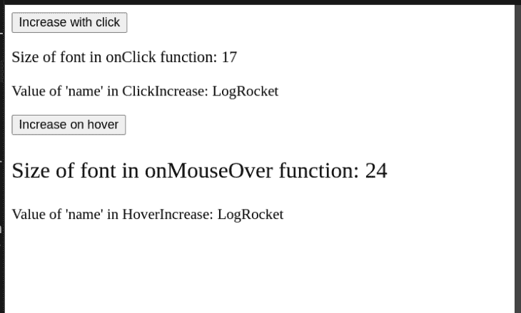
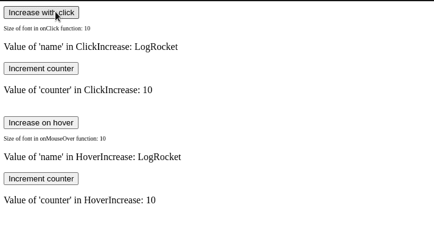
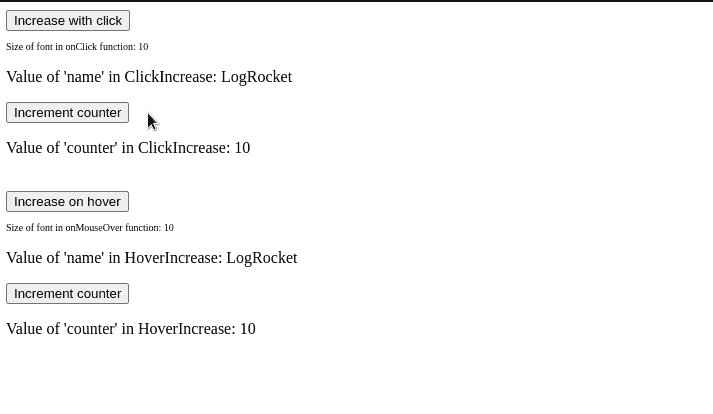

# 了解 React 高阶组件

> 原文：<https://blog.logrocket.com/understanding-react-higher-order-components/>

在本文中，我们将介绍 React 的 HOC 概念的基础，包括向您介绍高阶组件，教您语法，并向您展示如何应用 HOC。我们还将讨论高阶元件可能遇到的一些常见问题。

以下是我们将采取的步骤:

## 介绍

### 什么是 hoc，什么时候应该使用？

假设用户想要一个组件，它在每个`onClick`事件上增加一个计数器变量:

```
function ClickCounter() {
  const [count, setCount] = useState(0); //default value of this state will be 0.
  return (
    <div>
      {/*When clicked, increment the value of 'count'*/}
      <button onClick={() => setCount((count) => count + 1)}>Increment</button>
      <p>Clicked: {count}</p> {/*Render the value of count*/}
    </div>
  );
}
export default ClickCounter;

```



我们的代码有效！然而，考虑一下这种情况:如果客户想要包含相同功能的另一个组件，但是它在一个`onMouseOver`事件上触发了，该怎么办？

为了实现这一点，我们必须编写以下代码:

```
function HoverCounter(props) {
  const [count, setCount] = useState(0);
  return (
    <div>
      {/*If the user hovers over this button, then increment 'count'*/}
      <button onMouseOver={() => setCount((count) => count + 1)}>
        Increment
      </button>
      <p>
        Clicked: {count}
      </p>
    </div>
  );
}
export default HoverCounter;

```



尽管我们的代码示例是有效的，但是有一个主要问题:这两个文件拥有相似的代码逻辑。

因此，这打破了[干的概念](https://thevaluable.dev/dry-principle-cost-benefit-example/)。那么我们如何解决这个问题呢？

这就是 HOCs 的用武之地。这里，高阶组件允许开发人员在他们的项目中重用代码逻辑。因此，这意味着更少的重复和更优化的可读代码。

现在我们已经介绍了它的优点，让我们开始使用 HOCs 吧！

### 句法

根据 [React 的文档](https://reactjs.org/docs/higher-order-components.html)，典型的 React HOC 具有以下定义:

> 高阶分量是接收一个分量并返回一个新分量的函数。

使用代码，我们可以像这样重写上面的语句:

```
const newComponent = higherFunction(WrappedComponent);

```

在这一行:

*   `newComponent` —将是增强组件
*   `higherFunction` —顾名思义，该功能将增强`WrappedComponent`
*   `WrappedComponent` —我们想要扩展其功能的组件。换句话说，这将是我们想要增强的组件

在本文的下一部分，我们将看到 React 的 HOC 概念的实际应用。

## 使用 hoc

### 初始化我们的存储库

在编写一些代码之前，我们必须首先创建一个空白的 React 项目。为此，首先编写以下代码:

```
npx create-react-app hoc-tutorial 
cd hoc-tutorial #navigate to the project folder.
cd src #go to codebase
mkdir components #will hold all our custom components

```

对于本文，我们将构建两个定制组件来演示特殊用法:

*   这个组件将呈现一个按钮和一段文本。当用户点击这个按钮时(一个`onClick`事件)，文本的`fontSize`属性将增加
*   `HoverIncrease.js` —与`ClickIncrease`相似。然而，与前者不同，这个组件将监听`onMouseOver`事件

在您的项目中，导航到`components`文件夹。在这里，创建这两个新文件。

完成后，您的文件结构应该如下所示:



既然我们已经为项目奠定了基础，那么是时候构建我们的定制组件了。

### 编写我们的组件

在`ClickIncrease.js`中，开始编写以下代码:

```
//file name: components/ClickIncrease.js
function ClickIncrease() {
  const [fontSize, setFontSize] = useState(10); //set initial value of Hook to 10.
  return (
    <div>
      {/*When clicked, increment the value of fontSize*/}
      <button onClick={() => setFontSize((size) => size + 1)}>
        Increase with click
      </button>
      {/*Set the font size of this text to the fontSize variable.*/}
      {/*Furthermore, display its value as well.*/}
      <p style={{ fontSize }}>Size of font in onClick function: {fontSize}</p>
    </div>
  );
}
export default ClickIncrease;

```

接下来，在您的`HoverIncrease`组件中，粘贴以下代码行:

```
function HoverIncrease(props) {
  const [fontSize, setFontSize] = useState(10);
  return (
    <div>
      {/*This time, instead of listening to clicks,*/}
      {/*Listen to hover events instead*/}
      <button onMouseOver={() => setFontSize((size) => size + 1)}>
        Increase on hover
      </button>
      <p style={{ fontSize }}>
        Size of font in onMouseOver function: {fontSize}
      </p>
    </div>
  );
}
export default HoverIncrease;

```

最后，将这些函数呈现给 GUI，如下所示:

```
//import both components
import ClickIncrease from "./components/ClickIncrease"; 
import HoverIncrease from "./components/HoverIncrease";
export default function App() {
  return (
    <div className="App">
      {/*Render both of these components to the UI */}
      <ClickIncrease />
      <HoverIncrease />
    </div>
  );
}

```

让我们来测试一下！这将是代码的结果:



### 创建和使用我们的特设功能

在`components`文件夹中，创建一个名为`withCounter.js`的文件。这里，从编写以下代码开始:

```
import React from "react";
const UpdatedComponent = (OriginalComponent) => {
  function NewComponent(props) {
  //render OriginalComponent and pass on its props.
    return <OriginalComponent />;
  }
  return NewComponent;
};
export default UpdatedComponent;

```

让我们一点一点地解构这段代码:

*   一开始，我们创建了一个名为`UpdatedComponent`的函数，它接受一个名为`OriginalComponent`的参数。在这种情况下，`OriginalComponent`将是被包装的 React 元素
*   后来，我们告诉 React 将`OriginalComponent`渲染到 UI。我们将在本文后面实现增强功能

完成后，现在是时候使用我们应用程序中的`UpdatedComponent`功能了。

为此，首先转到`HoverIncrease.js`文件，写下以下几行:

```
import withCounter from "./withCounter.js" //import the withCounter function
//..further code ..
function HoverIncrease() {
//..further code
}
//replace your 'export' statement with:
export default withCounter(HoverIncrease);
//We have now converted HoverIncrease to an HOC function.

```

接下来，对`ClickIncrease`模块执行相同的过程:

```
//file name: components/ClickIncrease.js
import withCounter from "./withCounter";
function ClickIncrease() {
//...further code
}
export default withCounter(ClickIncrease);
//ClickIncrease is now a wrapped component of the withCounter method.

```

让我们来测试一下！代码中的结果如下:



请注意，我们的结果没有变化。这是因为我们还没有对我们的 HOC 进行更改。在下一小节中，您将学习如何在我们的组件之间共享道具。

### 共享道具

通过 HOCs，React 允许用户在项目的包装组件中共享道具。

第一步，在`withCounter.js`中创建一个`name`道具，如下所示:

```
//file name: components/withCounter.js
const UpdatedComponent = (OriginalComponent) => {
  function NewComponent(props) {
    //Here, add a 'name' prop and set its value of 'LogRocket'.  
    return <OriginalComponent name="LogRocket" />;
  }
//..further code..

```

就是这样！要读取这个数据属性，我们所要做的就是对它的子组件进行以下更改:

```
//extra code removed for brevity.
//In components/HoverIncrease
function HoverIncrease(props) {   //get the shared props
  return (
    <div>
      {/* Further code..*/}
      {/*Now render the value of the 'name' prop */ }
      <p> Value of 'name' in HoverIncrease: {props.name}</p>
    </div>
  );
}
//Now In components/ClickIncrease.js
function ClickIncrease(props) {
  //accept incoming props
  return (
    <div>
      {/*Further code..*/}
      <p>Value of 'name' in ClickIncrease: {props.name}</p>
    </div>
  );
}

```



那很容易！正如您所看到的，React 的特设设计允许开发人员相对容易地在组件之间共享数据。

在接下来的章节中，您将学习如何通过特设函数共享状态。

### 用钩子共享状态变量

就像道具一样，我们甚至可以共享挂钩:

```
//In components/withCounter.js
const UpdatedComponent = (OriginalComponent) => {
  function NewComponent(props) {
    const [counter, setCounter] = useState(10); //create a Hook
    return (
      <OriginalComponent
        counter={counter} //export our counter Hook
        //now create an 'incrementSize' function
        incrementCounter={() => setCounter((counter) => counter + 1)}
      />
    );
  }
//further code..

```

下面是代码的解释:

*   首先，我们创建了一个名为`counter`的钩子变量，并将其初始值设置为`10`
*   除此之外，我们还编写了一个`incrementCounter`函数。当被调用时，该方法将增加`counter`的值
*   最后，导出`incrementSize`方法和`size`钩子作为道具。结果，这允许`UpdatedComponent`的包装组件访问这些钩子

作为最后一步，我们现在必须使用`counter`钩子。
为此，在`HoverIncrease`和`ClickIncrease`模块中编写以下代码行:

```
//make the following file changes to components/HoverIncrease.js and ClickIncrease.js
//extract the counter Hook and incrementCounter function from our HOC:
const { counter, incrementCounter } = props; 
return (
  <div>
    {/*Use the incrementCounter method to increment the 'counter' state..*/}
    <button onClick={() => incrementCounter()}>Increment counter</button> 
    {/*Render the value of our 'counter' variable:*/}
    <p> Value of 'counter' in HoverIncrease/ClickIncrease: {counter}</p>
  </div>
);

```



这里，需要注意的一件重要事情是,`counter`状态的值不在我们的子组件之间共享。如果你想在不同的 React 组件之间共享状态，请使用 [React 的上下文 API](https://blog.logrocket.com/react-context-api-deep-dive-examples/) ，它允许你毫不费力地在整个应用程序中共享状态和钩子。

### 传递参数

即使我们的代码可以工作，考虑下面的情况:如果我们想用自定义值增加`counter`的值呢？通过 HOCs，我们甚至可以告诉 React 将特定的数据传递给某些子组件。这是通过参数实现的。

要启用参数支持，请在`components/withCounter.js`中编写以下代码:

```
//This function will now accept an 'increaseCount' parameter.
const UpdatedComponent = (OriginalComponent, increaseCount) => {   
  function NewComponent(props) {
    return (
      <OriginalComponent
        //this time, increment the 'size' variable by 'increaseCount'
        incrementCounter={() => setCounter((size) => size + increaseCount)}
      />
    );
//further code..

```

在这段代码中，我们通知 React 我们的函数现在将接受一个名为`increaseCount`的额外参数。

留给我们的就是在包装的组件中使用这个参数。为此，在`HoverIncrease.js`和`ClickIncrease.js`中添加这行代码:

```
//In HoverIncrease, change the 'export' statement:
export default withCounter(HoverIncrease, 10); //value of increaseCount is 10.
//this will increment the 'counter' Hook by 10.
//In ClickIncrease:
export default withCounter(ClickIncrease, 3); //value of increaseCount is 3.
//will increment the 'counter' state by 3 steps.

```



最后，`withCounter.js`文件应该是这样的:

```
import React from "react";
import { useState } from "react";
const UpdatedComponent = (OriginalComponent, increaseCount) => {
  function NewComponent(props) {
    const [counter, setCounter] = useState(10);
    return (
      <OriginalComponent
        name="LogRocket"
        counter={counter}
        incrementCounter={() => setCounter((size) => size + increaseCount)}
      />
    );
  }
  return NewComponent;
};
export default UpdatedComponent;

```

而且，`HoverIncrease.js`看起来应该是这样的:

```
import { useState } from "react";
import withCounter from "./withCounter";
function HoverIncrease(props) {
  const [fontSize, setFontSize] = useState(10);
  const { counter, incrementCounter } = props;
  return (
    <div>
      <button onMouseOver={() => setFontSize((size) => size + 1)}>
        Increase on hover
      </button>
      <p style={{ fontSize }}>
        Size of font in onMouseOver function: {fontSize}
      </p>
      <p> Value of 'name' in HoverIncrease: {props.name}</p>
      <button onClick={() => incrementCounter()}>Increment counter</button>
      <p> Value of 'counter' in HoverIncrease: {counter}</p>
    </div>
  );
}
export default withCounter(HoverIncrease, 10);

```

最后，您的`ClickIncrease`组件应该有以下代码:

```
import { useEffect, useState } from "react";
import withCounter from "./withCounter";
function ClickIncrease(props) {
  const { counter, incrementCounter } = props;
  const [fontSize, setFontSize] = useState(10);
  return (
    <div>
      <button onClick={() => setFontSize((size) => size + 1)}>
        Increase with click
      </button>
      <p style={{ fontSize }}>Size of font in onClick function: {fontSize}</p>
      <p>Value of 'name' in ClickIncrease: {props.name}</p>
      <button onClick={() => incrementCounter()}>Increment counter</button>
      <p> Value of 'counter' in ClickIncrease: {counter}</p>
    </div>
  );
}
export default withCounter(ClickIncrease, 3);

```

## 常见问题

### 将道具传递给特定组件

需要注意的一点是，将道具传递给一个特设子组件的过程与传递给一个非特设组件的过程不同。

例如，看看下面的代码:

```
function App() {
  return (
    <div>
      {/*Pass in a 'secretWord' prop*/}
      <HoverIncrease secretWord={"pineapple"} />
    </div>
  );
}
function HoverIncrease(props) {
  //read prop value:
  console.log("Value of secretWord: " + props.secretWord);
  //further code..
}

```

理论上，我们应该在控制台中得到消息`Value of secretWord: pineapple`。然而，这里的情况并非如此:


这里发生了什么？

在这种情况下，`secretWord`属性实际上被传递给了`withCounter`函数，而不是`HoverIncrease`组件。

为了解决这个问题，我们必须对`withCounter.js`做一个简单的修改:

```
const UpdatedComponent = (OriginalComponent, increaseCount) => {
  function NewComponent(props) {
    return (
      <OriginalComponent
        //Pass down all incoming props to the HOC's children:
        {...props}
      />
    );
  }
  return NewComponent;
};

```

这个小修复解决了我们的问题:


我们完事了。

## 结论

在本文中，您了解了 React 的 HOC 概念的基础。如果您在本文中遇到了任何困难，我对您的建议是解构并使用上面的代码示例。这会帮助你更好地理解这个概念。

非常感谢您的阅读！编码快乐！

## [LogRocket](https://lp.logrocket.com/blg/react-signup-general) :全面了解您的生产 React 应用

调试 React 应用程序可能很困难，尤其是当用户遇到难以重现的问题时。如果您对监视和跟踪 Redux 状态、自动显示 JavaScript 错误以及跟踪缓慢的网络请求和组件加载时间感兴趣，

[try LogRocket](https://lp.logrocket.com/blg/react-signup-general)

.

[ ](https://lp.logrocket.com/blg/react-signup-general) [](https://lp.logrocket.com/blg/react-signup-general) 

LogRocket 结合了会话回放、产品分析和错误跟踪，使软件团队能够创建理想的 web 和移动产品体验。这对你来说意味着什么？

LogRocket 不是猜测错误发生的原因，也不是要求用户提供截图和日志转储，而是让您回放问题，就像它们发生在您自己的浏览器中一样，以快速了解哪里出错了。

不再有嘈杂的警报。智能错误跟踪允许您对问题进行分类，然后从中学习。获得有影响的用户问题的通知，而不是误报。警报越少，有用的信号越多。

LogRocket Redux 中间件包为您的用户会话增加了一层额外的可见性。LogRocket 记录 Redux 存储中的所有操作和状态。

现代化您调试 React 应用的方式— [开始免费监控](https://lp.logrocket.com/blg/react-signup-general)。