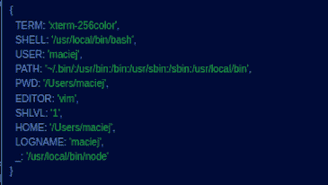

# 了解 React 本机环境变量

> 原文：<https://blog.logrocket.com/understanding-react-native-env-variables/>

变量是编程语言的基本组成部分之一。在 JavaScript 中，变量存储整数、字符串等数据类型的值。变量的值或数据类型可以在以后更改。

在本文中，我们将了解环境变量，为什么它们有用，以及如何在 React Native 中使用它们。我们将涵盖:

## 什么是环境变量？

变量可以在 React Native 中扮演不同的角色。例如，您可以[在 React Native](https://blog.logrocket.com/using-css-variables-react-native/) 中使用 CSS 变量来存储和实现自定义样式。

环境变量——或者众所周知的 env 变量——是一个其值在程序外部设置的变量。它是一个在构建时嵌入的变量，用于存储 API 端点、目录路径等信息。

如果您想减少代码中的重复或者更好地管理变量，使用 env 变量有助于减少代码。你所要做的就是在你的根文件夹中编写或者定义你的变量。然后，您可以在调用该变量之前将其导入组件中。

虽然 env 变量在 React Native 中非常有用，但不建议使用它们来存储敏感信息，如 API 密钥、身份验证密钥或密码。由于各种原因，它们并不安全。

例如，env 变量不加密它们的值。它们也被嵌入到应用程序的内部版本中，这意味着任何人都可以通过检查应用程序的文件来查看它们。

### 不同的环境文件

您可以决定使用不同的 env 文件作为您的 env 变量。这些不同的文件包括:

*   `.env` —用于存储开发、生产和测试变量的默认文件
*   `.env.local` —覆盖除测试文件之外的所有环境文件(包括默认的`.env`文件)
*   `.env.development` —特定于开发环境
*   `.env.development.local` —覆盖`.env.development`环境文件
*   `.env.production` —特定于生产环境
*   `.env.production.local` —覆盖`.env.production`环境文件
*   `.env.test` —特定于测试环境
*   `.env.test.local` —覆盖`.env.test`环境文件

总之，`.env.development`、`.env.production`和`.env.test`文件是特定于环境的文件。同时，`.env.development.local`、`.env.production.local`、`.env.test.local`文件是各自文件的本地覆盖。

如果没有明确指定环境设置，则使用默认的`.env`文件。

### 环境文件的优先级

在显式设置您的 env 文件之前，您应该了解机器处理不同 env 文件的重要性顺序。

让我们回顾一下当您运行`npm start`、`npm run build`或`npm test`时，这些文件是如何优先排序的。下面列表中的文件从左边的高优先级到右边的低优先级排列:

*   `npm start`:`.env.development.local`>`.env.development`>`.env.local`>`.env`
*   `npm run build`:`.env.production.local`>`.env.production`>`.env.local`>`.env`
*   `npm test` : `.env.test.local` > `.env.test` > `.env`

注意，测试环境中没有`.env.local`文件，因为测试环境不支持这种类型的文件。

## 什么是`process.env`？

`process.env`是节点应用程序在运行时注入的全局变量。此变量显示了初始化期间应用程序环境的完整状态。

换句话说，`process.env`在运行时显示您的应用程序的环境，并允许您利用该环境。

属性返回一个包含用户环境的对象。这个环境包括用户的路径、术语、编辑器等等。

为了更好地理解，在您的应用程序中使用`process.env`上的`console.log()`,并检查您的控制台以查看它记录了什么。您应该会看到如下所示的内容:



然而，在 React Native 中，`process.env`的一个`console.log`将只记录`"NODE_ENV"`并显示你的应用程序的环境，就像这样:


这是因为 React 本机应用程序运行在设备或模拟器环境上，而不是 Node.js 进程上。

## 如何在 React Native 中创建自定义 env 变量

让我们看一个在 React Native 中创建 env 变量的例子。

您的第一步是转到您的根文件夹并创建一个`.env`文件。在该文件中，编写不带任何括号的 API 端点，如下所示:

```
BASE_URL=https://api-dev.application.com

```

然后，在组件内部调用 env 变量，如下例所示:

```
import React, { useState, useEffect } from "react";
import { View, Text } from "react-native";

const App = () => {
  const postUrl = process.env.BASE_URL
  return (
    <View
      style={{
        flex: 1,
        justifyContent: "center",
        alignItems: "center"
      }}
    >
      <Text>ENV URL: {postUrl} </Text> // https://api-dev.endpoint.com
    </View>
  );
};
export default App;

```

注意在上面的例子中我们是如何在`process.env.`中定义 env 变量的。这一步允许我们使用`process.env.`来访问 env 变量。

值得注意的是，React Native 中的所有自定义 env 变量都必须以`REACT_APP_`开头。任何不带`REACT_APP_`前缀的变量都将被忽略，我们将无法在我们的应用程序中访问它们。

## 什么是`NODE_ENV`？

`NODE_ENV`是一个内置的 env 变量，用于声明一个特定的环境是开发、测试还是生产环境。

* * *

### 更多来自 LogRocket 的精彩文章:

* * *

要使用`NODE_ENV`来检查您当前工作的环境，您可以在您的`App.js`文件中执行以下操作:

```
const environment = process.env.NODE_ENV
console.log(environment)

```

如果你在一个开发环境中工作(即当你运行`npm start`)，那么`console.log(environment)`将记录`development`。

如果你在一个测试环境中工作(即当你运行`npm test`)，那么`console.log(environment)`将记录`test`。

如果你在一个生产环境中工作(也就是说，当你运行`npm build`来推进生产)，那么`console.log(environment)`将记录`production`。

不能手动覆盖，这有助于防止开发人员意外地将缓慢的开发版本部署到生产环境中。

## 使用 env 变量在不同环境中的 API 端点之间切换

您可以使用 env 变量根据环境有条件地呈现信息。例如，我们可以使用`NODE_ENV`在开发、测试和生产中的 API 端点之间切换。

您可能想知道为什么 API 端点和其他信息的基于环境的呈现是必要的。一个重要的原因是，我们可以在生产中进行更改或热修复，或者在开发中添加新功能，而不会破坏生产版本。

假设我们已经有了一个应用程序的实际版本，但是我们想要添加一个新特性或者做一些其他的改变。我们不希望在生产环境中进行这种更改，因为我们可能会破坏应用程序。

相反，我们将不得不切换到开发环境，进行必要的更改，并进行测试。我们还可以切换到试运行环境，以确保在投入生产之前一切正常，没有任何问题。

我们将构建一个非常简单的 React 本地应用程序来帮助演示如何使用 env 变量在不同环境中的 API 端点之间进行切换。按照本文的其余部分，[您应该知道如何使用 React Native](https://blog.logrocket.com/complete-guide-react-native-web/) 。

### 安装和配置`dotenv`包

有[许多 React 原生组件库](https://blog.logrocket.com/react-native-component-libraries/)和包帮助提供平稳的开发体验。一些包可以帮助我们轻松地访问 React Native 中的 env 变量，包括`dotenv`、`react-native-config`等等。

出于本文的目的，我们将使用`dotenv`包。`dotenv`包允许您将 env 变量注入 React 本地环境。

要用 NPM 安装`dotenv`，运行下面的命令:

```
$ npm install react-native-dotenv

```

要用 yarn 安装`dotenv`,运行以下命令:

```
$ yarn add react-native-dotenv

```

安装软件包后，启动您的应用程序。然后，让我们配置插件。

要配置已安装的软件包，请转到位于根文件夹中的`.babelrc`文件——或者创建一个`.babelrc`文件，如果它不存在的话——并添加以下内容:

```
{
  plugins: [
    [
      "module:react-native-dotenv",
      {
        envName: "APP_ENV",
        moduleName: "@env",
        path: ".env"
      }
    ]
  ]
};

```

这里，我们配置了我们的`dotenv`包。我们还为`.env`文件分配了一个路径，我们的 env 变量将存储在这里。最后，我们分配了一个名为`@env`的模块，从中我们可以导入我们的 env 变量。

### 在我们的`.env`文件中定义我们的自定义 env 变量

接下来，让我们在根文件夹中创建我们的`.env`文件。`.env`文件是一个文本文件，我们将使用它来定义变量，如下所示。

```
REACT_APP_DEV_MODE=https://api-dev.application.com
REACT_APP_PROD_MODE=https://api-prod.application.com
REACT_APP_STAGE_MODE=https://api-stage.application.com
REACT_APP_TEST_MODE=https://api-test.application.com

```

正如您在上面看到的，我们使用`REACT_APP_`前缀定义了自定义的 env 变量。

这种命名约定有利于一致性。但是，如果您正在使用 React，那么`REACT_APP_`前缀也是一个要求；除了`NODE_ENV`之外的任何变量都将被忽略，除非它使用这个前缀。

### 从我们的`@env`模块导入和调用变量

接下来，让我们转到我们的`App.js`文件，从`@env`模块导入变量，这是我们之前在`babel.config.js`文件中配置的。

```
import React from "react";
import { REACT_APP_DEV_MODE, REACT_APP_PROD_MODE } from "@env"

```

导入变量后，我们可以调用它们，并用它们获取 API 端点。

```
import React from 'react';
import { View, Text, StyleSheet } from 'react-native';
import { REACT_APP_DEV_MODE } from '@env';

const App = () => {
    return (
        <View style={styles.screen}>
            <Text>Url: {REACT_APP_DEV_MODE}</Text> // https://api-dev.application.com
        </View>
    );
};

const styles = StyleSheet.create({
    screen: {
        flex: 1,
        justifyContent: 'center',
        alignItems: 'center'
    }
});
export default App;

```

我们已经看到了如何配置我们的`dotenv`包，创建我们的 env 变量，以及从我们的`@env`模块调用 env 变量。最后，让我们利用这些知识在不同环境中的 API 端点之间进行切换。

### 检查环境并动态调用 env 变量

前面，我们了解到我们可以使用`NODE_ENV`来检查我们处于哪个 React 本地环境中。然后，我们可以基于该环境有条件地在 API 端点之间切换。

以下代码显示了如何实现这一点:

```
// using the @env package
import { REACT_APP_DEV_MODE, REACT_APP_PROD_MODE } from '@env';

const url =
        process.env.NODE_ENV === 'development'
            ? REACT_APP_DEV_MODE
            : REACT_APP_PROD_MODE;

```

在上面的代码中，我们首先动态检查了 process.env 环境，以查看我们正在哪个环境中工作。然后，使用条件，我们将 URL 分配给相应环境的正确变量。

## 隐藏您的 API 密钥

之前，我们简单地提到过你不应该在你的`.env`文件中存储你的秘密，比如 API 密匙，因为任何人都可以通过检查你的应用程序文件来访问它。

既然已经确定了，您可能想知道如何在推送之前隐藏您的 env 文件，例如，使用 Git 的版本控制系统。在`gitignore`文件的帮助下，这是可能的。

`gitignore`文件允许我们在 React 应用程序中添加我们希望 Git 在将代码推送到 Github 或 Gitlab 等远程 repo 时忽略的文件。这些文件中的一些可能包括`node_modules`文件——它很大——和我们存储私钥的`.env`文件。

要隐藏 env 文件，请转到根文件夹中的`gitignore`文件。React Native 在创建应用程序时会创建这个文件。您应该会看到一堆被您的应用程序忽略的文件。只需将`.env`文件添加到列表中:

```
/* .env */

.env

```

添加完`.env`文件后，创建一个新的`.env.local`文件并添加以下代码:

```
/* .env.local */

REACT_APP_DEV_MODE=YOUR_DEV_KEY
REACT_APP_PROD_MODE=YOUR_PROD_KEY

```

现在，当我们推送到远程存储库时，我们将只能看到`.env.local`文件，而不能看到我们的主`.env`文件。因为它也是一个环境文件，所以变量将在构建时被注入，并且可以以同样的方式被访问。

## 扩展应用程序中已经存在的 env 变量

最后，我们将探索如何扩展我们的应用程序中已经存在的 env 变量。这里扩展 env 变量意味着使用存储在我们的`.env`文件中已经存在的变量。

让我们看看下面的代码:

```
const firstName = "Chimezie"
const lastName = "Innocent"
const fullName = lastName + " " + firstName // Innocent Chimezie

```

通过连接两个字符串变量，我们可以定义一个新的变量，就像我们在上面看到的一样。我们可以在我们的`.env`文件中获得类似的结果，如下所示:

```
/* .env */

FIRST_NAME=Innocent
LAST_NAME=Chimezie
NAME=$npm_package_name //awesomeproject
FULL_NAME=$FIRST_NAME // Innocent

// OR

FULL_NAME=${FIRST_NAME} // Innocent

```

不过这个功能只有`react-scripts` v1.1.0 或更高版本才有。

## 结论

在本文中，我们看到了在 React Native 中使用 env 变量的重要性。我们还学习了如何创建定制的 env 变量，并使用它们在不同环境中的 API 端点之间动态切换。最后，我们探索了如何隐藏我们的私有 API 键，甚至扩展我们现有的 env 变量。

我希望这篇文章能帮助您更好地理解 React 本机 env 变量。感谢您的阅读！

## [LogRocket](https://lp.logrocket.com/blg/react-native-signup) :即时重现 React 原生应用中的问题。

[](https://lp.logrocket.com/blg/react-native-signup)

[LogRocket](https://lp.logrocket.com/blg/react-native-signup) 是一款 React 原生监控解决方案，可帮助您即时重现问题、确定 bug 的优先级并了解 React 原生应用的性能。

LogRocket 还可以向你展示用户是如何与你的应用程序互动的，从而帮助你提高转化率和产品使用率。LogRocket 的产品分析功能揭示了用户不完成特定流程或不采用新功能的原因。

开始主动监控您的 React 原生应用— [免费试用 LogRocket】。](https://lp.logrocket.com/blg/react-native-signup)