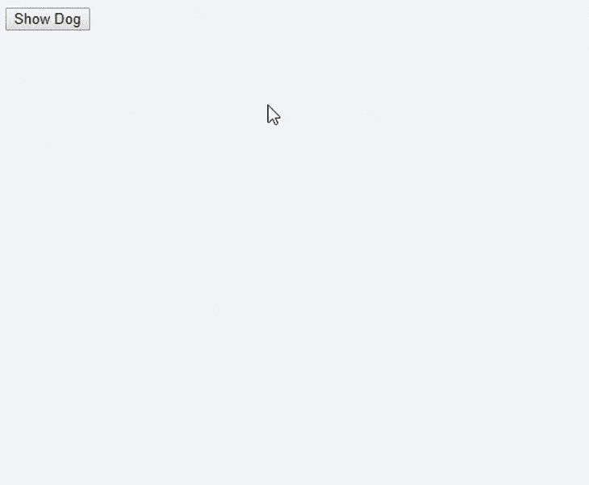

# 理解 Redux 传奇:从动作创作者到传奇

> 原文：<https://blog.logrocket.com/understanding-redux-saga-action-creators-sagas/>

***编者按*** *:这篇文章更新于 2022 年 3 月 18 日，目的是将代码的图像转换为 CodePens 和书面片段，以便于交互，解决 Redux Toolkit 处理异步操作的流行和偏好，并重新验证这篇文章中阐述的概念仍然是最新的。*

任何 Redux 开发人员都会告诉你，构建应用程序最困难的部分是弄清楚如何处理异步调用——如何管理网络请求、超时和其他回调，而不使 Redux 动作和 reducers 复杂化？

为了管理这种复杂性，我将介绍并描述几种不同的方法来处理应用程序中的异步任务，包括:

1.  【Redux 动作创作者有哪些？
2.  [使用 Redux Thunk 进行异步操作](#using-redux-thunk-asynchronous-operations)
3.  [使用 Redux Saga 处理副作用](#using-redux-saga-work-with-side-effects)
4.  [使用 Redux Saga 处理多个异步请求](#using-redux-saga-handle-multiple-async-requests)
5.  [如何用 Redux Saga 测试](#test-with-redux-saga)

我们将使用 [React](https://blog.logrocket.com/tag/react) 和 Redux，所以这篇文章假设你至少对它们的工作原理有一点了解。

## Redux 动作创作者是什么？

通常，对于用户与应用程序的每次交互，应用程序的状态都会发生变化。这些交互的范围可以从点击按钮到悬停在界面上的组件上；这些交互的结果决定了 UI 上呈现的内容。这些交互也会触发一个动作，一个描述发生了什么并负责改变应用程序状态的普通对象。

使用普通 JavaScript 时，跟踪这些动作及其各自的类型以确定应该执行哪个效果或响应有时会很麻烦。Redux 使用被称为[动作创建者](https://redux.js.org/tutorials/fundamentals/part-3-state-actions-reducers)的专门函数来解决这个问题。通过动作创建器，您可以基于分派给 reducer 的动作类型来执行特定的操作。

调用 API 是许多应用程序的常见要求。让我们看一个例子——想象一下，当我们点击一个按钮时，我们需要显示一张随机的狗的图片:



我们可以在动作创建器中使用[狗 CEO API](https://dog.ceo/dog-api/) 和简单的 [`fetch()`调用](https://developers.google.com/web/updates/2015/03/introduction-to-fetch):

参见 [CodePen](https://codepen.io) 上 Olu ( [@olu-damilare](https://codepen.io/olu-damilare) )
的笔[redux-saga-1](https://codepen.io/olu-damilare/pen/abEmdoV)。

这种方法没有错。如果一切都一样，我们应该选择最简单的方法。

但是，使用 bare Redux 不会给我们带来太大的灵活性。其核心是，Redux 只是一个支持同步数据流的状态容器:每次一个动作被发送到存储时，一个 reducer 被调用，状态被立即更新。

但是在异步流中，你必须先等待响应；然后，如果没有错误，您可以更新状态。如果您的应用程序有一个复杂的逻辑/工作流呢？

Redux 使用中间件来解决这个问题。[中间件](https://redux.js.org/understanding/history-and-design/middleware)是一段代码，在一个动作被分派之后，但在它到达缩减器之前被执行。它的核心功能是拦截发送给 reducer 的动作，执行动作中可能存在的任何异步操作，并向 reducer 呈现一个对象。

许多中间件可以被安排到一个执行链中，以不同的方式处理动作，但是中间件必须解释你传递给它的任何东西。它还必须确保在链的末端分派一个普通对象(一个动作)。

对于异步操作，Redux 提供了 [thunk 中间件](https://github.com/reduxjs/redux-thunk)，它是流行的 [Redux 工具包](https://blog.logrocket.com/using-redux-toolkits-createasyncthunk/)的一部分。

## 使用 Redux Thunk 进行异步操作

Redux Thunk 是 Redux 中执行异步操作的标准方式。出于我们的目的，thunk 代表一个仅在需要时调用的函数。以 [Redux Thunk 的文档](https://github.com/reduxjs/redux-thunk#whats-a-thunk)为例:

```
let x = 1 + 2;

```

值`3`被立即分配给`x`。然而，当我们有类似下面的语句时:

```
let foo = () => 1 + 2;

```

`sum`操作不会立即执行，只有在调用`foo()`时才会执行。这使得`foo`成为一个 thunk。

Redux Thunk 允许动作创建者调度一个普通对象之外的函数，将动作创建者转换成一个 Thunk。

这是我们使用 Redux Thunk 方法的演示应用程序的外观:

参见 [CodePen](https://codepen.io) 上 Olu ( [@olu-damilare](https://codepen.io/olu-damilare) )
的笔[redux-saga-2](https://codepen.io/olu-damilare/pen/QWaKKzv)。

起初，这似乎与以前的方法没有太大的不同。

不带 Redux Thunk:

```
// Action creator
const fetchDog = async (dispatch) => {
    try{
        dispatch(requestDog());
        var response = await fetch('https://dog.ceo/api/breeds/image/random');
        var data = response.json;
        return dispatch(showDog(data));
    }catch(error){
        return dispatch(requestDogError());
    }
};

// Invoking the action creator
<button onClick={() => fetchDog(this.props.dispatch)}>Show Dog</button>

```

使用 Redux Thunk:

```
// Action creator
const fetchDog = async (dispatch) => {
    try{
        dispatch(requestDog());
        var response = await fetch('https://dog.ceo/api/breeds/image/random');
        var data = response.json;
        return dispatch(showDog(data));
    }catch(error){
        return dispatch(requestDogError());
    }
};

// Invoking the action creator
<button onClick={() => this.props.dispatch(fetchDog())}>Show Dog</button>

```

然而，使用 Redux Thunk 的优点是组件不知道它正在执行一个异步动作。由于中间件会自动将`dispatch`函数传递给动作创建者返回的函数，所以要求组件执行一个同步动作，然后执行一个异步动作是没有区别的(反正他们也不用在意)。

通过使用中间件，我们增加了一个间接的[层](https://en.wikipedia.org/wiki/Fundamental_theorem_of_software_engineering)，这给了我们更多的灵活性。由于 Redux Thunk 将`dispatch`和`getState`方法作为参数提供给从存储中调度的函数，因此您还可以调度其他动作并读取状态以实现更复杂的业务逻辑和工作流。

另一个好处是，如果 thunks 在不改变组件的情况下表达太复杂的东西，我们可以使用另一个中间件库来进行更多的控制: [Redux Saga](https://redux-saga.js.org/) 。

## 使用 Redux Saga 处理副作用

Redux Saga 是一个旨在通过 sagas 使副作用更容易工作的库，sagas 是来自分布式事务世界的设计模式。如果你想深入研究传奇，我建议你去看看凯铁·麦卡弗里的讲座[应用传奇模式](https://youtu.be/xDuwrtwYHu8)。

saga 管理需要以事务方式执行的流程，维护执行状态并补偿失败的流程。在 Redux 的上下文中，一个 saga 被实现为一个中间件，因为我们不能使用一个 reducer，它必须是一个纯函数，来协调和触发异步动作(副作用)。

Redux Saga 在 [ES2015 发电机](https://developer.mozilla.org/en-US/docs/Web/JavaScript/Reference/Statements/function*)的帮助下做到了这一点:

```
function* myGenerator(){
    let first = yield 'first yield value';
    let second = yield 'second yield value';
    return 'third returned value';
}

```

### 什么是发电机功能？

生成器是可以在执行过程中暂停和恢复的函数，而不是一次执行一个函数的所有语句。

当你调用一个生成器函数时，它将返回一个迭代器对象。随着迭代器的`next()`方法的每次调用，生成器的主体将被执行，直到下一个`yield`语句，然后它将暂停:

```
const it = myGenerator();
console.log(it.next()); // {value: "first yield value", done: false}
console.log(it.next()); // {value: "second yield value", done: false}
console.log(it.next()); // {value: "third returned value", done: true}
console.log(it.next()); // {value: "undefined", done: true}

```

这可以使异步代码易于编写和理解。例如，不这样做:

```
const data = await fetch(url);
console.log(data);

```

有了发电机，我们可以做到这一点:

```
let val = yield fetch(url);
console.log(val);

```

对于 Redux Saga，我们通常有一个 Saga，其工作是监视分派的动作:

```
function* watchRequestDog(){

}

```

为了协调我们想要在 saga 中实现的逻辑，我们可以使用类似于 [`takeEvery`](https://redux-saga.js.org/docs/api/#takeeverypattern-saga-args) 的帮助器函数来生成一个新的 saga 来执行一个操作:

```
// Watcher saga for distributing new tasks
function* watchRequestDog(){
    yield takeEvery('FETCHED_DOG', fetchDogAsync)
}

// Worker saga that performs the task
function* fetchDogAsync(){

}

```

watcher saga 是另一个间接层，它增加了实现复杂逻辑的灵活性，但对于简单的应用程序可能是不必要的。

## 使用 Redux Saga 处理多个异步请求

如果有多个请求，`takeEvery`将启动工人传奇的多个实例；换句话说，它为您处理并发性。

回想我们的例子，我们可以用类似这样的东西实现`fetchDogAsync()`函数(假设我们可以访问`dispatch`方法):

```
function* fetchDogAsync(){
    try{
        yield dispatch(requestDog());
        const data = yield fetch(...);
        yield dispatch(requestDogSuccess(data));
    }catch (error){
        yield dispatch(requestDogError());
    }
}

```

但是 Redux Saga 允许我们产生一个声明我们执行操作意图的对象，而不是产生执行操作本身的结果。换句话说，上面的例子是这样在 Redux Saga 中实现的:

```
function* fetchDogAsync(){
    try{
        yield put(requestDog())
        const data = yield call(() => fetch(...))
        yield put(requestDogSuccess(data))
    }catch(error){
        yield put(requestDogError())
    }
}

```

方法`call`将只返回一个描述操作的普通对象，而不是直接调用异步请求。然后 Redux Saga 负责调用并将结果返回给生成器。

同样的事情也会发生在`put`方法上。`put`没有在生成器内部分派动作，而是返回一个对象，其中包含中间件分派动作的指令。那些返回的对象被称为效果。下面是一个由`call`方法返回的效果的例子:

```
{
    CALL: {
        fn: () => {/* ... */},
        args: []
    }
}

```

另一个额外的好处是能够轻松地将许多效果组合到一个复杂的工作流程中。除了`[takeEvery](https://redux-saga.js.org/docs/api/#takeeverypattern-saga-args)`、`[call](https://redux-saga.js.org/docs/api/#callfn-args)`、`[put](https://redux-saga.js.org/docs/api/#putaction)`之外，Redux Saga 还提供了很多[特效创作者](https://redux-saga.js.org/docs/api/#effect-creators)用于[节流](https://redux-saga.js.org/docs/recipes/#throttling)、[获取当前状态](https://redux-saga.js.org/docs/advanced/FutureActions/)、[并行运行任务](https://redux-saga.js.org/docs/advanced/RunningTasksInParallel/)、[取消任务](https://redux-saga.js.org/docs/advanced/TaskCancellation/)，不一而足。

回到我们的例子，这是 Redux Saga 中的完整实现:

参见 [CodePen](https://codepen.io) 上 Olu ( [@olu-damilare](https://codepen.io/olu-damilare) )
的笔[redux-saga-3](https://codepen.io/olu-damilare/pen/MWrjQoB)。

这是您单击按钮后在幕后发生的情况:

1.  动作`FETCHED_DOG`被分派
2.  观察者传奇`watchFetchDog`采取分派的动作并调用工作者传奇`fetchDogAsync`
3.  显示加载指示器的动作被调度
4.  执行 API 调用
5.  调度更新状态的动作(`success`或`fail`)

## 如何用 Redux Saga 测试

通过使用效果，Redux Saga 使 sagas [成为声明性的](https://en.wikipedia.org/wiki/Declarative_programming)，而不是[命令性的](https://en.wikipedia.org/wiki/Imperative_programming)，这增加了返回简单对象的函数的好处，这比直接进行异步调用的函数更容易测试。

要运行测试，您不需要使用真正的 API、伪造或模仿它——您只需迭代生成器函数，断言生成的值相等:

```
const iterator = requestTrivia();
asserts.deepEqual(
    iterator.next().value,
    call(fetch(...)),
    "requestDog should yield the Effect call(fetch)"
)

```

如果你认为一些间接层和一点额外的工作是值得的，Redux Saga 可以给你更多的控制，以功能的方式处理副作用。

## 结论

这篇文章向您展示了如何用动作创建器、thunks 和 sagas 在 Redux 中实现异步操作，从最简单的方法到最复杂的方法。

Redux 并没有给出处理副作用的解决方案。在决定采用哪种方法时，您必须考虑应用程序的复杂性。我的建议是从最简单的解决方案开始。

Redux Saga 还有其他替代方案值得尝试。两个最受欢迎的选项是 [Redux Observable](https://github.com/redux-observable/redux-observable) (基于 [RxJS](https://github.com/ReactiveX/rxjs) )和 [Redux Logic](https://github.com/jeffbski/redux-logic) (也基于 RxJS observables，但是可以自由地用[其他风格](https://github.com/jeffbski/redux-logic#tldr)编写您的逻辑)。