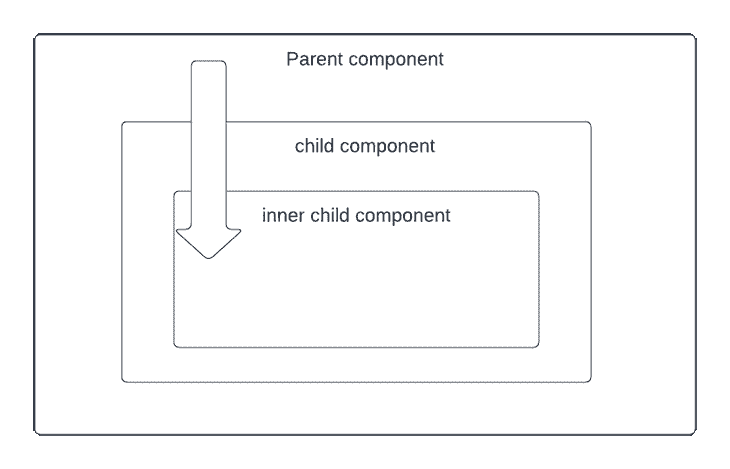
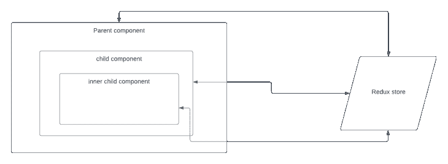

# 理解 Redux:带示例的教程

> 原文：<https://blog.logrocket.com/understanding-redux-tutorial-examples/>

***编者按**:这个 React Redux 教程最后一次更新是在 2022 年 10 月 3 日，内容包括 Redux 有什么用途，为什么 Redux 对 React 很好，以及更新过时的信息。*

随着 web 开发工具和库的出现(JavaScript 库可能在您读完本文之前就已经发布了)，在没有真正理解它的好处或为什么应该使用它的情况下就使用每一个新的工具和库可能不是最明智的做法。

Redux 并不新鲜，但它仍然很受欢迎。在本教程中，我们将向您展示 Redux 是什么，为什么您应该使用它，以及它是如何工作的。

首先，我们将回顾 Redux 的[基础以及它是如何工作的。然后我们将通过使用一个简单但实用的组件来看看使用 Redux 如何在您的应用程序中帮助您。](https://egghead.io/courses/getting-started-with-redux)

我们将详细介绍以下内容:

## Redux 是什么？

Redux 是一个可预测的状态容器，旨在帮助您编写跨客户端、服务器和本机环境表现一致的 JavaScript 应用程序，并且易于测试。

虽然它主要用作 React 的状态管理工具，但是您可以将它用于任何其他 JavaScript 框架或库。它是轻量级的，只有 2KB(包括依赖项)，所以您不必担心它会使您的应用程序的资产变大。

使用 Redux，应用程序的状态保存在一个存储中，每个组件都可以从这个存储中访问它需要的任何状态。

如果你刚刚开始使用 Redux，下面的视频对初学者来说是一个很好的资源。

 [https://www.youtube.com/embed/CVpUuw9XSjY?version=3&rel=1&showsearch=0&showinfo=1&iv_load_policy=1&fs=1&hl=en-US&autohide=2&wmode=transparent](https://www.youtube.com/embed/CVpUuw9XSjY?version=3&rel=1&showsearch=0&showinfo=1&iv_load_policy=1&fs=1&hl=en-US&autohide=2&wmode=transparent)

视频

## 何时使用 Redux

最近前端世界最大的争论之一是关于 Redux。发布后不久，Redux 就成为最热门的讨论话题之一。许多人赞成它，而其他人指出了问题。

Redux 允许您在一个地方管理应用程序的状态，并使应用程序中的更改更加可预测和可跟踪。这使得推断应用程序中发生的变化变得更加容易。但是所有这些好处都伴随着权衡和限制。有人可能会觉得它增加了样板代码，使简单的事情变得有点令人不知所措；但这取决于架构决策。

这个问题的一个简单答案是，当你需要 Redux 时，你会自己意识到。如果你仍然不知道是否需要它，你不需要。当你的应用程序增长到管理应用程序状态变得很麻烦的规模时，通常会发生这种情况；你开始寻找使它变得简单易行的方法。

### 那么，Redux 是用来做什么的呢？

简而言之，Redux 用于跨应用程序维护和更新数据，供多个组件共享，同时保持独立于组件。

如果没有 Redux，您将不得不使数据依赖于组件，并通过不同的组件将其传递到需要它的地方。



在上面的例子中，我们只需要父组件和内部子组件中的一些数据，但是我们被迫将它传递给所有组件(包括不需要它的子组件),以便将它传递到需要它的地方。

使用 Redux，我们可以使状态数据独立于组件，并且在需要时，组件可以通过 Redux 存储进行访问或更新。



## 为什么 Redux 和 React 好？

正如我们前面提到的，Redux 是一个独立的库，可以用于不同的 JavaScript 框架，如 Angular、Inferno、Vue、Preact、react 等

但是，Redux 最常与 React 一起使用。

这是因为 React 是根据状态和生命周期的概念设计的。而在 React 中，状态也不能直接修改，只能通过函数`setState`来完成。这使得 Redux 概念更容易应用，因为它们共享对状态对象的相同理解和行为。

> 💡React 组件被定义为具有应用程序状态访问的类或函数，即类扩展了`React.Component`，函数使用`useState`助手来访问状态值/对象。

## Redux 中的状态管理是什么？

状态管理本质上是一种促进组件间通信和数据共享的方法。它创建了一个有形的数据结构来表示您的应用程序的状态，您可以从中读取和写入。这样，在使用它们时，您可以看到原本看不见的状态。

* * *

### 更多来自 LogRocket 的精彩文章:

* * *

大部分库，比如 React，Angular 等。为组件提供了一种在内部管理其状态的方式，而不需要任何外部库或工具。它适用于组件很少的应用程序，但是随着应用程序越来越大，管理跨组件共享的状态就变得很麻烦。

在组件间共享数据的应用程序中，实际知道一个州应该在哪里可能会令人困惑。理想情况下，组件中的数据应该只存在于一个组件中，因此在兄弟组件之间共享数据变得很困难。

例如，在 React 中，为了在兄弟组件之间共享数据，状态必须存在于父组件中。更新该状态的方法由父组件提供，并作为道具传递给这些兄弟组件。

下面是 React 中登录组件的一个简单示例。登录组件的输入会影响其同级组件(状态组件)显示的内容:

```
class App extends React.Component {
  constructor(props) {
    super(props);
    // First the Parent creates a state for what will be passed
    this.state = { userStatus: "NOT LOGGED IN"}
    this.setStatus = this.setStatus.bind(this);
  }
  // A method is provided for the child component to update the state of the
  // userStatus
  setStatus(username, password) {
    const newUsers = users;
    newUsers.map(user => {
      if (user.username == username && user.password === password) {
        this.setState({
          userStatus: "LOGGED IN"
        })
      }
    });
  }

  render() {
    return (
      <div>
        // the state is passed to the sibling as a props as is updated whenever
        // the child component changes the input
        <Status status={this.state.userStatus} />
        // this method is passed to the child component as a props which it
        // uses to change the state of the userStatus
        <Login handleSubmit={this.setStatus} />
      </div>
    );
  }
});

```

> 请记住，父组件不需要这些数据，但是因为其子组件需要共享数据，所以它必须提供一个状态。

现在想象一下，当一个状态必须在组件树中相距很远的组件之间共享时会发生什么。状态必须从一个组件传递到另一个组件，直到它到达需要它的地方。

基本上，状态必须提升到最近的父组件，然后提升到下一个组件，直到到达需要该状态的两个组件共有的祖先，然后传递下去。这使得状态难以维持，并且更不可预测。这也意味着将数据传递给不需要它的组件。

很明显，随着应用程序变得越来越复杂，状态管理也变得越来越混乱。这就是为什么你需要一个像 Redux 这样的状态管理工具，让维护这些状态变得更容易。在考虑 Redux 的好处之前，让我们先了解一下 Redux 的概念。

## Redux 如何工作

Redux 的工作方式很简单。有一个保存应用程序整个状态的中央存储。每个组件都可以访问存储的状态，而不必将道具从一个组件发送到另一个组件。

Redux 中有三个核心组件——动作、存储和 reducers。下面简单讨论一下他们各自是做什么的。这很重要，因为它们可以帮助您了解 Redux 的优势以及如何使用它。我们将实现一个类似于上面登录组件的例子，但是这次是在 Redux 中。

> 💡`state`表示保存组件间共享的应用程序数据的对象。

### 什么是 Redux 动作？

简单来说，Redux 动作就是事件。

它们是将数据从应用程序发送到 Redux 存储的唯一方式。数据可以来自用户交互、API 调用，甚至表单提交。

动作是普通的 JavaScript 对象，必须具有

*   用于指示要执行的动作类型的`type`属性，以及
*   一个包含用于改变状态的信息的`payload`对象。

动作是通过动作创建器创建的，简单来说就是一个返回动作的函数。并且使用将动作发送到存储的`store.dispatch()`方法来执行动作。

下面是一个操作示例:

```
{ 
  type: "LOGIN",
  payload: {
    username: "foo",
    password: "bar"
  }
}

```

下面是一个动作创建者的示例:

```
const setLoginStatus = (username, password) => {
  return {
    type: "LOGIN",
    payload: {
      username, // "foo"
      password // "bar" 
    }
  }
}

```

## 什么是 Redux reducers？

Reducers 是纯粹的函数，它接受应用程序的当前状态，执行一个动作，然后返回一个新状态。reducer 处理状态(应用程序数据)如何响应动作而改变。

> 💡纯函数是指如果给定相同的参数，将总是返回相同的值的函数。即该函数仅依赖于参数而不依赖于外部数据。

它基于 JavaScript 中的`reduce`函数，在执行回调函数后，从多个值中计算出一个值。

下面是 Redux 中 reducers 如何工作的一个例子:

```
const LoginComponent = (state = initialState, action) => {
    switch (action.type) {

      // This reducer handles any action with type "LOGIN"
      case "LOGIN":
          return state.map(user => {
              if (user.username !== action.username) {
                  return user;
              }

              if (user.password == action.password) {
                  return {
                      ...user,
                      login_status: "LOGGED IN"
                  }
              }
          });
       default:
          return state;
      } 
};

```

> 💡Reducers 获取应用程序以前的状态，并根据传递给它的动作返回一个新状态。作为纯函数，它们不会改变传递给它们的对象中的数据，也不会对应用程序产生任何副作用。给定相同的对象，它们应该总是产生相同的结果。

### Redux Store 是什么？

商店是保存应用程序状态的“容器”(实际上是一个 JavaScript 对象)，改变状态的唯一方式是通过发送到商店的动作。Redux 允许单个组件将 *连接到商店，并通过调度动作对其应用更改。*

 *强烈建议在任何 Redux 应用程序中只保留一个存储。您可以通过 helper 方法访问存储的状态、更新状态以及注册或取消注册侦听器。

让我们为我们的登录应用程序创建一个商店:

```
const store = createStore(LoginComponent);

```

对状态执行的操作总是返回新的状态。因此，这种状态非常容易预测。

现在我们对 Redux 有了更多的了解，让我们回到之前实现的登录组件示例，看看 Redux 如何改进组件:

```
class App extends React.Component {
    render() {
        return (
            <div>
                <Status user={this.props.user.name}/>
                <Login login={this.props.setLoginStatus}/>
            </div>
        )
    }
}

```

使用 Redux，存储中有一个通用状态，每个组件都可以访问该状态。

这消除了将状态从一个组件持续传递到另一个组件的需要。您还可以从商店中为特定组件选择切片；这使得你的应用程序更加优化。

## Redux 中间件

Redux 允许开发人员在组件的所有动作被传递给`reducer`函数之前拦截它们。这种拦截是通过中间件完成的。

基于上一节讨论的示例登录组件，我们可能希望在用户的输入到达我们的存储进行进一步处理之前对其进行净化。这可以通过 [Redux 中间件](https://redux.js.org/understanding/history-and-design/middleware)来实现。

从技术上讲，中间件是在处理完当前动作后调用参数中接收的下一个方法的函数。每次调度后都会调用这些函数。

下面是一个简单的中间件的样子:

```
function simpleMiddleware({ getState, dispatch }) {
  return function(next){
    return function(action){
      // processing
      const nextAction = next(action);
      // read the next state
      const state = getState();
      // return the next action or you can dispatch any other action
      return nextAction;  
    }
  }
}

```

这可能看起来有点令人不知所措，但是在大多数情况下，您可能不需要创建自己的中间件，因为巨大的 Redux 社区已经提供了许多这样的中间件。如果你觉得中间件是必需的，你会喜欢它，因为它给你很大的力量用最好的抽象做大量的工作。

## 为什么要用 Redux？

当 Redux 与 React 一起使用时，状态将不再需要提升。这使您更容易跟踪哪个操作导致了任何变化。

正如您在上面的例子中看到的，组件不需要为其子组件提供任何状态或方法来在它们之间共享数据。一切都由 Redux 处理。这大大简化了应用程序，使其更容易维护。

这是您应该使用 Redux 的主要原因，但不是唯一的好处。请看下面的列表，它总结了使用 Redux 进行状态管理可以获得的好处。

### Redux 使状态可预测

在 Redux 中，状态总是可预测的。如果将相同的状态和动作传递给一个 reducer，总是会产生相同的结果，因为 reducer 是纯函数。状态也是不可变的，永远不会改变。这使得实现像无限撤销和重做这样的艰巨任务成为可能。还可以实现时间旅行，即在以前的状态之间来回移动并实时查看结果的能力。

### Redux 是可维护的

Redux 对如何组织代码有严格的要求，这使得了解 Redux 的人更容易理解任何 Redux 应用程序的结构。这通常会使维护变得更容易。这也有助于将业务逻辑从组件树中分离出来。对于大规模的应用程序，保持你的应用程序更具可预测性和可维护性是至关重要的。

### 在 Redux 中调试很容易

Redux 使调试应用程序变得容易。通过记录操作和状态，很容易理解编码错误、网络错误和生产过程中可能出现的其他形式的错误。

除了日志之外，它还有[强大的开发工具，允许你进行时间旅行动作](https://blog.logrocket.com/redux-devtools-tips-tricks-for-faster-debugging/)，在页面刷新时保持动作，等等。

对于中型和大型应用程序，调试比实际开发功能花费更多的时间。Redux DevTools 使得利用 Redux 提供的所有功能变得很容易。

### 性能优势

您可能会认为保持应用程序的全局状态会导致性能下降。很大程度上，事实并非如此。

React Redux 在内部实现了许多性能优化，以便您自己的连接组件只在实际需要时才重新呈现。

### 易于测试

测试 Redux 应用程序很容易，因为函数用来改变纯函数的状态。

### 状态持久性

您可以将应用程序的一些状态保存到本地存储，并在刷新后恢复。这真的很棒。

### 服务器端渲染

Redux 也可以用于服务器端渲染。使用它，您可以通过将应用程序的状态及其对服务器请求的响应发送到服务器来处理应用程序的初始呈现。然后，所需的组件以 HTML 格式呈现并发送给客户端。

## 结论

我们已经讨论了 Redux 的主要特性，以及为什么 Redux 对你的应用有益。虽然 Redux 有它的好处，但这并不意味着你应该在你所有的应用中加入 Redux。没有 Redux ，你的应用程序[可能仍然工作得很好。](https://blog.logrocket.com/when-and-when-not-to-use-redux-41807f29a7fb/)

Redux 的一个主要好处是增加了将“发生了什么”与“事情如何变化”分离的方向。然而，如果您确定您的项目需要状态管理工具，那么您应该只实现 Redux。*