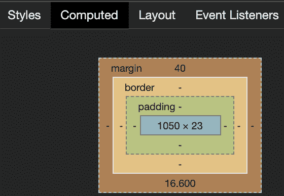
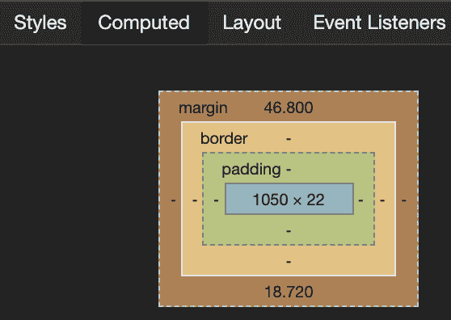
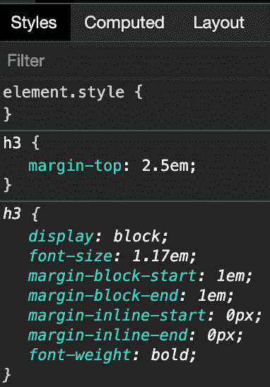
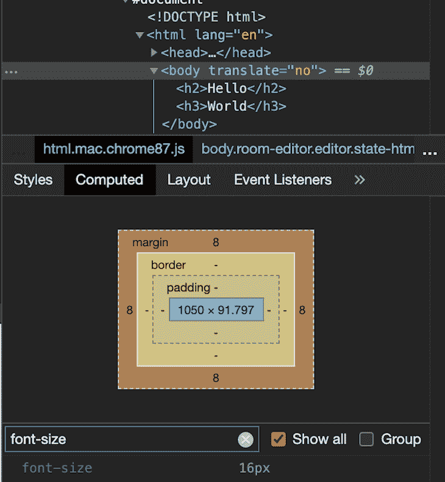
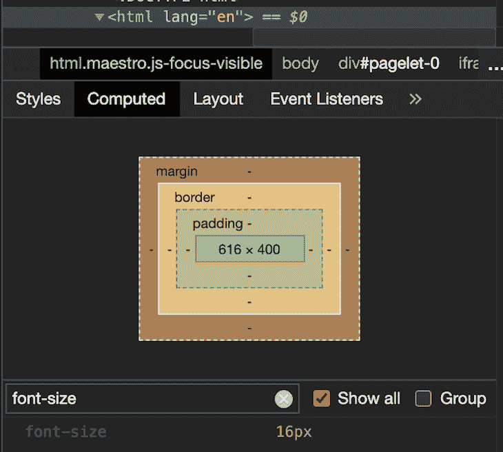
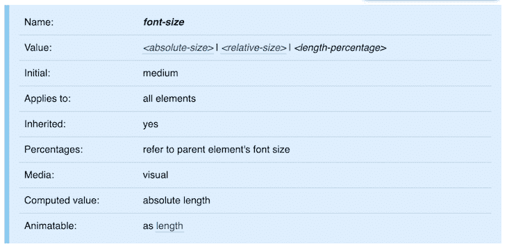
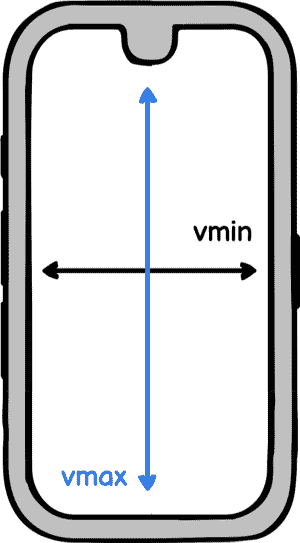
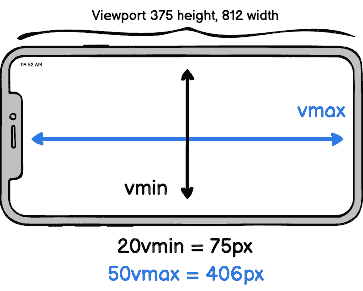
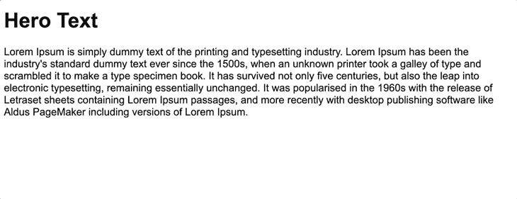

# 了解相对 CSS 单位- LogRocket 博客

> 原文：<https://blog.logrocket.com/understanding-relative-css-units/>

本文旨在揭开[相对长度单位](https://developer.mozilla.org/en-US/docs/Learn/CSS/Building_blocks/Values_and_units#Relative_length_units)的神秘面纱。与[绝对长度单位](https://developer.mozilla.org/en-US/docs/Learn/CSS/Building_blocks/Values_and_units#Absolute_length_units)(以`px`为最著名的代表)相反，相对长度单位指定相对于其他东西的长度。这种“其他东西”可以是各种类型的，例如，父元素的字体大小、父容器的宽度或视口的高度。

两种类型的单位都有一个共同的术语`length`，但是在这个上下文中长度单位到底是什么？还有[字体相对长度单位](https://developer.mozilla.org/en-US/docs/Web/CSS/length#Font-relative_lengths)(如`em`、`rem`，相对于一个元素的字符或字体相关属性。此外，还有相对于视口的长度单位[(例如`vw`、`vh`)。](https://developer.mozilla.org/en-US/docs/Web/CSS/length#Viewport-percentage_lengths)

相对单位上下文中另一种常见的 CSS 数据类型是百分比(`%`)。还有接受整数值的 [CSS 属性](https://stackoverflow.com/a/2130116)。这种无单位值最常见的用例是[与行高属性](http://meyerweb.com/eric/thoughts/2006/02/08/unitless-line-heights/)一起使用。

从流畅布局和网页可访问性的角度来看，相对单元对于支持依赖缩放的用户尤为重要。这些流体布局基于比例设计，其中长度根据容器的百分比来定义。

因此，基于相对单位的组件可能在运行时改变大小，因为它们是相对于上下文容器(重新)计算的，例如，通过旋转设备或通过减小浏览器窗口的大小。

## 字体相关的 CSS 单元

首先，我们将看看最常见的与字体相关的 CSS 单元如何工作:`em`和`rem`。

### CSS 单位`em`

浏览器根据当前字体大小上下文将`em`值转换为`px`值。让我们看一个例子。

参见 [CodePen](https://codepen.io) 上塞巴斯蒂安·韦伯( [@doppelmutzi](https://codepen.io/doppelmutzi) )
的钢笔 [CSS 单元 em–标题](https://codepen.io/doppelmutzi/pen/xqbyZb)。

`h2`元素的实际`margin-top`值是多少？打开 Chrome [DevTools](https://developers.google.com/web/tools/chrome-devtools) ，选择`h2`，导航到 CSS 部分的 **Computed** 选项卡。值为`40px`。



The rendered margin value of the h2 element is 40px.

这个值是怎么来的？HTML 元素(`h2`)的 CSS 属性(`margin-top`)的计算公式为:

*将`em`值(2)乘以要样式化的 HTML 元素的 px 中的实际`font-size`值(20)。对于我们的例子来说，这意味着:`2 * 20px = 40px.`*

示例中的`h3`元素的`margin-top`呢？最终的价值是`46.8px`。



Calculated margin-top value of the h3 element.

这是为什么呢？我们没有声明一个`font-size`值，就像我们对`h2`元素所做的那样。然而，每个元素都有一个派生值——这是 CSS 中事物的本质。



正如我们所看到的，我们的`h3`元素有一个默认的`font-size`值`1.17em`。好，这也不是`px`值。我们必须沿着父元素层次向上，直到找到一个`px`值。

在 DevTools 的帮助下，我们发现`body`元素有一个来自浏览器默认值的绝对`font-size`值，因为我们没有指定自定义值。



有了这些信息，就可以计算出我们的具体价值:`2.5 * 1.17 * 16 = 46.8px`。

下一个例子演示了`em`不仅仅是文本内容的样式；相反，只要能使用长度单位的地方都可以用。乍一看可能有点疏远，但是您可以毫无问题地设计非文本元素的样式。

参见 Sebastian Weber([@ doppelmutzi](https://codepen.io/doppelmutzi))[CodePen](https://codepen.io)上的 Pen [CSS Unit em(margin)](https://codepen.io/doppelmutzi/pen/qBaKMzE)。

CSS 单位`rem`

### 字体相关的相对单位`rem`代表“根 em”它与浏览器根元素的`font-size`相关(通常是`html`元素)。很容易确定:*用浏览器的`html`元素的`px`中的`rem`值乘以实际的`font-size`值。*

这里有一个例子。

参见 Sebastian Weber([@ doppelmutzi](https://codepen.io/doppelmutzi))
关于 [CodePen](https://codepen.io) 的 Pen [CSS Unit rem](https://codepen.io/doppelmutzi/pen/NpqXpR) 。

See the Pen [CSS Unit rem](https://codepen.io/doppelmutzi/pen/NpqXpR) by Sebastian Weber ([@doppelmutzi](https://codepen.io/doppelmutzi))
on [CodePen](https://codepen.io).

因为定义的`rem`值(2)乘以`html`元素(`16px`)的绝对`font-size`值，所以`h2`元素的计算`margin-top`值是`32px`。因为我们没有提供选择器来定义`html`元素的`font-size`，所以这是浏览器的默认设置。

对于大多数(桌面)浏览器，默认是`16px`。但是为了确定这一点，您可以再次使用 DevTools。



[浏览器支持好](https://caniuse.com/rem)。它可以毫无问题地使用，除非你必须为遗留浏览器开发。

使用`em`

### 不时查看 W3C CSS 标准文档是一个好主意。在这里，您可以看到`font-size`属性[从 HTML 父层次结构中继承了](https://www.w3.org/TR/css-fonts-3/#propdef-font-size)。

因此，使用`em`可能会很棘手:



font-size gets inherited.

每个 HTML 元素从它的父 HTML 元素继承它的`font-size`值

*   如果为根元素(`html`)设置了基于`em`的`font-size`，则`px`值是与浏览器的默认值相乘的结果。一些浏览器允许在随后使用的设置中定义用户值
*   结果是浏览器字体设置可能通过继承影响每个`em`值。从可访问性的角度来看，这对于支持依赖缩放的用户至关重要。

然而，这可能会在使用`em`值的嵌套元素中导致最不希望的行为。

参见 [CodePen](https://codepen.io) 上塞巴斯蒂安·韦伯( [@doppelmutzi](https://codepen.io/doppelmutzi) )
的 Pen [em——继承问题](https://codepen.io/doppelmutzi/pen/aJOzJR)。

See the Pen [em – inheritance problematic](https://codepen.io/doppelmutzi/pen/aJOzJR) by Sebastian Weber ([@doppelmutzi](https://codepen.io/doppelmutzi))
on [CodePen](https://codepen.io).

在我们的例子中，嵌套更深的元素的`font-size`比预期的要大。这是为什么呢？

第一级`li`的`font-size`为`14px`:

*   `1.4 (li selector) * 10px (inherited font-size` `from body)`
    *   第二级`li`的`font-size`为`19.6px`:
*   `1.4 (li selector) * 14px (inherited from level 1 li)`
    *   第三级`li`的`font-size`在`27.44px`甚至更大
*   `1.4 (li selector) * 19.6px (inherited from level 2 li)`
    *   为了解决这个问题，确保所有的`li`元素具有相同的字体大小，您可以添加另一个选择器。

在你的 CSS 设计中请记住这一点。在这种情况下，您很可能不想使用`em`;而是用`rem`。

```
li li { font-size: 1em; };

```

使用`rem`

### 使用一个`rem`值来确定 CSS 属性的计算出的`px`值很容易:您必须将`rem`值乘以`html`元素的`px`值。使用 DevTools ( **Computed** tab)查看您是否设置了该值。

下面的列表提供了关于如何确定`html`元素的`px`值的更多细节:

如果您没有为`html`元素定义自定义的`px`值，那么`px`值将从浏览器设置或浏览器默认值中继承

*   如果用一个`px`值定义`html`元素的`font-size`，那么这就是用于计算的内容
*   如果用一个`em`或`%`值定义`html`元素的`font-size`，那么实际的`px`值将在浏览器字体设置或默认值的帮助下进行计算
*   如果用一个`rem`值定义`html`元素的`font-size`,`html`元素的`px`值是与浏览器字体大小设置或默认值相乘的结果
*   结果是浏览器字体设置会影响 CSS 设计中的每个`rem`值。使用`rem`不会导致`font-size`的“继承问题”，正如你在下一个例子中看到的。

参见 [CodePen](https://codepen.io) 上塞巴斯蒂安·韦伯( [@doppelmutzi](https://codepen.io/doppelmutzi) )
的 Pen [CSS Unit rem——无继承效果](https://codepen.io/doppelmutzi/pen/yMNBKr)。

See the Pen [CSS Unit rem – no inheritance effects](https://codepen.io/doppelmutzi/pen/yMNBKr) by Sebastian Weber ([@doppelmutzi](https://codepen.io/doppelmutzi))
on [CodePen](https://codepen.io).

`font-size`父层次中的定义是不相关的，因为`rem`值总是与单个`html`元素的(计算的)`px`值相关。

更多来自 LogRocket 的精彩文章:

* * *

### 何时使用`rem`和`em`

* * *

### 使用`rem`和`em`与响应式设计、可用性和易访问性密切相关。

`rem`的优势是统一定大小，没有`font-size`继承。作为应用程序设计人员，您可以对用户字体设置做出反应，以便恰当地呈现内容。这一点很重要，这样才不会将依赖易访问设计的用户排除在外。当用户增加字体大小时，你有机会保持布局的完整性，例如，文本不会被挤到一个固定宽度的小容器中。

是每个 CSS 开发者腰带上的强大工具。样式化元素的基本原则是根据父元素的`font-size`值来确定“大小值”(例如`margin`、`width`)。因此，它不限于根元素(`html`)。

`em`的一个主要好处是它能够在一个上下文中建立设计元素之间的比例关系(例如，一个按钮或预告模块)。`em`的使用与上下文可伸缩性和响应性设计的问题密切相关。下一个例子展示了如何将`em`用于响应式组件设计。

参见 Sebastian Weber([@ doppelmutzi](https://codepen.io/doppelmutzi))[CodePen](https://codepen.io)上的 [带 em 单元的笔响应按钮](https://codepen.io/doppelmutzi/pen/BbNbpy)。

See the Pen [Responsive buttons with em unit](https://codepen.io/doppelmutzi/pen/BbNbpy) by Sebastian Weber ([@doppelmutzi](https://codepen.io/doppelmutzi))
on [CodePen](https://codepen.io).

按钮组件响应结构由`button`选择器定义。`border`、`padding`和`border-radius`使用与定义的`font-size`值相关的相对单位。不同的按钮大小由具体的类别选择器定义(如`size-l`)。

因为`font-size`值也是`em`单位，所以具体的上下文值是从用`main`和`footer`选择器定义的具体的`px`值中得到的。

这种方法的好处是，您可以在不同的上下文中轻松地重用这些组件。您只需为不同的上下文容器定义不同的`font-size`值，然后继承会完成剩下的工作。

相对 CSS 单位`%`

## 在 CSS 中，percent ( `%`)本身不是长度单位，而是一种[数据类型](https://developer.mozilla.org/en-US/docs/Web/CSS/percentage)。使用它感觉像一个长度单位，因为你可以在任何可以使用`px`、`em`等的地方使用它。所以在这种背景下提一下还是比较公平的。

该数据类型总是引用父组件的一部分。以百分比定义的长度基于父元素相同属性的长度(在`px`中计算的值)。下面的例子说明了这一点:

`h1`元素的计算`width`是其父元素`main`的一半，即`200px`。如果父容器是`body`元素，那么百分比总是指浏览器视窗的大小。在我们的例子中，`main`元素的`height`属性的计算值是 viewport 容器的计算值的一半。

```
main {
  width: 400px;
  height: 50%;
}

h1 {
  width: 50%;
}

<body>
  <main>
    <h1>hello world</h1>
  </main>
</body>

```

让我们仔细看看一些基本细节。在下面的代码笔中，灰色背景容器是`h2`元素(蓝色背景)的父元素。

参见 [CodePen](https://codepen.io) 上塞巴斯蒂安·韦伯( [@doppelmutzi](https://codepen.io/doppelmutzi) )
的 Pen [CSS 百分比演示](https://codepen.io/doppelmutzi/pen/BmmqQb)。

See the Pen [CSS percentage demo](https://codepen.io/doppelmutzi/pen/BmmqQb) by Sebastian Weber ([@doppelmutzi](https://codepen.io/doppelmutzi))
on [CodePen](https://codepen.io).

没有用户定义宽度的块级元素的默认行为是占据父容器的[可用水平空间，正如你在**演示 1** 中看到的。我们的`h2`的水平填充(深蓝色背景)没有添加到总宽度中。](https://stackoverflow.com/a/28354270/3116979)

然而，正如你在**演示 2** 中看到的，定义一个显式的`width: 100%`会导致显示一个水平滚动条。这是为什么呢？

与**演示 1** 相反，其中默认`width`具有值`auto`，定义百分比值在其计算中包括`padding`、`margin`和`border`，并使子容器能够超出其父容器的宽度。你可以在 [CSS 规范](https://www.w3.org/TR/CSS21/visudet.html#blockwidth)中读到它。

在**演示 3** 中，我们也指定了`width: 100%`，但是我们没有水平滚动条。这是因为孩子的`border`和`padding`没有增加水平间距，因为我们把默认的`box-sizing: content-box`改成了`box-sizing: border-box`。在整个 CSS 设计中定义一个全局选择器来使用`border-box`并不罕见。

通过**演示 4** 和**演示 5** ，您可以看到百分比不一定与直接的父元素相关，而是与父树中更高一级的元素相关。

Viewport units

## 百分比值(`%`)总是指父元素。然而，[视口单位](https://www.w3.org/TR/css3-values/#viewport-relative-lengths)值代表当前浏览器视口的百分比。

视口单位的值基于视口容器的宽度(`vw`)和高度(`vh`)来确定。取值范围在 1 到 100 之间:

`1vw`是视口宽度的 1 %;类似地，`1vh`是视口高度的 1%

*   `100vw`是视窗宽度的 100 %;同样，`100vh`是视口高度的 100%
*   视口单元最明显的用例是将它们用于顶层容器，这些容器相对于视口大小占用空间；不涉及级联或受父元素的影响。与`%`相反，对于视口单元，要样式化的元素在标记中的位置并不重要。

所以`100vw`可以用于全幅剖面吧？是的——但是有一个警告。

元素的`border`和`margin`没有被考虑，所以在下一个例子中可以看到， **header** 容器超出了浏览器视窗，并且显示了一个水平滚动条。**文章**容器通过将`box-sizing`属性从默认值`content-box`设置为`border-box`来解决这个问题。

参见 [CodePen](https://codepen.io) 上 Sebastian Weber([@ doppelmutzi](https://codepen.io/doppelmutzi))
的 Pen [视口单位演示](https://codepen.io/doppelmutzi/pen/MWjGQgd)。

See the Pen [Viewport units demo](https://codepen.io/doppelmutzi/pen/MWjGQgd) by Sebastian Weber ([@doppelmutzi](https://codepen.io/doppelmutzi))
on [CodePen](https://codepen.io).

对于**主**容器，我们用另一种方法来防止这个问题，使用`calc()`减去两边的边界宽度和边距。

如果你的用例是得到一个全宽的部分，使用好的旧的`width: 100%`(默认使用`display: block`)会更容易，正如你在**页脚**容器中看到的。使用`width: 100%`更好，因为老版本的浏览器[在显示滚动条时会遇到问题](https://stackoverflow.com/a/30504010)。

一个更有益的用例是使用与视口高度相关的`vh`单位。如果你想将一个容器拉伸到视口的高度，`vh`比`%`更好，因为后者与父容器相关。因此，使用`%`单元，您必须使用固定布局技术来确保父容器填充视口的高度。

下面的粘滞页脚示例利用`vh`在视口底部有一个组件。

参见 Sebastian Weber([@ doppelmutzi](https://codepen.io/doppelmutzi))[CodePen](https://codepen.io)上的 [带 flexbox](https://codepen.io/doppelmutzi/pen/bqNoBK) 的粘脚笔。

See the Pen [sticky footer with flexbox](https://codepen.io/doppelmutzi/pen/bqNoBK) by Sebastian Weber ([@doppelmutzi](https://codepen.io/doppelmutzi))
on [CodePen](https://codepen.io).

关联单位为`vmin`和`vmax`:

`20vmin`与`20vw`或`20vh`相关，以较小者为准

*   `10vmax`与`10vw`或`10vh`相关，以较大者为准
*   让我们重新表述一下解释:例如，`10vmin`将在纵向方向上解析为当前视窗宽度的 10 %,在横向方向上解析为视窗高度的 10%。

下图举例说明了如何计算两个单位的最终像素值。



To which axis vmin and vmax refer in portrait mode.


Exemplary calculation of both units for landscape mode.

有什么好处？想到的用例并不多——但作为一名 web 开发人员，它是您包里的另一个工具。



Exemplary calculation of both units for landscape mode.

在某些情况下，它比媒体询问更能为你服务。面对媒体的询问，你必须考虑“盖茨”然而，由于几乎无限数量的设备和形状因素，这种方法并不总是可扩展的。你可以把`vmin`和`vmax`更多的看作是流体长度单位。

当您搜索用例时，您经常会遇到响应式英雄文本组件。下一个代码笔展示了与`vw`相比，`vmin`改进了响应行为。在这种情况下，横向模式下文本与屏幕宽度的比例更加一致。

参见 Sebastian Weber([@ doppelmutzi](https://codepen.io/doppelmutzi))[CodePen](https://codepen.io)上的 Pen [英雄文本与 vmin](https://codepen.io/doppelmutzi/pen/MWjqaOa) 。

See the Pen [Hero text with vmin](https://codepen.io/doppelmutzi/pen/MWjqaOa) by Sebastian Weber ([@doppelmutzi](https://codepen.io/doppelmutzi))
on [CodePen](https://codepen.io).

[浏览器支持很好](https://caniuse.com/viewport-units)，即使是 ie 9，除了你要用`vmax`。

然而，当涉及到移动设备时，魔鬼就在细节中。尤其是`vh`的计算[在所有移动浏览器](https://stackoverflow.com/questions/37112218/css3-100vh-not-constant-in-mobile-browser)中并不一致，因为规范的表述很模糊。然而，有一些[技巧可以对付它](https://css-tricks.com/the-trick-to-viewport-units-on-mobile/)。

常见使用案例

## 在这一节中，我想展示一些通过组合不同的相关单元而可能实现的响应模式。

结合`em`和`rem`进行局部和全局缩放

### [Chris Coyier](https://codepen.io/chriscoyier/pen/tvheK)的代码笔令人印象深刻地展示了，在滑块的帮助下，`rem`和`em`如何被用于全局(即，整个网站)和局部(即，在一个模块内)缩放。这展示了如何通过对用户的字体大小设置做出反应来构建具有包容性设计的布局。

参见 [CodePen](https://codepen.io) 上克里斯科伊尔([@克里斯科伊尔](https://codepen.io/chriscoyier) )
的笔[Em 和雷姆](https://codepen.io/chriscoyier/pen/tvheK)。

See the Pen [Em AND Rem](https://codepen.io/chriscoyier/pen/tvheK) by Chris Coyier ([@chriscoyier](https://codepen.io/chriscoyier))
on [CodePen](https://codepen.io).

这种方法和我们上面讨论的按钮示例有一个微妙的区别。使用`rem`值代替`px`值——此外，不为根元素定义固定的`font-size`值——考虑用户字体大小设置以提高可访问性。

有限宽度父容器中的全宽度容器

### 考虑一个场景，其中标记的结构不完全在您的控制之下。如果您使用某种类型的 CMS，您可能会发现自己处于这样一种情况，您有一个有限宽度的容器，但是您想让子元素爆发出来。

[ne](https://codepen.io/doppelmutzi/pen/abmMWgY)XT code pen 展示了如何在`vw`的帮助下突破一个有界的容器并跨越整个水平空间。

参见 Sebastian Weber([@ doppelmutzi](https://codepen.io/doppelmutzi))[CodePen](https://codepen.io)上的 Pen [限宽父代](https://codepen.io/doppelmutzi/pen/abmMWgY)中的全角容器。

See the Pen [Full-width containers in limited-width parents](https://codepen.io/doppelmutzi/pen/abmMWgY) by Sebastian Weber ([@doppelmutzi](https://codepen.io/doppelmutzi))
on [CodePen](https://codepen.io).

重要代码是`.break-out`选择器的一部分。如果你对代码很好奇，看看下面的`margin-left`的推导过程:

可以在 [CSS-T](https://css-tricks.com/full-width-containers-limited-width-parents/) [里克斯](https://css-tricks.com/full-width-containers-limited-width-parents/)和 [C](https://cloudfour.com/thinks/breaking-out-with-viewport-units-and-calc/) [大声四](https://cloudfour.com/thinks/breaking-out-with-viewport-units-and-calc/)阅读不同场景和技巧的详细讲解。

```
.break-out {
  margin-left: calc(-100vw / 2 + 500px / 2); // 500px because of the max width of the container
  margin-left: calc(-50vw + 50%); // replace 500px with 100%
}

```

流畅的排版

### 简而言之，大多数时候，文本内容在页面上起着非常重要的作用。由于屏幕尺寸的多样性，流畅的排版变得越来越重要。

使用视口单位(`vw`、`vh`)的流畅排版可根据视口动态调整字体大小。与基于断点的响应式排版相比，这导致了更加和谐和合适的呈现。

这里有一个简单的例子:

但是等等，更好的方法是做以下事情:

```
h1 { font-size: 4vw; }
p { font-size: 2vw; }

```

为什么？因为我们在考虑可访问性的同时利用了浏览器的默认值。`h1`和`p`的 HTML 标签是用相对的`font-size`值(`em`定义的，所以你不必考虑段落文本、标题等之间的相关性。当然，如果你想优化你的设计，你可以定义你自己的字体大小。

```
html { font-size: 3vw; }

```

但是我们的方法有一个问题:对于小的视窗宽度来说，字体太小了。



因此，我们需要一些下限和上限，以便文本既不会收缩也不会增长太多，分别适用于小屏幕宽度和大屏幕宽度。我们可以使用[媒体查询](https://developer.mozilla.org/en-US/docs/Web/CSS/Media_Queries/Using_media_queries)来定义这样的边界，但是我们最终会在断点之间产生这些不和谐的跳跃。

更好的方法是首先忽略媒体查询。

参见 Sebastian Weber([@ doppelmutzi](https://codepen.io/doppelmutzi))[CodePen](https://codepen.io)上的[笔
流体排版](https://codepen.io/doppelmutzi/pen/bGwZXJx)。

上面代码笔中使用的算法是基于 [CSS-Tricks](https://css-tricks.com/snippets/css/fluid-typography/) 描述的方法。[克里斯汀·瓦劳里](https://medium.com/sketch-app-sources/truly-fluid-typography-257a2b434105)很好地解释了这种算法背后的基本原理。

蒂姆·布朗也将这一概念转移到流体上`line-height`。

```
html {
    font-size: calc([minimum size] + ([maximum size] - [minimum size]) * ((100vw - [minimum viewport width]) / ([maximum viewport width] - [minimum viewport width])));
}

```

请看 [CodePen](https://codepen.io) 上蒂姆布朗([@蒂姆布朗](https://codepen.io/timbrown) )
的笔[CSS calc lock for line-height](https://codepen.io/timbrown/pen/akXvRw)。

See the Pen [CSS calc lock for line-height](https://codepen.io/timbrown/pen/akXvRw) by Tim Brown ([@timbrown](https://codepen.io/timbrown))
on [CodePen](https://codepen.io).

带`vh`的自定义滚动指示器

### 下面的例子展示了一个巧妙的技巧，将`%`和`vh`单元结合起来创建一个纯粹的 CSS 滚动指示器。

看笔 [CSS only 滚动指示器](https://codepen.io/MadeByMike/pen/ZOrEmr)by Mike([@ made by Mike](https://codepen.io/MadeByMike))
on[code Pen](https://codepen.io)。

结论

理解相对单位是流畅布局或响应式设计(随你怎么称呼)的关键，它们使 CSS 能够应对几乎无限的各种视口大小和 dpi。

## 基于字体的单位一开始可能会觉得奇怪，但是在获得一些经验后，你会认识到它们比绝对单位更好。视口单位，尤其是`vh`，非常有用，但是理解何时使用它们以及何时使用传统的`%`数据类型非常重要。

在开发网站的过程中，一个经常被忽视的方面是让网站具有可访问性。就其本质而言，这些相对单位尊重用户特定的字体大小和缩放设置。

地平线上还有更多相对单位，但是目前没有浏览器支持它们。令人欣慰的是，我们已经能够与现任代表们很好地合作。

你的前端是否占用了用户的 CPU？

随着 web 前端变得越来越复杂，资源贪婪的特性对浏览器的要求越来越高。如果您对监控和跟踪生产环境中所有用户的客户端 CPU 使用、内存使用等感兴趣，

## .

LogRocket 就像是网络和移动应用的 DVR，记录你的网络应用或网站上发生的一切。您可以汇总和报告关键的前端性能指标，重放用户会话和应用程序状态，记录网络请求，并自动显示所有错误，而不是猜测问题发生的原因。

[try LogRocket](https://lp.logrocket.com/blg/css-signup)

现代化您调试 web 和移动应用的方式— [开始免费监控](https://lp.logrocket.com/blg/css-signup)。

[](https://lp.logrocket.com/blg/css-signup)[https://logrocket.com/signup/](https://lp.logrocket.com/blg/css-signup)

[LogRocket](https://lp.logrocket.com/blg/css-signup) is like a DVR for web and mobile apps, recording everything that happens in your web app or site. Instead of guessing why problems happen, you can aggregate and report on key frontend performance metrics, replay user sessions along with application state, log network requests, and automatically surface all errors.

Modernize how you debug web and mobile apps — [Start monitoring for free](https://lp.logrocket.com/blg/css-signup).