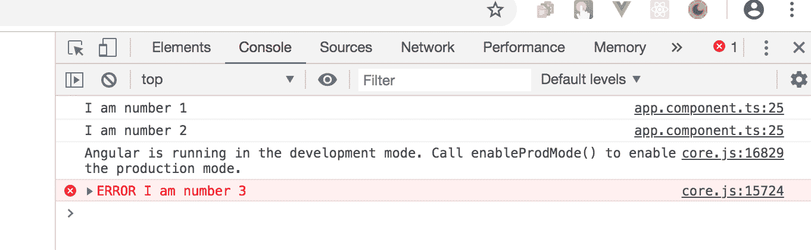
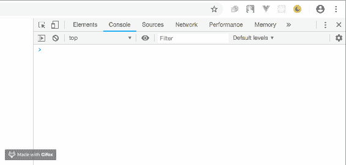

# 了解 RxJS 可观测量以及为什么需要它们

> 原文：<https://blog.logrocket.com/understanding-rxjs-observables/>

## RxJS 是什么？

RxJS 是一个反应式编程的框架，它利用了[可观察对象](https://rxjs-dev.firebaseapp.com/guide/observable)，使得编写异步代码变得非常容易。根据官方[文档](https://rxjs-dev.firebaseapp.com/)，这个项目是对 JavaScript 的一种反应式扩展，具有更好的性能、更好的模块化、更好的可调试调用堆栈，同时保持大部分向后兼容，并有一些减少 API 面的突破性变化。Angular 使用这个官方库来处理反应，将回调的拉操作转换成可观察的。

先决条件

## 为了能够完成本文的演示，您应该具备:

确认你使用的是版本 7，如果不是的话[更新到 7](https://angular.io/cli/update) 。

```
// run the command in a terminal
ng version
```

点击这里下载本教程的起始项目[来完成演示](https://github.com/viclotana/ng_canvas)

*   解压缩项目，并使用以下命令初始化终端中的节点模块
*   其他值得拥有的东西有:

```
npm install
```

初级水平的[角度](https://blog.logrocket.com/how-to-make-your-angular-8-forms-reactive/)框架的工作知识

*   理解可观测量:拉与推

## 为了理解可观测量，你必须首先理解拉和推的背景。在 JavaScript 中，有两种通信系统，称为推和拉。

一个**拉系统**基本上就是一个函数。通常首先定义一个函数(一个称为*生产*的过程)，然后调用(这个过程称为*消费*)返回函数中的数据或值。对于函数，生产者(这是定义)不知道数据何时被消费，所以函数调用从生产者那里获取返回值或数据。

另一方面，推送系统控制在生产者手中，消费者不知道数据何时会被传递给它。一个常见的例子是 JavaScript 中的承诺，承诺(生产者)将已经解析的值推给回调(消费者)。另一个例子是 RxJS Observables，Observables 产生多个称为流的值(不同于返回一个值的承诺),并将它们推送给作为消费者的观察者。

什么是溪流？

## [流](https://angular.io/guide/observables)基本上是一段时间内的数据值序列，其范围可以是 6 秒内打印的简单数字增量(0，1，2，3，4，5)或一段时间内打印的坐标，甚至是通过 web 套接字或 API 响应传递的表单或聊天文本中输入的数据值。这些都表示将随时间收集的数据值，因此称为 stream。

什么是可观测量？

## 理解流是很重要的，因为 RxJS 可观察性有助于理解流。一个可观察对象基本上是一个函数，它可以随着时间的推移向观察者返回一系列的值，这可以是同步的，也可以是异步的。返回的数据值可以从零到无限范围的值。

观察者和订阅

## 要让 Observables 工作，需要有观察者和订阅。观察器是数据源包装器，当有新值或数据值发生变化时，观察器会执行一些指令。可观察对象通过订阅连接到执行的观察者，通过订阅方法，观察者连接到可观察对象以执行代码块。

可观察的生命周期

## 在观察者和订阅的帮助下，可观察实例在其整个生命周期中会经历以下四个阶段:

创造

*   签署
*   执行
*   破坏
*   创造可观的

## 如果您从一开始就关注这篇文章，那么您一定已经用 VS 代码打开了 Angular starter 项目。要创建一个 Observable，你必须首先从 RxJS 导入 Observable 到你想要创建它的组件的`.ts`文件中。创建语法如下所示:

打开您的`app.component.ts`文件，并将下面的代码块复制到其中:

```
import { Observable } from "rxjs";

var observable = Observable.create((observer:any) => {
    observer.next('Hello World!')
})
```

订阅 Observables

```
import { Component, OnInit } from '@angular/core';
import { Observable } from "rxjs/";
@Component({
  selector: 'app-root',
  templateUrl: './app.component.html',
  styleUrls: ['./app.component.css']
})
export class AppComponent implements OnInit{
  title = 'ngcanvas';
  ngOnInit(): void {
    var observable = Observable.create()
  }

}
```

## 要告诉 RxJS 在可观察对象上执行代码块，或者用更简单的术语来说，调用可观察对象开始执行，您必须使用 subscribe 方法，如下所示:

这个 subscribe 方法将导致在控制台中记录“hello world”。

```
export class AppComponent implements OnInit{
  title = 'ngcanvas';
  ngOnInit(): void {
    var observable = Observable.create((observer:any) => {
      observer.next('Hello World!')
  })
  observable.subscribe(function logMessage(message:any) {
    console.log(message);
  })
}
```

执行观察值

## 观察者负责执行可观察对象中的指令，因此每个订阅的观察者可以向可观察对象传递三个值:

**下一个值:**对于下一个值，observer 发送一个值，可以是数字、字符串或者对象。特定可观察对象上可以设置多个后续通知

1.  **错误值:**利用错误值，观察者发送一个 JavaScript 异常。如果在可观察对象中发现一个错误，其他任何东西都不能交付给可观察对象
2.  **完整值:**有了完整值，观察者不发送任何值。这通常表示特定可观察对象的订阅已完成。如果发送了完整的值，就不能向可观察对象发送其他任何东西。
3.  这可以用下面的代码块来说明:

如果您此时在 dev 服务器中用

```
export class AppComponent implements OnInit{
  title = 'ngcanvas';
  ngOnInit(): void {
    var observable = Observable.create((observer:any) => {
      observer.next('I am number 1')
      observer.next('I am number 2')
      observer.error('I am number 3')
      observer.complete('I am number 4')
      observer.next('I am number 5')
  })
  observable.subscribe(function logMessage(message:any) {
    console.log(message);
  })
}
}
```

当您在开发人员工具中打开控制台时，您的日志将如下所示:

```
ng serve
```



您会注意到，错误值或完整值会自动停止执行，因此数字 5 不会出现在控制台中。这是一个简单的同步练习。为了使它异步，让我们在一些值周围包装计时器。

这将在您的浏览器控制台中显示如下:

```
export class AppComponent implements OnInit{
  title = 'ngcanvas';
  ngOnInit(): void {
    var observable = Observable.create((observer:any) => {
      observer.next('I am number 1')
      observer.next('I am number 2')
      setInterval(() => {
        observer.next('Random Async log message')
    }, 2000)
    observer.next('I am number 3')
    observer.next('I am number 4')
      setInterval(() => {
        observer.error('This is the end')
    }, 6001)
    observer.next('I am number 5')
  })
  observable.subscribe(function logMessage(message:any) {
    console.log(message);
  })
}
}
```



请注意，在 setInterval 模块的帮助下，这里的值显示是异步完成的。

摧毁一个可见的

## 摧毁一个可观察对象实质上就是通过取消订阅将它从 [DOM](https://blog.logrocket.com/8-dom-features-you-didnt-know-existed-ec2a0a28fd89/) 中移除。通常对于异步逻辑，RxJS 负责退订，在错误或完整通知之后，您的可观察对象立即退订。对于知识，您可以像这样手动触发取消订阅:

为什么可观察性如此重要

```
return function unsubscribe() {
    clearInterval(observable);
  };
```

## 用 Observables 异步发出多个值非常容易处理

*   错误处理程序也可以很容易地在 Observables 内部完成，而不是像 promises 这样的构造
*   可观测量被认为是惰性的，因此在没有订阅的情况下，不会发出数据值
*   与功能甚至承诺相反，可观察到的问题可以解决多次
*   结论

## 我们已经对 RxJS 中的可观察对象、观察者和订阅进行了全面的介绍。我们还通过实际例子了解了可观测量的生命周期过程。更多 RxJS 的帖子可以在博客上找到，黑客快乐！

使用 [LogRocket](https://lp.logrocket.com/blg/signup) 消除传统错误报告的干扰

## [LogRocket](https://lp.logrocket.com/blg/signup) 是一个数字体验分析解决方案，它可以保护您免受数百个假阳性错误警报的影响，只针对几个真正重要的项目。LogRocket 会告诉您应用程序中实际影响用户的最具影响力的 bug 和 UX 问题。

[](https://lp.logrocket.com/blg/signup)

然后，使用具有深层技术遥测的会话重放来确切地查看用户看到了什么以及是什么导致了问题，就像你在他们身后看一样。

LogRocket 自动聚合客户端错误、JS 异常、前端性能指标和用户交互。然后 LogRocket 使用机器学习来告诉你哪些问题正在影响大多数用户，并提供你需要修复它的上下文。

关注重要的 bug—[今天就试试 LogRocket】。](https://lp.logrocket.com/blg/signup-issue-free)

Focus on the bugs that matter — [try LogRocket today](https://lp.logrocket.com/blg/signup-issue-free).