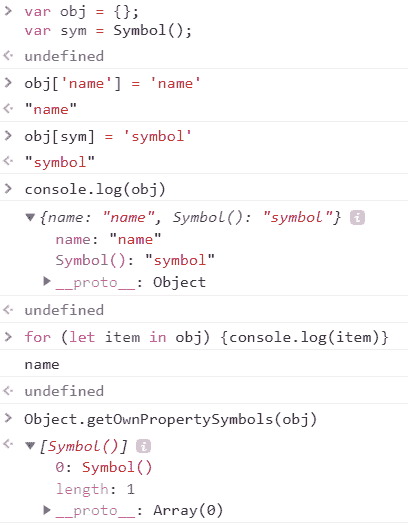
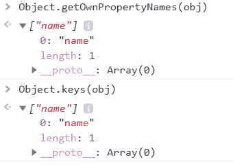
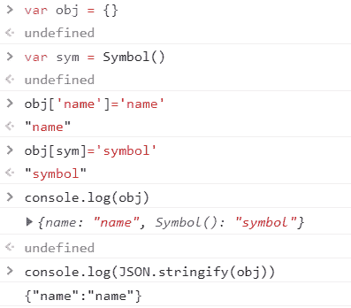
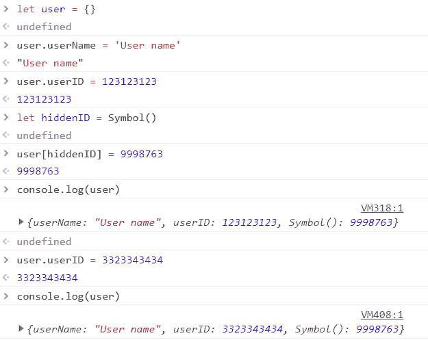
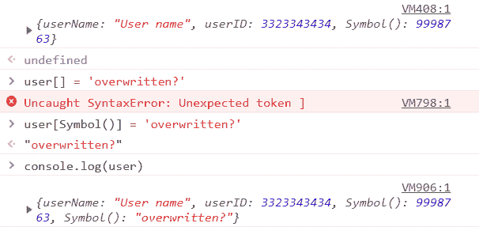

# 理解 JavaScript - LogRocket 博客中的符号

> 原文：<https://blog.logrocket.com/understanding-symbols-in-javascript/>

在符号作为一种新的原语引入 ES6 之前，JavaScript 使用七种主要的数据类型，分为两类:

1.  原语，包括字符串、数字、bigint、布尔、空和未定义的数据类型
2.  对象，包括更复杂的数据结构，如数组、函数和常规 JS 对象

从 ES6 开始，符号被添加到原语组。像所有其他原语一样，它们是不可变的，没有自己的方法。

符号的最初目的是提供全球唯一的值，这些值是私有的，仅供内部使用。然而，在这种原始类型的最终实现中，符号最终没有被私有，但它们确实保持了其值的唯一性。

我们稍后将解决隐私问题。至于符号的唯一性，如果你用工厂函数`Symbol()`创建两个不同的符号，它们的值不会相等。

```
const symbol1 = Symbol('1');
const symbol2 = Symbol('2');

console.log(symbol1 === symbol2); // Outputs False

```

`symbol1`和`symbol2`的数据类型为`symbol`。您可以通过登录到您的控制台来检查它。

```
console.log(typeof(symbol1)); // Outputs symbol
console.log(typeof(symbol2)); // Outputs symbol

```

`Symbol()`函数可以带一个字符串参数，但是这个参数对符号的值没有影响；它只是出于描述的目的。所以这个字符串对调试很有用，因为它在打印符号时为您提供了一个参考，但它只是一个标签。

```
console.log(symbol1); // Outputs Symbol(symbol1)
console.log(symbol2); // Outputs Symbol(symbol1)

```

您可能想知道为什么`Symbol()`函数不使用 new 关键字来创建一个新符号。你不会写`const symbol = new Symbol()`，因为`Symbol()`是一个函数，而不是构造函数。

```
const symbol3 = new Symbol('symbol3');

// Outputs: Uncaught TypeError: Symbol is not a constructor 

```

由于符号是原语，因此是不可变的，所以符号的值不能改变，就像数字类型原语的值不能改变一样。

这里有一个实际的例子，首先是一个数字原语:

```
let prim1 = 10;
console.log(prim1); // Outputs 10

prim1 = 20;
console.log(prim1); // Outputs 20

10 = 20 // Outputs: Uncaught ReferenceError: Invalid left-hand side in assignment

10 == 20 // Outputs: False

```

我们给`prim1`变量赋值`10`，这是一个数字原语。我们可以给变量`prim1`重新分配一个不同的值，所以我们可以说我们希望变量`prim1`的值是`20`而不是`10`。

然而，我们不能将值`20`赋给数字原语`10`。`10`和`20`都是数字型原语，所以不能变异。

这同样适用于符号。我们可以将一个有符号值的变量重新赋值给另一个符号值，但是我们不能改变实际符号原语的值。

```
let symb4 = Symbol('4');
let symb5 = Symbol('5');

symb4 = symb5; 
console.log(symb4); // Outputs Symbol(5)

Symbol(4) = Symbol(5); // Outputs: ReferenceError: Invalid left-hand side in assignment

```

对于大多数原语，该值总是与具有相同值的其他原语完全相等。

```
const a = 10;
const b = 10;

a == b; // Outputs True
a === b; // Outputs True

const str1 = 'abc';
const str2 = 'abc';

str1 == str2; // Outputs True
str1 === str2; // Outputs True

```

但是，对象数据类型永远不等于其他对象类型；他们每个人都有自己的身份。

```
let obj1 = { 'id': 1 };
let obj2 = { 'id': 1 };

obj1 == obj2; // Outputs False
obj1 === obj2; // Outputs False

```

您可能会认为符号的行为类似于数字或字符串类型的原语，但从这个角度来看，它们的行为类似于对象，因为每个符号都有唯一的标识。

```
let symbol1 = Symbol('1');
let symbol2 = Symbol('2');

symbol1 == symbol2; // Outputs False
symbol1 === symbol2; // Outputs False 

```

那么是什么让符号独一无二呢？它们是原语，但是当涉及到它们的值时，它们的行为就像对象一样。在讨论符号的实际用途时，记住这一点非常重要。

## 符号在现实生活中什么时候使用，如何使用？

如前所述，符号旨在体现独特的私人价值。然而，他们最终没有成为私有。如果打印对象或使用`Object.getOwnPropertySymbols()`方法，就可以看到它们。

此方法返回在对象中找到的所有符号属性的数组。

```
let obj = {};
let sym = Symbol();

obj['name'] = 'name';
obj[sym] = 'symbol';

console.log(obj);

```



然而，注意这个符号对于`for`循环是不可见的，所以当迭代发生时它被跳过。

```
for (let item in obj) { 
   console.log(item) 
}; // Outputs name

Object.getOwnPropertySymbols(obj); 

```

同样，符号不是`Object.keys()`或`Object.getOwnPropertyNames()`结果的一部分。



此外，如果您尝试将对象转换为 JSON 字符串，该符号将被跳过。

```
let obj = {};
let sym = Symbol();

obj['name'] = 'name';
obj[sym] = 'symbol';

console.log(obj);
console.log(JSON.stringify(obj));

```



所以符号并不完全是私有的，但是它们只能通过特定的方式被访问。它们还有用吗？它们在现实生活中的使用时间和方式？

最常见的是，在两种情况下使用符号:

1.  您不希望用户误覆盖的唯一属性值
2.  用于标识对象属性的唯一键

让我们看看每个场景在实践中是什么样子的。

### 1.唯一属性值

对于这个用例，我们将做一个简单的练习，我们假装是一个发布旅行安全建议的国家旅行咨询机构。这里可以看到代码[。](https://jsfiddle.net/7kshdgye/)

假设我们有一个颜色编码系统来代表特定区域的各种危险等级。

*   红色代码是最高级别；人们不应该去这个地区旅行
*   Code Orange 是高水平；如果真的有必要，人们应该只去这个地区旅行
*   黄色代码代表中度危险；人们去这个地区旅行时应该保持警惕
*   绿色代码表示没有危险；人们可以安全地前往这个地区

我们不希望这些代码及其值被错误地覆盖，所以我们将定义以下变量。

```
const id = Symbol('id');

const RED = Symbol('Red');
const ORANGE = Symbol('Orange');
const YELLOW = Symbol('Yellow');
const GREEN = Symbol('Green');

const redMsg = Symbol('Do not travel');
const orangeMsg = Symbol('Only travel if necessary');
const yellowMsg = Symbol('Travel, but be careful');
const greenMsg = Symbol('Travel, and enjoy your trip');

let colorCodes = [{
    [id]: RED,
    name: RED.description,
    message: redMsg.description,
  },
  {
    [id]: ORANGE,
    name: ORANGE.description,
    message: orangeMsg.description,
  },
  {
    [id]: YELLOW,
    name: YELLOW.description,
    message: yellowMsg.description,
  },
  {
    [id]: GREEN,
    name: GREEN.description,
    message: greenMsg.description,
  }
]

let alerts = colorCodes.map(element => {
  return (`It is Code ${element.name}. Our recommendation for this region: ${element.message}.`);
});

let ul = document.getElementById("msgList");

for (let elem in alerts) {
  let msg = alerts[elem];
  let li = document.createElement('li');
  li.appendChild(document.createTextNode(msg));
  ul.appendChild(li);
}

```

本练习对应的 HTML 和 SCSS 片段如下。

```
<div>
  <h1>Alert messages</h1>
  <ul id="msgList"></ul>
</div>

ul {
  list-style: none;
  display: flex;
  flex: row wrap;
  justify-content: center;
  align-items: stretch;
  align-content: center;
}

li {
  flex-basis: 25%;
  margin: 10px;
  padding: 10px;

  &:nth-child(1) {
    background-color: red;
  }

  &:nth-child(2) {
    background-color: orange;
  }

  &:nth-child(3) {
    background-color: yellow;
  }

  &:nth-child(4) {
    background-color: green;
  }
}

```

如果您登录`colorCodes`，您会看到 ID 和它的值都是符号，所以当以 JSON 的形式检索数据时，它们不会显示出来。

因此，很难错误地覆盖这个颜色代码的 ID 或值本身，除非您知道它们在那里或者您检索它们，如前所述。

### 2.用于标识对象属性的唯一键

在引入符号之前，对象键总是字符串，所以很容易被覆盖。此外，在使用多个库时，名称冲突是很常见的。

假设您有一个应用程序，它有两个不同的库，试图向一个对象添加属性。或者，也许您正在使用来自第三方的 JSON 数据，并且希望为每个对象附加一个唯一的`userID`属性。

如果你的对象已经有一个名为`userID`的键，你最终会覆盖它，从而丢失原来的值。在下面的例子中，`userID`有一个被覆盖的初始值。

```
let user = {};

user.userName = 'User name';
user.userID = 123123123;

let hiddenID = Symbol();
user[hiddenID] = 9998763;

console.log(user);

```



如果您查看上面的用户对象，您会发现它也有一个** `Symbol(): 9998763`属性。这是`[hiddenID]`键，其实是一个符号。因为这不会在 JSON 中出现，所以很难覆盖它。此外，当没有描述作为字符串附加到符号时，不能覆盖该值。

```
user[] = 'overwritten?'; // Outputs SyntaxError: Unexpected token ]

user[Symbol()] = 'overwritten?'; 

console.log(user);

```



这两个符号都被添加到这个对象中，所以我们用值`99987`覆盖原始符号的尝试失败了。

## 符号是独一无二的——直到它们不再是

还有一点需要注意的是，这使得符号没有它们原本的用途那么有用。如果你声明一个新的`Symbol()`，这个值确实是唯一的，但是如果你使用`Symbol.for()`方法，你将在全局符号注册表中创建一个新值。

如果这个值已经存在，只需调用方法`Symbol.for(key)`就可以检索到它。如果您检查被赋予这些值的变量的唯一性，您会发现它们实际上并不唯一。

```
let unique1 = Symbol.for('unique1');
let unique2 = Symbol.for('unique1');

unique1 == unique2; // Outputs True
unique1 == unique2; // Outputs True

Symbol.for('unique1') == Symbol.for('unique1'); // Outputs True
Symbol.for('unique1') === Symbol.for('unique1'); // Outputs True

```

此外，如果你有两个不同的变量，它们的值相等，你给它们赋值`Symbol.for()`方法，你仍然会得到相等的值。

```
let fstKey = 1;
let secKey = 1;

Symbol.for(fstKey) == Symbol.for(secKey); // Outputs True
Symbol.for(fstKey) === Symbol.for(secKey); // Outputs True

```

当您想要为变量(如 IDs)使用相同的值并在应用程序之间共享它们时，或者如果您想要定义一些仅适用于共享相同密钥的变量的协议时，这可能是有益的。

现在，您应该对何时何地可以使用符号有了基本的了解。请注意，即使它们在 JSON 格式中不直接可见或不可检索，它们仍然可以被读取，因为符号不提供真实的属性隐私或安全性。

## 通过理解上下文，更容易地调试 JavaScript 错误

调试代码总是一项单调乏味的任务。但是你越了解自己的错误，就越容易改正。

LogRocket 让你以新的独特的方式理解这些错误。我们的前端监控解决方案跟踪用户与您的 JavaScript 前端的互动，让您能够准确找出导致错误的用户行为。

[](https://lp.logrocket.com/blg/javascript-signup)

LogRocket 记录控制台日志、页面加载时间、堆栈跟踪、慢速网络请求/响应(带有标题+正文)、浏览器元数据和自定义日志。理解您的 JavaScript 代码的影响从来没有这么简单过！

[Try it for free](https://lp.logrocket.com/blg/javascript-signup)

.