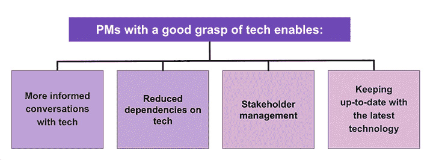

# 非技术产品经理了解技术基础

> 原文：<https://blog.logrocket.com/product-management/understanding-tech-basics-for-non-technical-product-managers/>

“下午好！前端在登录步骤失败。API 服务中断，正在发送 4xx 响应代码。

作为一名项目经理，您肯定听说过开发人员在回复客户支持单或调试某个特性时会说类似的话。

但是这些术语是什么？前端？API？它们为什么重要？在本文中，我们将回顾作为非技术产品经理需要了解的基本(但重要)技术术语和流程。

* * *

*向前跳转*

* * *

## 为什么作为一名项目经理，精通技术很重要

作为一名产品经理，你将每天与技术或工程团队进行大量的交流。这可能有多种原因，例如，新功能发布或在现有功能中发现的错误。

对技术的一般工作原理(以及你所拥有的具体产品特性)有基本了解的几个主要原因是:

1.  **与技术人员进行更有见地的对话:**作为一名项目经理，这种理解能让你更深入。您将能够了解团队提出的技术任务或功能的可行性和时间表，以及相关的挑战。最终，你将能够更好地理解技术团队
2.  **减少对技术的依赖:**虽然我并不是说项目经理可以开始解决软件错误或编码，但这在诸如客户问题的基本调试和测试开发中的特性等领域是有帮助的
3.  **[利益相关者管理](https://blog.logrocket.com/product-management/what-stakeholder-management-tools-techniques/) :** 作为一名项目经理，你通常会收到来自各种其他团队的请求，比如客户支持、业务和运营。增强技术知识可以让您更好地预先管理他们的期望和焦虑
4.  **与最新技术保持同步:**后 COVID 时代的技术采用迅速增加，导致了跨行业的数字颠覆。因此，作为项目经理，您的一个重要职责就是了解您所在行业以及其他适用行业的最新技术趋势，并在必要时了解如何在内部实施这些趋势

## 在以产品为导向的公司中，技术团队是如何组织的

通常，在以产品为导向的公司中，团队被分成更小的单元。它们有可能按照客户获取漏斗阶段进行组织，如认知、获取、激活等。

此外，每个 pod 都有来自不同部门的成员，包括技术、设计、产品和业务部门，这样每个部门几乎都可以独立运作。

具体谈到技术团队，它由具有不同技能的成员组成:

*   **前端(FE)工程师:**顾名思义，FE 是指任何面向用户或客户的东西。FE 开发人员致力于用户直接交互的方面。例如，网站或应用程序上的**提交细节**按钮，使用 JavaScript、CSS 和 HTML 等编码语言构建
*   后端工程师:虽然客户只看到前端，但很多事情都发生在后台。继续之前的例子，用户点击网站上的**提交细节**，工程师们正在研究一旦用户点击按钮会发生什么。例如，在数据库中为该特定用户创建一个日志以及他们的详细信息，甚至可能触发一封欢迎电子邮件。因此，它们涉及数据存储、数据库、API 和其他服务器端功能等领域。他们精通 Python、Ruby、PHP 和 Java 等编程语言
*   **全栈工程师:**简而言之，他们既可以从事前端任务，也可以从事后端任务，即全栈。他们知道双方需要的编程语言
*   **质量保证(QA)/测试:**质量保证工程师在一个特性开发出来后就对其进行测试，与前端和后端开发人员合作，以确保该特性按预期工作并且没有错误
*   **工程经理(EM):** 这更多的是一个管理角色，主要是一个高级 FE/BE/全栈开发人员，他已经晋升到现在管理技术舱。作为一名项目经理，与 EM 保持良好的关系非常重要，以确保您的功能在即将到来的 sprints 中得到优先考虑，并确保您获得所需的资源

## 软件开发生命周期是如何工作的？

现在让我们举一个例子来理解软件产品开发生命周期。

假设您的任务是为客户创建一个注册页面。您已经完成了与用户交谈、了解他们的挑战、定义和确定问题大小(需要注册页面)、编写 PRD 以及与设计团队合作开发设计的艰苦工作。现在，您将它交给技术团队来实施。

最初，FE 和 BE 工程师将各自负责创建注册页面。写完代码后，他们会做一些健全性测试，看看是否一切正常。之后，QA 工程师开始集成前端和后端，并完成端到端的测试。

作为最后一步，在按计划发布之前，与包括产品和设计在内的所有利益相关方一起安排一次产品演示，以展示注册流程符合预期并且没有任何错误。

## 与技术团队的会议类型

技术是最关键的职能，也是公司的支柱。项目经理可能会幻想他们想要的新功能，但如果没有技术团队来提供它们，愿原力与你同在！

主要会议有:

### 积压整理

**时长**:45-60 分钟；每周(或每两周)

**主要利益相关者**:工程经理

**目标** : [项目经理提供了对即将到来的冲刺](https://blog.logrocket.com/product-management/what-is-backlog-grooming-aka-refinement/)中预期任务的看法，同时了解了所提议工作的技术可行性

### 冲刺前计划

**时长**:45-60 分钟；每两周一次(或根据 sprint 频率)；理想的情况是在下一次冲刺开始前几天

**关键利益相关者**:工程部门的高级人员；其他项目经理

**目标**:为下一次冲刺确定[建议任务的优先级](https://blog.logrocket.com/product-management/what-is-sprint-planning-guide-meeting-agenda-cheat-sheet/)

### 竖立

**时长**:30-45 分钟；每天地；天天地

**主要利益相关者**:工程经理

**目标**:开发人员/QA 提供当前 sprint(两个星期的时间段)中任务进度的快速更新，如果需要的话请求支持，并分享修改后的时间表

### 追溯(追溯)

**时长**:45-60 分钟；每 4–6 周一次

**关键利益相关者**:高级产品负责人；其他 pm；技术 EMs

**目标** : [在过去 4-6 周内，从产品生命周期的角度、需要解决的差距、关键经验和最佳实践，找出积极的方面和需要改进的地方](https://blog.logrocket.com/product-management/what-is-a-sprint-retrospective-templates-and-best-practices/)。所有这些都是为了不断迭代改进！

## 常用技术术语

如果你是一个非技术产品经理，理解技术术语会让人感到畏惧。根据我对最近毕业的项目经理进行的调查，以下是项目经理需要了解的一些关键技术术语:

### 技术堆栈

公司用来构建和监控其产品的技术选择。它也被称为技术基础设施或解决方案堆栈。通常，它将包括前端/后端技术、编程语言、框架和数据库。

### 敏捷

一种软件开发方法，其中一个特定的任务被分解成更小的块，以一种有时间限制的方式和迭代的方式完成。[它允许更快的开发](https://blog.logrocket.com/product-management/agile-product-management-what-does-it-mean/)并增强跨职能团队之间的协作，以便在整个产品开发出来之前纠正错误。

### 积压

之前讨论过的功能和需求的运行列表，这些功能和需求尚未由技术团队进行优先排序和执行，通常是由于带宽限制或其他更高优先级的任务。

### 应用程序编程接口

API 允许请求者(或客户机)访问来自提供者(服务器)的某些信息。这些信息可以存储在内部的另一个数据库中，也可以存储在外部的另一个供应商处。

一个简单的类比是顾客(客户)去餐馆(服务器)点一些食物。在这里，服务员充当了一个 API——他们提供菜单(来自厨房的信息)，接受订单(来自顾客的信息)，将其传达给厨房，然后将最终的菜肴端给顾客。

还有一些与 API 相关的术语:

*   **延迟**:API 收到请求和返回响应之间的时间
*   **响应时间**:一个 API 接收、处理和返回响应所花费的总时间
*   **端点**:请求者提到的一个数字位置(通常是一个 URL ),表示所请求的信息在哪里可用

### 微服务

一种软件开发方法，其中软件被分解成小的或“微”的服务，这些服务是独立的，并通过 API 与其他服务进行通信。

* * *

订阅我们的产品管理简讯
将此类文章发送到您的收件箱

* * *

他们的失败不会影响其他服务。这种方法允许应用程序更快地扩展和开发。

这与整体架构形成了鲜明对比，在整体架构中，所有流程都被组合在一起，作为一个服务来运行。在这里，不利的一面是，即使一个流程出现需求高峰，整个服务都需要扩展，导致复杂性和依赖性增加。此外，一个进程的失败可能会导致整个应用程序失败。

### 回归测试

一种软件测试，旨在确保新功能或错误修复不会影响产品的现有功能。通常，它包括在所有后续迭代中检查一个已知的 bug(在以前的版本中发现的)。

### 沙箱

一个独立、安全的环境，在此环境中，代码可以在发布给更广泛的用户之前进行测试——在此环境中，如果有 bug，可能会产生重大的负面影响。

沙盒包括一个开发服务器和一个临时服务器，很大程度上类似于生产环境。这确保了如果一段新代码在沙盒中运行良好，生产中极有可能出现最小的问题。

## 作为项目经理，如何提高自己的技术知识并保持更新

以下是一些有助于提高您的技术知识的资源。

### (主要)免费资源

例如 Twitter、Youtube、LinkedIn 和播客。关注您所在行业和整体的顶级产品/技术领导者，了解最新的技术趋势和术语。

#### 特定行业出版物和通用技术或 PM 博客

与上面类似，这些将提供关于最新技术和特性的更深入的指导。

#### 贵公司经验丰富的项目经理和工程师

这是以经济高效的方式快速学习公司和行业特定技术的最佳方式(同时建立关系！)

### 付费或其他资源

以下是我自己用过的或者普遍强烈推荐的一些资源:

## 结论

对技术基础的扎实理解对于 PMs 的长期成功至关重要——它有助于与技术和其他利益相关者建立牢固的关系，并快速适应行业中的相关数字中断。

本文中提到的概念和指导方针肯定会在开发增值特性的竞争中给早期项目管理提供帮助。

*精选图片来源:[icon scout](https://iconscout.com/icon/deal-1956271)*

## [LogRocket](https://lp.logrocket.com/blg/pm-signup) 产生产品见解，从而导致有意义的行动

[LogRocket](https://lp.logrocket.com/blg/pm-signup) 确定用户体验中的摩擦点，以便您能够做出明智的产品和设计变更决策，从而实现您的目标。

使用 LogRocket，您可以[了解影响您产品的问题的范围](https://logrocket.com/for/analytics-for-web-applications)，并优先考虑需要做出的更改。LogRocket 简化了工作流程，允许工程和设计团队使用与您相同的[数据进行工作](https://logrocket.com/for/web-analytics-solutions)，消除了对需要做什么的困惑。

让你的团队步调一致——今天就试试 [LogRocket](https://lp.logrocket.com/blg/pm-signup) 。

[Divyang Saxena Follow](https://blog.logrocket.com/author/divyangsaxena/) Financial Analyst turned Product Manager | When not in cross-functional meetings, find me at the gym, reading non-fiction, or traveling | Connect on [LinkedIn](https://www.linkedin.com/in/divyangsaxena/)