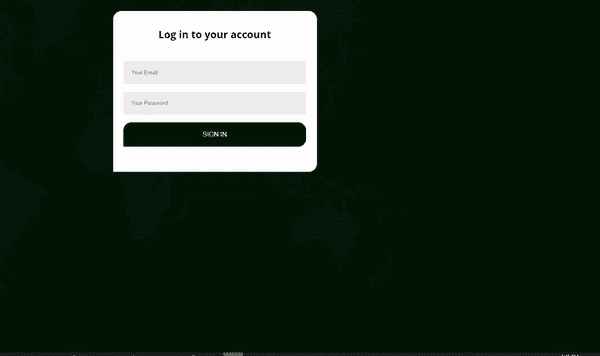
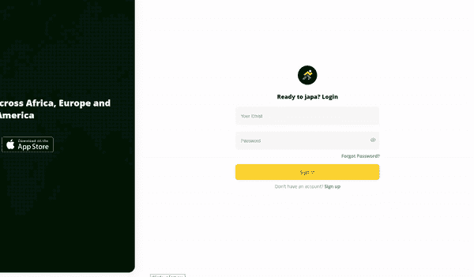

# 理解 Vue - LogRocket 博客中的过渡和动画

> 原文：<https://blog.logrocket.com/understanding-transitions-and-animations-in-vue/>

在 web 应用程序中添加过渡和动画有助于吸引用户的注意力，使用户体验更加生动。即使是细微的效果和动作也能给你的页面带来动感，尤其是当它们在网站加载时播放的时候。

为了把我所说的放在上下文中，看看下面的这些登录页面(来源: [japa](https://wejapa.firebaseapp.com/) )。





这些页面中哪一个在视觉上更吸引人？我肯定大多数人会选择第二种。效果很小，但它比第一个静态页面提供了更多的视觉刺激。另一方面，如果动画太多或太快，可能会令人不安。

Vue.js 中的转换尤其适用于需要在 DOM 中添加或删除元素的情况，无论是因为路由、条件语句还是任何影响元素添加到 DOM 的因素。

考虑下面的例子。我们有我们的组件，我们使用条件(`v-if` / `v-else`)来切换网页中的元素。

```
<template>
  <div>
   <div class="container">
  <button @click="display = !display">Switch</button>
     <div class="item" v-if="display">1</div>
   </div>
  </div>
</template>
<style scoped>
  body {
    align-content: center;
  }
    .container {
        display: grid;
        grid-gap: 20px;
        width: 500px;
        margin: 0 auto;
      }
    .item {
      background-color: blue;
      height: 100px;
    }
</style>

```

然后我们可以添加数据属性来绑定到 HTML 表单。

```
[...]

<script>
export default {
  data () {
    return {
      display : false
    }
  }
}
</script>

```

要在该元素被切换时创建一个过渡，第一步是将该元素包装在一个`<transition>`标签中。接下来，给它一个惟一的`name`，在创建转换类时使用。

这种切换不一定是由于`v-if`/`v-else`；它可以是一个动态组件或其他任何东西。只要用一个`<transition>`标签包装这个元素，它就能同样工作。

```
<button @click="display = !display">Switch</button>
<transition name="block">
 <div class="item" v-if="display">1</div>
</transition>

```

在任何给定时间，转换标签只允许显示一个元素(或一个`div`包装下的一组元素)。

输入名称后，这就是过渡类出现的地方。过渡类是 Vue 附带的默认类，用于确定何时以及如何在 DOM 中添加或删除元素。

*   `.v-enter` —在附加到 DOM 时，此 CSS 类仅在过渡开始时附加一帧
*   `.v-enter-active` —这是在第一帧之后附加到 DOM 的过程发生的地方
*   `.v-leave` —与`.v-enter`一样，这是在移除 DOM 时为一帧附加的
*   `.v-leave-active` —这是保存从 DOM 中移除元素的过渡样式的类。

在现实生活中的应用程序中，您可以将类前面的`.v`替换为您希望它影响的转换的`name`。因此，您的组件应该是这样的结构:

*   `.block-enter`
*   `.block-enter-active`
*   `.block-leave`
*   `.block-leave-active`

让我们使用初始组件快速旋转一个渐变过渡的例子。过渡类将如下所示:

```
.block-enter {
        Opacity: 0;
}
.block-enter-active {
        transition : opacity 2s;
}
.block-leave {
}
.block-leave-active {
        transition: opacity 2s;
        Opacity: 0;
}

```

在`.block-enter`中，不透明度默认为`0`。元素逐渐用`.block-enter-active`显示自己，不透明度为`2s`。

使用`.block-leave`，默认情况下不透明度是`1`,因为此时元素仍然附加到 DOM。随着`.block-leave-active`，它逐渐消失，直到不透明度结束`0`。

## 动态命名

根据您的代码或您希望转换看起来像什么，转换元素的命名不一定总是硬编码的。您还可以绑定转换的名称，因此它可以是动态的，而不必是硬编码的。它将被绑定到一个属性，并可以通过下拉菜单或按钮进行更改——同样，这取决于您希望采取的操作。这在有两种不同的过渡样式并且需要在它们之间切换的情况下很有用。

在下面的例子中，我们将使用下拉菜单。

```
<template>
  <div>
   <div class="container">
   <select v-model="animate">
     <option value="block">Fade</option>
     <option value="gradualFade">Slower fade</option>
   </select>
   <button @click="display = !display">Switch</button>
    <transition :name="animate">
      <div class="item" v-if="display">1</div>
    </transition>
   </div>
  </div>
</template>

[...]

<style scoped>
  body {
    align-content: center;
  }
    .container {
        display: grid;
        grid-gap: 20px;
        width: 500px;
        margin: 0 auto;
      }
    .item {
      background-color: blue;
      height: 100px;
    }

  .block-enter {
        Opacity: 0;
  }
  .block-enter-active {
        transition : opacity 2s;
  }
  .block-leave {
  }
  .block-leave-active {
        Transition: opacity 2s;
        Opacity: 0;
  }
  .gradualFade-enter {
        Opacity: 0;
  }
  .gradualFade-enter-active {
        transition : opacity 4s;
  }
  .gradualFade-leave {
  }
  .gradualFade-leave-active {
        Transition: opacity 4s;
        Opacity: 0;
  }
</style>
<script>
export default {
  data () {
    return {
      display : false,
      animate : 'block'
    }
  }
}
</script>

```

## 动画属性

动画属性可用于处理动画，就像过渡属性一样。它们使用关键帧的方式与传统 CSS 相同。

让我们重新创建淡入淡出效果，但是这次使用动画属性。

```
<template>
  <div>
    <div class="container">
    <button @click="display = !display">Switch</button>
    <transition name="block">
      <div class="item" v-if="display">1</div>
    </transition>
  </div>
  </div>
</template>

<style scoped>
  body {
    align-content: center;
  }
    .container {
        display: grid;
        grid-gap: 20px;
        width: 500px;
        margin: 0 auto;
      }
    .item {
      background-color: blue;
      height: 100px;
    }
    .block-enter {
    }
    .block-enter-active {
      animation : fade-in 1s 
    }
    .block-leave {
    }
    .block-leave-active {
       animation : fade-out 1s 
    }
    @keyframes fade-in {
      from {
        opacity : 0
      }
      to {
        opacity : 1;
      }
    }
    @keyframes fade-out {
      from {
        opacity : 1;
      }
      to {
        opacity : 0;
      }
    }
</style>
<script>
export default {
  data () {
    return {
      display : false
    }
  }
}
</script>

```

使用我们之前设置的相同组件，我们可以更改样式，这次使用关键帧并将动画名称和时间添加到过渡类。

## 混合动画和过渡

您可以在同一个元素上同时使用动画和过渡，这在创建效果时特别有用。要查看实际效果，让我们使用过渡和动画创建同时执行的幻灯片和淡入淡出效果。

* * *

### 更多来自 LogRocket 的精彩文章:

* * *

当附加到 DOM 时，盒子从下面滑入，同时淡入。当从 DOM 中移除时，它会向上滑动并淡出。

```
<template>
  <div>
    <div class="container">
    <button @click="display = !display">Switch</button>
    <transition name="block">
      <div class="item" v-if="display">1</div>
    </transition>
  </div>
  </div>
</template>

<style scoped>
  body {
    align-content: center;
  }
    .container {
        display: grid;
        grid-gap: 20px;
        width: 500px;
        margin: 0 auto;
      }
    .item {
      background-color: blue;
      height: 100px;
      margin-bottom: 10px;
    }
    .block-enter {
      opacity: 0;
    }
    .block-enter-active {
      animation : slide-in 1s ease-out forwards;
      transition : opacity 1s;
    }
    .block-leave {
        opacity: 1;
    }
    .block-leave-active {
       animation : slide-out 1s ease-out forwards;
       transition : opacity 1s;
       opacity: 0;
    }
    @keyframes slide-in {
      from {
         transform: translateY(20px);
      }
      to {
         transform: translateY(0);
      }
    }
    @keyframes slide-out {
      from {
        transform: translateY(0);
      }
      to {
         transform: translateY(-20px);
      }
    }
</style>
<script>
export default {
  data () {
    return {
      display : false
    }
  }
}
</script>

```

我们仍然使用相同的组件。在样式中，我们为附加和分离元素添加了单独的动画关键帧。

对于`slide-in`关键帧，由于它从下面滑入，我们给`transform: translateY(0)`添加了`transform: translateY(20px)`。

对于`slide-out`关键帧，它向上滑出，所以我们给`transform: translateY(0)`添加了`transform : translateY(-20px)`。

回到过渡班；我们给了`block-enter`帧一个`0`的不透明度。

```
.block-enter {
    Opacity: 0;
}

```

在`.block-enter-active`中，它逐渐将不透明度更改为`1`(默认为`1`，因为它附加到了 DOM 中)，所有这些都在`1s`中。`slide-in`动画使用`forwards`来确保它正确着陆。

```
.block-enter-active {
      animation : slide-in 1s ease-out forwards;
     transition : opacity 1s;
}

```

为了从 DOM 中移除，动画被添加到`.block-leave-active`。它滑出，不透明度变为`0`，仍在`1s`内。

```
.block-leave-active {
   animation : slide-out 1s ease-out forwards;
   transition : opacity 1s;
   opacity: 0;
}

```

如果动画中使用的时间与任何过渡类中的过渡(附加或分离)不同，就不会有平衡，并且会不均匀地变化。如果是这种情况，将`type`添加到过渡类，并告诉它确切的时间，无论是过渡还是动画。

```
<transition name="block" type="animation">
      <div class="item" key="1" v-if="display">1</div>
    </transition>

```

如果您想让动画在加载页面时工作，您可以将显示参数更改为`true`并将`appear`添加到`transition`标签中。

```
<transition name="block" type="animation" appear>
      <div class="item" key="1" v-if="display">1</div>
    </transition>

```

## 在转换标签中使用`Animate.css`库

是一个流行的动画库，你可能已经熟悉了。即使用 Vue 也很有用。

像`Animate.css`这样的库除了我们一直在使用的转换类之外，还有它们自己的 CSS 类。为了解决这个问题，我们将采取以下步骤。

1.  安装 NPM 包或将`animate.css`的 CDN 添加到`index.html`

    ```
    npm install animate.css --save
    ```

2.  不是给 transition 标签添加一个 name 属性，而是添加两个新属性:`.enter-active-class`和`.leave-active-class`。在这里，您将添加来自`animate.css`的类，用于在 DOM 中添加和移除

    ```
     <transition    name="block"   enter-active-class="animate__animated animate__bounce"    leave-active-class="animate__animated animate__pulse"          >       <div class="item" key="1" v-if="display">1</div>     </transition> 
    ```

## 在多个元素之间转换

如果您需要在一个转换标签中有两个元素，并且由于一个条件`v-if`而一次只显示一个，请采取以下步骤。

1.  在转换标签中，给它一个模式属性。模式可以是`out-in`或`in-out`。`Out-in`表示当前显示的元素在新的元素出现之前消失，反之亦然`in-out`
2.  然后，我们给这两个元素中的每一个提供键，这作为转换标签包装器使用它们的唯一标识符。就是这样！他们会顺利地交换位置，不会有任何问题。

    ```
    <transition name="block" mode="out-in">       <div class="item" key="1" v-if="display">1</div>       <div class="item" key="2" v-if="!display">2</div>     </transition> 
    ```

## 使用`transition-group`制作列表动画

使用`transition-group`和使用`transition-group`标签是一样的，只是一次显示一系列元素，而不是一个。如果您只想循环访问从 API 获取的数据，这很有用，可能是为了仪表板或类似的东西。

一个有趣的事实是，`transition-group`实际上作为`<span>`呈现给了 DOM，但是另一方面，`transition`并没有呈现给 DOM。

下面是一个包装了一些元素的`transition-group`标签。我们仍然使用与`transition`标签相同的转换类，但是这次每个单独的元素都有一个键。该键与`transition`标签一起使用。它允许`transition-group`识别每个元素，并可以根据需要制作动画。

```
<template>
  <div>
    <div class="container">
    <button @click="display = !display">Switch</button>
    <transition-group name="block">
    <div class="item" key="1" v-if="display">1</div>
    <div class="item" key="2" v-if="display">2</div>
    <div class="item" key="3" v-if="display">3</div>
    </transition-group>
  </div>
  </div>
</template>

[...]

<style scoped>
  body {
    align-content: center;
  }
    .container {
        display: grid;
        grid-gap: 20px;
        width: 500px;
        margin: 0 auto;
      }
    .item {
      background-color: blue;
      height: 100px;
      margin-bottom: 10px;
    }
    .block-enter {
      opacity: 0;
    }
    .block-enter-active {
      animation : slide-in 1s ease-out forwards;
      transition : opacity 1s;
    }
    .block-leave {
        opacity: 1;
    }
    .block-leave-active {
       animation : slide-out 1s ease-out forwards;
       transition : opacity 1s;
       opacity: 0;
    }
    @keyframes slide-in {
      from {
         transform: translateY(20px);
      }
      to {
         transform: translateY(0);
      }
    }
    @keyframes slide-out {
      from {
        transform: translateY(0);
      }
      to {
         transform: translateY(-20px);
      }
    }
</style>
<script>
export default {
  data () {
    return {
      display : false
    }
  }
}
</script>

```

## 结论

走之前值得注意的是，有 [vue2-animate](https://www.npmjs.com/package/vue2-animate) 这样的动画库可以帮助你在 vue 中创建无缝动画，而不必自己编写代码。

如果你不清楚代码，请随意参考 GitHub repo。还有一个[演示网站](https://vue-animation.netlify.app/)，你可以在那里检查所有的效果。

## 像用户一样体验您的 Vue 应用

调试 Vue.js 应用程序可能会很困难，尤其是当用户会话期间有几十个(如果不是几百个)突变时。如果您对监视和跟踪生产中所有用户的 Vue 突变感兴趣，

[try LogRocket](https://lp.logrocket.com/blg/vue-signup)

.

[](https://lp.logrocket.com/blg/vue-signup)[https://logrocket.com/signup/](https://lp.logrocket.com/blg/vue-signup)

LogRocket 就像是网络和移动应用程序的 DVR，记录你的 Vue 应用程序中发生的一切，包括网络请求、JavaScript 错误、性能问题等等。您可以汇总并报告问题发生时应用程序的状态，而不是猜测问题发生的原因。

LogRocket Vuex 插件将 Vuex 突变记录到 LogRocket 控制台，为您提供导致错误的环境，以及出现问题时应用程序的状态。

现代化您调试 Vue 应用的方式- [开始免费监控](https://lp.logrocket.com/blg/vue-signup)。