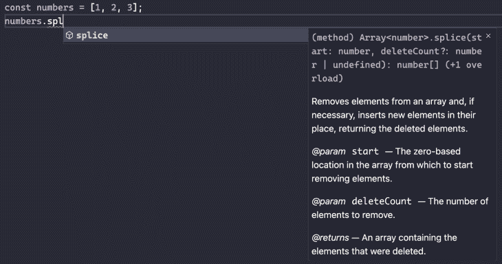
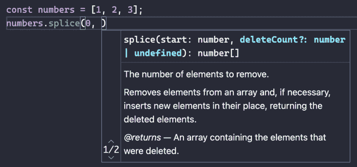
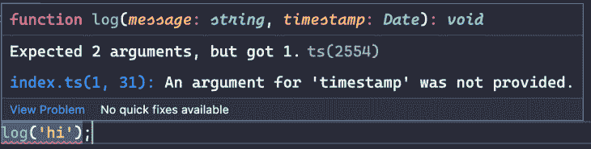
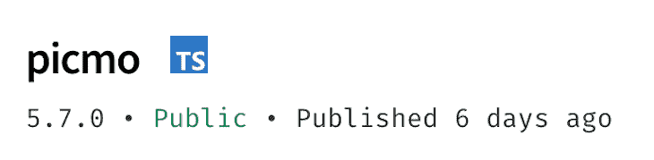

# 了解 TypeScript 的优点和缺点

> 原文：<https://blog.logrocket.com/understanding-typescripts-benefits-pitfalls/>

JavaScript 的动态类型允许灵活性，但是它增加了额外的复杂性和风险。如果有人将一个`Number`传递给一个需要一个`Date`的函数，这个函数很可能会抛出一个异常，除非这个函数添加一些额外的代码来确保这个参数实际上是一个`Date`。

类型检查是 TypeScript 的主要优点。通过将静态类型添加到语言中，我们可以在构建时发现许多这样的问题。它们可以在代码发布前修复。

当然，这不是万灵药。像任何工具一样，有积极和消极的方面。在本帖中，我们将讨论:

## 好人

让我们从探索 TypeScript 的好处开始。还有许多其他的没有在这里列出，但这些是最好的一些。

### 出色的代码完成

我主要使用 Visual Studio 代码作为我的 IDE。在其众多强大的特性中，VS 代码带有内置的 TypeScript 智能。弹出代码完成可用于 web 平台 API 以及任何具有类型定义的第三方包(现在，在 2022 年，大多数都有)。

不记得拼接数组的参数了？VS 代码已经覆盖了你。考虑这个简单的数组:

```
const numbers = [1, 2, 3];
```

当我开始调用`numbers`数组上的一个函数时，VS Code 的智能感知开始工作，并向我显示匹配的函数:



我看到了函数签名和每个参数的描述。当我继续键入对`splice`的调用时，当前参数被突出显示:



如果我错误地调用了一个函数，我会立即得到红色下划线:



当然，VS 代码只是一个编辑器；许多其他现代编辑器和 ide 也提供一流的类型脚本支持。

### 支持增量采用

TypeScript 有[许多配置选项](https://www.typescriptlang.org/tsconfig)，包括许多控制严格类型检查的选项。

当您从简单的配置开始并关闭严格的检查时，进入的障碍降低了，您的项目可以开始享受静态类型的好处。随着您和您的团队对 TypeScript 越来越熟悉，可以添加额外的选项来开始进行更严格的检查。

TypeScript 可以在 JavaScript 文件的项目中引入，因为它输出 JavaScript。在构建过程之后，一切都只是 JavaScript。这允许更渐进地过渡到 TypeScript 您可以从一两个类型脚本文件开始，而不是将所有的`*.js`文件重命名为`*.ts`并可能得到许多错误(取决于配置设置)。最终，文件可以被重命名为`*.ts`，出现的新类型错误可以被解决。

### 更好的第三方库集成

当使用 TypeScript 处理第三方包时，您可能不会经常在编辑器和带有文档的浏览器选项卡之间切换。npm 上的许多库都附带了 TypeScript 类型定义(`d.ts`)文件。

npm 网站还显示了任何包含内置类型定义的包的类型脚本标签:



有很多其他的包不包含类型定义。为了支持这些情况，微软还运行了 [DefinitelyTyped](https://github.com/DefinitelyTyped/DefinitelyTyped) 项目，这是一个 GitHub 资源库，社区成员可以在这里提交缺少的库和工具的类型定义。

这些类型在`@types`范围下作为单独的包发布。这些类型通常不是由包的作者提供的。一般来说，除非一个包过时了或者被放弃了，否则你很有可能找到你今天正在使用的任何包的类型定义。

如果你是一个库作者，你甚至不需要手写定义。TypeScript 编译器可以配置为根据库中的模块自动生成这些`d.ts`文件。

## 不太好的人

TypeScript 并非没有批评者。有时候，我其实很赞同他们说的话。TypeScript 也有它的缺点，有时会令人讨厌。

### 不保证安全(运行时)

使用 TypeScript 很容易让人产生一种虚假的安全感。即使您的整个项目是用 TypeScript 编写的，具有严格的类型定义，并且打开了最严格的类型检查，您仍然是不安全的。

TypeScript 在生成时执行所有类型检查。也许有一天浏览器会支持原生运行 TypeScript，但目前，TypeScript 编译器会检查您的代码，确保您没有任何类型错误，并输出可以在浏览器(或 Node.js 环境)中运行的普通 JavaScript。

这个生成的 JavaScript 不包含类型检查。没错，在运行时，都没了。至少，您可以确信它处理的任何代码都不会有类型错误；你的应用不会因为有人试图在一个`Date`对象上调用`splice`而爆炸。

然而，大多数应用程序并不存在于真空中。当您从 API 请求数据时会发生什么？假设您编写了一个函数来处理来自一个记录良好的 API 的数据。您可以创建一个接口来模拟数据的预期形状，所有使用它的函数都使用这种类型信息。

也许这个特定的服务改变了他们的 API 数据的格式，而你错过了更新。突然，您传递的数据与函数的类型定义不匹配。嘣！控制台中出现异常。

并非一切都没了。Sneh Pandya 在【TypeScript 运行时类型检查方法中讨论了一些运行时检查类型的选项。

让我们使用 JavaScript 来监听文本输入上的输入事件:

```
document.querySelector('#username').addEventListener('input', event => {
  console.log(event.target.value);
});
```

每当用户输入一些内容时，它都会被打印到控制台。这在浏览器中有效，一切正常。

让我们将完全相同的代码放到 TypeScript 中。它会给我们一些关于引用`event.target.value`的错误。

首先是:

```
Object is possibly 'null'.

```

TypeScript 推断事件参数属于类型`Event`，即所有 DOM 事件的基接口。根据规范，`Event`的目标属性可能是`null`(例如，直接创建的没有给定目标的`Event`对象)。

DOM 类型定义将`Event.target`的类型指定为`EventTarget | null`。TypeScript 告诉我们，`event.target`可能是`null`——不是基于我们的代码，而是基于定义本身。

在这个例子中，我们知道`event.target`将被定义，因为事件来自于`<input>`元素，我们为其添加了一个监听器。我们可以有把握地假设`event.target`不为空。为此，我们可以使用 TypeScript 的[非空断言操作符](https://blog.logrocket.com/understanding-exclamation-mark-typescript/)(`!`操作符)。应该非常小心地使用这个操作符，但是这里是安全的:

```
input.addEventListener('input', event => {
  console.log('Got value:', event.target!.value);
});
```

这解决了“可能为空”的错误，但是还有另一个问题:

```
Property 'value' does not exist on type 'EventTarget'.

```

我们知道这里的`event.target`指的是`<input>`元素(一个`HTMLInputElement`)，但是类型定义说`event.target`是`EventTarget`的类型，而*没有*属性。

为了安全地访问`value`属性，我们需要将`event.target`转换为`HTMLInputElement`:

```
input.addEventListener('input', event => {
  const target = event.target as HTMLInputElement;
  console.log('Got value:', target.value);
});
```

注意，我们也不再需要`!`操作符。当我们将`event.target`设定为`HTMLInputElement`时，我们不会考虑它是`null`的可能性(如果有这种可能性，我们会将其设定为 `HTMLInputElement | null`)。

### 错误消息可能很难解读

简单的类型错误通常很容易理解和修复，但是有时 TypeScript 会产生一些错误消息，这些消息在最好的情况下是无用的，在最坏的情况下是不可理解的。

下面是一个简单用户数据库的一些代码:

```
interface User {
  username: string;
  roles: string[];
}

const users: User[] = [
  { username: 'bob', roles: ['admin', 'user']},
  { username: 'joe', roles: ['user']}
];
```

我们有一个用户列表和一个描述用户的类型定义。用户有一个用户名和一个或多个角色。让我们编写一个函数，生成这些用户的所有唯一角色的数组:

```
const roles = users.reduce((result, user) => { // Huge error here!
  return [
    ...result,
    ...user.roles.filter(role => !result.includes(role)) // Minor error here
  ];
}, []);
```

我们从一个空数组开始，对于每个用户，我们添加每个我们还没有见过的角色。

我们得到的错误消息可能会让初学者永远远离 TypeScript:

```
No overload matches this call.
  Overload 1 of 3, '(callbackfn: (previousValue: User, currentValue: User, currentIndex: number, array: User[]) => User, initialValue: User): User', gave the following error.
    Argument of type '(result: never[], user: User) => Role[]' is not assignable to parameter of type '(previousValue: User, currentValue: User, currentIndex: number, array: User[]) => User'.
      Types of parameters 'result' and 'previousValue' are incompatible.
        Type 'User' is missing the following properties from type 'never[]': length, pop, push, concat, and 26 more.
  Overload 2 of 3, '(callbackfn: (previousValue: never[], currentValue: User, currentIndex: number, array: User[]) => never[], initialValue: never[]): never[]', gave the following error.
    Argument of type '(result: never[], user: User) => Role[]' is not assignable to parameter of type '(previousValue: never[], currentValue: User, currentIndex: number, array: User[]) => never[]'.
      Type 'Role[]' is not assignable to type 'never[]'.
        Type 'string' is not assignable to type 'never'.
          Type 'string' is not assignable to type 'never'.
```

我们如何解决这个巨大的错误信息？我们需要对传递给`reduce`的回调做一点小小的改变。TypeScript 已经正确地推断出`user`参数的类型是`User`(因为我们在一个由`User` s 组成的数组上调用`reduce`，但是它找不到`result`数组的类型。在这种情况下，TypeScript 赋予空数组一种类型`never[]`。

要解决这个问题，我们只需向`result`数组添加一个类型，并告诉 TypeScript 它是一个`Role`的数组，错误消失，构建过程成功。

```
const roles = users.reduce((result: Role[], user) => {
  return [
    ...result,
    ...user.roles.filter(role => !result.includes(role))
  ];
}, []);
```

我们收到的错误消息虽然在技术上是正确的，但却难以理解(尤其是对初学者而言)。

### 构建性能可能会受到影响

TypeScript 的类型检查优势不是没有代价的。类型检查会减慢构建过程，尤其是在大型项目中。如果您运行的是在代码更改时重新加载的开发服务器，当您等待代码生成时，缓慢的 TypeScript 生成步骤会降低开发速度。

有一些方法可以解决这个问题。例如，可以用 Babel 代替 TypeScript 编译器，用`@babel/plugin-transform-typescript plugin`将 TypeScript 转换成 JavaScript。此插件仅传输文件；它不执行类型检查。

通过使用`noEmit`选项运行 TypeScript 编译器，可以单独进行类型检查。这将检查类型，但不会输出任何 JavaScript。通过使用两步过程，当您需要快速开发服务器时，可以跳过类型检查，类型检查可以作为额外的测试步骤或产品构建的一部分来完成。

### 这不是万无一失的

当我们将某些内容转换为另一种类型或使用转义符(如非空断言操作符)时，TypeScript 相信我们的话。如果我在表达式后添加了`!`操作符，TypeScript 不会警告我它可能是`null`的情况。我可能错过了一个可能的场景，其中值实际上可能是`null`，并引入了一个 bug。早先关于虚假安全感的警告在这里同样适用。

由于这有效地禁用了类型检查，许多项目使用了一个 [ESLint 规则](https://typescript-eslint.io/rules/no-non-null-assertion/)，禁止使用`!`操作符。

## 接受好的和坏的

不同的团队会对这些好处和痛点产生不同的共鸣。对某些人来说，好处可能超过性能、严格性和无益的错误。然而，其他人可能认为这不值得。

当遇到令人困惑的错误时，一些开发人员可能会将值强制转换为`any`，这通常会满足 TypeScript 的要求(但代价是可能会出现本来可以避免的错误)。对此也有一个 T2 法则。当然，也有绕过 ESLint 的方法。

有效地使用 TypeScript 需要耐心和耐心去倾听编译器告诉你的东西。花时间正确地解决一个棘手的错误可能是痛苦的，但如果你坚持下去，通常会有回报。

另一方面，如果您预期使用`!`操作符，强制转换为`any`，并使用其他技巧来消除错误，您将无法获得 TypeScript 的全部好处。在这种情况下，你可能要考虑是否值得做出改变。

## [LogRocket](https://lp.logrocket.com/blg/typescript-signup) :全面了解您的网络和移动应用

[](https://lp.logrocket.com/blg/typescript-signup)

LogRocket 是一个前端应用程序监控解决方案，可以让您回放问题，就像问题发生在您自己的浏览器中一样。LogRocket 不需要猜测错误发生的原因，也不需要向用户询问截图和日志转储，而是让您重放会话以快速了解哪里出错了。它可以与任何应用程序完美配合，不管是什么框架，并且有插件可以记录来自 Redux、Vuex 和@ngrx/store 的额外上下文。

除了记录 Redux 操作和状态，LogRocket 还记录控制台日志、JavaScript 错误、堆栈跟踪、带有头+正文的网络请求/响应、浏览器元数据和自定义日志。它还使用 DOM 来记录页面上的 HTML 和 CSS，甚至为最复杂的单页面和移动应用程序重新创建像素级完美视频。

[Try it for free](https://lp.logrocket.com/blg/typescript-signup)

.