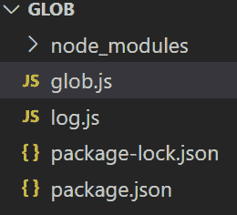
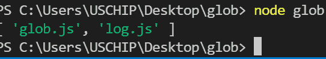
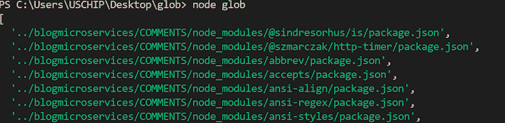
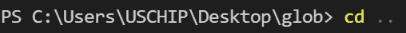
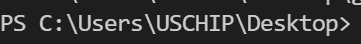
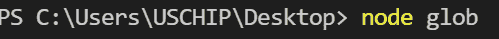
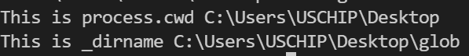
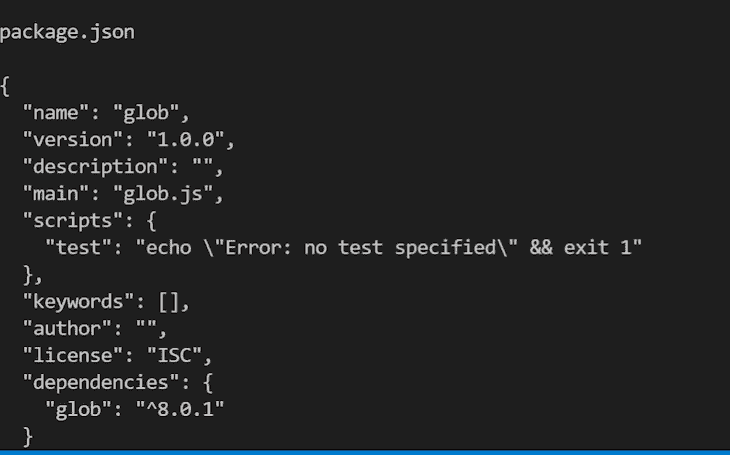
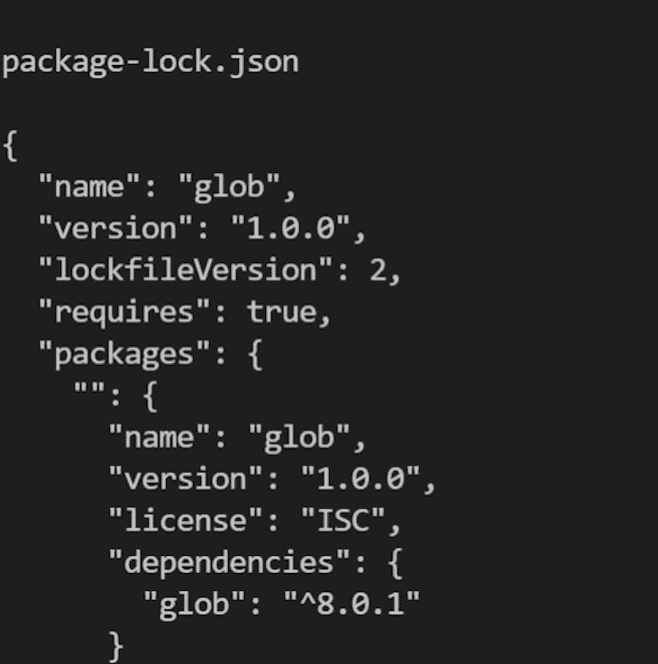

# 理解 Node.js - LogRocket 博客中的 glob 模式

> 原文：<https://blog.logrocket.com/understanding-using-globs-node-js/>

使用字符作为占位符是计算机编程中的常见做法。如果您曾经尝试过使用`git add *.java`命令将多个扩展名类似 Git 的文件添加到一个目录中，那么您已经使用了 glob 模式。

glob 模式最常用于指定文件名，称为[通配符](https://en.wikipedia.org/wiki/Wildcard_character) [s](https://en.wikipedia.org/wiki/Wildcard_character) ，以及字符串，称为[通配符匹配](https://en.wikipedia.org/wiki/Matching_wildcards)。glob 模式添加扩展名为`.java`的目录中的所有文件，而`git add *`命令将添加给定目录中除了文件名开头带有点`.`的文件之外的所有文件。

在本文中，我们将探索如何在 Node.js 中使用 glob 模式来表示或指定文件名和任意字符串。要跟随本教程，您需要以下内容:

*   对 Node.js 的基本了解
*   安装在计算机上的 Node.js
*   一个代码编辑器，最好是 VS 代码

## 目录

## 什么是全球匹配？

Glob matching 或 Globbing 是一种编程方法，它需要使用通配符或 glob 模式来指定或匹配文件名或一组任意字符串。

与 glob 模式相比，正则表达式模式可能更加复杂。然而，一个简化的 glob 模式在某些情况下可以证明是有用的，并且可以完成工作。

## 常见的球状模式

`*`是不同编程语言中最受支持的基本通配符匹配模式之一。`*`匹配任意字符零次或多次，不包括`/`。它也不匹配文件名开头带有点`.`的文件，除非程序员使用`dotglob`公共选项指定。

`**`通配符模式匹配任意字符零次或多次，包括`/`。`?`通配符模式匹配任何字符一次，但它通常不匹配点文件，即带有前导点`.`的文件名。

最后，`[abc]`通配符模式匹配定义的指定字符。在这种情况下，`a`、`b`和`c`。现在我们已经了解了什么是 glob，让我们学习如何在 Node.js 中实现 globbing。

## 设置我们的项目

首先，我们将创建一个新的 Node.js 项目。首先，用以下命令创建一个`package.json`:

```
npm init -y

```

接下来，我们将使用以下命令[安装 glob 包](https://www.npmjs.com/package/glob):

```
npm install glob

```

您的`package.json`文件应该看起来像上面的图片。现在，让我们编写一个使用 glob 包的示例代码。在 Node.js 项目文件夹中创建两个文件，`glob.js`和`log.js`:



在您的`glob.js`文件中添加以下代码:

```
const glob = require(“glob”);

glob("*.js", (error, filesWithJs)=>{
  if(error){
    console.log(error)
  }
  console.log(filesWithJs)
}

```

在上面的代码中，我导入了 glob 模块，然后将一个模式传递给 glob 函数和一个回调函数，该函数返回模式的结果。

当您运行上面的代码时，会打印出扩展名为`.js`的文件列表:



根据当前工作目录中的`.js`文件的数量，您的输出应该类似于上面的截图。

现在，让我们看看如何使用 Node.js glob 模式导航当前的工作目录和子目录。在我们导入 glob 包的`glob.js`文件中，编写以下代码:

```
function directoryFiles(error, jsonFilesInDirectory){
  return console.log(jsonFilesInDirectory);
}
glob('*../**/*.json', directoryFiles)

```

上面的代码片段将在当前目录和子目录中搜索以`.json`结尾的文件，然后将它们打印到控制台。输出将是一个以`.json`结尾的文件数组。您的照片可能与下图略有不同:



## 在计算机目录中导航

接下来，我们将学习使用 Node.js 包在计算机目录中导航。要访问 Node.js 应用程序的当前目录，我们有两个选项可以选择，`process.cwd()`和`__dirname`。

`process.cwd()`方法位于 Node.js 全局对象中，并提供关于 Node.js 进程的当前工作目录的信息。另一方面，`__dirname`变量返回当前模块或文件的目录名。

下面的代码片段说明了`process.cwd()`和`__dirname`之间的区别:

```
console.log("This is process.cwd", process.cwd());
console.log("This is _dirname", __dirname);

```

在运行上面的代码之前，使用`cd..`命令在目录中向后导航一步:



下图显示了命令的结果:



继续使用下面的命令运行 Node.js 应用程序:

```
 node glob

```



运行上述代码的结果如下图所示:



既然我们理解了`process.cwd()`和`__dirname`之间的区别，让我们将`process.cwd()`函数用于 glob。我们将使用以下代码片段进行说明:

```
const glob = require(“glob”);

stepInDirectory = {
  cwd: "../"
}
allJSFiles = (error, filesWithJS)=>console.log(filesWithJS);

// add a glob pattern
glob('**/*.js', stepInDirectory, allJSFiles);

console.log("This is an illustration for the current working directory", process.cwd());

```

到目前为止，我们只使用了 Node.js glob 包进行 globbing 或模式匹配，但是 Node.js glob 并不局限于模式匹配。与 Node.js [文件系统](https://nodejs.dev/learn/the-nodejs-fs-module)包 fs 协作，可以使用 glob 读取文件。

下面的代码片段说明了如何在 Node.js 应用程序中使用 glob 和 fs 来读取文件:

```
const glob = require(“glob”);
const fs = require('’fs”);

const readFiles = function (pat, forFile) {
    // pattern
    pat =  '*.json';
    // for file method
    forFile = (contentOfFile, jsonFileInDirectory) => {
        console.log(' ');
        console.log(jsonFileInDirectory);
        console.log(' ');
        console.log(contentOfFile);
        console.log(' ');
    };
    // using glob
    glob(pat, function (err, files) {
        if (err) {
            console.log(err);
        } else {
            files.forEach(function (file) {
                fs.readFile(file, function (err, data) {
                    if (err) {
                        console.log(err);
                    } else {
                        forFile(data.toString(), file);
                    }
                });
            });
        }
    });
};
readFiles();

```

代码检查当前文件夹中以`.json`结尾的文件，打印一个空格，读取内容，最后打印到控制台。如果你有和我一样的代码，输出应该和下面的类似:





## 结论

在本教程中，我们讨论了几种最常见的 glob 模式，包括`*`、`**`、`?`，最后是`[abc]`，考虑了通配符和通配符匹配之间的差异。我们演示了如何在 Node.js 应用程序中使用 globbing 以及另一个有用的 Node.js 包 fs 来读取应用程序中的文件。

我们还展示了如何使用 glob 模式来遍历我们的工作目录。本教程的内容应该足以让您开始使用 Node.js 中的 glob 包，但是如果您有任何问题，请务必留下评论。编码快乐！

## 200 只显示器出现故障，生产中网络请求缓慢

部署基于节点的 web 应用程序或网站是容易的部分。确保您的节点实例继续为您的应用程序提供资源是事情变得更加困难的地方。如果您对确保对后端或第三方服务的请求成功感兴趣，

[try LogRocket](https://lp.logrocket.com/blg/node-signup)

.

[](https://lp.logrocket.com/blg/node-signup)[https://logrocket.com/signup/](https://lp.logrocket.com/blg/node-signup)

LogRocket 就像是网络和移动应用程序的 DVR，记录下用户与你的应用程序交互时发生的一切。您可以汇总并报告有问题的网络请求，以快速了解根本原因，而不是猜测问题发生的原因。

LogRocket 检测您的应用程序以记录基线性能计时，如页面加载时间、到达第一个字节的时间、慢速网络请求，还记录 Redux、NgRx 和 Vuex 操作/状态。

[Start monitoring for free](https://lp.logrocket.com/blg/node-signup)

.