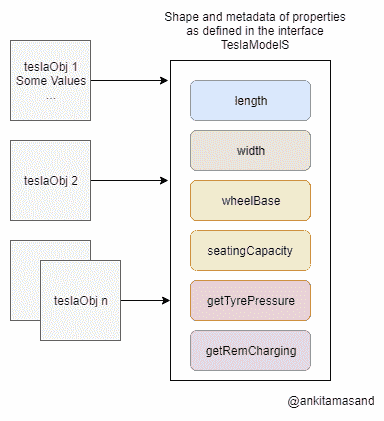

# 理解和使用 TypeScript - LogRocket 博客中的接口

> 原文：<https://blog.logrocket.com/understanding-using-interfaces-typescript/>

***编者按:**这篇文章于 2022 年 9 月 9 日更新，提供内容的一般更新，包括关于可调用接口和在 Angular 中使用接口的信息。*

TypeScript 席卷了 JavaScript 世界，通过添加健壮的类型特性，允许团队更聪明地工作。这些类型化特性使我们的代码更具描述性，并使我们能够更早、更容易地识别和修复错误。在本文中，我们将讨论 TypeScript 中最重要的类型特性之一:接口。它们允许我们描述将在代码中使用的对象，最终帮助我们捕捉错误并编写更高效的代码。

## 接口介绍

JavaScript 给了开发人员很大的灵活性。初始化为整数的变量可以在运行时被赋予一个函数文字。变量的类型在 JavaScript 中是不可预测的。如下例所示，`a`被初始化为一个整数，然后被赋予一个函数文字:

```
var a = 2
a = function () {
  console.log("I was initialized with a value of an integer, but now I'm a function")
}
```

让我们考虑一下建造一辆特斯拉 Model S 汽车的实施计划。

十名特斯拉工程师建造了他们的原型模型。在实现之前没有制定规范，所以工程师们都想出了他们自己的一套规范和实现模型。其中一个原型可以向用户显示汽车充电的细节，而另一个原型有轮胎监控系统。

如果预先定义了一套规范，那么这些工程师根据这些规范实现原型将会非常方便和容易。在用 JavaScript 构建复杂的实体时，我们会遇到同样的问题:

```
function buildTeslaModelS (teslaObj) {
    // Implementation Details
}

buildTeslaModelS({
    length: 196,
    width: 86,
    measureTirePressure: function () {
    },
    wheelbase: 116
})

buildTeslaModelS({
    length: "196",
    width: "86",
    wheelbase: "116",
    measureRemCharging: function () {
    }
})
```

`buildTeslaModelS`函数使用`teslaObj`中定义的参数返回一辆特斯拉 Model S 汽车。它对输入参数进行一些假设，并基于这些假设返回一个模型。它假设`length`、`width`和`wheelbase`属性是整数，并基于这一假设执行一些计算。

然而，正如您在对`buildTeslaModelS`的第二次函数调用中看到的，这些值是字符串，因此假设不再有效。

另外，`buildTeslaModelS`函数不知道它必须处理`measureRemCharging`属性，所以它完全跳过了这一部分。它假设`measureTirePressure`是一个强制属性，并且应该出现在所有这些模型中。然而，当它在第二次函数调用中没有找到这个属性时，它会在运行时抛出一个错误。

这是一个非常灵活的功能！应该有办法告诉`buildTeslaModelS`函数输入`teslaObj`参数的形状。如果在编译时有一个验证检查来检查`teslaObj`上的强制属性及其类型，事情会变得更容易。

这里有 TypeScript 接口可以提供帮助！

TypeScript 具有对接口的内置支持[。接口定义了实体的规范。它列出了合同，说明需要做什么，但没有具体说明如何做。](https://www.typescriptlang.org/docs/handbook/interfaces.html)

在上面的例子中，我们可以为 Tesla Model S 定义一个接口，然后它的每个原型将使用这个接口为接口中定义的各种功能提出一个实现计划。

这是特斯拉 Model S 的界面:

```
interface TeslaModelS {
    length: number;
    width: number;
    wheelbase: number;
    seatingCapacity: number;
    getTyrePressure: () => number;
    getRemCharging: () => number;
}
```

接口包含所有属性的名称及其类型。它还包括函数的签名以及参数类型和返回类型。例如，`getTyrePressure`和`getRemCharging`函数返回`number`类型的值。

 [https://www.youtube.com/embed/en4FtiVTckE?version=3&rel=1&showsearch=0&showinfo=1&iv_load_policy=1&fs=1&hl=en-US&autohide=2&wmode=transparent](https://www.youtube.com/embed/en4FtiVTckE?version=3&rel=1&showsearch=0&showinfo=1&iv_load_policy=1&fs=1&hl=en-US&autohide=2&wmode=transparent)

视频

## 如何使用界面

类或函数可以实现一个接口来定义该接口中定义的属性的实现。

让我们写一个函数来实现`TeslaModelS`接口:

```
function buildTeslaModelS (teslaObj: TeslaModelS) {
}

buildTeslaModelS({
    length: "196",
    width: "86",
    wheelbase: "116",
    measureRemCharging: function () {
    }
})
```

当您运行上面显示的代码时，TypeScript 编译器将给出以下错误:

> 类型为`{ length: string; width: string; wheelbase: string; measureRemCharging: () => void; }`的参数不可分配给类型为`TeslaModelS`的参数。对象文字只能指定已知的属性，`measureRemCharging`在类型`TeslaModelS`中不存在。

编译器报错有两个原因:

1.  属性`length`、`width`和`wheelbase`在接口中被定义为类型`number`，所以它期望它们是类型`number`而不是`string`
2.  接口上未定义属性`measureRemCharging`。它应该被命名为`getRemCharging`，并且应该返回一个`integer`。实体的实现应该遵循其接口中定义的契约

要构建界面中定义的 Tesla Model S，我们必须像这样定义函数:

```
function buildTeslaModelS (teslaObj: TeslaModelS) {
}

buildTeslaModelS({
    length: 196,
    width: 86,
    wheelbase: 116,
    seatingCapacity: 4,
    getTyrePressure: function () {
        let tyrePressure = 20 // Evaluated after doing a few complex computations!
        return tyrePressure
    },
    getRemCharging: function () {
        let remCharging = 20 // Evaluated after doing a few complex computations!
        return remCharging
    }
})
```

上面的`teslaObj`实现正是接口所期望的！

## 如何在接口中定义可选属性

接口在确保实体按预期实现方面做得很好。但是，在某些情况下，没有必要拥有接口中定义的所有属性。这些称为可选属性，在界面中表示如下:

```
interface TeslaModelS {
    length: number;
    width: number;
    wheelbase: number;
    seatingCapacity: number;
    getTyrePressure?: () => number;
    getRemCharging: () => number;
}
```

请注意`getTyrePressure`属性中的`?`。问号表明属性`getTyrePressure`是可选的，并不是实体在所有模型中实现该功能的强制要求。即使你没有在`teslaObj`参数中指定这个属性，编译器也不会报错。

编译器还会检查接口中未定义的多余属性。比方说，`teslaObj`包含一个多余属性`turningCircle`，这个属性在`TeslaModelS`接口中没有指定:

```
buildTeslaModelS({
    length: 196,
    width: 86,
    wheelbase: 116,
    getTyrePressure: function () {
        let tyrePressure = 20 // Evaluated after doing a few complex computations!
        return tyrePressure
    },
    getRemCharging: function () {
        let remCharging = 20 // Evaluated after doing a few complex computations!
        return remCharging
    },
    turningCircle: 10
})
```

编译器给出以下错误:

> 类型为`{ length: number; width: number; wheelbase: number; getTyrePressure: () => number; getRemCharging: () => number; turningCircle: number; }`的参数不可分配给类型为`TeslaModelS`的参数。对象文字只能指定已知的属性，`turningCircle`在类型`TeslaModelS`中不存在。

## 接口中的只读属性

只读属性一旦初始化就不能更改。例如，属性`length`、`width`、`wheelbase`和`seatingCapacity`在用某个固定值初始化后，在任何情况下都不应该被修改。

我们必须修改我们的界面来反映这一变化:

```
interface TeslaModelS {
    readonly length: number;
    readonly width: number;
    readonly wheelbase: number;
    readonly seatingCapacity: number;
    getTyrePressure?: () => number;
    getRemCharging: () => number;
}
```

注意属性名称中使用了关键字`readonly`。这表明这些属性在用某个值初始化后不能被修改。

## 界面中的可索引属性

顾名思义，可索引属性用于定义索引到唯一数字或字符串中的类型。例如，我们可以将类型`CustomArray`定义为:

请注意`cars`变量不是普通的数组，所以不能使用`push`、`pop`、`filter`等数组内置函数。您可能会认为定义普通数组比使用可索引类型更好。当您必须定义应对同一数据类型的一系列值进行操作的自定义属性和函数时，可索引类型非常有用。

由于我们已经明确地将特斯拉 Model S 的规格放在一个界面中，这提高了特斯拉工程师的效率，他们现在已经准备好了第一批 100 辆汽车。现在是时候让评审委员会检查每个模型，并测试它们的性能和其他因素了:

`TeslaModelSReview`接口将与特定模型相关联的属性组— `engineer`、`model`和`rating`编入唯一的数字索引。`TeslaModelSReviewQueue`的型号为`TeslaModelSReview`。它列出了不同工程师制造的特斯拉模型。

从上面的代码中，我们可以看到 John 构建了两个模型:`modelByJohn1`和`modelByJohn2`，分别被评为`2`和`4`。

索引器的类型可以是字符串或数字。我们也可以在`TeslaModelSReview`接口中定义其他属性，但是这些属性应该返回一个`TeslaModelS`类型的子类型。

* * *

### 更多来自 LogRocket 的精彩文章:

* * *

可以将`TeslaModelSReview`的索引设为只读，以防止在检查过程中修改其值。我们必须像这样修改我们的`TeslaModelSReview`接口:

```
interface TeslaModelSReview {
    readonly [id: number]: TeslaModelS
}
```

## 如何在接口中定义函数类型

接口也可以用来定义函数的结构。正如我们前面看到的，函数`getTyrePressure`和`getRemCharging`被定义为`TeslaModelS`接口上的属性。但是，我们可以为函数定义这样一个接口:

```
interface Order {
    (customerId: number, modelId: number): boolean 
}

let orderFn: Order = function (cId, mId) {
    // processing the order
    return true // processed successfully!
}
```

`orderFn`的作用是键入`Order`。它接受两个类型为`number`的参数，并返回一个类型为`boolean`的值。

在上面的代码中可以看到，在`orderFn`函数的定义中不需要再次定义参数的类型。编译器只是将接口中定义的参数与函数声明中定义的参数一一对应。

推断出`cId`映射到`customerId`，类型为`number`，而`mId`映射到`modelId`，类型也为`number`。甚至`orderFn`函数的返回类型也是从它在接口中的定义中推断出来的。

## 如何对类使用接口

到目前为止，我们已经学习了函数是如何实现接口的。现在让我们为`TeslaModelS`接口构建一个类。

```
class TeslaModelSPrototype implements TeslaModelS {
    length: number;
    width: number;
    wheelbase: number;
    seatingCapacity: number;
    private tempCache: string;

    constructor (l, w, wb, sc) {
        this.length = l;
        this.width = w;
        this.wheelbase = wb;
        this.seatingCapacity = sc;
    }

    getTyrePressure () {
        let tyrePressure = 20 // Evaluated after doing a few complex computations!
        return tyrePressure
    }

    getRemCharging () {
        let remCharging = 20 // Evaluated after doing a few complex computations!
        return remCharging
    }
}

let teslaObj = new TeslaModelSPrototype(196, 86, 116, 4)
console.log('Tyre Pressure', teslaObj.getTyrePressure())
```

类`TeslaModelSPrototype`定义了一个接口的所有属性。请注意，接口只定义了类的公共属性。从上面的代码可以看出，属性`tempCache`有一个访问修饰符`private`，因此它没有在接口`TeslaModelS`中定义。

## 一个类中不同类型的变量

一个类有三种不同类型的变量:

1.  局部变量:局部变量是在函数或块级别定义的。它只在函数或块执行之前存在。每次函数运行时，都会在内存中创建局部变量的新副本
2.  实例变量:实例变量是类的成员。它们用于存储类对象的属性。每个对象都有自己的实例变量副本
3.  静态变量:静态变量也被称为类变量，因为它们作为一个整体与一个类相关联。一个类的所有对象共享静态变量的同一个副本

请注意，接口只处理类的实例部分。例如，`constructor`功能属于`static`部分。接口`TeslaModelS`没有指定任何与`constructor`或静态部分相关的东西。

## 扩展接口

接口可以扩展任何其他接口并导入其属性。这有助于构建小型的可重用组件。例如，我们可以创建不同的接口来处理 Tesla 模型的不同组件，如下所示:

```
interface Wheel {
    wheelBase: number;
    controls: Array<string>,
    material: string;
}

interface Charger {
    adapter: string;
    connector: string;
    location: string;
}

interface TeslaModelS extends Wheel, Charger {
    // ... All other properties
}
```

`TeslaModelS`接口扩展了`Wheel`和`Charger`的属性。不要把所有的属性都放在一个接口中，而是为处理不同的组件创建单独的接口是一个很好的实践。

## 类型别名与接口有何不同？

类型别名用于为 TypeScript 中不同类型的组合命名。

例如，我们可以创建一个类型，它可以是类型`string`或`null`:

```
type StringOrNull = string | null;
```

类型别名和接口在 TypeScript 中经常互换使用。也可以像这样使用`type`来定义`TeslaModelS`对象的形状:

```
type TeslaModelS {
    length: number;
    width: number;
    wheelbase: number;
    seatingCapacity: number;
    getTyrePressure: () => number;
    getRemCharging: () => number;
}
```

类似于接口如何使用关键字扩展其他接口和类型别名，类型别名也可以使用交集运算符扩展其他类型和接口。类型别名也可以由类实现。

类型别名通常用在我们必须定义不同类型的合并的情况下。例如，考虑函数`renderObject`:

```
function renderObject (objShape: Square | Rectangle | Triangle) {\
    // ...
}
```

`renderObject`函数接受一个输入参数`objShape`。`Square`、`Rectangle`、`Triangle`是类型，`|`称为联合运算符。`objShape`可以是`Square`、`Rectangle`或`Triangle`类型。然而，形状的联合不能用界面来表达。

接口用于定义关于对象形状的契约；因此，它们不能用于多个形状的联合。即使是类也不能实现描述形状联合的类型。这是接口和类型别名之间重要的功能差异之一。

当我们定义两个同名的接口时，它们会合并成一个。结果接口将具有来自两个接口的属性。但是，如果我们试图用相同的名称定义多个类型，编译器会报错。

## 接口中的混合类型

在 JavaScript 中，函数也被视为对象，即使像这样在函数文字上添加属性也是有效的:

```
function manufactureCar (type) {
    const model = function getModel (type) {
        console.log('inside getModel function')
        // get the model of type as mentioned in the argument
    }
    model.getCustomerDetails = function  () {
        console.log('inside customer details function')
        // get the details of the customer who has purchased this model
    }
    model.price = 100000
    model.trackDelivery = function () {
        console.log('inside trackDelivery function')
        // track the delivery of the model
    }
    return model
}

let tesla = manufactureCar('tesla')
tesla() // tesla is a function
tesla.getCustomerDetails() // getCustomerDetails is a property defined on function
```

从上面的代码中可以看出，变量`model`被赋值为`function` / `getCustomerDetails`，`trackDelivery`作为属性附加在`model`上。这是 JavaScript 中的一种常见模式。我们如何用 TypeScript 接口定义这种模式？

```
interface CarDelivery {
    (string): TeslaModelS,
    getCustomerDetails (): string,
    price: number,
    trackDelivery (): string
}

function manufactureCar (type: string): CarDelivery {
    const model = <CarDelivery> function (type: string) {
        // get the model of type as mentioned in the argument
    }
    model.getCustomerDetails = function () {
        // get the details of the customer who has purchased this model
        return 'customer details'
    }
    model.price = 100000
    model.trackDelivery = function () {
        // track the delivery of the model
        return 'tracking address'
    }
    return model
}
let tesla = manufactureCar('tesla')
tesla() // tesla is a function
tesla.getCustomerDetails() // getCustomerDetails is a property defined on function
```

类型为`CarDelivery`的对象从`manufactureCar`函数返回。接口`CarDelivery`帮助维护从`manufactureCar`函数返回的对象的形状。它确保模型的所有强制属性— `getCustomerDetails`、`price`和`trackDelivery` —都出现在模型中。

## 如何在接口中使用泛型

当我们必须创建可以在多种数据类型上工作的泛型组件时，使用 TypeScript 中的泛型。例如，我们不想限制我们的函数只接受`number`作为输入参数。它应该根据用例进行扩展，并接受一系列类型。

让我们编写代码来实现处理一般数据类型的堆栈:

```
interface StackSpec<T> {
    (elements: Array<T>): void
}

function Stack<T> (elements) {
    this.elements = elements
    this.head = elements.length - 1

    this.push = function (number): void {
        this.elements[this.head] = number
        this.head++
    }

    this.pop = function <T>(): T {
        this.elements.splice(-1, 1)
        this.head--
        return this.elements[this.head]
    }

    this.getElements = function (): Array<T> {
        return this.elements
    }
}

let stacksOfStr: StackSpec<string> = Stack
let cars = new stacksOfStr(['Hatchback', 'Sedan', 'Land Rover'])
cars.push('Tesla Model S')

console.log('Cars', cars.getElements()) // ['Hatchback', 'Sedan', 'Land Rover', 'Tesla Model S']
```

接口`StackSpec`接受任何数据类型，并将其放入函数的定义中。`T`用于定义`type`。函数`Stack`将一个元素数组作为输入。

`Stack`有方法——`push`用于在原来的`elements`数组中添加一个类型为`T`的新元素，`pop`用于移除`elements`数组的最顶层元素，`getElements`函数返回所有类型为`T`的元素。

我们创建了一个名为`stacksOfStr`的字符串堆栈，它接收`string`，并相应地用`string`替换`T`。我们可以重用这个栈实现来创建`number`和其他数据类型的栈。

我们还可以创建一堆特斯拉模型。让我们看看如何做到这一点:

```
let stacksOfTesla: StackSpec<TeslaModelS> = Stack
let teslaModels = [
    {
        engineer: 'John',
        modelId: 1,
        length: 112,
        //...
    },
    // ...
]
let teslaStack = new stacksOfTesla(teslaModels)
console.log(teslaStack) // prints the value of `teslaModels`
```

请注意，我们对类型为`TeslaModelS`的数组使用了相同的堆栈实现。泛型和接口的结合是 TypeScript 中一个强大的工具。

## TypeScript 如何编译接口

TypeScript 在处理 JavaScript 的奇怪部分方面做得很好。然而，浏览器不理解 TypeScript，所以它必须被编译成 JavaScript。

TypeScript 编译器将上面的`TeslaModelSPrototype`类编译为:

```
var TeslaModelSPrototype = /** @class */ (function () {
    function TeslaModelSPrototype(l, w, wb, sc) {
        this.length = l;
        this.width = w;
        this.wheelbase = wb;
        this.seatingCapacity = sc;
    }
    TeslaModelSPrototype.prototype.getTyrePressure = function () {
        var tyrePressure = 20; // Evaluated after doing a few complex computations!
        return tyrePressure;
    };
    TeslaModelSPrototype.prototype.getRemCharging = function () {
        var remCharging = 20; // Evaluated after doing a few complex computations!
        return remCharging;
    };
    return TeslaModelSPrototype;
}());
var teslaObj = new TeslaModelSPrototype(196, 86, 116, 4);
console.log('Tyre Pressure', teslaObj.getTyrePressure());
```

我在用 [TypeScript Playground](https://www.typescriptlang.org/play/index.html) 看编译好的代码。实例变量——`length`、`width`、`wheelBase`和`seatingCapacity`——在函数`TeslaModelSPrototype`中初始化。方法`getTyrePressure`和`getRemCharging`在函数`TeslaModelSPrototype`的原型上定义。

上面的代码是普通的 JavaScript，所以它可以在浏览器中运行。

## 为什么要使用接口？

正如您已经了解的，接口有助于为实体的实现定义具体的计划。除此之外，接口还有助于 JavaScript 引擎的性能。

本节假设您对 JavaScript 引擎有所了解。在这一节中，我们将深入探讨 JavaScript 引擎的工作原理，并理解接口如何帮助提高性能。

我们先来了解一下坐在[V8(Chrome 上的 JavaScript 引擎)](https://v8.dev/)上的编译器是如何存储对象的。

TypeScript 中的接口只在编译时存在。正如您在上面由 TypeScript 编译器生成的代码中所看到的，没有提到接口。`TeslaModelS`接口的属性(`length`、`width`、`wheelBase`、`seatingCapacity`)被添加到`TeslaModelSPrototype`构造函数中，而函数类型被附加在`TeslaModelSPrototype`函数的原型上。JavaScript 引擎不知道任何与接口相关的东西。

如果我们实例化数千辆`TeslaModelSPrototype`汽车，我们将不得不处理数千个`TeslaModelS`类型的对象。这些对象中的每一个都将具有类似于接口的结构。

JavaScript 引擎是如何存储这几千个形状相同的对象的？它会复制成千上万份这些物品吗？制作成千上万个形状相似的副本绝对是浪费内存。

JavaScript 引擎只制作一个类型为`TeslaModelS`的形状，每个对象只存储在`TeslaModelS`接口中定义的相应属性值。

Objects share the same shape.

对于 JavaScript 引擎来说，这是一个巨大的性能优势。

如果对象具有不同的形状，引擎将不得不为这些对象创建不同的形状，并相应地处理它们。接口有助于保持相似对象的形状不变。

## 可调用接口

可调用接口允许我们使用类型函数来捕捉问题，比如传递期望错误参数或返回错误值的函数。

例如，以下面的代码为例:

```
const generateANumber: Function = (factor: number, genFunc: Function) => {
return genFunc(factor)
}
console.log(generateANumber(5, (a:number) => a)) // 5
console.log(generateANumber(5, () => "Cheese")) //Cheese
```

假设我们希望`getFunc`参数是一个接受数字并返回数字的函数。在上面的代码中，这不是强制的，我们可以在第 5 行看到，我们传递了一个不带参数的函数，并返回一个字符串。不会引发任何类型错误。

我们可以这样解决这个问题:

```
// Callable Interface
interface NumberGenerator {
    (num: number): number
}
interface GenANum {
    (num: number, gen: NumberGenerator): number
}
const generateANumber: GenANum = (factor: number, genFunc: NumberGenerator) => {
    return genFunc(factor)
}
console.log(generateANumber(5, (a:number) => a)) // 5
console.log(generateANumber(5, () => "Cheese")) // Type Error
```

我们有两个接口为`generateANumber`和它的`genFunc`参数添加了一个签名。这将把`() =>` `" Cheese "`传递给`generateANumber`函数，并给我们一个类型错误，从而使我们的代码更加类型安全。可调用接口本质上允许我们键入我们的函数。

[你可以在这里](https://github.com/AlexMercedCoder/typescript-interface-examples)查看这一节的代码。

## 如何在 React 中使用接口

让我们构建一个使用 React 和 TypeScript 接口显示 Pokemon 列表的简单用例。

下面是主要的`App`组件，它在 id 为`root`的 div 容器中呈现口袋妖怪列表:

```
import React, { Component, Fragment } from 'react';
import { render } from 'react-dom';
import PokemonList from './pokemon-list';
import './style.css';

const App = () => {
  return (
    <Fragment>
        <h2>Pokemon List</h2>
        <PokemonList />
      </Fragment>
  )
}

render(<App />, document.getElementById('root'));
```

`App`组件渲染`PokemonList`。

让我们检查一下`PokemonList`组件的实现:

```
import React, { Component } from 'react';
import { PokemonListModel } from './pokemon-model';

interface PokemonProps {}
interface PokemonState {
  pokemonList: PokemonListModel | null;
}

class PokemonList extends Component<PokemonProps, PokemonState> {

  constructor (props) {
    super(props);
    this.state = {
      pokemonList: null
    }
  }

  getPokemonList = () => {
    fetch ('https://pokeapi.co/api/v2/pokemon/?limit=50')
      .then (response => {
        return response.json();
      })
      .then (response => {
        this.setState({ pokemonList: response });
      })
  }

  render () {
    let { pokemonList } = this.state;
    return (
      <div className='pokemon-list'>
        {
          pokemonList && pokemonList.results.map (pokemon => {
            return (
              <div className='row' key={pokemon.name}>
                <span>{pokemon.name}</span>
              </div>
            )
          })
        }
      </div>
    )
  }

  componentDidMount () {
    this.getPokemonList()
  }
}

export default PokemonList
```

`PokemonList`组件使用[开源 Poke API 项目](https://pokeapi.co/)获取口袋妖怪列表。它将 Pokemon API 的结果存储在组件的状态中。组件使用接口`PokemonProps`和`PokemonState`来定义它的`props`和`state`。接口`PokemonListModel`定义了从 Pokemon API 返回的对象的结构。

下面是`PokemonListModel`界面:

```
export interface PokemonListModel {
  count: number;
  next: string | null;
  previous: string | null;
  results: Array
}

interface Pokemon {
  name: string;
  url: string;
}
```

注意`results`属性的类型。它使用接口`Pokemon`来定义`results`的结构。下面是 Stackblitz 上的 Pokemon 应用程序演示:

> 口袋妖怪列表

在角度中使用界面

## 现在，让我们深入到 Angular 中的接口。因为 Angular 是基于类型脚本的框架，所以 Angular 中的接口工作方式类似，但仍然值得讨论。让我们检查以下 Angular 代码库的接口用法。

首先我们来看一下`/src/app/types.ts`。在这个文件中，我们可以定义我们计划在整个应用程序中使用的任何接口和类型。

这里，我们为单个`Post`定义了接口，为`title`和`content`定义了两个属性。我们计划能够检索帖子列表，并能够添加帖子。我们希望将这种数据管理封装到服务中，我们可以在`/src/app/post.service.ts`中找到。

```
export interface Post {
  title: string
  content: string
}

```

在这个服务调用中，我们使用我们的`Post`接口定义一个私有属性，一个 post 数组，然后用一个初始 post 实例化这个数组。我们还给这个服务两个方法:

```
import { Injectable } from '@angular/core';
import { Post } from './types';
@Injectable({
  providedIn: 'root'
})
export class PostService {
  #posts:[Post] // private property of posts
  constructor() {
    this.#posts = [{title: "Post 0", content: "content for post 0"}]
   }
  // method for adding a post
  addPosts(newPost: Post){
    this.#posts.push(newPost)
  }
  // method for getting all posts
  getPosts(){
    return this.#posts
  }
}

```

`addPosts`:接受一个`Post`作为参数，然后将其推入`this.#posts`数组

*   `getPosts`:返回`Post`个对象的数组
*   然后，我们可以将这个服务注入到任何需要访问这个帖子列表的组件中，比如我们在`src/app/app.component.ts`中的`App`组件:

在`Component`类中，我们使用我们的服务和发布类型来定义该类的两个属性:

```
import { Component } from '@angular/core';
import { PostService } from './post.service';
import { Post } from './types';
@Component({
  selector: 'app-root',
  templateUrl: './app.component.html',
  styleUrls: ['./app.component.css'],
})
export class AppComponent {
  title = 'sampleproject';
  postService: PostService;
  posts: [Post]
  // initiate PostService in component
  constructor(postService: PostService) {
    this.postService = postService;
    this.posts = this.postService.getPosts()
  }
  addPost() {
    // Create new post
    const newPost: Post = {
      title: `Post ${this.posts.length}`,
      content: 'this is the content for this post',
    };
    // update list of posts in service and component
    this.postService.addPosts(newPost)
    this.posts = this.postService.getPosts()
  }
}

```

`this.postService`:我们之前定义的`PostService`的实例

*   `this.posts`:该组件本地的`Post`对象数组的副本
*   在构造函数中，我们使用依赖注入在构造函数参数中实例化一个`PostService`。我们将带有`PostService`对象的参数`postService`分配给`this.postService`，然后立即使用它的`getPosts()`方法用现有的帖子填充数组。

我们向组件添加一个本地`addPost`方法，该方法以编程方式添加一个新的 post 并更新服务和数组的本地版本。完成所有这些后，我们现在可以在`src/app/app.component.html`中为这个组件构建接口了。

这里，我们对组件的`this.posts`数组进行了`div`循环，并为每个帖子生成了一个`h2`和`p`元素。我们还有一个按钮，它将触发`addPost`方法并添加一个新帖子。

```
<h1> Posts </h1>
<button (click)="addPost()">Add Post</button>
<div *ngFor="let post of posts; index as i">
  <h2>{{post.title}}</h2>
  <p>{{post.content}}</p>
</div>

```

在整个过程中，我们一直在使用`Post`接口。如果我们犯了任何错误，比如将`Post`属性写成`Title`而不是`title`，我们就会得到类型错误，这样我们就可以在应用程序运行之前很久就解决问题，最终避免运行时错误。

结论

## 接口是在 TypeScript 中定义协定的一种强有力的方式。让我们回顾一下我们在本教程中学到的所有内容:

接口定义了实体的规范，它们可以通过函数或类来实现。我们可以使用`?`在接口上定义可选属性，并通过在属性名中使用`readonly`关键字来定义只读属性

1.  TypeScript 编译器还会检查对象上的多余属性，如果对象包含在接口中定义的属性，则会给出错误
2.  我们还学习了如何使用接口定义可索引属性
3.  类可以实现一个接口。接口只包含一个类的实例变量的定义
4.  可以使用`extends`关键字扩展接口，以导入其他接口的属性
5.  我们可以通过接口使用泛型的力量，构建可重用的组件
6.  我们还学习了接口如何帮助 JavaScript 引擎的性能

使用 LogRocket 消除传统反应错误报告的噪音

## 是一款 React analytics 解决方案，可保护您免受数百个误报错误警报的影响，只针对少数真正重要的项目。LogRocket 告诉您 React 应用程序中实际影响用户的最具影响力的 bug 和 UX 问题。

[LogRocket](https://lp.logrocket.com/blg/react-signup-issue-free)

自动聚合客户端错误、反应错误边界、还原状态、缓慢的组件加载时间、JS 异常、前端性能指标和用户交互。然后，LogRocket 使用机器学习来通知您影响大多数用户的最具影响力的问题，并提供您修复它所需的上下文。

[ ](https://lp.logrocket.com/blg/react-signup-general) [  ](https://lp.logrocket.com/blg/react-signup-general) [LogRocket](https://lp.logrocket.com/blg/react-signup-issue-free)

关注重要的 React bug—[今天就试试 LogRocket】。](https://lp.logrocket.com/blg/react-signup-issue-free)

[LogRocket](https://lp.logrocket.com/blg/typescript-signup) :全面了解您的网络和移动应用

## LogRocket 是一个前端应用程序监控解决方案，可以让您回放问题，就像问题发生在您自己的浏览器中一样。LogRocket 不需要猜测错误发生的原因，也不需要向用户询问截图和日志转储，而是让您重放会话以快速了解哪里出错了。它可以与任何应用程序完美配合，不管是什么框架，并且有插件可以记录来自 Redux、Vuex 和@ngrx/store 的额外上下文。

[](https://lp.logrocket.com/blg/typescript-signup)

除了记录 Redux 操作和状态，LogRocket 还记录控制台日志、JavaScript 错误、堆栈跟踪、带有头+正文的网络请求/响应、浏览器元数据和自定义日志。它还使用 DOM 来记录页面上的 HTML 和 CSS，甚至为最复杂的单页面和移动应用程序重新创建像素级完美视频。

.

[Try it for free](https://lp.logrocket.com/blg/typescript-signup)

.