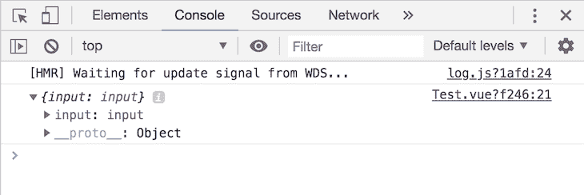
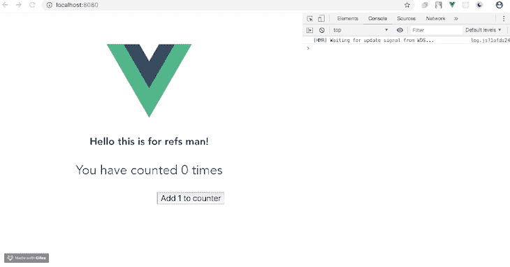
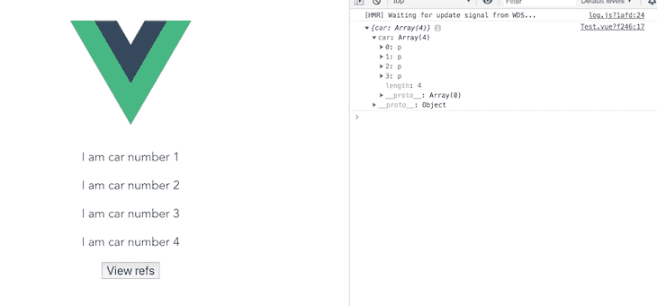

# 理解 Vue 中的引用

> 原文：<https://blog.logrocket.com/understanding-vue-refs/>

*编者按:本帖于**2022 年 10 月 4 日***更新，以包括在 Vue 中观看* `ref` *s 的信息，以及确保所有信息反映 Vue 的最新版本。**

 *在本教程中，我们将演示如何在您的 [Vue.js 组件](https://blog.logrocket.com/how-to-use-stateless-components-in-vue-js/)中引用 HTML 元素。

我们将详细介绍以下内容:

这篇 Vue 教程适合使用 Vue 的所有阶段的开发者——包括初学者。在您开始之前，这里有一些先决条件:

*   [node . js](https://nodejs.org/en/)10 . x 以上版本。通过在终端/命令提示符下运行`node -v`来验证您的版本
*   NPM 6.7 或更高版本
*   代码编辑器；我强烈推荐 VS 代码
*   在您的机器上全局安装 Vue.js 3
*   安装在您机器上的 Vue CLI 3.0。为此，首先使用`npm uninstall -g vue-cli`卸载旧版本的 CLI，然后使用`npm install -g @vue/cli`安装新版本
*   下载一个 [Vue starter 项目](https://github.com/viclotana/vue-canvas)
*   解压缩下载的项目，导航到其中，并运行`npm install`来保持所有的依赖项都是最新的

## Vue.js 是什么？

Vue.js 是一个进步的 JavaScript 框架，由[尤雨溪](https://twitter.com/youyuxi?lang=en)和 Vue 核心团队创建，有超过 230 名社区成员参与其中。Vue 被用于超过 870，000 个项目，在 GitHub 上有超过 [175，000 颗星。](https://github.com/vuejs/vue)

Vue.js 是一个平易近人的核心库，只关注视图层。它还有一个庞大的支持库生态系统，可以帮助您轻松构建响应迅速的 web 体验。

## Vue.js 中有哪些`ref` s？

是 Vue.js 实例属性，用于注册或指示对应用程序模板中 HTML 元素或子元素的引用。

如果一个 [`ref`属性](https://vuejs.org/guide/essentials/template-refs.html)被添加到你的 Vue 模板中的一个 HTML 元素中，那么你将能够在你的 Vue 实例中引用那个元素，甚至是一个子元素。也可以直接访问 DOM 元素；它是一个只读属性，返回一个对象。

## `getElementById`在 vista . js 中

Vue 不鼓励使用 JavaScript 的`getElementById`,因为这会造成性能问题。Vue 的`ref`帮助你以更有效的方式“引用”DOM 元素。

## 如何在 Vue.js 中使用`ref` s

`ref`属性通过作为父`$ref`属性中的键使 DOM 元素可选。

例如，将一个`ref`属性放入 input 元素中，会将父 DOM 节点暴露为`this.$refs.input`，或者您可以说是`this.refs["input"]`。

关于在 Vue.js 中引用`$refs`的快速视觉指南，请查看[这个视频教程](https://www.youtube.com/watch?v=YQ36Il2hGcM)。

## `this.refs`在望

您可以通过在元素的引用上定义方法来操作 DOM 元素。例如，您可以关注带有`this`的输入元素:

```
this.$refs["input"].focus()

```

这样，`ref` s 可以像 JavaScript 中的`document.querySelector('.element')`或 jQuery 中的`$('.element')`一样使用。虽然`document.querySelector()`执行`ref`的一些功能，但是`ref`更有效，因为它们让你直接访问你需要的特定元素。另一方面，`document.querySelector()`只是返回 DOM 中匹配指定选择器的第一个元素。在 Vue.js 实例内部和外部都可以访问`$refs`。但是，它们不是数据属性，因此它们不是反应性的。

在浏览器的模板检查中，`$refs`根本不显示，因为它不是 HTML 属性；它只是一个 Vue 模板属性。

## Vue.js 如何工作

如果您从一开始就关注了这篇文章，那么您应该已经下载了 starter 项目并在 VS 代码上打开了它。打开`components`文件夹，将其复制到`test.vue`文件中:

```
<template>
  <div>
    <h2>Hello this is for refs man!</h2>
    <p>You have counted {{this.counter}} times</p>
    <input type="text" ref="input">
    <button @click="submit">Add 1 to counter</button>
  </div>
</template>
<script>
export default {
  name: 'Test',
  data(){
    return {
      counter: 0
    }
  },
  methods: {
    submit(){
      this.counter++;
      console.log(this.ref)
    }
  }
}
</script>

```

现在，在您的开发服务器中使用以下命令运行它:

```
npm run serve

```

## 视图〔t0〕

您将看到用户界面显示了一个简单的计数器，单击它就会更新，但是当您在浏览器中打开开发人员工具时，您会注意到它记录了未定义的内容。

语法正确非常重要，因为这意味着 Vue 不会将此视为错误，但它确实是错误。根据我们已经知道的关于 Vue `ref` s 的信息，它们返回一个对象，但是根据未定义的响应来判断，有些事情是错误的。

将下面的代码复制到`test.vue`文件中:

```
<template>
  <div>
    <h2>Hello this is for refs man!</h2>
    <p>You have counted {{this.counter}} times</p>
    <input type="text" ref="input">
    <button @click="submit">Add 1 to counter</button>
  </div>
</template>
<script>
export default {
  name: 'Test',
  data(){
    return {
      counter: 0
    }
  },
  methods: {
    submit(){
      this.counter++;
      console.log(this.$refs)
    }
  }
}
</script>

```

当您运行并检查它时，您会注意到它现在返回一个对象:



快速看一下代码块就会发现正确的语法:在模板内部，它被称为`ref`，但是当我们在 Vue 实例中引用它时，它被称为`$refs`。这是非常重要的注意不要得到一个未定义的返回。模板中使用的语法`ref`是赋予元素的属性。另一方面，`$refs`是应用程序中被赋予了`ref`属性的元素的集合。您可以访问被引用元素的每个可能的属性，包括模板中的元素。

## 获取 Vue.js 中的 DOM 元素

让我们尝试记录一些我们可能感兴趣的属性。您的`test.vue`文件应该是:

```
<template>
  <div>
    <h2>Hello this is for refs man!</h2>
    <p>You have counted {{this.counter}} times</p>
    <input type="text" ref="input">
    <button @click="submit">Add 1 to counter</button>
  </div>
</template>
<script>
export default {
  name: 'Test',
  data(){
    return {
      counter: 0
    }
  },
  methods: {
    submit(){
      this.counter++;
      console.log(this.$refs)
    }
  }
}
</script>
<style scoped>
p , input, button{
  font-size: 30px;
}
input, button{
  font-size: 20px;
}
ul {
  list-style-type: none;
  padding: 0;
}
li {
  display: inline-block;
  margin: 0 10px;
}
a {
  color: #42b983;
}
</style>

```

浏览器上的应用程序应该如下所示:



### 在 Vue.js 中显示 HTML 元素

要显示 DOM 中的 HTML 元素，进入 submit 方法，将`methods`代码改为如下:

```
methods: {
    submit(){
      this.counter++;
      console.log(this.$refs.input)
    }
  }

```

这里的输入是您之前在元素(`ref="input"`)中创建的引用名。它可以是您选择的任何名称。

### 显示 HTML 输入值

要显示 HTML 元素输入值——在用户界面的文本框中输入的字符串——进入`submit`方法并将代码更改为:

```
methods: {
    submit(){
      this.counter++;
      console.log(this.$refs.input.value)
    }
  }

```

这会准确地显示您输入的字符串，这显示了与普通 JavaScript 和 jQuery 也可以实现的查询选择的相似性。

### 显示 Vue 元素的 URL

可以找到该元素的网页也是可以用 Vue `ref`显示的众多事物之一。进入`submit`方法，将代码改为:

```
methods: {
    submit(){
      this.counter++;
      console.log(this.$refs.input.baseURI)
 }
}

```

仅仅根据返回对象的信息，就可以用`ref`访问和记录许多其他的东西。

### 在 Vue.js 中处理条件

Vue.js 引用也可以用在输出 DOM 中多个元素的元素中，比如使用了`v-for`指令的条件语句。调用时，`ref` s 返回一个项目数组，而不是对象。为了说明这一点，创建一个简单的列表，如下所示:

```
<template>
  <div>
    <p v-for="car in 4" v-bind:key="car" ref="car"> I am car number {{car}}</p>
    <button @click="submit">View refs</button>
  </div>
</template>
<script>
export default {
  name: 'Test',
  data(){
    return {
    }
  },
  methods: {
    submit(){
      console.log(this.$refs)
    }
  }
}
</script>

```

当您在开发服务器中再次运行它时，它将如下所示:



## 在 Vue 中观看

假设您希望对 DOM 元素的变化做出反应，比如当元素的值发生变化时触发一个函数。您可以为此设置一个观察器。

下面，我们有一个简单的数据组件:

```
const Name = {
  data: () => ({
    myName: "Sam"
  }),
}

```

我们在`mounted`钩子中创建了观察器，这样它只在组件被渲染后才生效。我们使用`$watch()`实例方法来观察组件数据`myName`的变化。当数值改变时，触发`console.log`功能。

```
<template>
  <div>
    <name ref="name" /> 
  </div>
</template>

<script>
export default {
  //...
  components: { Name },
  mounted() {
    this.$watch(
      () => {
        return this.$refs.name.myName;
      },
      (val) => {
        console.log(val);
      }
    );
  },
  //...
};
</script>

```

你可以在 GitHub 上找到本教程[的完整代码。](https://github.com/viclotana/vue-refs)

## 结论

这篇文章向您展示了在 Vue.js 中引用 DOM 中的 HTML 元素。您现在可以通过所有元素属性访问和记录这些元素，包括值、子节点、数据属性，甚至包含它的基本 URL。

你也已经被介绍了你可以实现这一点的方法。值得注意的是，在 Vue 实例初始化和组件呈现之后，`ref`会被填充，所以不鼓励在计算属性中使用`ref` s，因为它能够直接操作子节点。黑客快乐！

## 像用户一样体验您的 Vue 应用

调试 Vue.js 应用程序可能会很困难，尤其是当用户会话期间有几十个(如果不是几百个)突变时。如果您对监视和跟踪生产中所有用户的 Vue 突变感兴趣，

[try LogRocket](https://lp.logrocket.com/blg/vue-signup)

.

[](https://lp.logrocket.com/blg/vue-signup)[https://logrocket.com/signup/](https://lp.logrocket.com/blg/vue-signup)

LogRocket 就像是网络和移动应用程序的 DVR，记录你的 Vue 应用程序中发生的一切，包括网络请求、JavaScript 错误、性能问题等等。您可以汇总并报告问题发生时应用程序的状态，而不是猜测问题发生的原因。

LogRocket Vuex 插件将 Vuex 突变记录到 LogRocket 控制台，为您提供导致错误的环境，以及出现问题时应用程序的状态。

现代化您调试 Vue 应用的方式- [开始免费监控](https://lp.logrocket.com/blg/vue-signup)。*