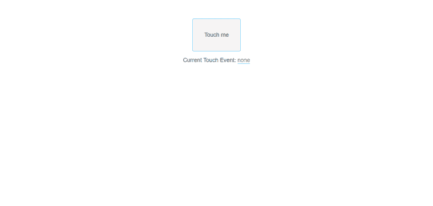
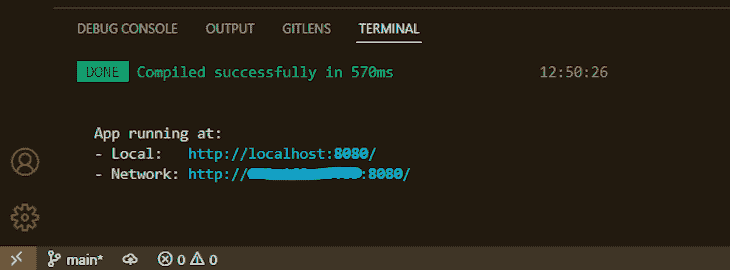
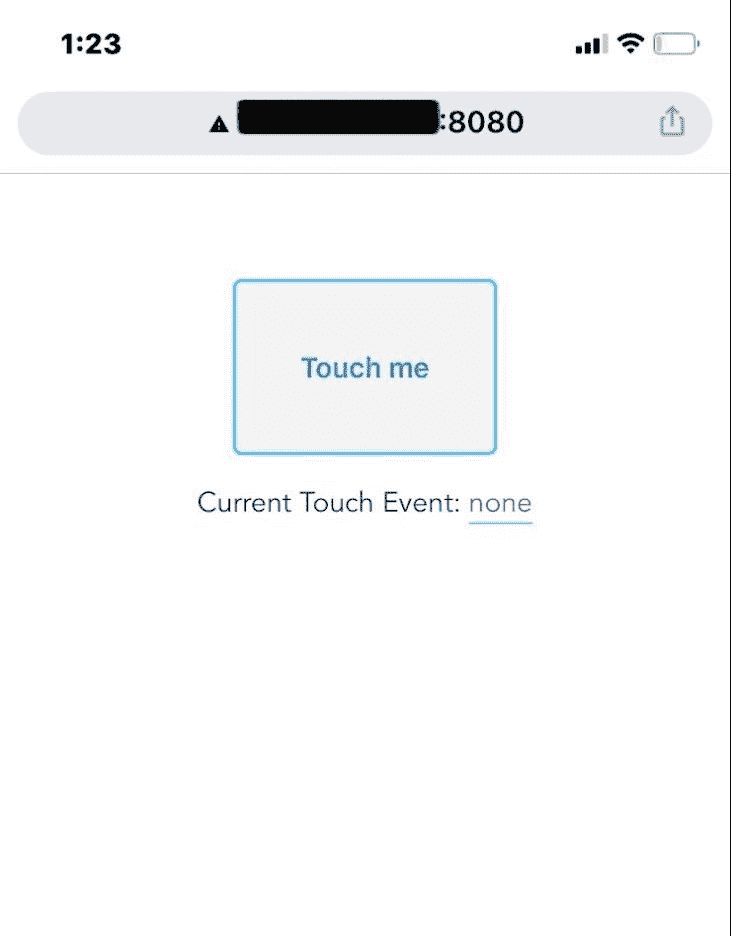
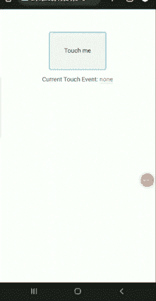
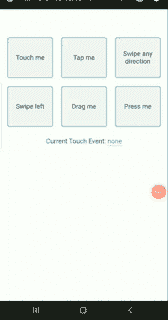
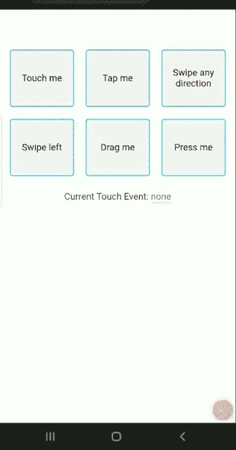

# 了解适用于 Android 和 iOS 的 Vue.js 触摸事件

> 原文：<https://blog.logrocket.com/understanding-vue-touch-events-android-ios/>

Vue.js 是一个流行的前端 JavaScript 框架，帮助我们构建简单快速的 ui 和 spa。它还允许我们通过使用 HTML 属性(也称为指令)来扩展我们的 HTML。这些[指令可以是内置的](https://vuejs.org/api/built-in-directives.html)，也可以是用户预定义的[自定义指令](https://blog.logrocket.com/deep-dive-custom-vue-directives/)。

在本文中，我们将讨论触摸事件，它是由用户在手机或平板电脑等触摸屏设备上触发的。本文将解释什么是触摸事件，可用的触摸事件类型，以及如何在 Android 和 iOS 的 Vue.js 中实现触摸事件。

让我们开始吧。

*向前跳转:*

## Android 和 iOS 上的触摸事件是什么？

触摸事件可以解释手指或触笔在触摸屏或触控板等触摸表面上的指针活动。它们监听用户和触摸表面之间的触摸点或交互，包括用户手指触摸、移动或离开屏幕的时间。它们不适用于非触摸屏设备。

与鼠标事件不同，鼠标事件侦听在同一实例中发生的交互，触摸事件可以侦听同时或多点触摸交互。例如，他们可以听两个手指的手势，如捏，或高级运动，如闪烁。

该事件在指针接触表面时开始，在指针离开时结束。在此事件期间，应用程序在开始、移动和结束阶段接收与触摸事件相关的所有属性。我们可以在任何事件中访问的属性有:

*   `identifier`:特定事件的唯一标识符。它用于跟踪多点触摸事件
*   `screenX / screenY`:触摸指针在屏幕坐标中的 x 和 y 坐标
*   `pageX / pageY`:触摸指针在页面坐标中的 x、y 坐标(包括滚动)
*   `clientX / clientY`:触摸指针相对于浏览器视窗的 x 和 y 坐标(不包括滚动)
*   `radiusX / radiusY / rotationAngle`:描述触摸指针覆盖的区域
*   `target`:指针触摸的元素，如`p`元素
*   `force`:用户对表面施加的压力量。范围从 0.0(无压力)到 1.0(最大压力)

如果多个触摸点同时处于活动状态，与每个触摸点相关的所有属性将被收集并存储在一个`TouchList`数组中，并使用`identifier`属性进行跟踪。在我们听触摸事件之前，让我们先了解一下这些事件是什么。

## 触摸事件的类型

*   `Touchstart`:当触摸面上有一个或多个触摸点时，触发该事件
*   `Touchmove`:当一个或多个触摸点沿着触摸表面移动时，就会出现这种情况
*   `Touchend`:当一个或多个触摸点离开触摸表面时触发
*   `Touchcancel`:当一个或多个接触点以特定于实现的方式中断时发生
*   `Tap`:当用户短暂触摸触摸面时触发
*   `DoubleTap`:当用户快速触摸触摸面两次时，触发该事件
*   当用户在表面上从一个点拖动一个触摸点到另一个点而不失去接触时触发
*   `Flick/Swipe`:当用户快速刷表面时触发该事件

在触摸表面上可以发生多种交互。本文将关注最常见的事件，即用户经常执行的事件；`tap`、`drag`、`swipe`和`press`。你可以参考卢克·乌鲁布莱夫斯基创作的这些[触摸手势卡](https://static.lukew.com/TouchGestureCards.pdf)来了解其他的交互和它们的功能。

## 监听 Vue.js 中的触摸事件

侦听触摸事件与侦听元素中的任何事件是一样的。您向想要监听的触摸事件添加一个事件监听器，然后在该事件被触发时调用所需的函数。这里有一个例子:

```
<body>
<p>This is a paragraph</p>

<script>
      document.querySelector('p').addEventListener('touchstart', myFunction);

                  function myFunction(e) {
                          console.log(e.touches, e.type);
                  }
</script>
</body>
```

您还可以在任何移动浏览器和 iOS 或 Android 上监听触摸事件。在 Vue.js 中监听触摸事件的过程与在 Vue.js 中监听任何事件的过程相同。您添加一个与您想要监听的触摸事件相关的事件监听器，并在该事件被触发时调用您想要运行的函数:

```
<MyComponent
    @touchstart="startDrag(item)"
    @touchmove="moveDrag(item)"
    @touchend="endDrag(item)"
/>

… 

methods: {
    startDrag(item) {
        // do something on touchstart
     },
     moveDrag(item) {
        // do something on touchmove
     },
     endDrag(item) {
        // do something on touchend
     },
},

```

正如我前面提到的，网络浏览器只允许我们访问`touchstart`、`touchend`、`touchmove`和`touchcancel`事件。您需要编写一个自定义函数来侦听自定义触摸事件。幸运的是，我们有几个已经为我们处理这些事件功能的 npm 包——T4 vue 3-touch-events 和 Hammer.js 插件。我们将在本文中使用 vue3-touch-events 包。

## 在 Vue.js 中创建自定义触摸事件

vue3-touch-events 包让我们监听 vue3 中任何 HTML DOM 元素上的事件，如`tap`、`swipe`、`hold`和`drag`。如果你正在使用 Vue 2，你将使用 [vue2 触摸事件](https://www.npmjs.com/package/vue2-touch-events)包。

### 在 vue3 中安装 Vue 3 触摸事件

首先，通过打开你的终端并运行命令`vue create touch-events`来创建你的 Vue.js 应用，然后使用命令`yarn add vue3-touch-events`或`npm install vue3-touch-events`安装 vue3-touch-events 包，这取决于你使用的包管理器。

在您喜欢的代码编辑器中打开应用程序，运行命令`yarn serve`或`npm run dev`在您的浏览器中查看应用程序。

### 创建基本触摸事件

在您的`App.vue`文件中，用以下代码替换其当前代码:

```
<template>
  <button
    class="btn"
    @touchstart="nameCurrentEvent('touchstart')"
    @touchmove="nameCurrentEvent('touchmove')"
    @touchend="nameCurrentEvent('touchend')"
    >Touch me</button
  >
  <p class="output"
    >Current Touch Event:
    <span class="event">{{ name }}</span>
  </p>
</template>

<script>
export default {
  name: "App",
  data() {
    return {
      name: "none",
    };
  },
  methods: {
    nameCurrentEvent(name) {
      this.name = name;
      console.log(name);
    },
  },
};
</script>

<style>
#app {
  font-family: Avenir, Helvetica, Arial, sans-serif;
  -webkit-font-smoothing: antialiased;
  -moz-osx-font-smoothing: grayscale;
  text-align: center;
  color: #2c3e50;
  margin-top: 60px;
}
.btn {
  border: 2px solid rgb(71, 197, 255);
  background-color: rgb(246, 244, 244);
  border-radius: 5px;
  width: 150px;
  height: 100px;
  font-size: 1rem;
  margin: auto;
  display: flex;
  align-items: center;
  justify-content: center;
}
.event {
  border-bottom: 1px solid rgb(71, 197, 255);
  color: rgb(113, 113, 113);
}
</style>
```

查看上面的代码，我们创建了一个带有三个事件监听器的`button`元素:`touchstart`、`touchmove`和`touchend`。每当事件被触发时，它们将调用同一个函数`nameCurrentEvent`。当事件被触发时，事件的名称存储在一个名为`name`的变量中，该函数在屏幕上输出`name`。

这是我们在浏览器中查看时的结果:



要在手机上同时查看同一个 web 应用程序，请在运行`yarn serve`的终端中复制为您创建的`Network Url`，并将链接粘贴到您的手机浏览器中。该链接应该类似于`[http://000.000.00.00/8080](http://000.000.00.00/8080)`:



因此，在您的移动浏览器中，我们将会看到以下内容:



现在，与我们手机上的按钮进行交互，当我们的手指触摸按钮时，我们应该会看到我们的`name`值从`none`变为`touchstart`。然后，当我们将手指从按钮上的一个点移动到另一个点时，我们会看到`touchmove`，然后当我们的手指离开屏幕时会看到`touchend`。

请注意，您只能在触摸屏设备上测试此代码:



### 自定义触摸事件

使用 vue3-touch-events 监听自定义事件相对容易。因为我们已经安装了插件，所以我们将插件注册在我们的`main.js`文件中:

```
import { createApp } from "vue";
import App from "./App.vue";
import Vue3TouchEvents from "vue3-touch-events";

createApp(App).use(Vue3TouchEvents).mount("#app");
```

然后，在 Vue 中，我们使用`v-touch`指令将触摸事件添加到元素中。因此，让我们添加我们希望在触发触摸事件时运行的附加函数。进入`App.js`，我们修改当前代码:

```
<template>
  <div class="grid-cntr">
    <button
      class="btn"
      @touchstart="nameCurrentEvent('touchstart')"
      @touchmove="nameCurrentEvent('touchmove')"
      @touchend="nameCurrentEvent('touchend')"
      >Touch me</button
    >
    <button class="btn" v-touch:tap="onTapItem">Tap me</button>
    <button class="btn" v-touch:swipe="onSwipeItem">Swipe any direction</button>
    <button class="btn" v-touch:swipe.left="onSwipeLeftItem">Swipe left</button>
    <button class="btn" v-touch:drag="onDragItem">Drag me</button>
    <button class="btn" v-touch:press="onPressItem">Press me</button></div
  >

  <p class="output"
    >Current Touch Event:
    <span class="event">{{ name }}</span>
  </p>
</template>

<script>
export default {
  name: "App",
  data() {
    return {
      name: "none",
    };
  },
  methods: {
    nameCurrentEvent(name) {
      this.name = name;
    },
    onTapItem() {
      return (this.name = "tapped");
    },
    onSwipeItem() {
      return (this.name = "swiped");
    },
    onSwipeLeftItem() {
      return (this.name = "swiped left");
    },
    onDragItem() {
      return (this.name = "dragged");
    },
    onPressItem() {
      return (this.name = "pressed");
    },
  },
};
</script>

<style>
#app {
  font-family: Avenir, Helvetica, Arial, sans-serif;
  -webkit-font-smoothing: antialiased;
  -moz-osx-font-smoothing: grayscale;
  text-align: center;
  color: #2c3e50;
  margin-top: 60px;
}
.grid-cntr {
  display: grid;
  grid-template-columns: 1fr 1fr 1fr;
  max-width: 500px;
  margin: auto;
}
.btn {
  border: 2px solid rgb(71, 197, 255);
  background-color: rgb(246, 244, 244);
  border-radius: 5px;
  height: 100px;
  font-size: 1rem;
  margin: 10px;
  display: flex;
  align-items: center;
  justify-content: center;
}
.event {
  border-bottom: 1px solid rgb(71, 197, 255);
  color: rgb(113, 113, 113);
}
</style>
```

在上面的代码中，我们添加了五个按钮，并用`v-touch`添加了`tap`、`swipe`、`swipe.left`、`drag`和`press`。让我们在手机浏览器上测试一下:



要了解其他 vue3 触摸事件，[查看 GitHub repo](https://github.com/robinrodricks/vue3-touch-events#Events) 。

### 在 vue3 触摸事件中使用`parameters`

vue3-touch-events 还允许我们将`parameters`传递给`event handler`。我们需要将`delegate`返回给`event handler`，我们可以根据需要传递任意多的属性。

因此，让我们将一个参数传入`v-touch:tap`并编辑`onTapItem`:

```
<button class="btn" v-touch:tap="onTapItem('onTapItem')">Tap me</button>

…

onTapItem(param) {
      return function () {
        alert("You called the " + param + " touch event.");
      };
 },
```

我们将一个字符串作为参数传递给函数中的另一个字符串，然后向用户提示新的字符串:



## 结论

这就是关于理解 Vue.js 中的触摸事件！我们讨论了什么是触摸事件，以及 Vue 中可能的不同触摸事件，包括默认浏览器事件和自定义事件。我们还讨论了如何监听它们，以及如何使用第三方插件来创建和监听自定义触摸事件。这篇文章的代码可以在 [GitHub](https://github.com/Timonwa/using-vue3-touch-events-in-vue3) 上找到。如果你想了解更多关于 Vue.js 的信息，请查看这个[档案](https://blog.logrocket.com/tag/vue/)。

## 像用户一样体验您的 Vue 应用

调试 Vue.js 应用程序可能会很困难，尤其是当用户会话期间有几十个(如果不是几百个)突变时。如果您对监视和跟踪生产中所有用户的 Vue 突变感兴趣，

[try LogRocket](https://lp.logrocket.com/blg/vue-signup)

.

[](https://lp.logrocket.com/blg/vue-signup)[https://logrocket.com/signup/](https://lp.logrocket.com/blg/vue-signup)

LogRocket 就像是网络和移动应用程序的 DVR，记录你的 Vue 应用程序中发生的一切，包括网络请求、JavaScript 错误、性能问题等等。您可以汇总并报告问题发生时应用程序的状态，而不是猜测问题发生的原因。

LogRocket Vuex 插件将 Vuex 突变记录到 LogRocket 控制台，为您提供导致错误的环境，以及出现问题时应用程序的状态。

现代化您调试 Vue 应用的方式- [开始免费监控](https://lp.logrocket.com/blg/vue-signup)。