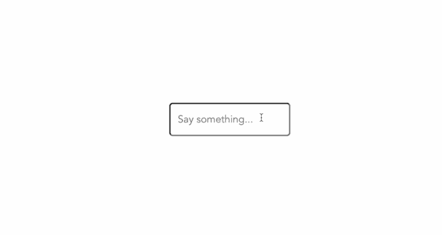
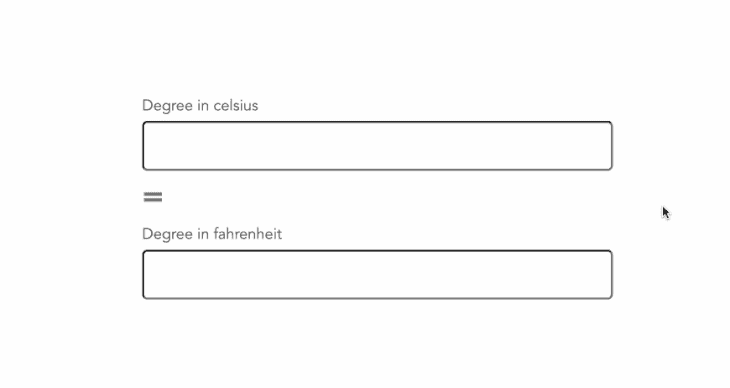

# 理解 Vue 中的观察者

> 原文：<https://blog.logrocket.com/understanding-watchers-vue/>

Vue 被设计成动态可扩展的，允许你快速开发可重用和可维护的组件，使用客户端数据绑定，并提供丰富的插件生态系统来增强其功能。

Vue 提供的众多功能之一是 watcher 功能，它允许我们监控应用程序状态，并根据这些变化触发操作。在本文中，我们将了解观察器如何在 Vue 中工作，它们能做什么，以及如何利用它们来构建强大的应用程序。

## 什么是观察者？

Vue 中的观察器是一个特殊的功能，它允许我们观察一些数据，并在数据发生变化时执行特定的操作。这是观察 Vue 实例中的数据变化并对其做出反应的一种更通用的方式。

使用 watchers，我们不仅仅能够监视一个属性和执行自定义操作；我们还可以访问这个特定属性正在更改的旧值，以及它已经更改为的新值。

## 使用观察器

使用 Options API，我们可以利用 watch 选项来监听属性值的变化，如下所示:

```
<script>
export default {
  data() {
    return {
      message: "Hello Vue!",
    };
  },
  watch: {
    message(newValue, oldValue) {
      // do something with newValue and oldValue.
    },
  },
};
</script>
```

另外，我们也可以用[组合 API](https://blog.logrocket.com/how-to-build-applications-with-vues-composition-api/) 的`watch()`函数来完成同样的事情:

```
<script setup>
import { ref, watch } from "vue";
const message = ref("Hello Vue!");

watch(message, (newValue, oldValue) => {
  // do something with newValue and oldValue.
});
</script>
```

因此，无论何时`message`的值发生变化，我们都能够访问它的新值或以前的值，并执行任何首选的操作。

在接下来的一章中，我们将看看在现实应用中使用观察器的更实际的例子。然而，在我们到达那里之前，让我们回顾一下观察者可用的所有选项。

### 使用`deep`选项进行深度观察

Vue.js 中 watchers 的默认行为比较浅薄；即，它们只监视顶层数据的变化，而不对嵌套的属性变化作出反应。

例如，我们有一个对象数组:

```
<script>
export default {
  data() {
    return {
      someData: [
        {
          id: 1,
          name: "John",
        },
        {
          id: 2,
          name: "Jane",
        },
      ],
    };
  },
  watch: {
    someData(newValue, oldValue) {
      console.log("someData changed!");
    },
  },
};
</script>
```

…并像上面那样为该数据设置一个观察器。每当一个对象的属性改变时，我们的观察器都不会被触发，比如当我们将`someData[0].id`设置为一个随机数时。

我们可以通过将观察器中的可选属性`deep`设置为`true`来解决这个问题。然而，这将稍微改变创建观察器的语法，因为我们必须引入一个新的处理函数:

```
// . . .
watch: {
  someData: {
    handler(newValue, oldValue) {
      // console.log(newValue, oldValue);
      console.log("someData changed!");
    },
    deep: true,
  },
},
```

有了这个新功能，即使嵌套属性发生变化，我们的观察器也会被触发。

这个例子也可以用 Vue 3 组合 API 中的`watch()`函数来复制，如下所示:

```
<script setup>
import { ref, watch } from "vue";

const someData = ref([
  {
    id: 1,
    name: "John",
  },
  {
    id: 2,
    name: "Jane",
  },
]);

watch(someData, (newValue, oldValue) => {
    console.log("someData changed!");
  },
  {
    deep: true,
  }
);
</script>
```

除非您正在监视的值已经更改，否则不会立即激活观察器。但是在某些情况下，我们可能希望使用我们正在监视的属性的初始值来执行某些操作。例如，我们的应用程序可能要求我们发送一个带有初始数据的 API 请求，然后在数据发生变化时重复这个过程。

我们可以像前面的例子一样，通过使用 handler 函数强制立即执行一个观察器，并将其`immediate`选项设置为`true`:

```
<script>
export default {
  data() {
    return {
      message: "Hello Vue.js!",
    };
  },
  watch: {
    message: {
      handler(val) {
        console.log(val);
      },
      immediate: true,
    },
  },
};
</script>
```

通过这样做，我们可以让我们的观察者在我们的应用程序启动后立即采取特定的行动，并在未来我们正在观察的属性发生变化时继续这样做。

使用 Vue 3，`immediate`选项也可以添加到可选对象，如下所示:

```
<script setup>
import { ref, watch } from "vue";
const message = ref("Hello Vue!");

watch(
  message,
  (newValue) => {
    console.log(newValue);
  },
  {
    immediate: true,
  }
);
</script>
```

此外，组合 API 引入了一个新的`watchEffect()`方法，它与`watch()`非常相似，即时选项设置为`true`。然而，当`watch`函数/选项只跟踪明确监控的源时，`watchEffect()`将自动跟踪在其执行过程中访问的每个反应属性:

```
<script setup>
import { ref, watchEffect } from "vue";
const foo = ref("Hello world!");
const bar = ref("Hello again!");

watchEffect(() => {
  console.log(foo.value);
  console.log(bar.value);
});
</script>
```

以这种方式，`foo`和`bar`的初始值被记录到控制台，并且将在它们的值改变时继续被记录。

## 实际观察器的示例场景

为了进一步理解观察器在实际应用程序中是如何工作的，让我们来看一些实际的例子。

### 观察打字状态

一个简单直观的观察器实验是一个应用程序，它观察输入状态，并在用户输入时执行某些操作:

```
<template>
  <div>
    <input type="text" v-model="message" />
    <p v-if="typing">Typing...</p>
  </div>
</template>

<script setup>
import { ref, watch } from "vue";

const message = ref("");
const typing = ref(false);

watch(message, (value) => {
  typing.value = true;
  setTimeout(() => {
    typing.value = false;
  }, 2000);
});
</script>
```

在这个例子中，我们创建了两个反应状态(`message`和`typing`)。然后，我们将`message`绑定到一个输入元素，并为其创建一个观察器，这样每当它发生变化时，我们将`typing`的值从`false`设置为`true`，并在 2 秒钟后自动将其设置回`false`。

当我们在浏览器中运行这个示例时，我们将得到以下结果:



虽然这个例子是基本的，但您可以更进一步，向远程 API 发送请求，并根据请求的响应更新您的标记，这类似于 Google 等搜索引擎在您键入时提供搜索建议的方式。

### 实时转换器

另一个交互式示例是一个简单的转换器应用程序，在该应用程序中，可以根据不同的输入点影响和计算输出。

与下面的代码一样，我们创建了一个温度转换器，其中华氏温度值可以通过输入摄氏温度值来计算，反之亦然:

```
<template>
  <div class="centered">
    <div>
      <label for="celsius">Degree in celsius</label>
      <input type="text" v-model="tempCelsius" id="celsius" />
    </div>
    <p style="font-size: 30px; margin: 0; font-weight: 600">=</p>
    <div>
      <label for="fahrenheit">Degree in fahrenheit</label>
      <input type="text" v-model="tempFahrenheit" id="fahrenheit" />
    </div>
  </div>
</template>

<script setup>
import { ref, watch } from "vue";

const tempCelsius = ref(null);
const tempFahrenheit = ref(null);

watch(tempCelsius, (newValue) => {
  tempFahrenheit.value = Math.round((newValue * 9) / 5 + 32);
});

watch(tempFahrenheit, (newValue) => {
  tempCelsius.value = Math.round(((newValue - 32) * 5) / 9);
});
</script>
```

运行该命令还会得到如下输出:



### 简单的倒计时定时器

为了查看`watchEffect()`功能的运行情况，我们还创建了一个简单的倒计时应用程序，它将从应用程序安装后的 10 秒开始计时，并在计时器到达 5 秒时结束:

```
<template>
  <div class="centered">
    <h1>{{ counter }}</h1>
  </div>
</template>

<script setup>
import { ref, watchEffect } from "vue";
const counter = ref(10);

watchEffect(() => {
  if (counter.value > 5) {
    setTimeout(() => {
      counter.value--;
    }, 1000);
  }
});
</script>
```

这背后的逻辑非常简单。我们已经创建了一个值为 10 的 reactive `counter`属性。然后，我们创建了一个`watchEffect()`,它会每秒钟连续地将我们的计数器减 1，并在它的值为 5 时停止。

## 停止观察器

当父组件被卸载时，观察器会自动停止，在大多数情况下，您不需要手动结束观察器。然而，在某些情况下，您可能希望停止一个观察器，可能是在满足某个条件时，这样做非常简单。

使用组合 API，我们只需要将我们的观察器分配给一个自定义变量，然后调用这个变量来停止观察器，如下所示:

```
const unwatch = watch(foo, (value) => {
  // ...
});

// stop watcher
unwatch();
```

同样的道理也适用于`watchEffect()`。然而，使用 Options API，我们只能通过编程方式停止一个使用`this.$watch()`方法而不是通过 watcher 选项创建的观察器:

```
<script>
export default {
  data() {
    return {
      foo: null,
    };
  },
  created() {
    const unwatch = this.$watch("foo", (value) => {
      console.log(value);
    });

    setTimeout(() => {
      unwatch();
    }, 5000);
  },
};
</script>
```

在本例中，我们在应用程序的 created hook 中创建了一个新的观察器，5 秒钟后，我们停止了观察器。

## 计算属性与观察器

关于什么时候使用计算属性，什么时候使用观察器，有很多不确定性。尽管如此，本节可以澄清情况。

[计算属性](https://blog.logrocket.com/understanding-computed-properties-in-vue-js/)用于根据一些其他条件计算属性的值。另一方面，观察器主要不是用于改变属性的值；相反，它们用于在值发生更改时通知您，并让您根据这些更改执行某些操作。

当您需要获取对象的当前值并在您的逻辑中使用它时，应该使用计算属性，例如基于它计算某些东西。当您需要知道一个或多个值何时发生变化并做出相应的反应时，应该使用观察器。

## 结论

观察器是 Vue 的一个强大功能。它们允许我们对系统中的变化做出即时和动态的反应。

如果一个观察器被添加到一个元素中，那么任何时候它发生变化，我们都可以对这个变化进行操作。虽然这看起来像是一个极端的例子，但它是一个很好的例子，说明了能够对变化做出反应是多么有用。在本文中，我们能够详细了解如何使用 watchers 及其可用选项。此外，我们还查看了在现实应用程序中如何使用观察器的各种实例。

## 像用户一样体验您的 Vue 应用

调试 Vue.js 应用程序可能会很困难，尤其是当用户会话期间有几十个(如果不是几百个)突变时。如果您对监视和跟踪生产中所有用户的 Vue 突变感兴趣，

[try LogRocket](https://lp.logrocket.com/blg/vue-signup)

.

[](https://lp.logrocket.com/blg/vue-signup)[https://logrocket.com/signup/](https://lp.logrocket.com/blg/vue-signup)

LogRocket 就像是网络和移动应用程序的 DVR，记录你的 Vue 应用程序中发生的一切，包括网络请求、JavaScript 错误、性能问题等等。您可以汇总并报告问题发生时应用程序的状态，而不是猜测问题发生的原因。

LogRocket Vuex 插件将 Vuex 突变记录到 LogRocket 控制台，为您提供导致错误的环境，以及出现问题时应用程序的状态。

现代化您调试 Vue 应用的方式- [开始免费监控](https://lp.logrocket.com/blg/vue-signup)。