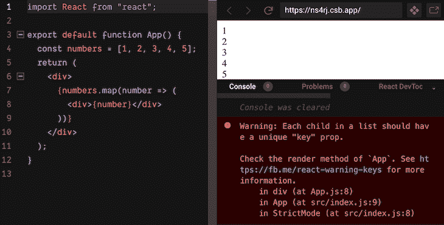
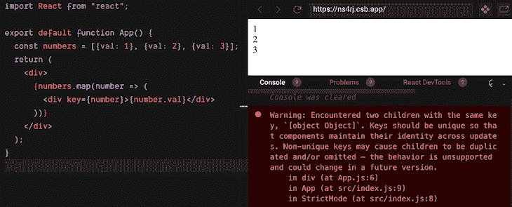
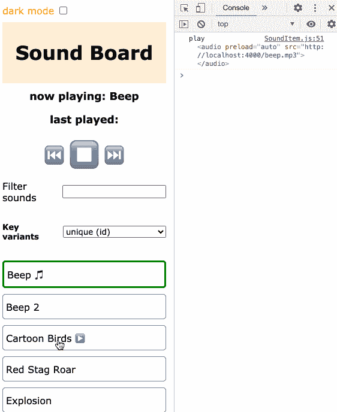
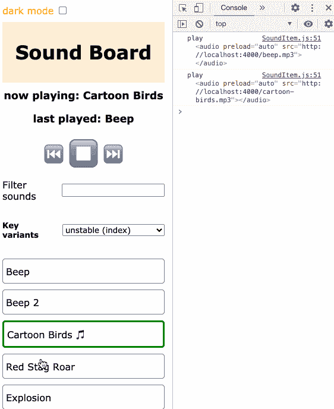
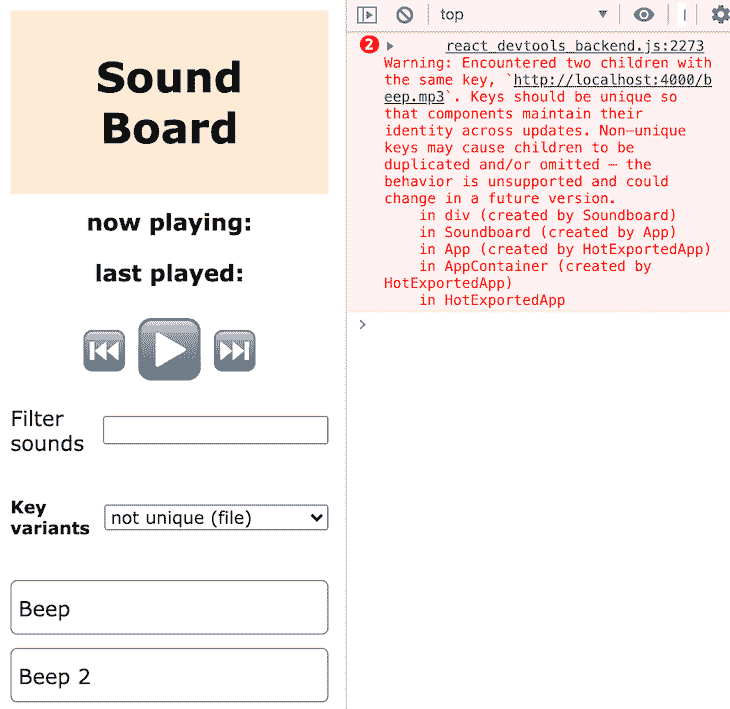
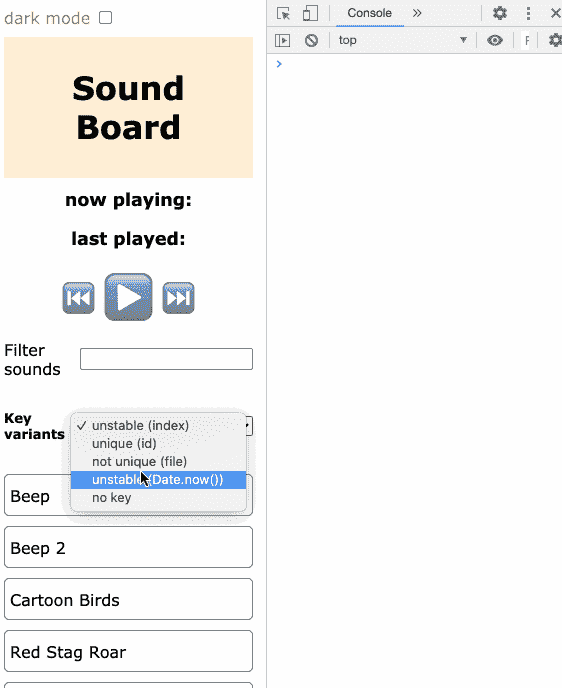
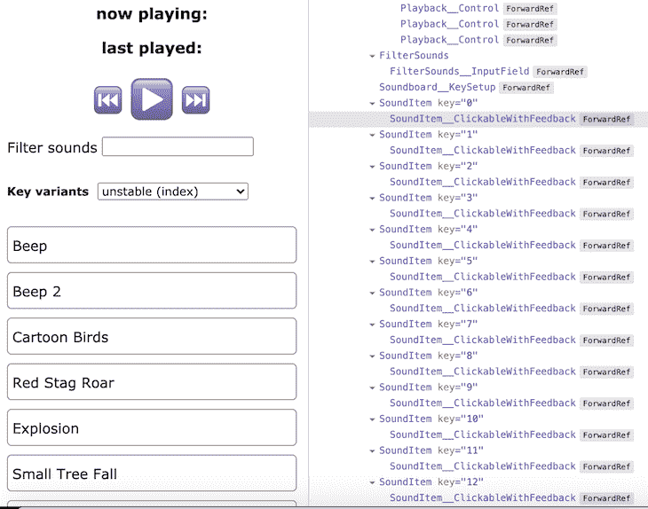

# 为什么不利的反应键会导致不可预测的行为

> 原文：<https://blog.logrocket.com/unfavorable-react-keys-unpredictable-behavior/>

列表在应用程序中无处不在。在实际项目中，这样的列表可能会很长，从而影响性能。这就是为什么 React 希望您在迭代对象列表以呈现多个 JSX 元素时，为每个元素添加唯一键。

这一点至关重要，否则，React 无法确定与上一个渲染周期相比，哪些元素被添加、移除或重新排序。结果是元素被不必要地重新呈现，或者在最坏的情况下，组件状态被混淆，导致严重的错误。

所以，React 需要美国开发者的一点帮助，以确保良好的性能结果。如果你省略了 key，条目在列表内得不到稳定的标识，React 会在控制台对你大喊:**警告:一个列表中的每个孩子都应该有一个唯一的“key”道具**。



React throws a warning at you if you omit a key.

## 反应键是怎么回事？

下面的代码块演示了如何为列表元素提供键。

```
function App() {
  const numbers = [1, 2, 3, 4, 5];
  return (
    <div>
      {numbers.map(number => (
        <div key={number}>{number}</div>
      ))}
    </div>
  );
}
```

在这个非常简单的例子中，我们也使用 item 作为键。问题解决了！然而，大多数时候你没有一个原始值的列表。如果你用一个对象作为键会发生什么？

```
const numbers = [{val: 1}, {val: 2}, {val: 3}];
  return (
    <div>
      {numbers.map(number => (
        <div key={number}>{number.val}</div>
      ))}
    </div>
  );
```

好吧，React 再次抛出警告。



Using an object as key is not a good idea because it gets flattened.

仔细看看解释，您会注意到问题是由于键值总是被转换成字符串表示这一事实。不管实际值是多少，键值总是`[object Object]`。这就是你有复制品的原因。

所以，解决方法是再次使用一个原始值。

```
const numbers = [{val: 1}, {val: 2}, {val: 3}];
  return (
    <div>
      {numbers.map(number => (
        <div key={number.val}>{number.val}</div>
      ))}
    </div>
  );
```

在现实世界的项目中，您有这样的代码并使用列表项的属性。

```
const products = fetchProducts();
  return (
    <div>
      {procuts.map(product => (
        <Product key={product.id} product={product} />
      ))}
    </div>
  );
```

您必须为每个列表项选择一个存在的属性。此外，属性值必须是惟一的，否则会因为重复而得到一个警告，正如您在上面看到的`[object Object]`警告。

顺便说一句，您不必像下面的例子那样提出“人类可读”的密钥。

```
const numbers = [{val: 1}, {val: 2}, {val: 3}];
  return (
    <div>
      {numbers.map(number => (
        <div key={`number_${number.val}`}>{number.val}</div>
      ))}
    </div>
  );
```

React 不关心键值，只要它满足合适的键的要求。提供唯一的键非常重要，否则 React 的[协调算法](https://reactjs.org/docs/reconciliation.html)无法清楚地确定自上一次渲染周期以来列表中的某些内容是否发生了变化(添加、移除、重新排序)。

如果您不能选择列表项的一个属性来保证明确性，也许您可以组合两个或更多的属性。看看下面这个构造的例子。

```
const orders = [{user: "Fred", productId: 1}, {user: "Michael", productId: 1}, {user: "Fred", productId: 3}];
  return (
    <div>
      {orders.map(order => (
        <div key={`${order.user}{${order.productId}}`}>User {order.user} ordered product with id {order.productId}</div>
      ))}
    </div>
  );
```

在下一节中，我们将详细讨论什么是好的密钥，以及选择不合适的密钥会导致什么问题。

## 不合适的键及其影响的示例

为了演示不同的用例，我开发了一个小小的[音板演示应用程序](https://github.com/doppelmutzi/react-soundboard-key-showcase)。在初始化阶段，应用程序获取一个声音对象列表，并进行渲染。单击列表条目会播放相应的声音。用户也可以使用播放按钮来停止播放或播放上一个或下一个声音。您也可以过滤列表。

看一下下拉字段，您可以在不同的键计算方式之间进行选择。首先，我们选择 **unique (id)** 来使用惟一 id 作为服务器响应的一部分。下面的动画 gif 显示了预期的行为。当你点击一个列表项时，对应于标签的声音效果将被播放。它适用于未过滤和过滤列表。



Soundboard demo application.

您可以通过右侧的控制台输出来跟踪这种正确的行为；播放正确的 mp3 文件。为了证明实际播放了正确的声音效果，请试用演示应用程序。然而，如果您不使用唯一且稳定的密钥，可能会出现奇怪的行为。为了演示这一点，我们从下拉列表中选择**不稳定(指数)**。



Weird behavior with map index as key.

正如您在控制台输出中看到的，当您播放未过滤列表中的声音，然后过滤该列表并第二次尝试播放一首歌曲时，您会以错误的播放结束。为什么会这样？因为列表项的键由于列表项的改变而不稳定。因此，如果没有一个准确的密钥，您可能会遇到严重的、难以跟踪的错误。

这个示例项目展示了为什么您应该总是选择一个稳定且唯一的键。这就给我们带来了一个问题，什么构成了一个稳定且唯一的键？

在这个上下文中，稳定意味着每次 React 通过呈现过程时，每个列表项都获得相同的键。从编码的角度来看，这意味着您的键基于与当前列表项相关联的实际数据。不要从其他上下文信息中获取密钥，比如相应 React 组件的状态变量或属性。

* * *

### 更多来自 LogRocket 的精彩文章:

* * *

下一个代码片段是有问题的，因为密钥分发是不确定的。

```
const Songs = ({darkMode, mp3s}) => mp3s.map((mp3, i) => <SoundItem mp3={mp3} key={`${darkMode}_${i}`} />)
```

如果`darkMode`道具的值为`true` *，则`true_3`是列表项 4 的键。*为什么这样不好？因为道具可以在运行时改变，然后同一个物品可以用一个键`false_3`重新分配。

但是，React 需要稳定的密钥。否则，在协调虚拟 DOM 时，React 无法检测哪些组件需要重新呈现或者可以重用。这可能会导致错误。下面的例子没有使用外部上下文变量会怎么样？

```
const Songs = ({darkMode, mp3s}) => mp3s.map((mp3, i) => <SoundItem mp3={mp3} key={i} />)
```

正如我们从上一个动画 gif 和产生的错误行为中所猜测的，使用索引被认为是不好的做法。为什么？不保证列表项的键在所有呈现周期中都是相同的(即稳定的)。

在运行时，如果列表的顺序发生变化(例如，由于过滤)或者应用程序允许插入或删除列表条目，那么您可能会遇到难以预测的错误，正如您在上面的第二个动画 gif 中看到的那样。

这是因为 React 可能会混淆组件状态，并可能对不同的组件实例使用旧的键。如果这么简单，React 团队就不会要求我们这些开发者提供密钥了吧？

但是，如果您的列表是静态的，没有重新排序、过滤或其他更改，那么稍微懒惰一点并使用索引作为键也是可以的。但是请注意，您的应用程序可能会增长，并且需求可能会改变。

在演示项目中，我在`sounds.json`中添加了两个具有相同`file`属性的条目。如果您从下拉列表中选择**非唯一(文件)**，则密钥基于`file`属性。

```
const Songs = ({mp3s}) => mp3s.map(mp3 => <SoundItem mp3={mp3} key={mp3.file} />)
```

与`id`属性相反，`file`属性在所有列表项中不是唯一的。



React is warning us about non-unique keys.

React 发现两个孩子有相同的键，因此抛出一个警告。React 希望列表中有唯一的键，否则 React 就不能确定一个元素是否需要重新呈现。React 的优化过程遭到破坏。

所以这里的问题是一个键必须一致地映射到同一个 React 元素。换句话说，React 需要可预测的键。什么是可预测的密钥？

考虑下一个例子，我们的键完全基于索引。如果我们有三个列表项，列表项呈现如下:

```
<SoundItem mp3="sound-1" key={1} />
<SoundItem mp3="sound-2" key={2} />
<SoundItem mp3="sound-3" key={3} />
```

如果我们删除第一个条目，那么剩下的两个列表项应该如下所示:

```
<SoundItem mp3="sound-2" key={2} />
<SoundItem mp3="sound-3" key={3} />
```

所以键应该保持不变，即使`sound-2`和`sound-3`现在分别位于位置 1 和位置 2。这就是依赖指数不是一个好主意的原因。

这也是为什么你不应该尝试使用`Math.random()`或`Date.now()`的结果作为密钥的原因。这些键非常不稳定，您会遇到严重的性能问题和错误。正如你在下一个动画 gif 中看到的，当你选择**不稳定(Date.now())** 时，元素会一遍又一遍地重新渲染，直到应用崩溃。



Unstable keys can crash the whole app.

最后，我们应该注意，键只需要在相邻的元素或兄弟列表项中是唯一的。一个键不必是全局唯一的，而只在一个列表的范围内。您甚至可以在不同的列表中重复使用相同的键。

## 对于唯一的、稳定的和可预测的键，我们有什么选择？

任务是从每个列表项的数据中获取符合这些要求的键。通常，您从某种后端获取数据。在这种情况下，稳定性和可预测性的责任在于后端层——因此，如果您的密钥有问题，就归咎于后端开发人员。😉

在这种情况下，后端层向您发送表示列表项的域对象，这些对象已经配备了惟一的键(服务器端生成的 id)。如果您的团队使用关系数据库或基于文档的数据库，他们无论如何都要处理惟一键，并且很可能有生成惟一 id 的策略。在这种情况下，为您的 React 列表获取合适的键是轻而易举的。

如果您从选择框中选择 **unique** ，那么服务器响应的 unique `id`属性将用于键。在这个演示应用程序中，`id`是独一无二的，与`file`形成对比。

```
const Songs = ({mp3s}) => mp3s.map(mp3 => <SoundItem mp3={mp3} key={mp3.id} />)
```

另一方面，如果你的应用程序允许添加新的条目(例如，使用表单字段)，并且你追求一种[乐观更新](https://stackoverflow.com/a/33009713)的方法(例如，提高 UX，使你的应用程序支持离线)，那么你仍然必须在前端提供密钥(客户端生成的 id)。

根据您的体系结构，这些乐观键只是临时的，当您从服务器获得成功响应时，需要用实际的惟一 ID 替换。然而，这种方法的缺点是您的密钥不稳定，因为您只需更改一次初始值。

另一种乐观的更新方法是在前端生成所有密钥。然而，根据 [RFC 4122](https://www.ietf.org/rfc/rfc4122.txt) 自己生成 UUIDs(通用唯一标识符)或 GUIDs(全球唯一标识符)是一项[易错](https://stackoverflow.com/a/105074)和[困难的任务](https://stackoverflow.com/a/2117523)。

鼓励为生产环境编写代码的开发人员使用严格的、维护良好的实现。因此，我会推荐使用一个成熟的、被大量使用的库，比如最新版本的 [uuid 包](https://github.com/uuidjs/uuid)。

在任何情况下，在客户端或服务器端生成全局唯一的 id 都比听起来要困难。甚至在应用程序的后端层，您可能有需要协调 id 的分布式服务器。

> 客户端生成的 IDs 的潜在问题是:可靠性、安全性和性能。–[瓦西里·祖卡诺夫](https://www.techyourchance.com/client-generated-ids-vs-server-generated-ids/)

但是，我想重申，列表项的键只需要在它的兄弟中是唯一的。所以，大多数时候，很容易从列表项的数据中找到一个键。

## 排除故障

为了在运行时检查分配给列表项的键，你必须使用 [React DevTools](https://reactjs.org/blog/2019/08/15/new-react-devtools.html) 。可以查看每个列表元素的`key`属性。



React DevTools shows the key values.

当然，你也可以利用古老的说法。

## 结论

无论何时使用列表，React 都需要我们开发人员的支持，为列表项提供合适的键。好的一面是这是一个非常简单的概念——您只需要注意提供稳定且唯一的密钥。大多数时候你手头都有一些后端 id。否则，您必须对列表项数据更有创造性。

## 使用 LogRocket 消除传统反应错误报告的噪音

[LogRocket](https://lp.logrocket.com/blg/react-signup-issue-free)

是一款 React analytics 解决方案，可保护您免受数百个误报错误警报的影响，只针对少数真正重要的项目。LogRocket 告诉您 React 应用程序中实际影响用户的最具影响力的 bug 和 UX 问题。

[ ](https://lp.logrocket.com/blg/react-signup-general) [  ](https://lp.logrocket.com/blg/react-signup-general) [LogRocket](https://lp.logrocket.com/blg/react-signup-issue-free)

自动聚合客户端错误、反应错误边界、还原状态、缓慢的组件加载时间、JS 异常、前端性能指标和用户交互。然后，LogRocket 使用机器学习来通知您影响大多数用户的最具影响力的问题，并提供您修复它所需的上下文。

关注重要的 React bug—[今天就试试 LogRocket】。](https://lp.logrocket.com/blg/react-signup-issue-free)