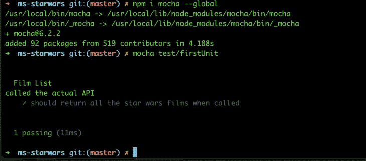

# Node.js 应用程序的单元和集成测试

> 原文：<https://blog.logrocket.com/unit-and-integration-testing-for-node-js-apps/>

对于任何应用程序，测试都是开发过程中不可或缺的一部分。

使用您的应用程序构建测试使您能够:

*   快速验证对项目的更改不会破坏预期的行为
*   在记录路径流时充当伪文档
*   轻松演示应用程序行为
*   快速检查应用程序的健康状况和代码库

这篇文章将介绍 Node.js 应用程序的单元和集成测试。

我们将在 GitHub 上回顾我的 express . js API ms-star wars[。我建议对我的项目做一个`git clone`,并跟随我讨论对应用程序进行单元测试的不同方法。](https://github.com/andrewevans0102/ms-starwars)

### 测试概述

当使用 Node.js 进行测试时，通常会使用以下代码:

术语测试通常还指以下内容:

*   **单元测试**–测试你的应用程序代码和逻辑。这是您的代码实际做的任何事情，不依赖于外部服务和数据来完成。
*   **集成测试**–测试您的应用程序与应用程序内部(或外部)的服务的连接。这可能包括连接应用程序的不同部分，或者在一个大型项目中连接两个不同的应用程序。
*   回归测试——在一系列更改完成后测试您的应用程序行为。这通常是在主要产品发布之前做的事情。
*   **端到端测试**–测试项目的完整端到端流程。这包括外部 HTTP 调用和项目中的完整流程。

除了这四种，还有其他特定于应用程序和框架的测试形式。

在这篇文章中，我们将关注单元和集成测试。

首先，让我们讨论一下我们将使用的不同框架。

### 摩卡是什么？

Mocha 是一个测试运行程序，可以让您测试 Node.js 代码。它适用于任何 Node.js 项目，并遵循基本的 [Jasmine](https://jasmine.github.io/2.0/introduction.html) 语法，如下所示(借用自[的 mocha 入门文档](https://mochajs.org/#getting-started))。

```
describe('Array', function() {
  describe('#indexOf()', function() {
    it('should return -1 when the value is not present', function() {
      assert.equal([1, 2, 3].indexOf(4), -1);
    });
  });
});
```

使用 mocha，您还可以使用断言库，如 [assert](https://www.npmjs.com/package/assert) 、 [expect](https://www.npmjs.com/package/expect) 等等。

Mocha 在 test runner 本身也有很多特性。我强烈推荐阅读 Glad Chinda 的[快速完整的摩卡测试指南](https://blog.logrocket.com/a-quick-and-complete-guide-to-mocha-testing-d0e0ea09f09d/)以获取更多信息。

### 柴和柴是什么-http？

[柴](https://www.chaijs.com/)为 Node.js 提供断言库。

Chai 包含了一些基本的断言，您可以使用它们来验证行为。一些比较受欢迎的包括:

这些可以在你的测试中用来评估你正在测试的代码的情况，比如下面的[摘自柴的主页](https://www.chaijs.com/):

```
chai.should();

foo.should.be.a('string');
foo.should.equal('bar');
foo.should.have.lengthOf(3);
tea.should.have.property('flavors')
  .with.lengthOf(3);
```

Chai-http 是一个插件，它提供了一个完全成熟的测试运行器，可以实际运行您的应用程序并直接测试其端点:

```
describe('GET /films-list', () => {
  it('should return a list of films when called', done => {
    chai
      .request(app)
      .get('/films-list')
      .end((err, res) => {
        res.should.have.status(200);
        expect(res.body).to.deep.equal(starwarsFilmListMock);
        done();
      });
  });
});
```

使用 chai-http，测试运行程序启动您的应用程序，调用请求的端点，然后在一个命令中完成所有操作。

这非常强大，有助于应用程序的集成测试。

### 什么是西农？

除了有一个测试运行器和断言，测试还需要刺探、存根和嘲讽。Sinon 为 spys、stubs 和 mocks 提供了一个框架来测试 Node.js。

Sinon 相当简单，您只需在应用程序的不同测试中使用相关的 spy、stub 和 mock 对象。

使用 sinon 的一些存根进行的简单测试如下所示:

```
describe('Station Information', function() {
  afterEach(function() {
    wmata.stationInformation.restore();
  });
  it('should return station information when called', async function() {
    const lineCode = 'SV';
    const stationListStub = sinon
      .stub(wmata, 'stationInformation')
      .withArgs(lineCode)
      .returns(wmataStationInformationMock);
    const response = await metro.getStationInformation(lineCode);
    expect(response).to.deep.equal(metroStationInformationMock);
  });
});
```

我知道这里发生了很多事情，但让我们只关注这一点:

```
const stationListStub = sinon
      .stub(wmata, 'stationInformation')
      .withArgs(lineCode)
      .returns(wmataStationInformationMock);
```

这是为带有参数`lineCode`的`wmata`服务的方法`stationInformation`创建一个存根，该存根将在`wmataStationInformationMock`返回模拟。

这让您可以构建基本的存根，这样测试运行程序将使用您的存根来代替它所运行的方法。这很好，因为你可以隔离行为。

西农能做的不仅仅是树桩。

关于用 sinon 测试的更多信息，我推荐阅读 Leighton Wallace 的[How to best use Sinon with Chai](https://blog.logrocket.com/sinon-with-chai/)。

### 演示

在我开始实际构建测试之前，我想简单描述一下我的项目。

ms-starwars 实际上是对 Star Wars API (SWAPI)的 API 调用的编排，这里的提供了[。SWAPI 本身就是一个非常好的 API，它提供了大量关于星球大战大炮的数据。](https://swapi.co/)

更酷的是 SWAPI 是社区驱动的。因此，如果您看到某处缺少信息，您可以在这里打开他们的[项目的 PR 并自己添加。](https://github.com/phalt/swapi)

当您为 SWAPI 调用端点时，API 会返回额外的端点，您可以调用这些端点来获取更多信息。这使得 rest 调用有些轻量级。

下面是来自`film`端点的响应:

```
{
    "title": "A New Hope",
    "episode_id": 4,
    "opening_crawl": "It is a period of civil war.\r\nRebel spaceships, striking\r\nfrom a hidden base, have won\r\ntheir first victory against\r\nthe evil Galactic Empire.\r\n\r\nDuring the battle, Rebel\r\nspies managed to steal secret\r\nplans to the Empire's\r\nultimate weapon, the DEATH\r\nSTAR, an armored space\r\nstation with enough power\r\nto destroy an entire planet.\r\n\r\nPursued by the Empire's\r\nsinister agents, Princess\r\nLeia races home aboard her\r\nstarship, custodian of the\r\nstolen plans that can save her\r\npeople and restore\r\nfreedom to the galaxy....",
    "director": "George Lucas",
    "producer": "Gary Kurtz, Rick McCallum",
    "release_date": "1977-05-25",
    "characters": [
        "https://swapi.co/api/people/1/",
        "https://swapi.co/api/people/2/",
        "https://swapi.co/api/people/3/",
        "https://swapi.co/api/people/4/",
        "https://swapi.co/api/people/5/",
        "https://swapi.co/api/people/6/",
        "https://swapi.co/api/people/7/",
        "https://swapi.co/api/people/8/",
        "https://swapi.co/api/people/9/",
        "https://swapi.co/api/people/10/",
        "https://swapi.co/api/people/12/",
        "https://swapi.co/api/people/13/",
        "https://swapi.co/api/people/14/",
        "https://swapi.co/api/people/15/",
        "https://swapi.co/api/people/16/",
        "https://swapi.co/api/people/18/",
        "https://swapi.co/api/people/19/",
        "https://swapi.co/api/people/81/"
    ],
    "planets": [
        "https://swapi.co/api/planets/2/",
        "https://swapi.co/api/planets/3/",
        "https://swapi.co/api/planets/1/"
    ],
    "starships": [
        "https://swapi.co/api/starships/2/",
        "https://swapi.co/api/starships/3/",
        "https://swapi.co/api/starships/5/",
        "https://swapi.co/api/starships/9/",
        "https://swapi.co/api/starships/10/",
        "https://swapi.co/api/starships/11/",
        "https://swapi.co/api/starships/12/",
        "https://swapi.co/api/starships/13/"
    ],
    "vehicles": [
        "https://swapi.co/api/vehicles/4/",
        "https://swapi.co/api/vehicles/6/",
        "https://swapi.co/api/vehicles/7/",
        "https://swapi.co/api/vehicles/8/"
    ],
    "species": [
        "https://swapi.co/api/species/5/",
        "https://swapi.co/api/species/3/",
        "https://swapi.co/api/species/2/",
        "https://swapi.co/api/species/1/",
        "https://swapi.co/api/species/4/"
    ],
    "created": "2014-12-10T14:23:31.880000Z",
    "edited": "2015-04-11T09:46:52.774897Z",
    "url": "https://swapi.co/api/films/1/"
}
```

为包括字符、行星等各种区域返回附加的 API 端点。

要获得特定电影的所有数据，您必须调用:

*   薄膜终点
*   字符的所有端点
*   行星的所有端点
*   星际飞船的所有端点
*   车辆的所有端点
*   物种的所有终点

我构建 ms-starwars 是为了尝试将 HTTP 调用捆绑到返回的端点，并使您能够发出单个请求并获得任何端点的相关数据。

为了设置这个编排，我创建了 Express.js 路由和相关的控制器。

我还为每个 SWAPI 调用添加了一个缓存机制。这提高了我的 API 的性能，因此这些捆绑的 HTTP 调用没有与进行多个 HTTP 调用等相关的延迟。

* * *

### 更多来自 LogRocket 的精彩文章:

* * *

在项目中，单元测试在`/test/unit`可用。在`test/integration`可以进行`integration`测试。你可以用我的项目的 npm 脚本运行它们:
`npm run unit-tests`和`npm run intergration-tests`。

在接下来的章节中，我们将逐步编写单元测试和集成测试。然后，我们将介绍一些您可以进行的考虑和优化。

让我们来看看代码。

### 单元测试

首先，让我们在示例项目中的`/test/firstUnit.js`处创建一个新文件

在测试的顶部，让我们添加以下内容:

```
const sinon = require('sinon');
const chai = require('chai');
const expect = chai.expect;
const swapi = require('../apis/swapi');
const starwars = require('../controllers/starwars');
// swapi mocks
const swapiFilmListMock = require('../mocks/swapi/film_list.json');
// starwars mocks
const starwarsFilmListMock = require('../mocks/starwars/film_list.json');
```

这是在做什么？好了，前几行引入了项目的依赖项:

```
const sinon = require('sinon');
const chai = require('chai');
const expect = chai.expect;
const swapi = require('../apis/swapi');
const starwars = require('../controllers/starwars');
```

*   拉入 [sinon 框架](https://sinonjs.org/)。
*   拉进[柴架](https://www.chaijs.com/)。
*   定义`expect`以便我们可以使用它断言。
*   引入项目中定义的`swapi` api 服务。这些是对 SWAPI 端点的直接调用。
*   引入项目中定义的`starwars` api 控制器。这些是 SWAPI 端点的编排。

接下来，你会注意到所有的模拟:

```
// swapi mocks
const swapiFilmListMock = require('../mocks/swapi/film_list.json');
// starwars mocks
const starwarsFilmListMock = require('../mocks/starwars/film_list.json');
```

这些是来自 SWAPI 端点的 JSON 响应和从项目控制器返回的结果。

由于我们的单元测试只是测试我们的实际代码，并不依赖于实际的流程，模拟数据使我们能够只测试代码，而不依赖于正在运行的服务。

接下来，让我们用以下内容定义我们的第一个测试:

```
describe('Film List', function() {
  afterEach(function() {
    swapi.films.restore();
  });
  it('should return all the star wars films when called', async function() {
    sinon.stub(swapi, 'films').returns(swapiFilmListMock);
    const response = await starwars.filmList();
    expect(response).to.deep.equal(starwarsFilmListMock);
  });
});
```

这里，`describe`块定义了测试的一个事件。

你通常会使用`describe`并用一个`it`把它包起来。这使您能够对测试进行分组，这样`describe`可以被看作是组的名称，而`it`可以被看作是将要运行的单个测试。

您还会注意到我们有一个`afterEach`函数。

有几个这种类型的函数适用于 Mocha。

通常，您最常看到的是`afterEach`和`beforeEach`。这些基本上是生命周期挂钩，使您能够为测试设置数据，然后在测试运行后释放资源。

在`afterEach`内有一个`swapi.films.restore()`调用。

这释放了 SWAPI `films`端点用于存根和未来的测试。这是必要的，因为我测试的星球大战控制器正在调用 SWAPI `films`端点。

在`it`块中，您会注意到有一个定义后跟一个`async function`调用。这里的`async`调用向运行者表明有异步行为要测试。这使我们能够使用您在第 7 行看到的`await`调用。

最后，我们来看看测试本身。

首先，我们用以下内容定义存根:

```
sinon.stub(swapi, 'films').returns(swapiFilmListMock);
```

每当从`swapis` API 服务调用`films`方法时，这个存根就通知 Mocha 使用模拟文件。

要在测试运行程序中释放这个方法，您需要调用`restore`。

这对我们来说并不是一个问题，因为我们只是运行一个测试，但是如果你定义了很多测试，那么你会想要这样做。我把它放在这里只是为了表示习惯。

最后，我们有实际的方法调用和一个`expect`来检查结果:

```
const response = await starwars.filmList();
expect(response).to.deep.equal(starwarsFilmListMock);
```

当您运行这个测试时，它应该调用`filmList`控制器，并返回预期的`starwarsFilmListMock`响应。

让我们运行它。

通过以下方式在您的终端中全球安装 Mocha:

```
npm i mocha --global
```

然后，用 运行测试

```
mocha test/firstUnit
```

您应该看到以下内容:



在高层次上，这是任何单元测试都可以预期的。

请注意，我们执行了以下操作:

1.  安排–我们通过创建存根来设置我们的数据
2.  act——我们调用了控制器方法来执行测试
3.  断言——我们断言来自控制器的响应等于我们保存的模拟值

在运行任何测试时，这种安排、操作和断言的模式都是需要记住的。

### 更复杂的单元测试

第一个测试向您展示了基本的设置——您现在对 arrange、act 和 assert 有了基本的了解。

让我们考虑一个更复杂的测试:

```
describe('Film', function() {
  afterEach(function() {
    swapi.film.restore();
    swapi.people.restore();
  });
  it('should return all the metadata for a film when called', async function() {
    const filmId = '1';
    const peopleId = '1';
    const planetId = '1';
    const starshipId = '2';
    const vehicleId = '4';
    const speciesId = '1';
    sinon
      .stub(swapi, 'film')
      .withArgs(filmId)
      .resolves(swapiFilmMock);
    sinon
      .stub(swapi, 'people')
      .withArgs(peopleId)
      .resolves(swapiPeopleMock);
    sinon
      .stub(swapi, 'planet')
      .withArgs(planetId)
      .resolves(swapiPlanetMock);
    sinon
      .stub(swapi, 'starship')
      .withArgs(starshipId)
      .resolves(swapiStarshipMock);
    sinon
      .stub(swapi, 'vehicle')
      .withArgs(vehicleId)
      .resolves(swapiVehicleMock);
    sinon
      .stub(swapi, 'species')
      .withArgs(speciesId)
      .resolves(swapiSpeciesMock);
    const response = await starwars.film(filmId);
    expect(response).to.deep.equal(starwarsFilmMock);
  });
});
```

哇，好多存根啊！但是它并不像看起来那么可怕——这个测试基本上和我们之前的例子做了同样的事情。

我想强调一下这个测试，因为它使用了多个存根(带参数)。

正如我之前提到的，ms-starwars 将几个 HTTP 调用捆绑在一起。对`film`端点的一个调用实际上调用了`film`、`people`、`planet`、`starship`、`vehicle`和`species`。要做到这一点，所有这些模拟都是必要的。

一般来说，这就是你的单元测试的样子。您可以对 PUT、POST 和 DELETE 方法调用执行类似的行为。

关键是测试代码。注意，我们在返回值中使用了 stub 和 mock。

我们在测试应用程序逻辑，并不关心应用程序的整体工作。测试完整流程的测试通常是集成或端到端测试。

### 集成测试

对于单元测试，我们只关注测试代码本身，而不关心端到端的流程。

我们只关注于确保应用程序方法从预期的输入中获得预期的输出。

对于集成测试(以及端到端测试)，我们测试流程。

集成测试很重要，因为它们确保应用程序的各个组件能够协同工作。

这对于微服务非常重要，因为您将定义不同的类来创建微服务。

您也可能有一个包含多个服务的项目，您需要编写集成测试来确保它们能够很好地协同工作。

对于 ms-starwars 项目，我们只是要确保控制器提供的编排与对 SWAPI 端点的各个 API 调用一起工作。

继续用`/test/firstIntegration.js`定义一个新文件。

将以下内容添加到文件的顶部:

```
const chai = require('chai');
const chaiHttp = require('chai-http');
chai.use(chaiHttp);
const app = require('../server');
const should = chai.should();
const expect = chai.expect;
// starwars mocks
const starwarsFilmListMock = require('../mocks/starwars/film_list.json');
```

这是在做什么？

首先，我们定义了一个 [chai](https://www.chaijs.com/) 和 [chai-http](https://www.chaijs.com/plugins/chai-http/) 的实例。接下来，我们将从`server.js`文件中定义实际应用程序本身的实例。

然后我们引入 should 和 expect，最后我们引入一个 mock，我们将使用它来比较响应。

让我们构建我们的测试:

```
describe('GET /films-list', () => {
  it('should return a list of films when called', done => {
    chai
      .request(app)
      .get('/films-list')
      .end((err, res) => {
        res.should.have.status(200);
        expect(res.body).to.deep.equal(starwarsFilmListMock);
        done();
      });
  });
});
```

这是在做什么？

嗯，这类似于我们之前看到的语法——我们有带`it`的`describe`。这将设置测试，并表明测试实际上正在这里进行。

然后我们调用`chai.request`并传递我们对 app ( `server.js`)文件的引用。这就是我们如何使用 [chai-http](https://www.chaijs.com/plugins/chai-http/) 库进行 http 调用。

然后，我们从我们的 API 向`films-list`端点传递一个 GET 调用。

然后我们调用`end`来通知行为，当调用完成时做什么。

我们预计`200`的状态为:

```
res.should.have.status(200);
```

然后，我们期待一个机构平等的嘲笑:

```
expect(res.body).to.deep.equal(starwarsFilmListMock);
```

最后，我们调用`done()`来停止测试运行程序。

真正酷的部分是它在本地启动你的应用程序，运行你指定的请求(GET，POST PUT DELETE，等等。)，使您能够捕获响应，并关闭本地运行的应用程序。

现在我们的集成测试设置好了，用下面的代码运行它:

```
    mocha --exit test/firstIntegration
> note that the `--exit` flag is being passed here just to signal to the test runner to stop after the test finishes.  You can run it without `--exit` , but it would just wait for you to manually cancel the process.
```

那么您应该会看到这样的内容:


除了测试运行程序之外，还有其他框架可以运行您的应用程序。

然而，使用 chai-http 是干净的，并且易于在您的任何项目中实现，通常不需要额外的框架。

我推荐使用 chai-http 库和您的应用程序，并在有问题时参考文档。

### 测试策略

对于任何测试套件，我们还应该考虑整体策略。你应该问问自己，你想考什么？你覆盖了所有的申请流程吗？是否有特定的边缘条件需要测试？您需要为您的产品负责人或团队领导提供报告吗？

到目前为止，我所介绍的框架使您能够运行测试，但是对于测试报告者来说还有许多选择。此外，还有一些测试工具可以提供代码覆盖率。

> 如果你在这里查阅[帖子，你会看到一个](https://medium.com/walkme-engineering/measure-your-nodejs-code-coverage-using-istanbul-82b129c81ae9)[伊斯坦布尔测试覆盖工具](https://istanbul.js.org/)的好例子。

我在团队中经历的一个失败是，他们认为如果代码覆盖率工具说你已经达到 90%的覆盖率，那么你就很好。这并不准确。

当您编写测试时，您应该考虑奇怪的行为和对特定输入的测试。仅仅因为你的代码已经被覆盖，并不意味着离群值和边缘情况已经被覆盖。

对于任何测试套件，您不仅应该考虑“快乐之路”和“悲伤之路”场景，还应该考虑边缘情况和客户的特定情况。

此外，在集成和端到端测试中，经常会依赖外部 HTTP 调用。

如果外部 API 关闭，这可能会有问题。

事实上，我最近构建了另一个微服务来做这件事。我使用一个模拟服务器来运行我的测试，并使用 [start-server-and-test](https://www.npmjs.com/package/start-server-and-test) 来一起运行这两个测试。

这被证明是一个很棒的体验，因为我可以独立运行我的测试，并且它将我从依赖外部 API 中解放出来。

我推荐[在这里查看我的文章](https://dev.to/andrewevans0102/mock-servers-with-integration-tests-52de)。这是一个很好的无依赖测试创新方法的例子。

总的来说，你的测试策略将基于你的情况。我建议你不要只看“快乐之路”或“预期案例”,而要考虑其他一切。

### 结论

我希望我在这里的帖子已经很好地介绍了如何测试 Node.js 应用程序。

我们已经讨论了可以在 Node.js 应用程序中使用的不同框架和技术。我们还完成了 Node.js 应用程序的单元和集成测试。

我在这里使用的框架是 Express.js，但是这些模式也适用于其他 Node.js 框架。我建议查看我上面提供的链接，以及每个框架的文档。

在推特上关注我，地址是 [@AndrewEvans0102。](https://twitter.com/andrewevans0102)

## 200 只显示器出现故障，生产中网络请求缓慢

部署基于节点的 web 应用程序或网站是容易的部分。确保您的节点实例继续为您的应用程序提供资源是事情变得更加困难的地方。如果您对确保对后端或第三方服务的请求成功感兴趣，

[try LogRocket](https://lp.logrocket.com/blg/node-signup)

.

[](https://lp.logrocket.com/blg/node-signup)[https://logrocket.com/signup/](https://lp.logrocket.com/blg/node-signup)

LogRocket 就像是网络和移动应用程序的 DVR，记录下用户与你的应用程序交互时发生的一切。您可以汇总并报告有问题的网络请求，以快速了解根本原因，而不是猜测问题发生的原因。

LogRocket 检测您的应用程序以记录基线性能计时，如页面加载时间、到达第一个字节的时间、慢速网络请求，还记录 Redux、NgRx 和 Vuex 操作/状态。

[Start monitoring for free](https://lp.logrocket.com/blg/node-signup)

.