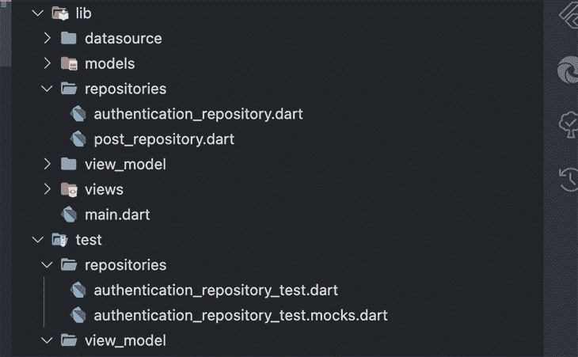
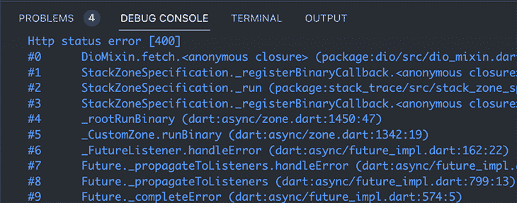
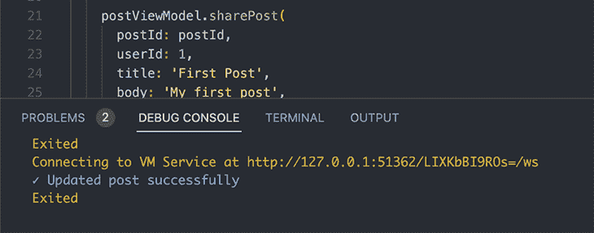

# 用 Mockito 对颤振代码进行单元测试

> 原文：<https://blog.logrocket.com/unit-testing-flutter-code-mockito/>

单元测试验证单个方法或类是否按预期工作。它还通过确认在进行新的更改时现有逻辑是否仍然工作来提高可维护性。

一般来说，单元测试很容易编写，但是要在测试环境中运行。默认情况下，当发出网络调用或 HTTP 请求时，会产生一个状态代码为`400`的空响应。为了解决这个问题，我们可以很容易地使用 Mockito 在任何时候发出 HTTP 请求时返回一个假的响应。Mockito 有各种各样的用例，我们将在后面逐步介绍。

在本教程中，我们将演示如何使用 Mockito 来测试颤振代码。我们将学习如何生成模拟、存根数据，并对发出流的方法执行测试。我们开始吧！

## 什么是莫奇托？

[Mockito 是一个众所周知的包](https://site.mockito.org/)，它使得生成现有类的伪实现变得更加容易。它消除了重复编写这些功能的压力。此外，Mockito 有助于控制输入，因此我们可以测试预期的结果。

假设使用 Mockito 使得编写单元测试更容易，然而，对于糟糕的架构，模仿和编写单元测试很容易变得复杂。

在本教程的后面，我们将学习如何将 Mockito 与模型-视图-视图模型(MVVM)模式一起使用，该模式涉及将代码库分成不同的可测试部分，如视图模型和存储库。

## 生成模拟和存根数据

模拟是真实类的假实现。它们通常用于控制测试的预期结果，或者当真正的类在测试环境中容易出错时。

为了更好地理解这一点，我们将为处理发送和接收帖子的应用程序编写单元测试。

### 项目结构概述

在我们开始之前，让我们将所有必需的包添加到我们的项目中。

```
dependencies:
  dio: ^4.0.6 # For making HTTP requests

dev_dependencies:
  build_runner: ^2.2.0 # For generating code (Mocks, etc)
  mockito: ^5.2.0 # For mocking and stubbing

```

我们将使用 MVVM 和存储库模式，该模式将包括对存储库和视图模型的测试。在 Flutter 中，将所有的测试放在`test`文件夹中是一个很好的实践，它与`lib`文件夹的结构非常匹配。

接下来，我们将通过给文件名添加`_test`来创建`authentication_repository.dart`和`authentication_repository_test.dart`文件。这有助于测试运行人员找到项目中存在的所有测试。



我们将通过创建一个名为`AuthRepository`的类来开始这一部分。顾名思义，这个类将处理我们应用程序中的所有身份验证功能。之后，我们将包含一个登录方法，它检查状态代码是否等于`200`，并捕捉身份验证时出现的任何错误。

```
class AuthRepository {
  Dio dio = Dio();

  AuthRepository();

  Future<bool> login({
    required String email,
    required String password,
  }) async {
    try {
      final result = await dio.post(
        '<https://reqres.in/api/login>',
        data: {'email': email, 'password': password},
      );

      if (result.statusCode != 200) {
        return false;
      }
    } on DioError catch (e) {
      print(e.message);
      return false;
    }

    return true;
  }

  // ...
}

```

```
void main() {
  late AuthRepository authRepository;

  setUp(() {
    authRepository = AuthRepository();
  });

  test('Successfully logged in user', () async {
    expect(
      await authRepository.login(email: '[email protected]', password: '123456'),
      true,
    );
  });
}

```

在上面的测试中，我们初始化了 setup 函数中的`AuthRepository`。由于它将在每个测试和测试组之前直接在`main`中运行，它将为每个测试或组初始化一个新的`auth`存储库。

接下来，我们将编写一个测试，期望 login 方法返回`true`而不抛出错误。然而，测试仍然会失败，因为默认情况下单元测试不支持发出网络请求，因此用`Dio`发出的登录请求会返回一个状态代码`400`。




为了解决这个问题，我们可以使用 Mockito 生成一个功能类似于`Dio`的模拟类。在 Mockito 中，我们通过在`main`方法的开头添加注释`@GenerateMocks([classes])`来生成 mocks。这通知构建运行器为列表中的所有类生成模拟。

```
@GenerateMocks([Dio, OtherClass])
void main(){
    // test for login
}

```

接下来，打开终端并运行命令`flutter pub run build_runner build`开始为类生成模拟。代码生成完成后，我们将能够通过在类名前添加`Mock`来访问生成的模拟。

```
@GenerateMocks([Dio])
void main(){
      MockDio mockDio = MockDio()
      late AuthRepository authRepository;
      ...
}

```

当我们调用登录端点时，我们必须存根数据以确保`MockDio`返回正确的响应数据。在 Flutter 中，stubbing 意味着在调用 mock 方法时返回一个假对象。例如，当测试使用`MockDio`调用登录端点时，我们应该返回一个状态代码为`200`的响应对象。

可以使用函数`when()`来清除 mock，该函数可以与`thenReturn`、`thenAnswer`或`thenThrow`一起使用，以便在我们调用 mock 方法时提供所需的值。`thenAnswer`函数用于返回未来或流的方法，而`thenReturn`用于模拟类的普通同步方法。

```
// To stub any method; gives error when used for futures or stream
when(mock.method()).thenReturn(value);

// To stub method that return a future or stream
when(mock.method()).thenAnswer(() => futureOrStream);

// To stub error
when(mock.method()).thenThrow(errorObject);

// dart
@GenerateMocks([Dio])
void main() {
  MockDio mockDio = MockDio();
  late AuthRepository authRepository;

  setUp(() {
    authRepository = AuthRepository();
  });

  test('Successfully logged in user', () async {
    // Stubbing
    when(mockDio.post(
      '<https://reqres.in/api/login>',
      data: {'email': '[email protected]', 'password': '123456'},
    )).thenAnswer(
      (inv) => Future.value(Response(
        statusCode: 200,
        data: {'token': 'ASjwweiBE'},
        requestOptions: RequestOptions(path: '<https://reqres.in/api/login>'),
      )),
    );

    expect(
      await authRepository.login(email: '[email protected]', password: '123456'),
      true,
    );
  });
}

```

在创建我们的存根之后，我们仍然需要将`MockDio`传递到测试文件中，这样就可以使用它来代替真正的`dio`类。为了实现这一点，我们将从`authRepository`中移除真正的`dio`类的定义或实例化，并允许它通过其构造函数传递。这个概念叫做依赖注入。

### 依赖注入

[Flutter 中的依赖注入](https://blog.logrocket.com/dependency-injection-flutter-using-getit-injectable/)是一种技术，其中一个对象或类提供另一个对象的依赖。这种模式确保了测试和视图模型都可以定义它们想要使用的`dio`的类型。

```
class AuthenticationRepository{
        Dio dio;

        // Instead of specifying the type of dio to be used
        // we let the test or viewmodel define it
        AuthenticationRepository(this.dio)
}

```

```
@GenerateMocks([Dio])
void main() {
  MockDio mockDio = MockDio();
  late AuthRepository authRepository;

  setUp(() {
    // we can now pass in Dio as an argument
    authRepository = AuthRepository(mockDio);
  });
}

```

## 使用参数匹配器

在前面的登录示例中，如果在发出请求时电子邮件`[[email protected]](/cdn-cgi/l/email-protection)`被更改为`[[email protected]](/cdn-cgi/l/email-protection)`，测试将产生一个`no stub found`错误。这是因为我们只为`[[email protected]](/cdn-cgi/l/email-protection)`创建了存根。

然而，在大多数情况下，我们希望通过使用 Mockito 提供的参数匹配器来避免重复不必要的逻辑。有了参数匹配器，我们可以对各种各样的值使用相同的存根，而不是确切的类型。

为了更好地理解匹配参数，我们将测试`PostViewModel`并为`PostRepository`创建模拟。推荐使用这种方法，因为当我们存根时，我们将返回自定义对象或模型，而不是响应和映射。也很轻松！

首先，我们将创建`PostModel`来更清晰地表示数据。

```
class PostModel {
  PostModel({
    required this.id,
    required this.userId,
    required this.body,
    required this.title,
  });

  final int id;
  final String userId;
  final String body;
  final String title;

  // implement fromJson and toJson methods for this
}

```

接下来，我们创建`PostViewModel`。这用于检索数据或向`PostRepository`发送数据。`PostViewModel`只不过是从存储库中发送和检索数据，并通知 UI 用新数据重建。

```
import 'package:flutter/material.dart';
import 'package:mockito_article/models/post_model.dart';
import 'package:mockito_article/repositories/post_repository.dart';

class PostViewModel extends ChangeNotifier {
  PostRepository postRepository;
  bool isLoading = false;

  final Map<int, PostModel> postMap = {};

  PostViewModel(this.postRepository);

  Future<void> sharePost({
    required int userId,
    required String title,
    required String body,
  }) async {
    isLoading = true;
    await postRepository.sharePost(
      userId: userId,
      title: title,
      body: body,
    );

    isLoading = false;
    notifyListeners();
  }

  Future<void> updatePost({
    required int userId,
    required int postId,
    required String body,
  }) async {
    isLoading = true;
    await postRepository.updatePost(postId, body);

    isLoading = false;
    notifyListeners();
  }

  Future<void> deletePost(int id) async {
    isLoading = true;
    await postRepository.deletePost(id);

    isLoading = false;
    notifyListeners();
  }

  Future<void> getAllPosts() async {
    isLoading = true;
    final postList = await postRepository.getAllPosts();

    for (var post in postList) {
      postMap[post.id] = post;
    }

    isLoading = false;
    notifyListeners();
  }
}

```

如前所述，我们模拟依赖关系，而不是我们测试的实际类。在这个例子中，我们为`PostViewModel`编写单元测试，并模仿`PostRepository`。这意味着我们将调用生成的`MockPostRepository`类中的方法，而不是可能抛出错误的`PostRepository`。

Mockito 使得匹配参数变得非常容易。例如，看看`PostViewModel`中的`updatePost`方法。它调用存储库`updatePost`方法，该方法只接受两个位置参数。对于 stub 这个类方法，我们可以选择提供确切的`postId`和`body`，或者我们可以使用 Mockito 提供的变量`any`来简化事情。

```
@GenerateMocks([PostRepository])
void main() {
  MockPostRepository mockPostRepository = MockPostRepository();
  late PostViewModel postViewModel;

  setUp(() {
    postViewModel = PostViewModel(mockPostRepository);
  });

  test('Updated post successfully', () {
    // stubbing with argument matchers and 'any'
    when(
      mockPostRepository.updatePost(any, argThat(contains('stub'))),
    ).thenAnswer(
      (inv) => Future.value(),
    );

    // This method calls the mockPostRepository update method
    postViewModel.updatePost(
      userId: 1,
      postId: 3,
      body: 'include `stub` to receive the stub',
    );

    // verify the mock repository was called
    verify(mockPostRepository.updatePost(3, 'include `stub` to receive the stub'));
  });
}

```

上面的存根包括了变量`any`和函数`argThat(matcher)`。在 Dart 中，匹配器用于指定测试预期。我们有不同类型的匹配器适合不同的测试用例。例如，如果对象包含相应的值，匹配器`contains(value)`将返回`true`。

### 匹配位置参数和命名参数

[在 Dart 中，我们也有位置参数和命名参数](https://blog.logrocket.com/introduction-to-using-dart-in-flutter/)。在上面的例子中，`updatePost`方法的 mock 和 stub 处理位置参数并使用`any`变量。

然而，命名参数不支持`any`变量，因为 Dart 没有提供一种机制来知道一个元素是否被用作命名参数。相反，我们在处理命名参数时使用`anyNamed(’name’)`函数。

```
when(
  mockPostRepository.sharePost(
    body: argThat(startsWith('stub'), named: 'body'),
    postId: anyNamed('postId'),
    title: anyNamed('title'),
    userId: 3,
  ),
).thenAnswer(
  (inv) => Future.value(),
);

```

当使用带有命名参数的匹配器时，我们必须提供参数的名称以避免错误。[你可以在 Dart 文档](https://api.flutter.dev/flutter/package-matcher_matcher/package-matcher_matcher-library.html)中阅读更多关于匹配器的信息，查看所有可能的可用选项。

## 在莫奇托制造假货

仿制品和假货经常被混淆，所以让我们快速澄清两者的区别。

Mocks 是生成的类，允许使用参数匹配器进行存根化。然而，Fakes 是覆盖 real 类的现有方法以提供更多灵活性的类，所有这些都没有使用参数匹配器。

例如，在 post 存储库中使用 fakes 而不是 mocks 将允许我们使伪存储库的功能类似于真实存储库。这是可能的，因为我们能够根据提供的值返回结果。更简单地说，当我们在测试中调用`sharePost`时，我们可以选择保存文章，然后使用`getAllPosts`确认文章是否被保存。

```
class FakePostRepository extends Fake implements PostRepository {
  Map<int, PostModel> fakePostStore = {};

  @override
  Future<PostModel> sharePost({
    int? postId,
    required int userId,
    required String title,
    required String body,
  }) async {
    final post = PostModel(
      id: postId ?? 0,
      userId: userId,
      body: body,
      title: title,
    );
    fakePostStore[postId ?? 0] = post;
    return post;
  }

  @override
  Future<void> updatePost(int postId, String body) async {
    fakePostStore[postId] = fakePostStore[postId]!.copyWith(body: body);
  }

  @override
  Future<List<PostModel>> getAllPosts() async {
    return fakePostStore.values.toList();
  }

  @override
  Future<bool> deletePost(int id) async {
    fakePostStore.remove(id);

    return true;
  }
}

```

使用`fake`更新的测试如下所示。使用`fake`，我们可以一次测试所有的方法。当一篇文章被添加或共享时，它会被添加到存储库中的地图中。

```
@GenerateMocks([PostRepository])
void main() {
  FakePostRepository fakePostRepository = FakePostRepository();
  late PostViewModel postViewModel;

  setUp(() {
    postViewModel = PostViewModel(fakePostRepository);
  });

  test('Updated post successfully', () async {
    expect(postViewModel.postMap.isEmpty, true);
    const postId = 123;

    postViewModel.sharePost(
      postId: postId,
      userId: 1,
      title: 'First Post',
      body: 'My first post',
    );
    await postViewModel.getAllPosts();
    expect(postViewModel.postMap[postId]?.body, 'My first post');

    postViewModel.updatePost(
      postId: postId,
      userId: 1,
      body: 'My updated post',
    );
    await postViewModel.getAllPosts();
    expect(postViewModel.postMap[postId]?.body, 'My updated post');
  });
}

```



## 抖动中的模拟和测试流

用 Mockito 模拟和存根化流与期货非常相似，因为我们使用相同的语法进行存根化。然而，现金流与期货有很大的不同，因为它们提供了一种机制，可以在价值发出时持续监听价值。

为了测试返回流的方法，我们可以测试该方法是否被调用，或者检查值是否以正确的顺序发出。

```
class PostViewModel extends ChangeNotifier {
  ...
  PostRepository postRepository;
  final likesStreamController = StreamController<int>();

  PostViewModel(this.postRepository);

  ...
  void listenForLikes(int postId) {
    postRepository.listenForLikes(postId).listen((likes) {
      likesStreamController.add(likes);
    });
  }
}

@GenerateMocks([PostRepository])
void main() {
  MockPostRepository mockPostRepository = MockPostRepository();
  late PostViewModel postViewModel;

  setUp(() {
    postViewModel = PostViewModel(mockPostRepository);
  });

  test('Listen for likes works correctly', () {
    final mocklikesStreamController = StreamController<int>();

    when(mockPostRepository.listenForLikes(any))
        .thenAnswer((inv) => mocklikesStreamController.stream);

    postViewModel.listenForLikes(1);

    mocklikesStreamController.add(3);
    mocklikesStreamController.add(5);
    mocklikesStreamController.add(9);

    // checks if listen for likes is called
    verify(mockPostRepository.listenForLikes(1));
    expect(postViewModel.likesStreamController.stream, emitsInOrder([3, 5, 9]));
  });
}

```

在上面的例子中，我们添加了一个`listenforLikes`方法，它调用`PostRepository`方法并返回一个我们可以监听的流。接下来，我们创建了一个测试，它监听流并检查方法是否以正确的顺序被调用和发出。

对于一些复杂的情况，我们可以使用`expectLater`或`expectAsync1`，而不是只使用`expect`函数。

## 结论

尽管大多数逻辑看起来很简单，但编写测试非常重要，这样我们就不会重复地对这些功能进行 QA。编写测试的目的之一是随着你的应用程序变大，减少重复的 QA。

在本文中，我们学习了如何在编写单元测试时有效地使用 Mockito 来生成模拟。我们还学习了如何使用 fakes 和参数匹配器来编写功能测试。

希望您能更好地理解如何构建您的应用程序来简化模仿。感谢阅读！

## 使用 [LogRocket](https://lp.logrocket.com/blg/signup) 消除传统错误报告的干扰

[](https://lp.logrocket.com/blg/signup)

[LogRocket](https://lp.logrocket.com/blg/signup) 是一个数字体验分析解决方案，它可以保护您免受数百个假阳性错误警报的影响，只针对几个真正重要的项目。LogRocket 会告诉您应用程序中实际影响用户的最具影响力的 bug 和 UX 问题。

然后，使用具有深层技术遥测的会话重放来确切地查看用户看到了什么以及是什么导致了问题，就像你在他们身后看一样。

LogRocket 自动聚合客户端错误、JS 异常、前端性能指标和用户交互。然后 LogRocket 使用机器学习来告诉你哪些问题正在影响大多数用户，并提供你需要修复它的上下文。

关注重要的 bug—[今天就试试 LogRocket】。](https://lp.logrocket.com/blg/signup-issue-free)