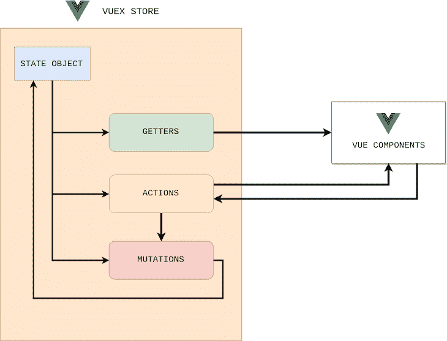

# 用 Jest 对 Vuex 模块进行单元测试

> 原文：<https://blog.logrocket.com/unit-testing-vuex-modules-jest/>

如果您正在构建一个中型到大型的 SPA，您可能会遇到希望更好地处理 Vue 组件状态的情况。

在任何应用程序中，多个组件都依赖于同一个状态。让我们想象一下，来自不同组件的多个动作想要改变同一个状态。为了克服这些挑战， [Vuex](https://vuex.vuejs.org/) 帮助我们维护整个应用程序的状态。

在本文中，我将指导您在 [TypeScript 中实现 Vuex 模块，然后使用 Jest](https://blog.logrocket.com/testing-typescript-apps-using-jest/) 对其进行单元测试。本教程的完整代码可以在 [vuex-test](https://github.com/gsampath127/vuex-test) GitHub 库获得；随便叉吧。我们开始吧！

## 什么是 Vuex？

Vuex 是一个用于 Vue 应用程序的状态管理模式和库，允许您在应用程序中使用集中的状态管理，帮助您利用 Flux-like 架构。 [Vuex 商店](https://vuex.vuejs.org/guide/#the-simplest-store)包含四个核心概念:

1.  状态
2.  吸气剂
3.  突变
4.  行动

[状态对象](https://vuex.vuejs.org/guide/state.html)包含您希望存储的数据，包括您的所有应用程序级状态，作为事实的单一来源。状态中定义的属性可以是任何数据类型，包括字符串、数字、对象或数组。

如果您希望拥有一个基于存储状态的派生状态，例如，计算项目列表、过滤集合，或者在其他模块或组件中使用相同的派生状态集，您可以[定义 getters](https://vuex.vuejs.org/guide/getters.html) 。

另一方面，[突变](https://vuex.vuejs.org/guide/mutations.html)是我们改变状态的唯一方法。突变总是同步的，有效载荷是可选的。您可以通过提交调用一个突变，即`MUTATION_NAME`或`payload`。总是建议从动作调用突变。

[动作](https://vuex.vuejs.org/guide/actions.html)可以执行异步操作并提交变异。操作处理程序接收一个上下文对象，该对象公开 store 实例上的同一组方法或属性。

您可以使用`context.getters`和`context.state`来获取状态，使用`context.commit`来调用突变。您可以使用`action-name`和`payload`调用动作处理程序，它们是从商店中的其他动作调用的。



Vuex architecture

## 创建 Vuex 模块

随着应用程序规模的增加，您的存储可能会变得臃肿。为了防止这种情况，Vuex 允许你[将商店分成模块](https://vuex.vuejs.org/guide/modules.html)。每个模块都可以包含自己的状态、获取器、变异和动作。

例如，让我们创建一个管理待办事项列表的应用程序。首先，为待办事项操作创建一个新的模块，它负责获取所有待办事项，并根据需要更新状态。

我们的目标是为大中型应用程序构建模块，因此，最好将变异类型、称为函数的动作和模块实现拆分到单独的文件中:

*   `mutation-types.ts`:包含所有功能名称
*   `actions.ts`:负责所有异步操作
*   `index.ts`:模块实现

```
import { IToDo } from '@/types/todo';
import {Module, VuexModule, Mutation, Action} from 'vuex-module-decorators';
import TodoActions from './actions';
import * as mutationTypes from './mutation-types';

@Module({namespaced: true, name: "Todos"})
export class ToDoModule extends VuexModule {
  todos:Array<IToDo> = [];
  loading = false;
  get completedTodos(){
    return this.todos.filter((todo:IToDo)=> todo.completed);
  }
  @Mutation
  [mutationTypes.ON_FETCH_TODOS_STARTED]() {
    this.loading = true;
  }
  @Mutation
  \[mutationTypes.ON_FETCH_TODOS_SUCCESS\](data: Array<IToDo>) {
    this.loading = false;
    this.todos = data;
  }
  @Mutation
  [mutationTypes.ON_FETCH_TODOS_FAILED]() {
    this.loading = false;
    this.todos = [];
  }

  @Action({rawError: true})
  public async fetchTodos():Promise<void> {
      try {
          this.context.commit(mutationTypes.ON_FETCH_TODOS_STARTED);
          const response: Array<IToDo> = await TodoActions.fetchTodos();
          this.context.commit(mutationTypes.ON_FETCH_TODOS_SUCCESS, response);
        } catch (error) {
          this.context.commit(mutationTypes.ON_FETCH_TODOS_FAILED);
        }
  }

}

```

上面的代码片段包含以下实现:

*   `fetchTodos Action`:从 REST API 获取待办事项，并提交变更
*   `ON_FETCH_TODOS_STARTED`突变:更新`loading`状态属性
*   `ON_FETCH_TODOS_SUCCESS`突变:更新`todos`状态数组
*   `ON_FETCH_TODOS_FAILED`突变:重置`todos`并将`loading`更新为假
*   getter:仅获取已完成的待办事项

## 初始化测试

我们将使用 [J](https://blog.logrocket.com/jest-testing-top-features/) [est 框架进行单元测试](https://blog.logrocket.com/jest-testing-top-features/)；Jest 只是一个 JavaScript 测试框架，可以很容易地安装到任何基于节点的包管理器中，比如 npm 或 Yarn。使用 Jest 的优势很少，例如，Jest 测试并行运行，包含内置代码覆盖，支持隔离测试、模仿和快照测试。

您可以通过创建存储、将 Vuex 附加到 Vue 并注册存储来初始化测试。`localVue`是我们可以在不影响全局 Vue 构造函数的情况下改变的作用域 Vue 构造函数。下面的代码片段将初始化商店:

```
describe('Todos Module', function() {
    let store: any;
    let todosInstance: ToDoModule;

    beforeEach(function() {
      localVue.use(Vuex);
      store = new Vuex.Store({});
      registerStoreModules(store);
      todosInstance = getModule(ToDoModule, store);
    });

    it('should exists', function() {
      expect(todosInstance).toBeDefined();
    });
});

```

## 测试操作

在`todos`模块中，我们创建了`fetchTodos`动作，它从 REST API 获取数据，并使用突变填充状态。由于 REST API 是一个外部调用，我们可以使用 Jest 函数模拟它，然后验证它是否被调用以及状态是否被更新:

```
it('fetchTodos action should fill todos state', async function() {
      // arrange
      const todosMocked = todos as Array<IToDo>;
       // act
      jest.spyOn(TodoActions, 'fetchTodos').mockImplementation(
        (): Promise<Array<IToDo>> => {
          return Promise.resolve(todosMocked);
        }
      );
      await todosInstance.fetchTodos();
      // assert
      expect(todosInstance.todos.length >0).toEqual(true);
      expect(TodoActions.fetchTodos).toHaveBeenCalled();
});

```

## 测试吸气剂

Getter 函数只是返回状态对象。在我们的示例中，我们有一个 getter 函数`completedTodos`，它应该返回已完成的待办事项:

```
  it('completedTodos getter should return only completed todos', async function() {
      // arrange
      const completedTodos = todosInstance.completedTodos;
      // assert
      expect(completedTodos.every((todo:IToDo)=> todo.completed)).toEqual(true);
    });

```

## 测试突变

我们已经知道，突变是改变状态的唯一方式。我们可以通过发送模拟待办任务并验证状态是否被修改来测试`ON_FETCH_TODOS_SUCCESS`突变。

下面的代码片段是针对`success`突变的。这同样适用于`started`和`error`突变:

```
it('ON_FETCH_TODOS_SUCCESS mutation should update given todos',  function() {
      // arrange 
      const todosTest = [
        {
          userId: 13,
          id: 12,
          title: "Move to new city",
          completed: false
        },
        {
          userId: 15,
          id: 21,
          title: "Finish a novel",
          completed: true
        },
      ];
      // act
      todosInstance.ON_FETCH_TODOS_SUCCESS(todosTest);
      // assert
      expect(todosInstance.todos.length).toEqual(2);
      expect(todosInstance.todos).toEqual(todosTest);
    });

```

## 结论

在本教程中，我们通过用 TypeScript 和 Jest 创建和单元测试一个 Vuex 模块来了解 Vuex。我们讨论了 Vuex 存储的四个核心概念，包括状态、getters、突变和动作。通过 Vuex 的集中式状态管理，您可以简化您的应用程序并利用 Flux-like 架构。

希望你学到了新的东西，有问题一定要留下评论。编码快乐！

## 像用户一样体验您的 Vue 应用

调试 Vue.js 应用程序可能会很困难，尤其是当用户会话期间有几十个(如果不是几百个)突变时。如果您对监视和跟踪生产中所有用户的 Vue 突变感兴趣，

[try LogRocket](https://lp.logrocket.com/blg/vue-signup)

.

[](https://lp.logrocket.com/blg/vue-signup)[https://logrocket.com/signup/](https://lp.logrocket.com/blg/vue-signup)

LogRocket 就像是网络和移动应用程序的 DVR，记录你的 Vue 应用程序中发生的一切，包括网络请求、JavaScript 错误、性能问题等等。您可以汇总并报告问题发生时应用程序的状态，而不是猜测问题发生的原因。

LogRocket Vuex 插件将 Vuex 突变记录到 LogRocket 控制台，为您提供导致错误的环境，以及出现问题时应用程序的状态。

现代化您调试 Vue 应用的方式- [开始免费监控](https://lp.logrocket.com/blg/vue-signup)。