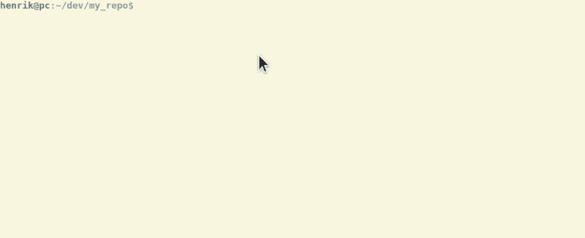

# 无情的版本控制- LogRocket 博客

> 原文：<https://blog.logrocket.com/unsentimental-versioning/>

我参与的大多数项目都试图遵循语义版本化，这可能是版本化软件最常用的策略之一。

它有明确严格的[规范](https://semver.org/)。当开发人员试图遵循这个规范时，问题就出现了。

语义版本化是这样定义的:MAJOR。小补丁

*   专业:突破性变化
*   次要:以向后兼容的方式添加功能
*   补丁:向后兼容的错误修复

这通常意味着，在发布新版本时，开发人员必须经历自上一个版本以来的所有变更，以确定下一个版本号。

这可能是一项困难且耗时的任务。通常，这会导致[感性版本化](http://sentimentalversioning.org/)。为了避免这一点，我们必须消除所有的人类互动。


Bender wants to end sentimental versioning.

我们可以通过使用[语义发布](https://semantic-release.gitbook.io/semantic-release/)来实现。

这是安装在 CI 环境中的一个工具，它检查提交消息，并在此基础上自动导出下一个版本的下一个版本号。

这意味着所有团队成员在编写提交消息时必须使用相同的标准。常规提交是帮助我们实现这一目标的标准。

> 传统的提交规范是提交消息之上的轻量级约定。它为创建显式提交历史提供了一组简单的规则，这使它成为编写自动化工具的坚实基础。

因为我们已经确定人类是不可信的，所以我们将使用命令行工具来生成常规提交。

该工具将询问开发人员一些问题，并根据这些答案创建一条提交消息。

这个工具叫做 [commitizen](https://commitizen.github.io/cz-cli/) ，它非常适合标准化提交消息。您可以这样安装它:

```
npm install -g commitizen
```

装上之后一定要用`git cz`而不是`git commit -m "commit message"`。该过程如下所示:



由这些问题生成的其他提交消息的示例:

| 提交消息 | 发布类型 |
| --- | --- |
| 修复(用户):修复了正确的电子邮件地址验证 | 补丁发布 |
| 专长(用户):为用户添加中间名 | 功能发布 |
| perf(用户):删除了用户的中间名。重大变更:中间名字段已被删除。 | 突破释放 |

当我们以这种格式构造提交消息时，我们可以利用语义发布。它意味着在发布分支的每个成功构建之后，在 CI 环境中执行。

通过这种方式，没有人直接参与到发布过程中，并且发布保证是不浪漫和不感情用事的。

Semantic-release 实际上是一个 npm 包，最初只用于节点项目。但是通过使用插件，它可以用于所有类型的项目。

这个插件叫做 [semantic-release/exec](https://github.com/semantic-release/exec) ，它为你提供新的版本号，让你执行自己的定制命令。

语义发布是这样安装的:

```
npm install --save-dev semantic-release
```

为了让它在 circleci 中工作，构建配置文件将如下所示:

```
version: 2
jobs:
  release:
    docker:
      - image: circleci/node:8
    steps:
      - checkout
      - run: npm install
      - run: npx semantic-release

workflows:
  version: 2
  make_release:
    jobs:
      - release
```

点击阅读关于 CI 环境的[设置的更多信息。](https://semantic-release.gitbook.io/semantic-release/recipes/recipes)

总而言之，我们现在在构建服务器上安装了`semantic-release`，它分析提交历史。

在`commitezen`(安装在开发人员的计算机上)的帮助下，提交消息遵循一个叫做`conventional commit`的标准。

这可能看起来有点过分，对于一些项目来说，可能就是这样。但是对于许多其他项目，特别是那些有许多人参与的项目，我真的认为这是需要考虑的事情。

尤其是当您发现自己开始变得不确定版本化过程的时候。

然后有一件事要做:将人类从过程中移除。

延伸阅读: