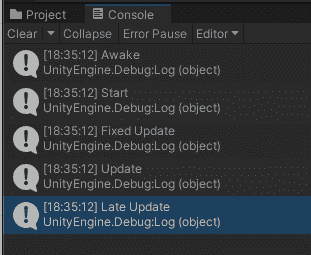
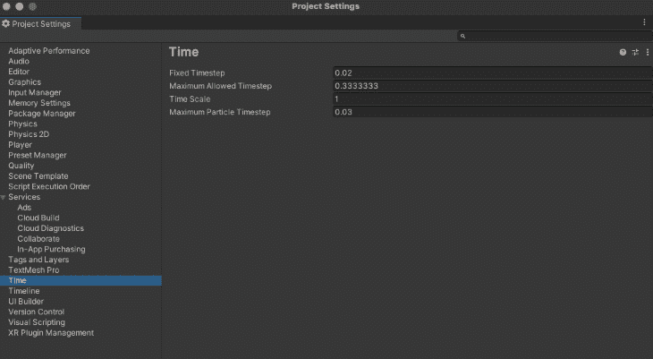
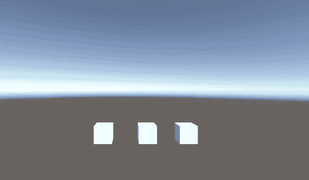

# Unity 中的更新与修复更新与最新更新

> 原文：<https://blog.logrocket.com/update-vs-fixedupdate-vs-lateupdate-in-unity/>

在 Unity 中，游戏呈现给玩家的方式就是一切。控制的流畅度和他们体验到的游戏性都是关键，知道这些信息是如何显示给玩家的会让你在处理 Unity 项目时更有优势。

因此，我们将讨论更新函数，学习它们的实现，并决定何时使用它们。

如果你想继续，这里有目录:

## Unity 中的框架是什么？

你可以把一帧想象成一张图片，如果你有多个相似的图片快速显示，你就可以创造出运动的错觉。

帧是从动画中继承的术语，其中一些常见的值是每秒 24、30 和 60 帧(FPS)。说到游戏，当一秒钟内有 60 个新图像呈现给玩家时，我们说“它以 60 FPS 的速度运行”。这称为帧速率，帧间隔是每帧之间发生的时间。

在我们 60 FPS 的例子中，60 是帧速率，帧间隔是 1/60 x 1000 = 16.67 毫秒。

在 Unity 中，一帧被认为是呈现在玩家屏幕上的渲染图像。一般来说，Unity 不关心时间，但是它关心帧，它的属性`Time.DeltaTime`计算帧之间的时间。

如果出于某种原因，比如在游戏过程中有繁重的处理，帧之间的时间变慢，这将降低帧速率，并给玩家游戏运行缓慢的感觉。

## 解释更新功能

在脚本的生命周期中，Unity 以特定的顺序执行它的功能。你可以在这里阅读更多关于[执行顺序的内容，但是为了保持这篇文章的简单，我们将把重点放在两个阶段:物理和游戏逻辑。](https://docs.unity3d.com/Manual/ExecutionOrder.html)

在每一帧中，Unity 按顺序执行活动脚本的所有事件功能。

它将首先执行物理模拟逻辑，首先调用`FixedUpdate`，然后调用其余的物理事件。

然后它将检查来自用户的输入事件。

最后在游戏逻辑期间，它会执行`Update`函数，所有的游戏逻辑函数，最后是`LateUpdate`。

值得注意的是，每个事件在 Unity 上的所有脚本中以相同的顺序执行，所以如果您有十个使用`FixedUpdate`的脚本，这些脚本将比其他十个在`Update`方法中有代码的脚本具有更高的执行优先级；本例中优先级较低的`LateUpdate`也是如此。

## 更新功能顺序

在这里我们可以看到这些函数的顺序:我们将在一个新的 Unity 场景中创建一个空的对象，并将这个脚本附加到它上面。

在这个脚本中，我们将把执行的函数的顺序输出到控制台。我们设置了三个名为`continueUpdate`、`continueFixedUpdate`和`continueLateUpdate`的标志，以防止我们的函数多次执行相同的代码，并使控制台充满不必要的结果:

```
using System.Collections;
using System.Collections.Generic;
using UnityEngine;

public class UpdateOrder : MonoBehaviour
{
   bool continueUpdate=true;
   bool continueFixedUpdate=true;
   bool continueLateUpdate=true;

   // Start is called before the first frame update
   void Start()
   {
       Debug.Log("Start");
   }
   // Awake is called when the object is enabled
   void Awake()
   {
       Debug.Log("Awake");
   }

   //FixedUpdate is called before Update, at the same rate based on Delta Time
   void FixedUpdate()
   {
       if(continueFixedUpdate)
       {
           Debug.Log("Fixed Update");
           continueFixedUpdate=false;
       }
   }

   // Update is called once per frame
   void Update()
   {
       if(continueUpdate)
       {
           Debug.Log("Update");
           continueUpdate=false;
       }
   }
   //Late Update is called after update
   void LateUpdate()
   {
       if(continueLateUpdate)
       {
           Debug.Log("Late Update");
           continueLateUpdate=false;
       }
   }
}

```

输出将是这样的:



从游戏对象激活开始，`Awake`首先被调用，然后是`Start`，然后是`FixedUpdate`，`Update`，最后是`LateUpdate`。

### 固定更新

FixedUpdate 通常用于物理计算，因为它与物理系统具有相同的频率:默认情况下，它每 0.02 秒执行一次(每秒 50 次)，但您可以使用`Time.fixedDeltaTime`仔细检查它。

你也可以通过进入**编辑** > **项目设置** > **时间** > **固定时间步长**来改变 Unity 中`FixedUpdate`的频率。



### 更新

`Update`是一个函数，如果启用了`MonoBehaviour`，则每帧都会调用该函数。

如果帧率为 60 FPS，每秒执行 60 次；如果是 30，那就是每秒 30 次。

如果脚本被禁用(即`enabled=false`)，它将停止。

* * *

### 更多来自 LogRocket 的精彩文章:

* * *

### 最新更新

与`Update`一样，`LateUpdate`在`MonoBehaviour`启用时执行每一帧，禁用时停止。

它将在所有更新函数被调用后执行，建议在相机脚本中使用`LateUpdate`而不是`Update`，因为它可以跟踪已经在`Update`函数中移动的对象。

请记住，`Update`和`LateUpdate`之间的执行顺序与速度无关。`Update`并不比`LateUpdate`快；它们以不同的顺序被执行来做不同的事情。虽然`Update`可能用于在一个时间间隔内移动对象，但是我们将使用`LateUpdate`来反映这些对象被移动后的结果，并且可以安全地假设它们处于新的状态。

## 在哪里使用每个更新功能

### 固定更新

建议在处理物理时使用`FixedUpdate`，比如刚体更新。

在下面的例子中，我们添加了三个立方体，每个都有一个`Rigidbody`。

该脚本在每种情况下所做的是，它获取每个立方体的`Rigidbody`的引用，并在它们所附着的对象中施加向上的力。它们之间唯一的区别是它们使用的更新函数的类型。

左边的立方体有这个脚本；它将使用`FixedUpdate`:

```
using System.Collections;
using System.Collections.Generic;
using UnityEngine;

public class FixedUpdateRigidBody : MonoBehaviour
{
   public Rigidbody rb;
   // Start is called before the first frame update
   void Start()
   {
       rb = GetComponent<Rigidbody>();
   }

   //Is executed based on the Fixed Timestep (by default 50 times per second)
   void FixedUpdate()
   {
       rb.AddForce(10.0f * Vector3.up);
   }
}

```

中间的立方体将使用这个，使用`Update`:

```
using System.Collections;
using System.Collections.Generic;
using UnityEngine;

public class UpdateRigidBody : MonoBehaviour
{
   public Rigidbody rb;
   // Start is called before the first frame update
   void Start()
   {
       rb = GetComponent<Rigidbody>();
   }

   //Is executed every frame
   void Update()
   {
       rb.AddForce(10.0f * Vector3.up);
   }
}

```

右边的立方体将使用这个脚本，调用`LateUpdate`:

```
using System.Collections;
using System.Collections.Generic;
using UnityEngine;

public class LateUpdateRigidBody : MonoBehaviour
{
   public Rigidbody rb;
   // Start is called before the first frame update
   void Start()
   {
       rb = GetComponent<Rigidbody>();
   }

   //Is executed every frame after Update
   void LateUpdate()
   {
       rb.AddForce(10.0f * Vector3.up);
   }
}

```



From left to right, `FixedUpdate`, `Update`, `LateUpdate`

您可以清楚地看到每个更新功能是如何工作的。`FixedUpdate`将在每一步被统一结算时执行一次；这就是运动持续稳定的原因。

另一方面，中心的立方体每一帧都在使用`Update`函数，所以每次调用该函数都向上施力，并且由于每一帧都比`FixedUpdate`的时间步长更频繁，所以您可以看到它上升的速度更快。这是因为它被调用的次数比左边的立方体多很多倍。

在第三个立方体使用`LateUpdate`函数的情况下，它也在每一帧被执行，但是由于上面讨论的执行顺序，它在`Update`函数之后被执行。

请注意，对于人眼来说，在`Update`函数和`LateUpdate`函数中执行代码的区别几乎是一样的。你不知道哪个立方体正在使用`Update`或`LateUpdate`功能。

### 更新

`Update`在每一帧都会被调用，所以如果你需要读取玩家的输入，这是处理它的完美函数，这样你就不会错过任何事件。

### 最新更新

`LateUpdate`在所有`Updates`函数被调用后执行。这是相关的，因为在`Update`上的执行顺序可能有点混乱，你不能确定哪个脚本将在所有执行`Update`的脚本中被执行。

然而，使用`LateUpdate`，你可以确定你将在所有使用`Update`改变的状态发生后调用这个函数，所以你可以处理你的对象的最终结果。

当用相机跟踪物体和为玩家更新 UI 时，建议使用`LateUpade`。

## 最后的想法

从这篇文章中你可以得到两个主要的概念。首先，执行的顺序是这样的:`Update`每帧执行一次；`FixedUpdate`是以编辑器中定义的特定速率执行的；并且在所有的`Update`函数被调用后`LateUpdate`被执行。

第二个是这个顺序不是基于每个剧本的。它基于您的整个项目，这意味着所有的`Update`事件将同时执行，在那些完成之后，`LateUpdate`将执行。正因为如此，一个`FixedUpdate`函数可能同时被另外两个调用，所以在同时执行所有的事情之前，尽你所能安排好你的函数和想法。

你应该意识到在这些事件中你的物体和位置的状态可能会改变，并提前计划好最好的方法来为你的玩家提供最稳定的体验。

希望这篇文章对你有用。gamedev 快乐！

## 使用 [LogRocket](https://lp.logrocket.com/blg/signup) 消除传统错误报告的干扰

[](https://lp.logrocket.com/blg/signup)

[LogRocket](https://lp.logrocket.com/blg/signup) 是一个数字体验分析解决方案，它可以保护您免受数百个假阳性错误警报的影响，只针对几个真正重要的项目。LogRocket 会告诉您应用程序中实际影响用户的最具影响力的 bug 和 UX 问题。

然后，使用具有深层技术遥测的会话重放来确切地查看用户看到了什么以及是什么导致了问题，就像你在他们身后看一样。

LogRocket 自动聚合客户端错误、JS 异常、前端性能指标和用户交互。然后 LogRocket 使用机器学习来告诉你哪些问题正在影响大多数用户，并提供你需要修复它的上下文。

关注重要的 bug—[今天就试试 LogRocket】。](https://lp.logrocket.com/blg/signup-issue-free)