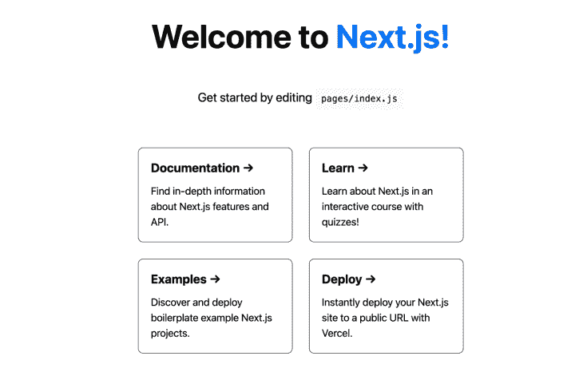
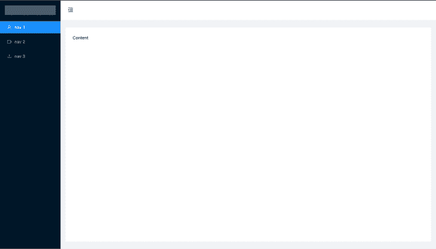
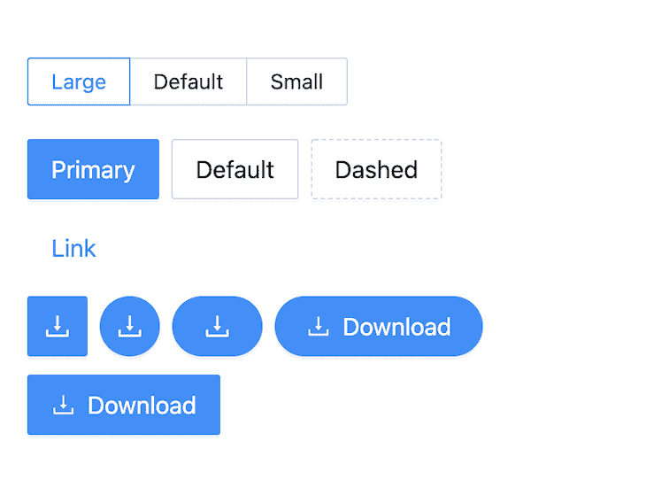
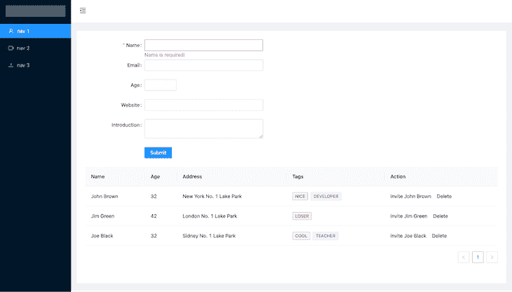
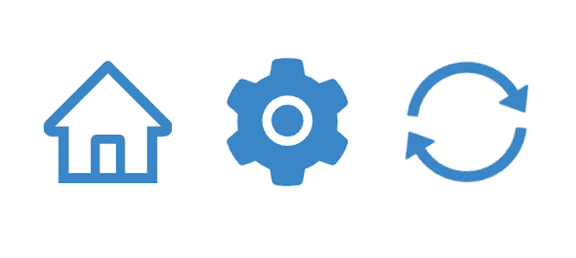
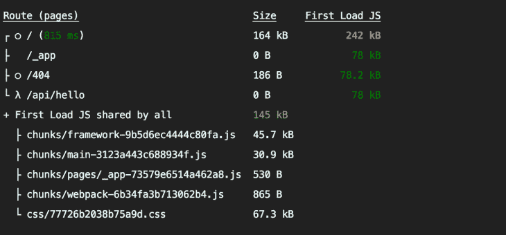
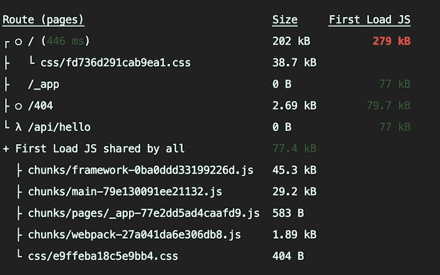

# 如何在 Next.js 中使用 Ant 设计

> 原文：<https://blog.logrocket.com/use-ant-design-next-js/>

[Ant Design](https://ant.design/docs/react/introduce) 是 React 应用的企业 UI 设计库。它由许多组件组成，旨在帮助加速开发周期。Ant Design 是 React 的开源包；它得到了官方支持，并且仍然是当今最流行的 UI 套件之一。

[Next.js](https://nextjs.org/) 是一个流行的 React 框架，以其性能、开发者体验和预建配置而闻名。这不需要手动配置。

通过将 Next.js 与 [Ant Design](https://blog.logrocket.com/introduction-to-ant-design/) 相结合，我们可以轻松地构建可扩展的、高效的、开发人员友好的应用程序。在本文中，我们将了解开发人员如何将 Ant Design 与 Next.js 集成在一起——让我们开始吧！

以下是我们今天要做的事情:

## 创建 Next.js 应用程序

首先，让我们使用以下命令创建一个 Next.js 应用程序:

```
npx [email protected]
```

还有一个 TypeScript 版本，但这里我使用的是 JavaScript 版本。

安装后，输入以下命令，并在浏览器中转至`localhost:3000`查看应用程序。

```
cd app-name
yarn run dev
```

您可以在浏览器中看到主页:



接下来，让我们安装蚂蚁设计，使我们的应用程序更具互动性。

## 安装 Ant 设计

我们可以用一个命令将 Ant Design 安装到 Next.js 应用程序中:

```
yarn add antd

```

安装完成后，我们就可以开始配置 Ant 设计了。在`_app.js`文件中导入`antd/dist/antd.css`。通过这样做，我们可以全局导入 Ant Design 组件样式，而不需要单独导入每个组件。Ant Design 也支持较少版本的 CSS。

## 添加 Ant 设计组件

现在，让我们开始添加组成 Ant 设计系统的组件。

### 布局

从`index.js`中删除现有代码，并添加以下代码，以包含带有菜单的顶栏和侧栏。

```
import {
  MenuFoldOutlined,
  MenuUnfoldOutlined,
  UploadOutlined,
  UserOutlined,
  VideoCameraOutlined,
} from '@ant-design/icons';
import { Layout, Menu } from 'antd';
import React, { useState } from 'react';
const { Header, Sider, Content } = Layout;

export default function Home() {
  const [collapsed, setCollapsed] = useState(false);
  return (
      <Layout className="layout">
        <Sider trigger={null} collapsible collapsed={collapsed}>
          <div className="logo" />
          <Menu
              theme="dark"
              mode="inline"
              defaultSelectedKeys={['1']}
              items={[
                {
                  key: '1',
                  icon: <UserOutlined />,
                  label: 'nav 1',
                },
                {
                  key: '2',
                  icon: <VideoCameraOutlined />,
                  label: 'nav 2',
                },
                {
                  key: '3',
                  icon: <UploadOutlined />,
                  label: 'nav 3',
                },
              ]}
          />
        </Sider>
        <Layout className="site-layout">
          <Header
              className="site-layout-background"
              style={{
                padding: 0,
              }}
          >
            {React.createElement(collapsed ? MenuUnfoldOutlined : MenuFoldOutlined, {
              className: 'trigger',
              onClick: () => setCollapsed(!collapsed),
            })}
          </Header>
          <Content
              className="site-layout-background"
              style={{
                margin: '24px 16px',
                padding: 24,
              }}
          >
            Content
          </Content>
        </Layout>
      </Layout>
  )
}

```

在上面的代码中，我们在侧边栏中包含了 Ant 布局组件。在`globals.css`文件中添加下面的 CSS 来做一些 UI 改进。

```
.trigger {
  padding: 0 24px;
  font-size: 18px;
  line-height: 64px;
  cursor: pointer;
  transition: color 0.3s;
}

 .trigger:hover {
  color: #1890ff;
}

 .logo {
  height: 32px;
  margin: 16px;
  background: rgba(255, 255, 255, 0.3);
}

.site-layout .site-layout-background {
  background: #fff;
}

.layout {
  height: 100vh;
}

```

添加上述 CSS 后，导航到浏览器查看输出。正如你所看到的，我们只用了几分钟就完成了菜单的布局，非常好！



接下来，我们可以添加表单组件来获取用户数据。您不需要为此安装第三方表单包，因为 Ant 本身已经包含了具有一些强大功能的表单组件。

### 形式

Ant 设计表单带有预定义的验证规则、默认值选项和各种输入。在 components 文件夹中创建一个`CustomForm`组件，并添加以下代码:

```
import React from 'react';
import { Button, Form, Input, InputNumber } from 'antd';
const layout = {
    labelCol: {
        span: 8,
    },
    wrapperCol: {
        span: 16,
    },
};
/* eslint-disable no-template-curly-in-string */

const validateMessages = {
    required: '${label} is required!',
    types: {
        email: '${label} is not a valid email!',
        number: '${label} is not a valid number!',
    },
    number: {
        range: '${label} must be between ${min} and ${max}',
    },
};
/* eslint-enable no-template-curly-in-string */

const CustomForm = () => {
    const onFinish = (values) => {
        console.log(values);
    };

    return (
        <Form className="form" {...layout} name="nest-messages" onFinish={onFinish} validateMessages={validateMessages}>
            <Form.Item
                name={['user', 'name']}
                label="Name"
                rules={[
                    {
                        required: true,
                    },
                ]}
            >
                <Input />
            </Form.Item>
            <Form.Item
                name={['user', 'email']}
                label="Email"
                rules={[
                    {
                        type: 'email',
                    },
                ]}
            >
                <Input />
            </Form.Item>
            <Form.Item
                name={['user', 'age']}
                label="Age"
                rules={[
                    {
                        type: 'number',
                        min: 0,
                        max: 99,
                    },
                ]}
            >
                <InputNumber />
            </Form.Item>
            <Form.Item name={['user', 'website']} label="Website">
                <Input />
            </Form.Item>
            <Form.Item name={['user', 'introduction']} label="Introduction">
                <Input.TextArea />
            </Form.Item>
            <Form.Item wrapperCol={{ ...layout.wrapperCol, offset: 8 }}>
                <Button type="primary" htmlType="submit">
                    Submit
                </Button>
            </Form.Item>
        </Form>
    );
};

export default CustomForm;

```

在下面的`index.js`中包含`CustomForm`组件，使其在主页上可见。

```
         <Content
              className="site-layout-background"
              style={{
                margin: '24px 16px',
                padding: 24,
              }}
          >
            <CustomForm/>
          </Content>

```

### 确认

Ant 表单包含了`rules`道具，可以用更少的工作为每个输入添加验证。在上面的表单中，我们已经使用`email`类型规则验证了电子邮件输入。

```
                rules={[
                    {
                        type: 'email',
                    },
                ]}

```

### 常用的验证规则

*   **枚举**:匹配枚举值
*   **Len** :数字或字符串长度
*   **Max** :字符串和数字的最大长度
*   **Min** :字符串和数字的最小长度
*   **模式**:正则表达式模式
*   **空格**:验证输入是否有空格
*   **类型**:验证字符串、数字、电子邮件、布尔值和 URL

### API 集成

我们可以使用`onFinish`函数在验证之后使用 API 将表单数据提交到后端。

```
 const onFinish = (values) => {
       fetch('https://example.com/profile', {
    method: 'POST', // or 'PUT'
  headers: {
    'Content-Type': 'application/json',
  },
  body: JSON.stringify(values),
})
  .then((response) => response.json())
  .then((data) => {
    console.log('Success:', data);
  })
  .catch((error) => {
    console.error('Error:', error);
  });
};

```

### 预填充数据以形成字段

我们可以使用`setFieldsValue`来设置表单中的值:

```
form.setFieldsValue({ name: 'Jack' });

form.setFieldsValue({ email: '[email protected]' });

```

导航到浏览器查看我们的表单运行情况:


在上面的 UI 中，我们已经使用了主按钮组件；Ant Design 还包括其他类型的按钮，如下所示:



### 桌子

接下来，让我们在我们的应用程序中包含一个表格来列出一些数据。

添加以下代码，并将其添加到`components/CustomTable.js`组件中。

```
import { Space, Table, Tag } from 'antd';
import React from 'react';

const columns = [
  {
    title: 'Name',
    dataIndex: 'name',
    key: 'name',
    render: (text) => {text},
  },
  {
    title: 'Age',
    dataIndex: 'age',
    key: 'age',
  },
  {
    title: 'Address',
    dataIndex: 'address',
    key: 'address',
  },
  {
    title: 'Tags',
    key: 'tags',
    dataIndex: 'tags',
    render: (_, { tags }) => (
      <>
        {tags.map((tag) => {
          let color = tag.length > 5 ? 'geekblue' : 'green';

          if (tag === 'loser') {
            color = 'volcano';
          }

          return (

              {tag.toUpperCase()}

          );
        })}
      </>
    ),
  },
  {
    title: 'Action',
    key: 'action',
    render: (_, record) => (

        Invite {record.name}
        Delete

    ),
  },
];

const data = [
  {
    key: '1',
    name: 'John Brown',
    age: 32,
    address: 'New York No. 1 Lake Park',
    tags: ['nice', 'developer'],
  },
  {
    key: '2',
    name: 'Jim Green',
    age: 42,
    address: 'London No. 1 Lake Park',
    tags: ['loser'],
  },
  {
    key: '3',
    name: 'Joe Black',
    age: 32,
    address: 'Sidney No. 1 Lake Park',
    tags: ['cool', 'teacher'],
  },
];

const CustomTable = ()
; export default CustomTable;

```

表格组件有两大道具:`columns`和`dataSource`。`columns`道具用于传递表列，而`dataSource`用于传递表的数据。

接下来，在`index.js`文件中导入表格组件。现在，我们的主页上包含了以下表格:



### 常用的桌子道具

*   **分页:**为表格添加分页
*   **加载:**显示 API 调用的加载
*   **列:**表格的列
*   **数据源:**为表格的数据
*   **尺寸:**表格尺寸

### 常用立柱道具

*   `defaultSorter`:排序值的默认顺序
*   `render`:渲染表格单元格
*   `sorter`:表格列的排序功能
*   `align`:列对齐

Ant Design 的表格组件包括前端和后端分页、排序、过滤器、用于选择行的复选框、嵌套集、无限滚动表格等等。

### `ConfigProvider`

`ConfigProvider`是 Ant 设计组件全局配置属性的上下文 API。您可以通过插入以下内容来添加`ConfigProvider`:

```
import { ConfigProvider } from 'antd';

export default () => (

);

```

### **配置区域设置**

您可以使用下面的配置提供程序简单地设置所有组件的语言环境。

```
import { ConfigProvider } from 'antd';

export default () => (
  <ConfigProvider direction="rtl" locale="en">
    <App />
  </ConfigProvider>
);

```

### 组件尺寸配置

```
import { ConfigProvider } from 'antd';

export default () => (
  <ConfigProvider direction="rtl" locale="en" componentSize="medium">
    <App />
  </ConfigProvider>
);

```

我们可以将`configProvide`用于子树组件，而不仅仅是全局组件。

### 核标准情报中心

要使用 Ant 设计图标，我们需要使用以下命令从 Ant 安装图标包:

```
yarn add @ant-design/icons

```

Ant 有三种不同的图标类型:

按如下方式导入组件:

```
import {
    HomeOutlined, 
    LoadingOutlined,
    SettingFilled,
    SyncOutlined

} from '@ant-design/icons';

const  iconSize = { fontSize: '40px', color: '#08c' };

const ShowIcons = () => (
<HomeOutlined  style={iconSize} />
<SettingFilled  style={iconSize} />
<SyncOutlined spin  style={iconSize} />
<LoadingOutlined  style={iconSize} />
);

```

### 图标输出



Ant Design 拥有列表、提醒、通知、选择器、图标等组件——您可以通过点击此[链接](https://ant.design/components/overview/)来探索所有组件。

## 问题和优化

我们将面临的主要问题是 CSS 包的大小，因为我们在`_app.js`中导入了整个 CSS 文件，如下文的`_app.js`所示，这将导入所有 Ant 设计组件的 CSS，而不考虑它们的用途。

```
import ‘antd/dist/antd.css

```

当我们构建应用程序时，我们可能会看到 CSS 的大小。我们的示例应用程序的总 CSS 大小为 67.3KB。查看下图了解更多信息。



这看起来很大，而且会降低应用程序的性能，增加应用程序的加载时间。要解决这个问题，我们可以通过只为使用的组件导入 CSS 来减少它。

### 组件级 CSS 导入

使用 [next-plugin-antd-less](https://github.com/SolidZORO/next-plugin-antd-less) 和 [babel-plugin-import](https://github.com/umijs/babel-plugin-import) 包并添加一些配置，我们可以实现这一点。

使用以下命令安装软件包:

```
yarn add next-plugin-antd-less
yarn add --dev babel-plugin-import

```

安装后，在根文件夹中创建`.babelrc`文件并添加以下代码。

```
{
  "presets": ["next/babel"],
  "plugins": [
    [
      "import",
    {
      "libraryName": "antd",
      "style": true
    }
  ]]
}

```

接下来，在`next.config.js`文件中添加下面的配置代码。

```
const withAntdLess = require('next-plugin-antd-less');

module.exports = withAntdLess({
  // modifyVars: { '@primary-color': '#04f' }, // optional
  lessVarsFilePath: './src/styles/variables.less', // optional
  lessVarsFilePathAppendToEndOfContent: false, // optional
  // optional https://github.com/webpack-contrib/css-loader#object
  cssLoaderOptions: {
    // ...
    mode: "local",
    localIdentName: "[hash:base64:8]",but you can rewritten getLocalIdentFn
    exportLocalsConvention: "camelCase",
    exportOnlyLocals: false,
    // ...
    getLocalIdent: (context, localIdentName, localName, options) => {
      return "whatever_random_class_name";
    },
  },

  // Other Config Here...

  webpack(config) {
    return config;
  },
});

```

从`_app.js`中删除导入的`antd.css`文件。

```
import 'antd/dist/antd.css

```

现在构建示例应用程序:

```
yarn build

```



构建完成后，我们可以看到 CSS 包的大小已经从 **67.3KB** 减少到 **38.7KB** 。通过这样做，我们已经将尺寸减小了大约 40%!

## 结论

与传统方法相比，Ant 设计有助于以最少的工作量和更少的时间构建丰富的用户界面。它可以用于所有类型的应用程序，它的社区很大，如果你需要帮助，它会参与进来。在本文中，我们已经介绍了基本组件；请访问 Ant Design [文档](https://ant.design/docs/react/introduce)来探索所有组件，并了解如何使用 Ant Design 来改进您的项目开发。

## [LogRocket](https://lp.logrocket.com/blg/nextjs-signup) :全面了解生产 Next.js 应用

调试下一个应用程序可能会很困难，尤其是当用户遇到难以重现的问题时。如果您对监视和跟踪状态、自动显示 JavaScript 错误、跟踪缓慢的网络请求和组件加载时间感兴趣，

[try LogRocket](https://lp.logrocket.com/blg/nextjs-signup)

.

[](https://lp.logrocket.com/blg/nextjs-signup)[](https://lp.logrocket.com/blg/nextjs-signup)

LogRocket 就像是网络和移动应用的 DVR，记录下你的 Next.js 应用上发生的一切。您可以汇总并报告问题发生时应用程序的状态，而不是猜测问题发生的原因。LogRocket 还可以监控应用程序的性能，报告客户端 CPU 负载、客户端内存使用等指标。

LogRocket Redux 中间件包为您的用户会话增加了一层额外的可见性。LogRocket 记录 Redux 存储中的所有操作和状态。

让您调试 Next.js 应用的方式现代化— [开始免费监控](https://lp.logrocket.com/blg/nextjs-signup)。