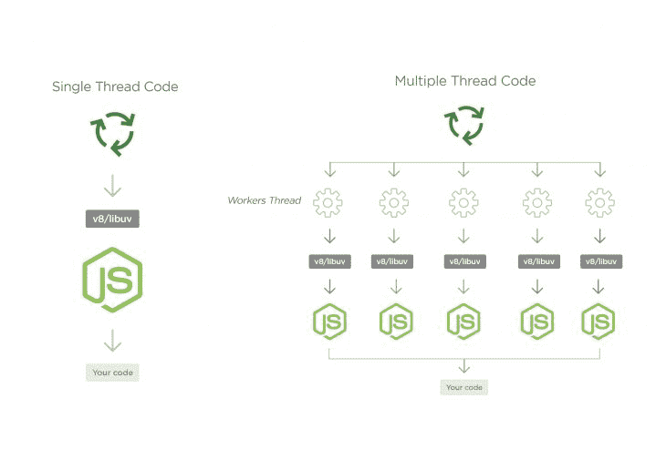

# 节点工作者的用例——log rocket 博客

> 原文：<https://blog.logrocket.com/use-cases-for-node-workers/>

在过去，当构建需要 [CPU](https://en.wikipedia.org/wiki/Central_processing_unit) 密集计算的应用程序时，Node.js 通常不是一个选项。这是由于它的非阻塞、事件驱动的 I/O 架构。随着 Node.js 中线程工作器的出现，有可能将其用于 CPU 密集型应用程序。在本文中，我们将研究 Node.js 应用程序中工作线程的某些用例。

在继续讨论 Node.js 中线程工作器的用例之前，让我们快速比较一下 Node 中 I/O 受限和 CPU 受限的情况。

## Node.js 中的 I/O 限制与 CPU 限制

### 输入输出绑定

如果资源的增加导致程序性能的提高，则称程序受资源约束。提高 I/O 子系统的速度(如内存、硬盘速度或网络连接)可以提高 I/O 绑定程序的性能。这是 Node.js 应用程序的典型情况，因为在继续执行代码或返回响应之前，事件循环通常会花费时间等待网络、文件系统甚至数据库 I/O 完成它们的操作。提高硬盘速度和/或网络连接通常会提高应用程序或程序的整体性能。

### CPU 限制

如果一个程序的处理时间因 CPU 的增加而减少，那么它就是 CPU 受限的。例如，计算文件哈希的程序在 2.2GHz 处理器上处理速度较快，在 1.2GHz 处理器上处理速度较慢

对于 CPU 受限的应用程序，大部分时间都花在使用 CPU 进行计算上。在 Node.js 中，受 CPU 限制的应用程序会阻塞事件，并导致其他请求被阻塞。

#### Node.js 黄金法则

> 不要阻塞事件循环，保持它运行，并避免任何可能阻塞类似线程的同步网络调用或无限循环的事情。

Node 在单线程事件循环中运行，使用非阻塞 I/O 调用，允许它同时支持同时运行的数万个计算，例如为多个传入的 HTTP 请求提供服务。只要在任何给定时间与每个客户机相关联的工作量很小，这种方法就很有效并且很快。但是如果您执行 CPU 密集型计算，您的并发 Node.js 服务器将嘎然而止。其他传入的请求将等待，因为一次只有一个请求得到服务。

Node.js 中使用了某些策略来处理 CPU 密集型任务。多个进程(如 [cluster API](https://nodejs.org/docs/latest-v10.x/api/cluster.html) )确保 CPU 得到最佳利用，子进程产生新的进程来处理阻塞任务。

这些策略是有利的，因为事件循环没有被阻塞，它还允许分离进程，所以如果一个进程出错，它不会影响其他进程。然而，由于子进程是独立运行的，它们不能相互共享内存，数据通信必须通过 JSON，这就需要对数据进行序列化和反序列化。

Node.js 中 CPU 密集型计算的最佳解决方案是在同一个进程中运行多个 Node.js 实例，这样可以共享内存，并且不需要通过 JSON 传递数据。这正是工作线程在 Node.js 中所做的。



## 可由线程工作器完成的真实世界的 CPU 密集型任务

我们将查看 Node.js 应用程序中线程工作器的几个用例。我们不会查看线程工作器 API，因为我们将只查看节点应用程序中线程工作器的用例。如果你不熟悉线程工作器，你可以访问这个[帖子](https://blog.logrocket.com/a-complete-guide-to-threads-in-node-js-4fa3898fe74f/)开始学习如何使用线程工作器 API。

### 图像大小调整

假设您正在构建一个允许用户上传个人资料图像的应用程序，然后您为应用程序中的各种用例生成多种大小(例如:100 x 100 和 64 x 64)的图像。调整图像大小的过程是 CPU 密集型的，并且必须调整成两种不同的大小也会增加 CPU 调整图像大小所花费的时间。调整图像大小的任务可以外包给一个单独的线程，而主线程处理其他轻量级任务。

```
// worker.js
const { parentPort, workerData } =  require("worker_threads");
const  sharp  =  require("sharp");

async  function  resize() {

    const  outputPath  =  "public/images/" + Date.now() +  ".png";
    const { image, size } =  workerData;

    await  sharp(image)
    .resize(size, size, { fit:  "cover" })
    .toFile(outputPath);
 parentPort.postMessage(outputPath);
}
resize()
```

```
// mainThread.js
const { Worker } =  require("worker_threads");

module.exports  =  function  imageResizer(image, size) {

    return  new  Promise((resolve, reject) => {
    const  worker  =  new  Worker(__dirname  +    "/worker.js", {
workerData: { image, size }
});
    worker.on("message", resolve);
    worker.on("error", reject);
    worker.on("exit", code  => {
        if (code  !==  0)
            reject(new  Error(`Worker stopped with exit code ${code}`));
        });
    });
};
```

主线程有一个方法，该方法创建一个调整每个图像大小的线程。它使用`workerData`属性将大小和图像传递给线程工作器。工人用 [sharp](https://www.npmjs.com/package/sharp) 调整图像大小，并将其发送回主线程。

### 视频压缩

视频压缩是另一项 CPU 密集型任务，可以外包给线程工作器。大多数视频流应用程序通常具有单个视频的多个变体，根据用户的网络连接显示给用户。线程工作者可以将视频压缩到各种大小。

[`ffmpeg-fluet`](https://www.npmjs.com/package/fluent-ffmpeg) 是 Node.js 应用中视频处理的常用模块。它依赖于 [`ffmpeg`](https://ffmpeg.org/) 这是一个完整的，跨平台的解决方案，以记录，转换和流媒体音频和视频。

由于每次需要使用新线程时都要创建工作线程，因此建议您创建一个工作线程池，以便在需要时使用，而不是匆忙创建工作线程。为了创建一个工作线程池，我们使用一个 NPM 模块`[node-worker-threads-pool](https://www.npmjs.com/package/node-worker-threads-pool)`，它使用节点的 worker_threads 模块创建工作线程池。

```
// worker.js
const { parentPort, workerData } =  require("worker_threads");
const  ffmpeg  =  require("fluent-ffmpeg");

function  resizeVideo({ inputPath, size, parentPort }) {
    const  outputPath  =  "public/videos/"  +  Date.now() +  size  +  ".mp4";
    ffmpeg(inputPath)
    .audioCodec("libmp3lame")
    .videoCodec("libx264")
    .size(size)
    .on("error", function(err) {
    console.log("An error occurred: "  +  err.message);
    })
    .on("end", function() {
    parentPort.postMessage(outputPath);
    })
    .save(outputPath);
}

parentPort.on("message", param  => {
    resizeVideo({ ...param, parentPort });
});

```

```
// mainThread.js
const { StaticPool } =  require("node-worker-threads-pool");

  const  filePath  =  __dirname  +  "/worker.js";
  const  pool  =  new  StaticPool({
        size:  4,
        task:  filePath,
        workerData:  "workerData!"
    });

  const  videoSizes  = ["1920x1080", "1280x720",   "854x480", "640x360"];

module.exports  =  async  function compressVideo(inputPath) {
    const  compressedVideos  = [];
    videoSizes.forEach(async  size  => {
        const  video  =  await  pool.exec({ inputPath, size });
        compressedVideos.push(video);
    });
};
```

### 文件完整性

假设你必须将你的文件存储在云存储中。您希望确保您存储的文件不会被任何第三方篡改。你可以通过使用一个[加密散列算法](https://www.lifewire.com/cryptographic-hash-function-2625832)来计算该文件的散列值。您将这些散列及其存储位置保存在数据库中。当您下载文件时，您需要再次计算散列值，看看它们是否匹配。计算散列的过程是 CPU 密集型的，并且可以在线程工作器中完成:

```
// hashing.js
const {
  Worker, isMainThread, parentPort, workerData
} = require('worker_threads');
const  crypto  =  require("crypto");
const  fs  =  require("fs");

if (isMainThread) {
  module.exports = async function hashFile(filePath) {
    return new Promise((resolve, reject) => {
      const worker = new Worker(__filename);
      worker.on('message', resolve);
      worker.on('error', reject);
      worker.on('exit', (code) => {
        if (code !== 0)
          reject(new Error(`Worker stopped with exit code ${code}`));
      });
      worker.postMessage(filePath)
    });
  };
} else {
    const  algorithm  =  "sha1";
    const  shasum  =  crypto.createHash(algorithm);
    const  stream  =  fs.ReadStream(filePath);
    stream.on("data", function(data) {
        shasum.update(data);
    });
    stream.on("end", function() {
        const  hash  =  shasum.digest("hex");
        parentPort.postMessage(hash);
    });
}
```

注意，我们在同一个文件中既有工作线程代码又有主线程代码。线程工作器的`isMainThread`属性帮助我们确定当前线程并运行适合每个线程的代码。主线程创建一个新的工作线程，并侦听来自该工作线程的事件。工作线程使用名为`createHash`的 Node.js [crypto](https://nodejs.org/api/crypto.html) 方法计算数据流的哈希。

## 结论

当我们希望通过释放事件循环来提高性能时，Node.js 线程工作器是一个很好的选择。需要注意的一点是，workers 对于执行 CPU 密集型 JavaScript 操作非常有用。不要将它们用于 I/O，因为 Node.js 用于异步执行操作的内置机制已经比工作线程更有效地处理了它。

## 200 只显示器出现故障，生产中网络请求缓慢

部署基于节点的 web 应用程序或网站是容易的部分。确保您的节点实例继续为您的应用程序提供资源是事情变得更加困难的地方。如果您对确保对后端或第三方服务的请求成功感兴趣，

[try LogRocket](https://lp.logrocket.com/blg/node-signup)

.

[](https://lp.logrocket.com/blg/node-signup)[https://logrocket.com/signup/](https://lp.logrocket.com/blg/node-signup)

LogRocket 就像是网络和移动应用程序的 DVR，记录下用户与你的应用程序交互时发生的一切。您可以汇总并报告有问题的网络请求，以快速了解根本原因，而不是猜测问题发生的原因。

LogRocket 检测您的应用程序以记录基线性能计时，如页面加载时间、到达第一个字节的时间、慢速网络请求，还记录 Redux、NgRx 和 Vuex 操作/状态。

[Start monitoring for free](https://lp.logrocket.com/blg/node-signup)

.