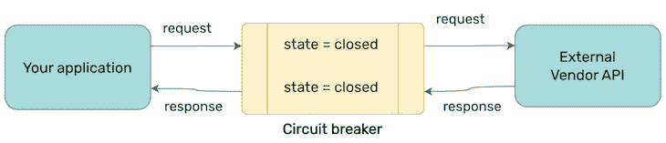
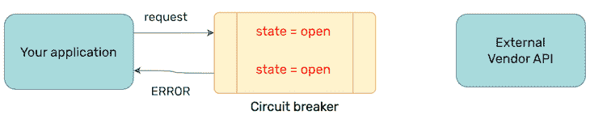
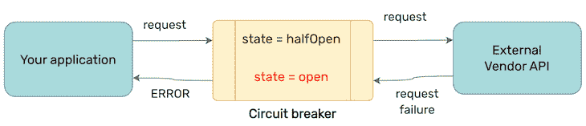
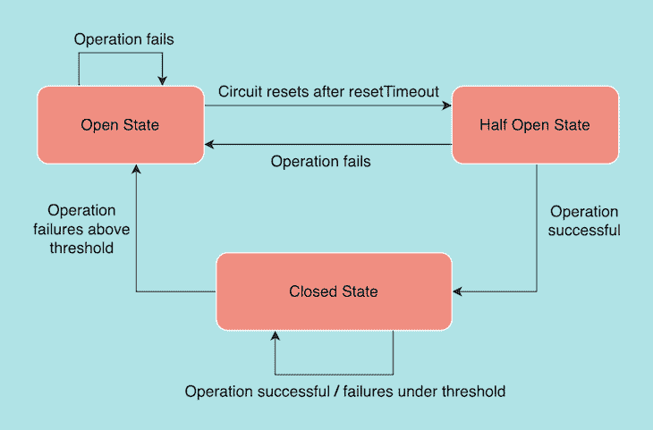

# 如何在 Node.js 中使用断路器

> 原文：<https://blog.logrocket.com/use-circuit-breaker-node-js/>

构建不可扩展的项目对业务来说不可扩展；每个项目都会经历成长的烦恼，面对突然的流量激增，应用程序崩溃的情况并不少见。

当涉及到向用户交付价值时，构建一个有弹性的应用程序非常重要。断路器是确保这一点的众多方法之一。在本文中，我们将探索断路器是什么，了解它如何改进您的应用程序，并在 Node.js 应用程序中实现它。我们开始吧！

*向前跳转:*

## 什么是断路器？

假设您的一个外部供应商 API 暂时关闭，导致您的应用程序出现故障，并扰乱了您的 SLA。您是否希望继续向那个死去的供应商 API 发出请求？这样做不会有成效。由于您对该供应商的所有请求都将失败，因此最好将时间和计算资源用在有价值的地方，从而节省时间和计算资源。

这正是断路器解决的问题。如果没有它，您的应用程序将继续遇到必然会失败的请求，浪费时间和资源。断路器阻止了这种情况的发生，很快就失效了。

## 为什么断路器很重要？

断路器为您节省了大量浪费的时间和资源，从而为您节省了资金，并帮助您高效地向用户提供价值。考虑到好处，实现断路器是显而易见的。这是迈向可靠、高性能和弹性应用的一步。

您甚至可以为您的断路器设置监控，这将有助于您在任何合作伙伴 API 出错时保持领先。你可以从官方文件中了解更多关于监控的信息。

## 断路器是如何工作的？

为了理解断路器模式，让我们首先考虑断路器的内部工作原理。断路器有三种明确的状态:

1.  `Closed`
2.  `Open`
3.  `HalfOpen`

该电路观察您的异步操作，并根据该值做出响应。每种状态都有不同的含义，是断路器的核心。

打个普通电路的比方，`Closed`电路的扰动为零，电流可以流过。与此相反，电流不能流过`Open`电路，因为在电路路径中至少有一个干扰，例如，由于切割线导致的不完整电路。

### `Closed`状态

当电路为`Closed`时，断路器允许所有请求通过。`Closed`状态意味着没有故障或者只有可接受限度内的故障:



### `Open`状态

当故障超过可接受的限度时，电路转换到`Open`状态:



### `HalfOpen`

在电路处于`Open`状态一段预定时间后，会出现半开状态。

当处于`HalfOpen`状态时，电路允许请求通过，以确定另一端的问题是否已解决。如果是，电路返回到`Closed`状态，正常操作继续。如果仍然观察到来自供应商的故障，电路返回到`Open`状态:



## 如何在 Node.js 中使用断路器

我们希望为我们的请求提供一个包装器，它可以确定故障并自动断开电路以防止资源浪费。为了了解如何利用它，我们将构建自己的断路器。

我们将实现一个具有以下方法的`CircuitBreaker`类:

1.  `Fire`:提出要求
2.  `Success`:成功时触发
3.  `Fail`:故障时触发

核心思想很简单，让我们借助流程图来理解它:



我们从一个`Closed`状态开始，这意味着请求正在通过。如果失败的次数超过了一个`failureThreshold`，电路转换到`Open`状态，这意味着没有更多的请求可以通过。

在由`resetTimeout`设定的某个预定时间之后，电路进入`HalfOpen`状态。在`HalfOpen`状态下，它允许请求通过，以确定故障是否仍在发生。如果遇到故障，它将返回到`Open`状态。否则，它进入`Closed`状态。

有了这样的理解，让我们来构建自己的断路器:

```
const axios = require('axios');
const CircuitBreakerStates = {
  OPENED: "OPENED",
  CLOSED: "CLOSED",
  HALF: "HALF"
}

class CircuitBreaker {
  request = null;
  state = CircuitBreakerStates.CLOSED;
  failureCount = 0;
  failureThreshold = 5; // number of failures to determine when to open the circuit
  resetAfter = 50000;
  timeout = 5000; // declare request failure if the function takes more than 5 seconds

  constructor(request, options) {
    this.request = request;
    this.state = CircuitBreakerStates.CLOSED; // allowing requests to go through by default
    this.failureCount = 0;
    // allow request to go through after the circuit has been opened for resetAfter seconds
    // open the circuit again if failure is observed, close the circuit otherwise
    this.resetAfter = Date.now(); 
    if (options) {
      this.failureThreshold = options.failureThreshold;
      this.timeout = options.timeout;
    }
    else {
      this.failureThreshold = 5; // in ms
      this.timeout = 5000; // in ms
   }
  }

  async fire() {
    if (this.state === CircuitBreakerStates.OPENED) {
      if (this.resetAfter <= Date.now()) {
        this.state = CircuitBreakerStates.HALF;
      } else {
        throw new Error('Circuit is in open state right now. Please try again later.');
      }
    }
    try {
      const response = await axios(this.request);
      if (response.status === 200) return this.success(response.data);
      return this.failure(response.data);
    }
    catch(err) {
      return this.failure(err.message);
    }
  } 

  success(data) {
    this.failureCount = 0
    if (this.state === CircuitBreakerStates.HALF) {
      this.state = CircuitBreakerStates.CLOSED;
    }
    return data;
  }

  failure(data) {
    this.failureCount += 1;
    if (
      this.state === CircuitBreakerStates.HALF ||
      this.failureCount >= this.failureThreshold
    ) {
      this.state = CircuitBreakerStates.OPENED;
      this.resetAfter = Date.now() + this.timeout;
    }
    return data;
  }
}

```

为了简单起见，我们在类中只定义了三个方法。在一个真实的用例中，您可以扩展这个想法，引入更多的方法来进行粒度控制。

为了使用上面的断路器，我们将把我们的请求包装在其中。让我们来看看:

```
// sample request to fetch data asynchronously
const request = axios fetchDataFromExternalVendor();
// wrap the request within a circuit breaker object
const circuitBreakerObject = new CircuitBreaker(request, { failureThreshold: 4, timeout: 4000 });
// fire the request
circuitBreakerObject.fire()
  .then((data) => console.log(data))
  .catch((err) => console.log(some error occurred = ${err.message}`);

```

有了这段代码，您就朝着使 Node.js 应用程序更具弹性的方向迈进了一步。但是，你不必完全靠自己来制造断路器。在下一节中，我们将学习如何使用负鼠来达到相同的结果，而无需重新发明轮子。

## 使用负鼠:Node.js 断路器

[Opossum](https://www.npmjs.com/package/opossum) 是 Node.js 应用程序的断路器实现。它负责在结束时维护异步操作的执行状态。每当它观察到失败，它就声明一个死的参与者，根据配置来决定，并防止进入死胡同。正如 GitHub 库雄辩地解释的那样，它很快就会失败。

负鼠通过提供回退功能允许监听电路`Open`事件。每当电路断开并开始快速失效时，就调用回退功能。电路断开后，对于每个请求，都将继续调用该函数。一旦电路关闭，它就让请求通过，正常操作再次开始。

负鼠为每个场景发出各种各样的事件。一些有用的工具包括:

1.  `reject`:当电路断开时触发请求时发出
2.  `timeout`:请求超时时
3.  `success`:请求成功完成时
4.  `failure`:请求出错时执行的操作
5.  `open`:断路器状态变为`Open`
6.  `close`:断路器状态变为`Closed`
7.  `halfOpen`:断路器状态变为`halfOpen`
8.  `fallback`:故障时执行回退功能

如果您需要在无服务器环境中使用 Opossum，它也允许初始化自定义状态。您可以使用配置微调断路器的行为。让我们来看看。

### `timeout`

顾名思义，您可以使用`timeout`来定制异步操作的允许时间。如果超过这个时间，负鼠就会引发故障。

### `errorThresholdPercentage`

使用`errorThresholdPercentage`，您可以指定在打开电路之前观察多少个失败的请求。如果您想设置一个阈值并允许一些间歇的通过，这可能会有所帮助。

* * *

### 更多来自 LogRocket 的精彩文章:

* * *

### `resetTimeout`

`resetTimeout`帮助您设置断路器允许请求通过的持续时间，这意味着断路器进入`halfOpen`状态。如果请求成功通过，电路关闭，正常操作将恢复。如果请求再次失败，电路回到`Open`状态。

## 现实世界的应用

您可以在任何需要的地方使用断路器，以避免级联和重复故障，并控制 Node.js 应用程序与外部世界的交互。

以下是断路器可以改善应用的一些常见情况:

1.  在维护您合作伙伴的任何 API 期间
2.  任何连接 API 中的临时中断或系统故障
3.  由于违反费率限制，来自外部服务的间歇性拒绝
4.  通过有意避免低优先级 API 调用来补偿高负载操作，从而节省资源。例如，YouTube 在初始加载时优先加载视频，而不是获取评论

## 负鼠快速入门片段

你可以给负鼠一个旋转没有太多的麻烦。只需复制下面的代码片段，并将其粘贴到 Node.js 应用程序的任何异步控制器中。

首先，使用下面的命令安装负鼠:

```
npm install opossum

```

将断路器对象包装在任何异步函数周围，就可以了。我们将从存储库的 [README.md](https://github.com/nodeshift/opossum/blob/main/README.md#usage) 中提取以下代码片段:

```
const CircuitBreaker = require('opossum');
function asyncFunctionThatCouldFail(x, y) {
  return new Promise((resolve, reject) => {
    // Do something, maybe on the network or a disk
  });
}
const options = {
  timeout: 3000, // If our function takes longer than 3 seconds, trigger a failure
  errorThresholdPercentage: 50, // When 50% of requests fail, trip the circuit
  resetTimeout: 30000 // After 30 seconds, try again.
};
const breaker = new CircuitBreaker(asyncFunctionThatCouldFail, options);
breaker.fire(x, y)
  .then(console.log)
  .catch(console.error);

```

## 结论

在本教程中，我们学习了什么是断路器，它在内部如何工作，以及如何在 Node.js 应用程序中利用它来确保可伸缩性和弹性。我们还快速看了一下 Opossum，它是 Node.js 的一个流行的断路器实现，回顾了它的一些有用的事件。

如果您有任何问题或反馈，请务必留下评论。感谢阅读！

## 200 只显示器出现故障，生产中网络请求缓慢

部署基于节点的 web 应用程序或网站是容易的部分。确保您的节点实例继续为您的应用程序提供资源是事情变得更加困难的地方。如果您对确保对后端或第三方服务的请求成功感兴趣，

[try LogRocket](https://lp.logrocket.com/blg/node-signup)

.

[](https://lp.logrocket.com/blg/node-signup)[https://logrocket.com/signup/](https://lp.logrocket.com/blg/node-signup)

LogRocket 就像是网络和移动应用程序的 DVR，记录下用户与你的应用程序交互时发生的一切。您可以汇总并报告有问题的网络请求，以快速了解根本原因，而不是猜测问题发生的原因。

LogRocket 检测您的应用程序以记录基线性能计时，如页面加载时间、到达第一个字节的时间、慢速网络请求，还记录 Redux、NgRx 和 Vuex 操作/状态。

[Start monitoring for free](https://lp.logrocket.com/blg/node-signup)

.