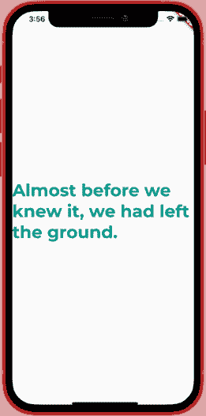
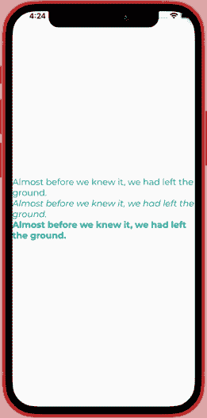

# 如何在 Flutter 中使用自定义字体

> 原文：<https://blog.logrocket.com/use-custom-fonts-flutter/>

Flutter 帮助我们用一个代码库为多个平台创建漂亮的移动应用程序。是不是很牛逼？是的，它是。

设计师和开发人员喜欢使用自定义字体来赋予他们的应用独特的外观，这有助于建立品牌意识和更好的产品。

Roboto 和 San Fransisco 分别是 Android 和 iOS 的默认字体系列。你可能从设计师那里定制了一种字体，或者你可能从其他资源下载了一种字体，比如 [Google Fonts](https://fonts.google.com) 。无论哪种方式，你都必须下载字体文件。ttf)并将其导入到您的颤振项目中。

在本文中，您将学习如何通过创建一个基本的 Flutter 应用程序，用不同的字体样式显示文本，来将自定义字体添加到项目中。

## 自定义字体入门🎬

按照以下步骤从 Flutter 中的字体开始:

1.  下载字体文件
2.  在项目中导入字体文件
3.  在`pubspec.yaml`中添加字体
4.  在应用程序中使用字体

### 1.下载字体文件📦

让我们从谷歌字体下载一个自定义字体开始。在这个例子中，我们将使用 Montserrat 字体。您可能已经从设计者或其他地方获得了自定义字体文件。但是在本教程中，我们将下载。谷歌字体的 ttf 字体文件。Google Fonts 是一个目录，包含在许可下发布的字体，允许您在任何网站或应用程序上使用它们进行商业或个人使用。

按照以下步骤下载字体文件:

*   第一步:访问[谷歌字体](https://fonts.google.com)并在搜索栏中搜索 Monserrat
*   第二步:点击 Monserrat 字体
*   第三步:现在点击下载系列下载字体
*   步骤 4:解压缩下载的文件

### 2.在项目中导入字体文件📂

下载后，我们需要将字体文件添加到我们的 Flutter 项目中。在 Flutter 项目的根目录下创建一个名为`fonts`的文件夹。

您需要像这样构建文件夹:

```
my_app/
  lib
  fonts/
    Montserrat-Regular.ttf

```

接下来，移动蒙特塞拉特字体文件或。ttf 文件到您刚刚创建的`fonts`文件夹中。

*注意，解压后你会看到很多字体文件，但本教程只复制 Monserrat-Regular.ttf，Monserrat-Italic.ttf，Monserrat-Bold.ttf。稍后，您可以尝试任意多的变体。*

### 3.在 pubspec 中添加字体文件📝

所以现在在将字体文件导入我们的 Flutter 项目后，我们需要将它们添加到我们的`pubspec.yaml`中。通过在`pubspec.yaml`中声明字体，您告诉 Flutter 注册这个字体并记住它，这样您就可以在整个项目中使用它。

在`pubspec.yaml`中声明字体时，需要遵循特定的结构:

按照下面的结构来声明字体:

```
flutter:
  fonts:
    - family: Montserrat
      fonts:
        - asset: fonts/Montserrat-Regular.ttf
        - asset: fonts/Montserrat-Italic.ttf
          style: italic
        - asset: fonts/Montserrat-Bold.ttf
          weight: 700

```

在 pubspec 中声明字体时，请记住这些事情🤓：

*   缩进是至关重要的，并始终确保有适当的空间要求
*   您可以用同样的方式添加多个字体系列(稍后您会看到)
*   `family`决定字体的名称，对于不同的字体系列，它应该是唯一的
*   `asset`是项目根目录下的字体路径
*   属性代表字体的粗细，一个从 100 到 900 的整数值
*   `style`属性指定字体是普通还是斜体

*提示:在`pubspec.yaml`中添加字体后，总是从冷重启 app。🔥*

到目前为止，您已经成功导入并添加了字体。在下一步中，您将看到如何在项目中使用该字体。

### 4.在应用程序🕹️中使用字体

现在是真正行动的时候了。完成所有这些步骤后，您就可以开始使用自定义字体并制作一个定制的应用程序了。

让我们看看如何在`Text`小部件中使用自定义字体:

```
import 'package:flutter/material.dart';
import 'package:flutter/cupertino.dart';

void main() => runApp(MyApp());

class MyApp extends StatelessWidget {
  @override
  Widget build(BuildContext context) {
    return const MaterialApp(
      home: Scaffold(
        body: SafeArea(
          child: Center(
            child: Text(
              'Almost before we knew it, we had left the ground.',
              style: TextStyle(
                fontFamily: 'Montserrat',
                fontSize: 36.0,
                color: Colors.teal,
                fontWeight: FontWeight.bold,
              ),
            ),
          ),
        ),
      ),
    );
  }
}

```

结果:



您需要使用`TextStyle`为`Text`小部件添加样式。`TextStyle`接受一个`fontFamily`参数，这是您之前在`pubspes.yaml`(这里是 Montserrat)中添加的字体名称。其他参数如`fontSize`、`color`和`fontWeight`分别声明字体的大小、字体的颜色和字体的粗细。

除了在每个`Text`窗口小部件中单独声明字体，你还可以创建一个字体应用程序级别，在整个应用程序中实现。

通过在 [MaterialApp](https://blog.logrocket.com/theming-your-app-flutter-guide/) 的`theme`属性中声明字体，你可以将自定义字体应用于整个应用。

这里是你如何添加做它😎：

```
class MyApp extends StatelessWidget {
  const MyApp({Key? key}) : super(key: key);
  @override
  Widget build(BuildContext context) {
    return MaterialApp(
      title: 'Flutter Demo',
      theme: ThemeData(
        primarySwatch: Colors.blue,
        fontFamily: 'Montserrat',
      ),
      home: const HomePage(),
    );
  }
}

```

在上面的例子中，我们添加了`Montserrat`作为应用程序的默认字体系列。您将要添加的每个`Text`小部件现在都将使用 Montserrat 作为它们的字体。将`fontWeight`和`fontStyle`配置为粗体和斜体将使用您在`pubspec.yaml`中为斜体和粗体添加的 Montserrat 字体。

这里有一个使用不同的`Montserrat`字体的完整例子:

```
import 'package:flutter/material.dart';
import 'package:flutter/widgets.dart';

void main() {
  runApp(const MyApp());
}

class MyApp extends StatelessWidget {
  const MyApp({Key? key}) : super(key: key);

  @override
  Widget build(BuildContext context) {
    return MaterialApp(
      title: 'Flutter Demo',
      theme: ThemeData(
        primarySwatch: Colors.blue,
        fontFamily: 'Montserrat',
      ),
      home: const HomePage(),
    );
  }
}

class HomePage extends StatelessWidget {
  const HomePage({Key? key}) : super(key: key);

  @override
  Widget build(BuildContext context) {
    return Scaffold(
      body: Center(
        child: Column(
          mainAxisAlignment: MainAxisAlignment.center,
          children: const [
            Text(
              "Almost before we knew it, we had left the ground.",
              style: TextStyle(
                fontSize: 18.0,
                color: Colors.teal,
              ),
            ),
            Text(
              "Almost before we knew it, we had left the ground.",
              style: TextStyle(
                fontStyle: FontStyle.italic,
                fontSize: 18.0,
                color: Colors.teal,
              ),
            ),
            Text(
              "Almost before we knew it, we had left the ground.",
              style: TextStyle(
                fontWeight: FontWeight.bold,
                fontSize: 18.0,
                color: Colors.teal,
              ),
            ),
          ],
        ),
      ),
    );
  }
}

```

结果:



有时候，你的设计师或者你可能想在你的应用程序中添加多种字体，使它更有活力，更有表现力，更好看。

要在`pubspec.yaml`中添加另一种字体，只需执行以下操作:

*   *   从谷歌字体下载舞蹈脚本
    *   解压并添加到字体文件夹
    *   将字体添加到`pubspec.yaml`:
        *   系列:DancingScript
            字体:
            *   asset:fonts/dancing script-bold . TTF
                权重:700
    *   通过在`Column`中添加一个新的`Text`小部件来使用 DancingScript 字体

添加使用 DancingScript 的`Text`小部件后，下面是`HomePage`小部件的外观:

```
class HomePage extends StatelessWidget {
  const HomePage({Key? key}) : super(key: key);
  @override
  Widget build(BuildContext context) {
    return Scaffold(
      body: Center(
        child: Column(
          mainAxisAlignment: MainAxisAlignment.center,
          children: const [
            Text(
              "Almost before we knew it, we had left the ground.",
              style: TextStyle(
                fontSize: 18.0,
                color: Colors.teal,
              ),
            ),
            Text(
              "Almost before we knew it, we had left the ground.",
              style: TextStyle(
                fontStyle: FontStyle.italic,
                fontSize: 18.0,
                color: Colors.teal,
              ),
            ),
            Text(
              "Almost before we knew it, we had left the ground.",
              style: TextStyle(
                fontWeight: FontWeight.bold,
                fontSize: 18.0,
                color: Colors.teal,
              ),
            ),
            Text(
              "Almost before we knew it, we had left the ground.",
              style: TextStyle(
                fontFamily: 'DancingScript',
                fontWeight: FontWeight.bold,
                fontSize: 18.0,
                color: Colors.teal,
              ),
            ),
          ],
        ),
      ),
    );
  }
}

```

结果:


## 结论🌠

在本教程中，您学习了如何在 Flutter 项目中使用自定义字体。

另一种使用谷歌字体的方法是使用[谷歌字体](https://pub.dev/packages/google_fonts)包。google *_* 字体包可以在运行时通过`http`一次性获取`.ttf`或字体文件，缓存在 app 的文件系统中，而不是存储在`fonts`文件夹中，在`pubspec.yaml`中声明字体。我很高兴看到你们都学到了什么。

祝你好运！开心飘飘！👨‍💻

如果你有任何问题，请随意发表👇。

欢迎任何反馈😃。

如果你喜欢这篇文章，你可以把它分享给你的朋友来支持我们。

## 使用 [LogRocket](https://lp.logrocket.com/blg/signup) 消除传统错误报告的干扰

[](https://lp.logrocket.com/blg/signup)

[LogRocket](https://lp.logrocket.com/blg/signup) 是一个数字体验分析解决方案，它可以保护您免受数百个假阳性错误警报的影响，只针对几个真正重要的项目。LogRocket 会告诉您应用程序中实际影响用户的最具影响力的 bug 和 UX 问题。

然后，使用具有深层技术遥测的会话重放来确切地查看用户看到了什么以及是什么导致了问题，就像你在他们身后看一样。

LogRocket 自动聚合客户端错误、JS 异常、前端性能指标和用户交互。然后 LogRocket 使用机器学习来告诉你哪些问题正在影响大多数用户，并提供你需要修复它的上下文。

关注重要的 bug—[今天就试试 LogRocket】。](https://lp.logrocket.com/blg/signup-issue-free)